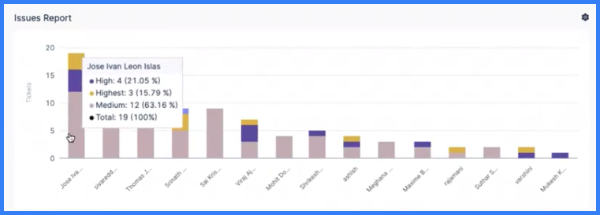
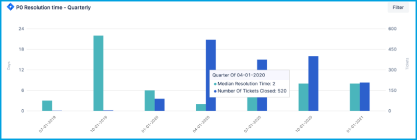

Velocity metrics help analyze the time taken to deliver a feature. They can help you identify bottlenecks in product development and delivery processes.

SEI identifies risk factors and slowdowns by providing insights into:

* Every stage of the SDLC.
* Risks of sprint slips due to scope creep.
* Wait times for PR review, merge times, and CI/CD.
* Code-to-production inefficiencies.

SEI offers different velocity metrics based on the tools your teams use and the processes they follow. Examples of velocity metrics include:

* **Deployment Frequency:** This DORA metric measures how often an organization/team successfully releases software to production. With SEI, you get:
  * The flexibility to choose [integrations](/docs/category/connectors-and-integrations), like issue management, SCM, and CI/CD tools, and add the relevant filters to define your Deployment Frequency.
  * An understanding of your organization's deployment performance.
  * An overview of the daily, weekly, and monthly deployment trends.
* **Lead Time:** The overall lead time is the sum of the average time spent in each stage configured in a workflow, such as the commit-to-deployment cycle in SCM or the issue lifecycle in an issue management system. This metric can help identify where the team is spending time and if the amount of time spent in each stage falls in an acceptable range.
* **PR Collaboration:** This metric provides an overview of how many PRs are being raised, by whom, who is reviewing PRs, who is merging PRs without reviews, and much more. These insights drive further actions to improve processes, initiate conversations with the team, remove the bottlenecks, and improve cycle time.

There are many velocity metrics, and some overlap with other metrics categories. For more information about velocity subcategories and related metrics, go to:

* [DORA metrics](../dora-metrics.md)
* [Effort investment metrics](../effort-investment-metrics.md)
* [Flow metrics](./flow-metrics.md)
* [Sprint metrics](./planning-sprint-metrics.md)

For information about reports you can use to analyze velocity metrics, go to:

* [CI/CD job reports](./ci-cd-reports.md)
* [SCM reports](./scm-reports.md)

<!-- Lead time -->
<!-- ("issues lead time by stage" - Lead time by development stages, entire SDLC, all tools) VELOCITY: lead time by stage, lead time trend, lead time by type, lead time single stat -->
<!-- (Specifically for jira/issue management) VELOCITY: lead time by time spent in stages -->
<!-- Done - VELOCITY & DORA: SCM commit to cicd job lead time report, aka Commit to deployment lead time - jobs commits lead single stat, jobs commit leads trends report -->
<!-- Done - (this section) VELOCITY: SCM PR lead time by stage report - scm pr lead time trend report, scm pr lead time by stage report -->

## Issues Report

Use the Issues Report to examine metrics related to various tickets/work items (epics, stories, bugs, tasks, and so on) in your issue management system. The report aggregates data based on selected attributes, such as priority, status, labels, components, or any other field. This report helps you create comparisons based on various fields and draw conclusions to make decisions.

### Configure the Issues Report

The following options are available when configuring the Issue Report widget.

#### Filters

Select an attribute to use to filter the Issues Report data. You can use multiple filters together.

Select an attribute from the **Add Filter** dropdown menu, and then configure the filter values.

Depending on the selected attribute, you can:

* Select one or more filter values.
* Select values to exclude.
* Use pattern matching rather than strict values.

#### Metrics

Select a metric to use for the Y-axis. The Issues Report widget supports the following metrics:

* **Number of Tickets**
* **Sum of Story Points**

#### Aggregations

* **X-axis:** Select the attribute to use for the X-axis. For example, if you selected the **Number of Tickets** metric for the Y-axis, you could select **Issues Resolved by week** for the X-axis. Additional examples of X-axis dimensional attributes include **Project**, **Assignee**, **Labels**, **Priority**, and so on.
* * **Stacks:** Select how you want to group data in each X-axis dimension. For example, if you select **Priority** for the X-axis and stack by **Status Category**, then data in each X-axis column are grouped by status.

<figure>

<figcaption>Figure 1: An Issues Report widget configured to show <b>Ticket count</b> on the Y-axis and <b>Assignee</b> across the X-axis. For each Assignee, the issues are stacked by <b>Priority</b>.</figcaption>
</figure>

#### Settings

* Select the issue management system to use for this widget. Available options are based on your configured [connectors](/docs/category/connectors-and-integrations).
* Select how you want to sort X-axis data, such as ascending or descending.
* Select the maximum number of values to show on the X-axis.
* Select the visualization style for the widget:
  * Bar chart
  * Donut Chart
  * Multi-Line chart
  * Percentage stacked bar chart
* Select the date format.

### Issues Report use cases

Here are some examples of configurations for the Issues Report widget.

Defects raised weekly

To configure the Issues Report widget to show bug tickets created weekly:

1. On the **Filter** tab, add an **Issue Type** filter set to **Bug/Defect**.
2. For the time range, either **Use Insight time** or set **Issue Created In** to the desired time range. **Use Insight time** allows the user to select a desired time range when viewing the Insight.
3. On the **Metrics** tab, select **Number of Tickets**.
4. On the **Aggregations** tab, set **X-axis** to **Issue created by week**.
5. On the **Settings** tab, set the **Visualization** to **Bar Chart**.
6. Set the widget **Name** to **Defects raised weekly**.

Stories resolved weekly

To configure the Issues Report widget to show stories resolved weekly:

1. On the **Filter** tab, add an **Issue Type** filter set to **Story**.
2. For the time range, either **Use Insight time** or set **Issue Created In** to the desired time range. **Use Insight time** allows the user to select a desired time range when viewing the Insight.
3. On the **Metrics** tab, select **Number of Tickets**.
4. On the **Aggregations** tab, set **Stacks** to **Priority**, and set **X-axis** to **Issue resolved by week**.
5. On the **Settings** tab, set the **Visualization** to **Bar Chart**.
6. Set the widget **Name** to **Stories resolved weekly**.

Distribution of tickets in an active sprint

To configure the Issues Report widget to show the distribution of tickets in the active sprint:

1. On the **Filter** tab, add a **Sprint** filter set to **Select Active Sprints only**.
2. On the **Metrics** tab, select **Number of Tickets**.
3. On the **Aggregations** tab, set **Stacks** to **Issue Type**, and set **X-axis** to **Sprint**.
4. On the **Settings** tab, set the **Visualization** to **Bar Chart**.
5. Set the widget **Name** to **Active sprint tickets distribution**.

Team workload (in stories)

To configure the Issues Report widget to show the team workload:

1. On the **Filter** tab, add a **Status** filter, set the value to all closed statuses (Done, Closed, Resolved, Won't Do, and so on), and select **Exclude**.

   This ensures the widget only shows active or not-started work.

2. On the **Metrics** tab, select **Number of Tickets**.
3. On the **Aggregations** tab, set **Stacks** to **Issue Type**, and set **X-axis** to **Assignee**.
4. On the **Settings** tab, set the **Visualization** to **Bar Chart**.
5. Set the widget **Name** to **Team workload**.

## Issue resolution time

Issue Resolution Time reports include:

* **Issue Resolution Time Report**
* **Issue Resolution Time Trend Report**
* **Issue Resolution Time Single Stat**

The Issue Resolution Time Single Stat widget is an [Issue Single Stat widget](#issue-single-stat) that reports the number of issues marked as resolved in a given time period.

The Issue Resolution Time Report is a configurable bar graph showing the number of tickets closed along with the average time it took to close those tickets, based on the time the tickets were created. This report can help answer questions like:

* Is my team getting faster at delivering features or fixing issues?
* Is the resolution times for a project or component decreasing over time?
* On average, how long does it take fix customer issues? Are we able to meet the SLA timeline?

<figure>

<figcaption>Figure 2: An Issue Resolution Time Report grouped by quarter.</figcaption>
</figure>

The Issue Resolution Time Trend Report monitors changes over time in issue resolution time.

:::tip Use Issue Resolution Time to monitor MTTR and MTBF

Mean Time To Recover (MTTR) and Mean Time Between Failures (MTBF) are [DORA metrics](../dora-metrics.md).

You can use the **Issue Resolution Time Report** and **Issue Resolution Time Single Stat** widgets to monitor MTTR and MTBF. You'll need to configure the filters and settings for these widgets so that they only track issues related to failure recovery.

:::

### Configure the Issue Resolution Time Report

By default, the Issue Resolution Time Report widget is filtered by issues closed (**Last closed date**) within a selected time range. Usually, the time range is set to **Use Insight time**, which allows the user to select a time range when viewing Insights.

<!-- img .gitbook/assets/image (56).png - issue resolution time report widget config - filters tab - last closed date and Insight time -->

On the **Aggregations** tab, you can select the dimension, from your issue management system, to use for the X-axis, such as **Assignee**, **Story Points**, **Ticket Category**, **Issue Closed Last Time Period**, and so on. This determines what you want the widget to focus on. For example, focusing on **Category** or **Component** can show you the issue resolution time for different work areas; whereas, focusing on **Assignee** can show you issue resolution time by developer.

<!-- img .gitbook/assets/image (59).png - issue resolution time report widget config - aggregations tab - x axis dropdown -->

On the **Settings** tab, you can:

* Select the issue management system to use for this widget. Available options are based on your configured [connectors](/docs/category/connectors-and-integrations).
* Select how you want to sort X-axis data, such as ascending or descending.
* Select the maximum number of unique values to show on the X-axis.

### Issue Resolution Time Report examples

The primary way to modify the Issue Resolution Time Report widget is to change the X-axis dimension on the **Aggregations** tab. Here are some examples of other configurations for this widget.

Average time to issue closed by assignee

This configuration produces a bar graph showing which assignees are taking the most time to close issues within the selected time frame.

1. On the **Aggregations** tab, select **Assignee** for the X-axis dimension.
2. On the **Settings** tab, set **Sort X-axis** to **By Value, High --> Low**, and set the **Max X-Axis Entries** high enough so that it can show all team members.

<!-- img /.gitbook/assets/image (53).png - Issue Resolution Time Report widget config - settings tab - sort xaxis high to low and 20 max entries -->

Median bug resolution time by priority

This configuration produces a bar graph showing the median resolution time for bugs, grouped by priority.

1. On the **Aggregations** tab, select **Issue Last Closed (Week, Month, Quarter)** for the X-axis dimension. Set the date to the desired time range, such as the last four quarters.
2. On the **Filters** tab:

   * Add a **Type** filter, and set the filter value to **Bug**.
   * Add a **Status Category** filter, and add filter values for done-equivalent statuses that you want to track, such as done, closed, resolved, and so on.

3. On the **Settings** tab, set **Sort X-axis** to **Priority**, and set the **Max X-Axis Entries** high enough so that it can show all priority levels.
4. For **Stacks**, use the **Median Resolution Time** and the **Number of Tickets**.

<!-- need to confirm this config -->

Story point estimation accuracy

This configuration produces a bar graph showing how well your story points are estimated. Good estimation is evidenced by a graph showing linear progression, with higher point issues taking longer to resolve than lower ones.

<!-- img .gitbook/assets/image (30).png - Story point estimation accuracy bar graph w linear progression -->

1. On the **Aggregations** tab, select **Story Points** for the X-axis dimension.
2. On the **Filters** tab, exclude backlog stages by adding an **Exclude Time In Status** filter, and set the filter value to your backlog status(es), such as **To Do** or **Backlog**.

<!-- img .gitbook/assets/image (29).png - exclude time in status filter example config -->

3. On the **Settings** tab, set **Sort X-axis** to **By Label, Low --> High**.

MTTR and Lead Time for Changes

This configuration produces a bar graph showing a historical record of the average time it took to close all issues within the selected time frame.

<!-- img .gitbook/assets/image (38).png - time to close issue by last time period bar graph example -->

1. On the **Aggregations** tab, select **Issue Last Closed (Week, Month, Quarter)** for the X-axis dimension.
2. On the **Filters** tab, add filters to demonstrate [MTTR](../dora-metrics.md#mean-time-to-restore-mttr) or [Lead Time For Changes](../dora-metrics.md#lead-time-for-changes) trends:

   * For MTTR: Add an **Issue Type** filter, and set the filter value to **Bugs**.
   * For Lead Time For Change: Add an **Issue Type** filter, and set the filter values to **Tasks** and **Stories**.

3. On the **Settings** tab, set **Sort X-axis** to **By Label, Low --> High**.

Median issue resolution time over time

This configuration produces a bar graph showing the median resolution time to close all issues each month in the selected time frame.

1. On the **Aggregations** tab, select **Issue Last Closed (Week, Month, Quarter)** for the X-axis dimension. Set the date to the desired time range, such as the last four months.
2. On the **Filters** tab, add a **Status Category** filter, and add filter values for all the closed-equivalent statuses that you want to track, such as done, closed, delivered, won't do, and so on.
3. On the **Settings** tab, set **Sort X-axis** to **Issue Closed Month**.
4. For **Stacks**, use the **Median Resolution Time** and the **Number of Tickets**, which will show, for each bar on the bar chart, the median resolution time for all tickets closed in that month.

<!-- need to confirm this config -->

## Issue Single Stat

The Issue Single Stat widgets provides single metrics over the given time range. This is useful for tracking events (created, resolved, etc.) happening over a period of time. For example, you can use the **Issue Resolution Time Single Stat** widget to know how many issues were *resolved* in the given time frame. Usually, the time range is set to **Use Insight time**, which allows the user to select a time range when viewing Insights.

Issue Single Stats widgets include:

* Issue created
* Issue due
* Issue resolution time
* Issue updated

You can configure these widgets to further filter and refine them, such as by issue type, label, priority, and so on.

## Issue Bounce Report

_Bounce_ describes tickets that are reassigned to a previous assignee. The Issue Bounce Report shows the number of times a ticket "bounced" between assignees. Bounce can occur if an issue isn't triaged correctly initially, or if the issue doesn't have enough information to be assigned correctly. Excessive bounce can potentially cause missed SLAs and unnecessary resource utilization.

The Issue Bounce Report widget is usually configured to observe the median number of bounces by component, project, or initiative. This widget can highlight issues that are being bounced around to different resources.

Instances of reassignment to new assignees are captured by the [Issue Hops Report](#issue-hops-report).

## Issue Hops Report

_Hops_ describes the number of times a ticket is reassigned to a new assignee (someone who has never been assigned to that issue before). The Issue Hops Report shows the number of times a ticket "hopped" to new assignees. Hops can occur if an issue isn't triaged correctly initially, or if the issue doesn't have enough information to be assigned correctly. Excessive hops can potentially cause missed SLAs and unnecessary resource utilization.

The Issue Hops Report widget is usually configured to observe the median number of hops by component, project, or initiative. This widget can highlight issues that are reassigned multiple times.

Instances of reassignment to a previous assignee are captured by the [Issue Bounce Report](#issue-bounce-report).
