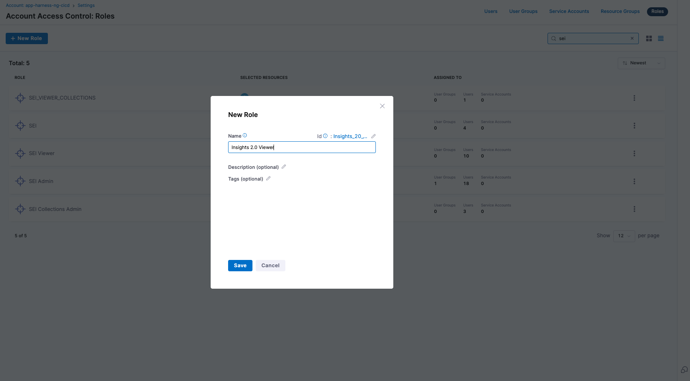
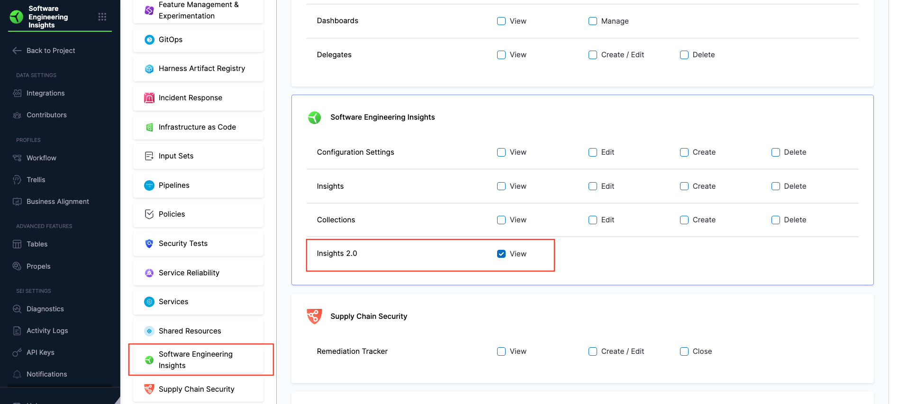
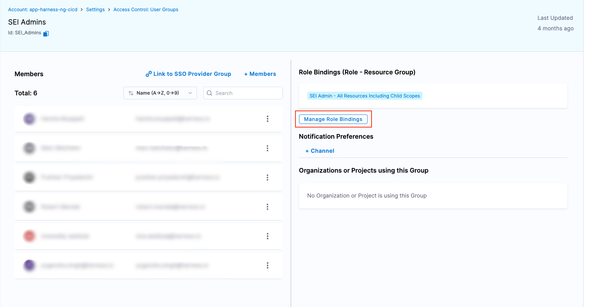
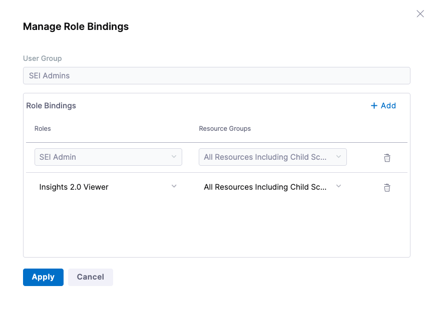

SEI 2.0 is currently in BETA, and we’re excited to give early access to users who want to explore the new experience. To participate in the beta program, you’ll need to enable a feature flag and assign appropriate access permissions.

### Step 1: Request Access

To enable SEI 2.0 for your account, submit a request through [Harness Support](/docs/software-engineering-insights/sei-support) and mention that you'd like access to the SEI 2.0 Experience. Our Product team will work with you to enable the required feature flag.

Once the feature flag is turned on, you’ll need to update your account’s access permissions so the right users can explore the new dashboards.

### Step 2: Create a Role for SEI 2.0 Access

If you're an **Account Admin**, follow these steps to create a role with SEI 2.0 access:

* In **Harness**, go to **Account Settings** and then select **Access Control**.
* Select **Roles** in the header, and then select **New Role**.
* Give your role a **Name** (e.g. SEI 2.0 Viewer). **Description** and **Tags** are optional.

* Select **Save**.
* Scroll down to the **Software Engineering Insights** section.
* Select the tab, check the box for **Insights 2.0**, and grant the **View** permission.

* Click **Apply Changes**.

### Step 3: Assign the Role to Users

After creating the role, you’ll need to assign it to the users or user groups who require access to the SEI 2.0 Experience.

You can assign the role to individual users or to user groups, depending on your organization's access control preferences.

* In **Harness**, go to **Account Settings**, and search for the user or user group where you want to assign the permissions.
* Go to the **Role Bindings** tab, then select **Manage Role Bindings**.

* Under **Role Bindings**, select **Add**.
* Under **Roles**, click **Select** the role that you created earlier in [Step 2](#step-2-create-a-role-for-sei-20-access).
* Under **Resource Groups**, select **All Resources Including Child Scopes**.

* Select **Apply**. You will receive a notification stating Role Assignments updated successfully, and the role binding process is complete.

### You're In!

After role assignment, users will be able to access SEI 2.0 from their existing SEI project within the Harness platform. The new experience will appear automatically once the feature flag is active and permissions are configured.

:::note
Since SEI 2.0 is in BETA, we recommend using it for exploration and feedback and not for critical business decisions just yet. We're actively iterating based on early user input, and your feedback will help shape the final experience.
:::
