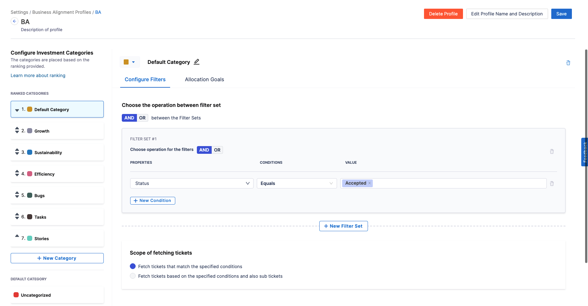
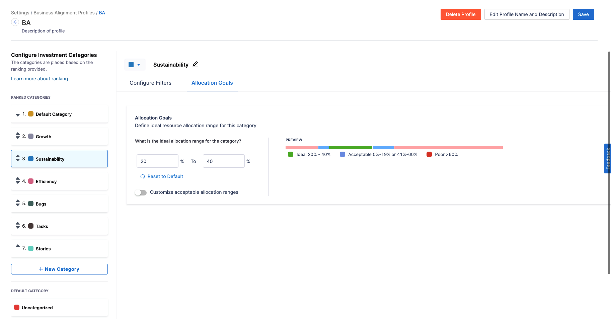
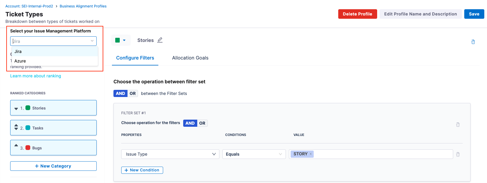
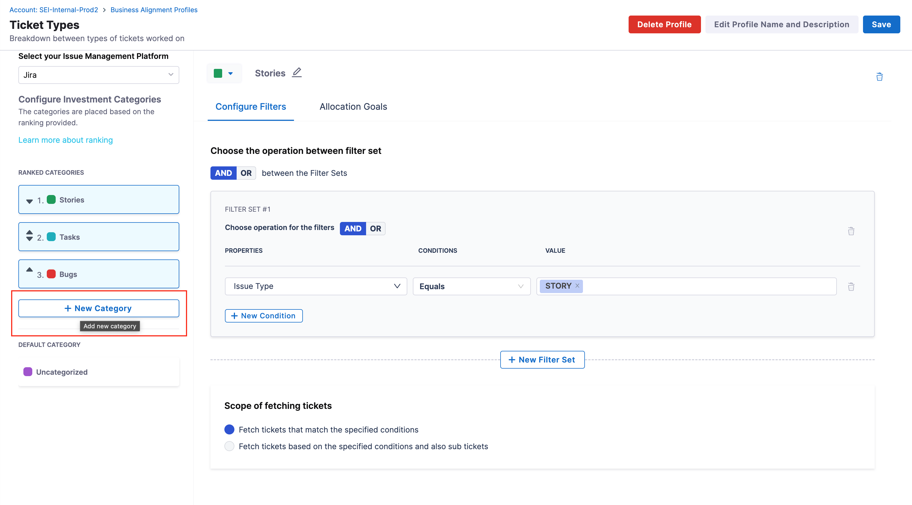
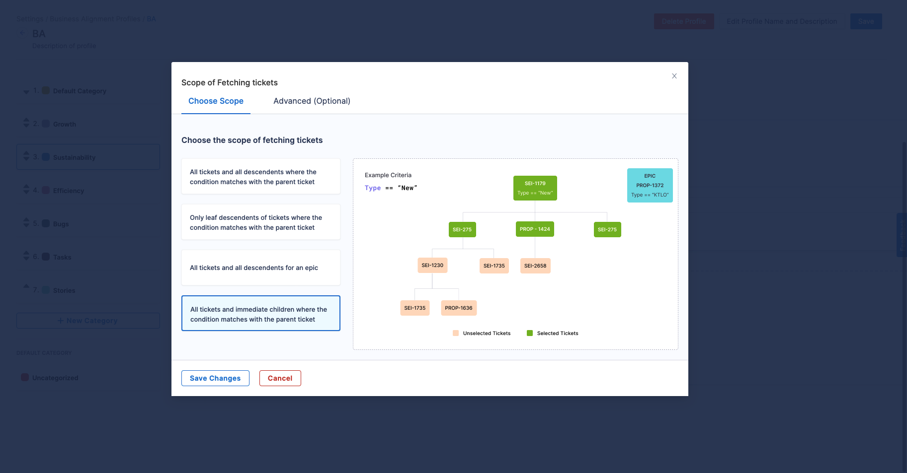
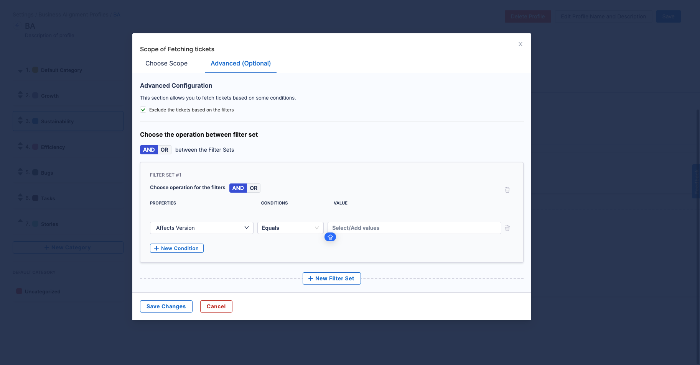

Business Alignment metrics help you understand where engineers are allocating their time through effort investment metrics. It is one of the most critical components of engineering metrics that connects your engineering to the business value.

The **Business Alignment profile** acts as the single source of truth for the Business Alignment metrics calculations where you can create and manage the Investment Categories using Filter Sets and adjust the threshold of each of these categories using Allocation Goals.

<DocVideo src="https://www.youtube.com/embed/f3fLqermTGo?si=qFF0PVof8Q36kkr3" />

## Important concepts

### Investment Categories

**Categories** define the data that you want to compare within an Business Alignment profile. For example, you could compare issue types (such as Bugs, Stories, and Tasks), Projects, Components, or other dimensions (such as Infrastructure, Support, and Development).

In the profile configuration, the **Default Category** is by default set up without any **Filters**. You can customize this category by adding custom **Filter Sets**, defining their associated conditions and specifying custom allocation goals. You can also customize and configure the scope of fetching tickets that should be considered for the metric calculation.

The `uncategorized` category in the profile configuration fetches and considers all the tickets that do not belong to any other defined category. You can customize the uncategorized category with custom allocation goals and use them in your Alignment metric calculation.

Relationship between Ranking Categories and Business Alignment metric calculations

The ranking of categories plays a significant role in determining how tickets are allocated to different categories, and subsequently, how Business Alignment calculations are made.

1. **Ticket Metadata for Categories:** Categories in the Business Alignment profile are defined based on certain attributes or metadata of tickets. These attributes can include Labels, Components, Priorities, Issue Types, or any other relevant information associated with the tickets in your Issue Management System (e.g., Jira or Azure).     Example Ticket Metadata:   `Ticket 1:` Labels: (`abc`, `def`) Priority: (P1)   `Ticket 2:` Labels: (`abc`, `def`, `ghi`) with Components: (`text`, `value`)
2. **Defining Categories:** Categories are defined based on specific criteria related to ticket metadata. In the provided example, let's say you define two categories:
   1. `Category 1:` Based on the label being `abc`
   2. `Category 2:` Based on the component being `text`
3. **Ticket Allocation to Categories:** Now, when you have tickets in your system, they are allocated to categories based on whether they meet the criteria defined for each category. For example:
   1. Ticket 1 belongs to `Category 1` because it has the label `abc`
   2. Ticket 2 can potentially belong to both `Category 1` and `Category 2` because it meets the criteria for both categories.
4. **Ranking Categories:** This is where the ranking of categories comes into play. When a ticket is eligible for multiple categories, the ranking helps determine which category takes precedence or priority. In the provided example:
   1. If `Category 1` is ranked higher (e.g., ranked 1), then Ticket 2 will also be allocated to `Category 1 `
   2. If `Category 2` is ranked higher, then Ticket 2 will be allocated to `Category 2` and it won't be included in `Category 1`
5. **Allocation Goals and Calculations:** After tickets are allocated to Categories, you can set Allocation Goals for each Category. To learn more, Go to [Allocation Goals](#allocation-goals).
6. **Business Alignment Calculations:** Once Allocation goals are set, Harness SEI calculates the Business Alignment metric value based on the actual allocation of tickets to categories and the progress made in each category.

### Allocation Goals

After adding [categories](https://developer.harness.io/docs/software-engineering-insights/sei-profiles/investment-profile#categories), you can set goals for how much time you want developers to work on each category.

Define the **Ideal Range** for each Category. You can set ranges in percentage values. After defining your ideal range, SEI automatically calculates the Acceptable range and Poor range based on your ideal.

### Range calculation example

For simplicity, the ranges in this example are given in whole numbers.

Assume your categories are Bugs, Stories, and Tasks, and you want developers to spend 20 to 30 per cent of their time working on Bugs. You would set the ideal range for bugs to 20% (minimum) and 30% (maximum). SEI then calculates the Acceptable range and Poor range on either side of your ideal.

This example could result in the following ranges:

* **Zero to 10 per cent:** Poor
* **10 to 20 per cent:** Acceptable
* **20 to 30 per cent:** Ideal
* **30 to 40 per cent:** Acceptable
* **40 to 100 per cent:** Poor

## Create the Business Alignment profile

To create or edit Business Alignment profiles:

### Step 1: Create a new Business Alignment profile

* Go to your **SEI settings**.
* Select **Business Alignment** under **Profiles**.
* To create a profile, select **+New Business Alignment Profile**. To edit an existing profile, select the profile's name in the profiles list.

### Step 2: Select the Issue Management System

Select your **Issue Management System** as either **Jira** or **Azure DevOps**. The custom fields for configuring filters on the categories will dynamically change based on the selected platform.

### Step 3: Add Categories

To add a custom **Category** to the profile configuration:

* Go to the **Business Alignment profile** settings.
* Select **+New Category** under the **RANKED CATEGORIES** section.

* Add a **Name**, then click on **Save** to save the Category.
* Define the **Filter Sets**, **Ticket Fetching Criteria** and **Allocation Goals** for the newly created custom category.

:::info
Note that for each Category, you can define its own separate set of **Filters** and **Allocation Goals**. The categories are placed based on the ranking provided.
:::

For each category, you can define its own set of **Filters** and **Allocation goals**.

### Step 4: Add Filters for Categories

For each category, you can define its own set of **Filters** and **Allocation goals**. **Filters** are the criteria that determine what kind of work or tasks fall into each category.

To set up these Filters:

* Decide on the logical relationship between different Filter Sets i.e. whether they should be combined using `AND` (all conditions must be met) or `OR` (any condition can be met).
* Define the specific conditions for each Filter. This involves selecting attributes from the `PROPERTIES` dropdown, setting a condition (like equals or not equals) from the `CONDITIONS` dropdown, and then specifying the `VALUE` for that condition.
* You can add multiple conditions for the same Filter Set and add at most three Filter Set combinations allowing you to create a detailed and accurate definition for each category.

### Step 5: Define the Scope of Fetching Tickets

This allows you to define how broadly you gather ticket data based on your Filters. Select one of the following options:

* **All Tickets and immediate children where the conditions matches with the parent ticket:** Fetches all tickets and their immediate children where the condition matches with the parent ticket.
* **All Tickets and all descendants where the conditions matches with the parent ticket**: Fetches all tickets and all their descendants if the condition matches with the parent ticket.
* **Only Leaf Descendants where the conditions matches with the parent ticket:** Targets only the leaf descendants of tickets where the condition matches with the parent ticket.
* **All Tickets and descendants for an Epic:** This option is comprehensive, covering all tickets and their descendants within a specific epic.

You also have the option to add a combination of multiple **Filter Sets** under the **Advanced Tab** in order to retrieve tickets based on additional conditions. Within the Advanced Tab, you can choose to either exclude or include tickets based on the configured filters.

### Step 6: Define the Allocation Goals

Finally, you will set the allocation goals for each category. This involves deciding how much of your team's time and effort should ideally go into each category.

* Set an ideal resource allocation range as a percentage. This is your target for how much effort should go into each category.
* You can also customize what is considered an acceptable range. This gives some flexibility while still aligning with your overall objectives.

### Step 7: Save the profile

Once the profile settings have been configured, you can **Save** the profile.    You can select the newly created Business Alignment profile in the Business Alignment report widget to generate insights which can help you align your engineering work with business goals, ensuring that time and effort are spent where they're most valuable. To learn more about how the Alignement metrics are calculated, go to the [Business Alignment report](/docs/software-engineering-insights/sei-metrics-and-reports/planning/sei-business-alignment-reports).