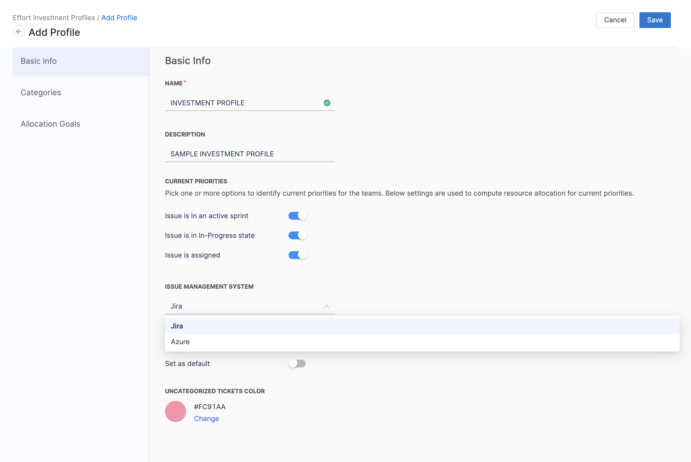
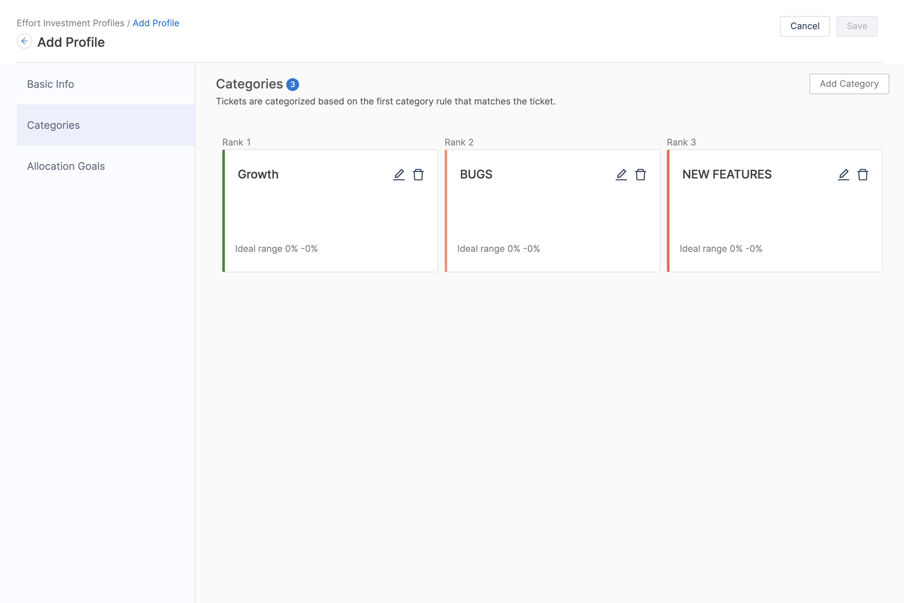

Investment profiles help you understand where engineers are allocating their time through [effort investment metrics](/docs/software-engineering-insights/sei-metrics-and-reports/planning/alignment/sei-business-alignment-overview).

:::info
The 202312.2 release included a new Business Alignment profile and report settings, which enhance the effectiveness and accuracy of BA metrics calculation. The feature is currently in BETA. To learn more, go to [Business Alignment Profile](/docs/software-engineering-insights/sei-profiles/business-alignment-profile)
:::

## Configure Investment Profiles

To create or edit **Investment profiles**:

### Step 1: Create a New Investment Profile

To create or edit Investment profiles:

1. In your Harness project, go to the SEI module.
2. Select **Account**.
3. Select **Investment** under **Profiles**.
4. To create a profile, select **+New Investment Profile**. To edit an existing profile, select the profile's name in the profiles list.

### Step 2: Add the Basic Info for the profile

* **Name and Description:** Name and describe your Investment profile.
* **Current Priorities:** Select one or more options that correspond with the team's *current* work. Options include:
  * **Issue is in an active sprint:** When computing resource allocation, include issues, in any status, that are in ongoing sprints.
  * **Issue is in In-Progress state:** When computing resource allocation, include in-progress issues.
  * **Issue is assigned:** When computing resource allocation, include issues, in any status, that are assigned to a team member.
* **Issue Management System:** Select the issue management tool, either **Jira** or **Azure**, to associate with this Investment profile.
* **Default Profile:** Enable this setting if you want to make this Investment profile the default Investment profile. The default profile is automatically selected when creating new widgets that use Investment profiles.

### Step 3: Set up the Categories

Categories define the data that you want to compare within an Investment profile. For example, you could compare issue types (such as bugs, stories, and tasks), projects, components, or other dimensions (such as infrastructure, support, and development).

To add a category, select **Add Category**, enter a name, and then select **Filters**.

### Step 4: Set up the Allocation Goals

After adding [categories](#categories), you can set goals for how much time you want developers to work on each category.

Adjust the sliders to define the **Ideal range** for each category. You can set ranges from zero to 100. After defining your ideal range, SEI automatically calculates the **Acceptable range** and **Poor range** based on your ideal.

Range calculation example

For simplicity, the ranges in this example are given in whole numbers.

Assume your categories are bugs, stories, and tasks, and you want developers to spend 20 to 30 percent of their time working on bugs. You would set the ideal range for bugs to `20%` (minimum) and `30%` (maximum). SEI then calculates the **Acceptable range** and **Poor range** on either side of your ideal.

This example could result in the following ranges:

* Zero to 10 percent: Poor
* 10 to 20 percent: Acceptable
* 20 to 30 percent: Ideal
* 30 to 40 percent: Acceptable
* 40 to 100 percent: Poor

Relationship between ranking categories and effort investment calculations

The ranking of categories plays a significant role in determining how tickets are allocated to different categories, and subsequently, how effort investment calculations are made.

1.  **Ticket Metadata for Categories:** Categories in the Investment profile are defined based on certain attributes or metadata of tickets. These attributes can include labels, components, priorities, issue types, or any other relevant information associated with the tickets in your issue management system (e.g., Jira or Azure). 
    
    Example Ticket Metadata:

    `Ticket 1:` Labels: ("abc", "def") Priority: (P1)

    `Ticket 2:` Labels: ("abc", "def", "ghi") with Components: ("text", "value")

2. **Defining Categories:** Categories are defined based on specific criteria related to ticket metadata. In the provided example, let's say you define two categories:
   * `Category 1:` Based on the label being "abc"
   * `Category 2:` Based on the component being "text" 

3. **Ticket Allocation to Categories:** Now, when you have tickets in your system, they are allocated to categories based on whether they meet the criteria defined for each category. For example:
   * `Ticket 1` belongs to `"Category 1"` because it has the label `"abc"`
   * `Ticket 2` can potentially belong to both `"Category 1"` and `"Category 2"` because it meets the criteria for both categories.

4.  **Ranking Categories:** This is where the ranking of categories comes into play. When a ticket is eligible for multiple categories, the ranking helps determine which category takes precedence or priority.

    
    In the provided example:

    1. If `"Category 1"` is ranked higher (e.g., ranked 1), then Ticket 2 will also be allocated to `"Category 1"`
    2. If `"Category 2"` is ranked higher, then Ticket 2 will be allocated to `"Category 2"` and it won't be included in `"Category 1"`

5. **Allocation Goals and Calculations:** After tickets are allocated to categories, you can set allocation goals for each category. To learn more, Go to [Allocation Goals](#allocation-goals).

6. **Effort Investment Calculations:** Once allocation goals are set, SEI calculates the effort investment based on the actual allocation of tickets to categories and the progress made in each category.

### Step 5: Save the profile

Once you've completed configuring the profile settings click on **Save** on the top right section of the page to save the Investment Profile.
