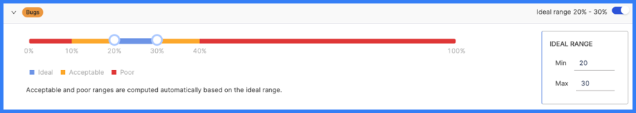

Investment profiles help you understand where engineers are allocating their time through [effort investment metrics](../sei-metrics-and-reports/effort-investment-metrics.md).

To create or edit Investment profiles:

1. In your Harness project, go to the SEI module.
2. Select **Account**.
3. Select **Investment** under **Profiles**.
4. To create a profile, select **New Investment Profile**. To edit an existing profile, select the profile's name in the profiles list.

## Basic Info

* **Name and Description:** Name and describe your Investment profile.
* **Current Priorities:** Select one or more options that correspond with the team's *current* work. Options include:
  * **Issue is in an active sprint:** When computing resource allocation, include issues, in any status, that are in ongoing sprints.
  * **Issue is in In-Progress state:** When computing resource allocation, include in-progress issues.
  * **Issue is assigned:** When computing resource allocation, include issues, in any status, that are assigned to a team member.
* **Issue Management System:** Select the issue management tool, either **Jira** or **Azure**, to associate with this Investment profile.
* **Default Profile:** Enable this setting if you want to make this Investment profile the default Investment profile. The default profile is automatically selected when creating new widgets that use Investment profiles.

## Categories

Categories define the data that you want to compare within an Investment profile. For example, you could compare issue types (such as bugs, stories, and tasks), projects, components, or other dimensions (such as infrastructure, support, and development).

To add a category, select **Add Category**, enter a name, and then select **Filters**.

## Allocation Goals

After adding [categories](#categories), you can set goals for how much time you want developers to work on each category.

Adjust the sliders to define the **Ideal range** for each category. You can set ranges from zero to 100. After defining your ideal range, SEI automatically calculates the **Acceptable range** and **Poor range** based on your ideal.

<figure>

<figcaption>Allocation goals for <b>Bugs</b>, where 20 to 30 percent is the ideal range.</figcaption>
</figure>

Range calculation example

For simplicity, the ranges in this example are given in whole numbers.

Assume your categories are bugs, stories, and tasks, and you want developers to spend 20 to 30 percent of their time working on bugs. You would set the ideal range for bugs to `20%` (minimum) and `30%` (maximum). SEI then calculates the **Acceptable range** and **Poor range** on either side of your ideal.

This example could result in the following ranges:

* Zero to 10 percent: Poor
* 10 to 20 percent: Acceptable
* 20 to 30 percent: Ideal
* 30 to 40 percent: Acceptable
* 40 to 100 percent: Poor

