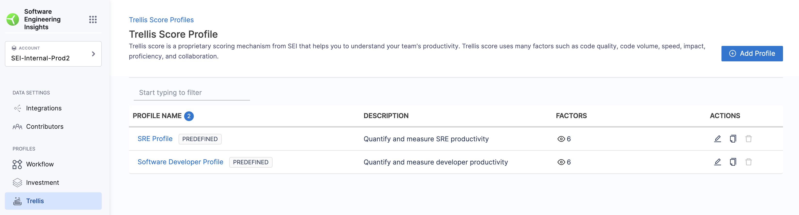
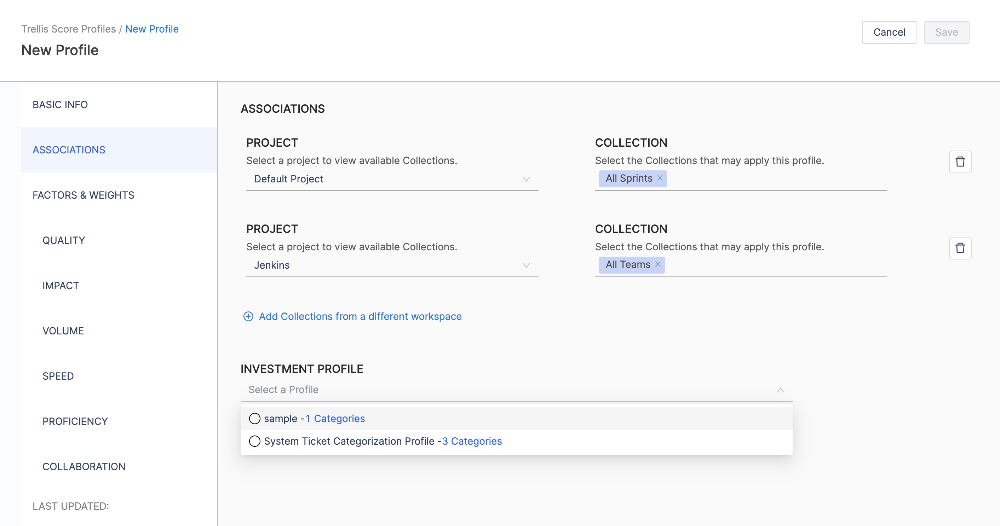
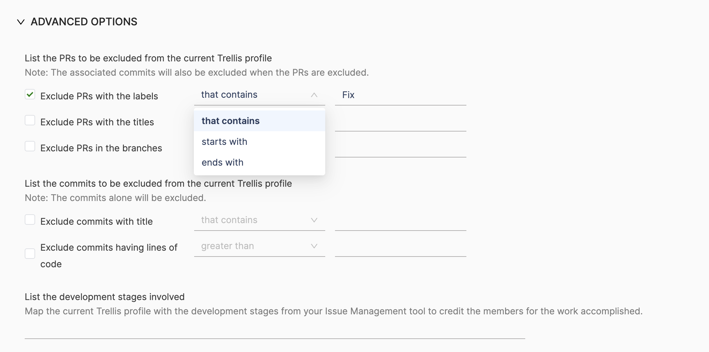
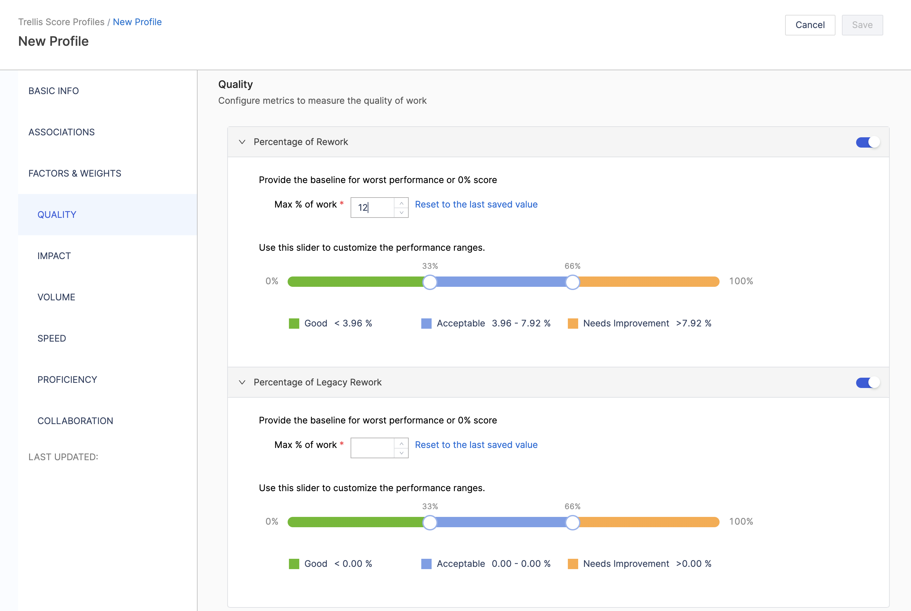

Trellis Scores are a proprietary scoring mechanism from SEI. Your Trellis Score helps you understand your team's productivity. [Trellis Scores](/docs/category/trellis-scores) are calculated from factors such as code quality, code volume, speed, impact, proficiency, and collaboration. You can adjust the weight given to each factor.

:::info
The 202402.1 release included a new experience for the Trellis profile configuration at the Collection level i.e. Trellis Factors settings, which enhance the effectiveness and accuracy of Trellis Scores calculation based on the custom attributes of the contributors.    The feature is currently in BETA. To learn more, go to [Trellis Factors](/docs/software-engineering-insights/early-access/profiles/sei-trellis-factors)
:::

## Configure Trellis Profiles

### Step 1: Create a new profile

To create or edit a Trellis profile:

* In your Harness project, go to the SEI module.
* Select **Account**.
* Select **Trellis** under **Profiles**.
* To create a profile, select **+New Trellis  Profile**. To edit an existing profile, select the profile's name in the profiles list.

:::info Predefined Trellis profiles

Some Trellis profiles are automatically created when you create a Harness project or add certain types of [SEI integrations](/docs/category/sei-integrations). You can associate predefined profiles with [Collections](/docs/software-engineering-insights/sei-projects-and-collections/manage-collections).

You can't delete predefined profiles. If you don't want to use a predefined profile, make sure it isn't associated with any Collections.

:::

### Step 2: Configure the Basic Info​

Configure basic information for the Trellis profile, such as a **Name** and an optional **Description**.

### Step 3: Configure the Association settings for the profile

In the **Association** section of your Trellis profile, you can map [Collections](/docs/software-engineering-insights/sei-projects-and-collections/manage-collections) to the Trellis profile, map development stages, and configure exclusions.

#### Associations

Select Collections to associate with this Trellis Profile.

#### Investment profile mapping

It refers to the allocation of effort investment categories used in the calculation of your Trellis score. 

#### Development stage mapping

Select relevant development stages as defined in your issue management tool. This is useful if you want to attribute scores to developers based on their contributions at different stages of a project's life cycle.

#### Exclusions

Exclusions are useful in scenarios where you want to ignore certain types of PRs and commits.

* **Exclude pull requests:** List PRs to exclude from Trellis Score calculations. If excluding PRs, the commits associated with those PRs are also excluded.
* **Exclude commits:** List commits to exclude from Trellis Score calculations. If excluding commits, only the commits are excluded. PRs that contain those commits are not excluded, unless you also excluded them in **Exclude pull requests**.

### Step 4: Configure the Factors and Weights

In the **Factors and Weights** section of your Trellis profile, you can configure the factors (Quality, Impact, Volume, Speed, Proficiency, and Leadership and Collaboration) that contribute to your Trellis Score.

In the main **Factors and Weights** section, you can:

* Enable and disable individual factors to include or exclude them from your Trellis Score calculation.
* Adjust the weight of each factor. Assign a low weight (1-5) to make less important factors have a lower impact on your score. Assign a higher weight (5-10) to make more important factors have a higher impact on your score. Weights are relative. For example, if all factors are weighted 5, then all factors are still equal.

In the subsections for the individual factors, you can:

* Adjust the metrics that are included in each factor's calculation. For information about the metrics behind each factor, go to [Trellis Score](/docs/category/trellis-scores).
* Define target performance ranges for each metric.

#### Quality

The quality of work is measured using two key metrics: the **Percentage of Rework** and the **Percentage of Legacy Rework**. 

* **Percentage of Rework:** This measures the changes made to code commits within the last 30 days. A lower percentage of rework indicates a higher level of quality, as it means fewer modifications were required to the recently written code. By default, any changes to the code created in the last 30 days are categorized as rework.
* **Percentage of Legacy Rework:** This measures the changes made to code commits that are older than 30 days. A lower percentage of legacy rework indicates a higher level of quality, as it means fewer modifications were required to the older codebase.

By default, all changes to code written in the last 30 days are considered rework.

:::info **What is Rework?
**Rework** is the process of making changes or modifications to existing code. This can include: Alterations, Code Fixes, Feature Enhancements, Code Optimizations etc.

The purpose of measuring rework is to evaluate the stability of the code, the frequency of necessary changes, and the efficiency of the development efforts.
By default, any changes made to code written in the last 30 days are considered rework.
:::

#### Impact

The Impact of an engineer's work is defined and measured by two key metrics: **High Impact Bugs Worked On Per Month** and **High Impact Stories Worked On Per Month**. High Impact refers to the classification of bug or story tickets, based on their perceived significance or priority. This classification can vary depending on your configuration in the **Issue Management Platform**.

* **High-Impact Bugs Worked On Per Month**: This metric tracks the number of resolved, high-impact bug tickets that an engineer was assigned to within the selected time frame. 
  * The metric value in the Trellis report is normalized to show the average number of resolved, high-impact bug tickets per month. 
  * If more than one developer worked on the same ticket, developers are credited proportionately. 
* **High-Impact Stories Worked On Per Month**: This measure represents the number of resolved, high-impact story tickets that the developer was assigned to within the selected time frame. 
  * The metric value in the report is normalized to show the average number of resolved, high-impact story tickets per month. 
  * If more than one developer worked on the same ticket, developers are credited proportionately.

:::info
It's important to note that the definition of **High Impact** can vary depending on the Investment profile and user preferences. The metrics that contribute to the **Impact Factor** require categories from the Investment profile as input parameters
:::

#### Enable the Impact factor

To include the **Impact factor** in your Trellis score, you must associate an Investment profile with your Trellis profile. This is required because the categories defined in the Investment profile serve as input parameters for the metrics that contribute to the Impact factor.

1. If you haven't done so already, create an Investment profile.
2. Go to the **Associations** section of your Trellis profile, and select the relevant **Investment Profile.**
3. Go to the **Factors and Weights** section of your **Trellis profile**, enable the **Impact factor**, and assign a suitable weight.
4. Select the metrics and categories that you want to include in the Impact factor.

#### Volume

Volume measures the quantity of code that the developer is working on. The default volume score is calculated using the following six metrics:

* **Number of PRs per month:** This is the number of Pull Requests a developer submitted within the selected time frame.
  * The metric value in the report is normalized to show the average number of pull requests a developer submitted per month.
  * It is recommended that developers submit between 5 and 7.5 PRs each month.
* **Number of Commits per month:** This is the average number of commits a developer has submitted within the selected time frame.
  * The metric value in the report is normalized to show the average number of commits a developer contributes per month.
  * The industry standard for the number of commits per month is between 10 and 15.
* **Lines of Code per month:** The Lines of Code metric calculates the total number of lines of code contributed by an engineer within the selected time frame.
  * The metric value in the trellis report is normalized to show the average number of lines of code contributed per month.
  * The industry standard recommends between 125 and 185 lines of code each month.
* **Number of bugs worked on per month:** This is the number of resolved bug tickets assigned to a developer within the selected time frame.
  * The metric value in the report is normalized to show the average number of resolved bug tickets assigned to a developer per month.
  * If more than one developer worked on the same ticket, developers are credited proportionately.
  * The average number of bugs worked on per month is between 2 and 3.
* **Number of Stories worked on per month:** This is the number of resolved story tickets assigned to a developer within the selected time frame.
  * The metric value in the report is normalized to show the average number of resolved story tickets assigned to a developer per month.
  * If more than one developer worked on the same ticket, developers are credited proportionately.
  * The average number of stories worked on per month is between 5 and 7.
* **Number of Story Points worked on per month:** This is the number of resolved story points assigned to a developer within the selected time frame.
  * The metric value in the report is normalized to show the average number of resolved story points assigned to a developer per month.
  * If more than one developer worked on the same ticket, developers are credited proportionately.

#### Speed

Speed measures the pace at which engineers successfully resolve or close the tickets assigned to them. Speed is determined by the following three metrics:

* **Average Coding Days per Week:** A coding day is any day when a developer commits code. This metric is calculated by dividing the number of coding days by a specified number of weeks.
  * This metric quantifies how consistently developers actively contribute code to the codebase.
  * Higher values indicate frequent code commits, which can indicate faster development.
  * The recommended goal for coding days per week is 3.2 days.
* **Average PR Cycle Time:** This represents the time elapsed from PR creation to closing. The average PR cycle time should be less than 7 days. This metric is calculated as the elapsed time between PR creation and closure.
* **Average Time Spent Working On Issues:** This is the average time spent on each issue resolved in the last 30 days or any specified time period.
  * This typically doesn't include time spent in the **Done** status. Time is counted only when the developer is assigned to an issue.
  * The average time spent working on issues should be between 3 and 5 days.
  * This metric is calculated by dividing the total time by the total number of issues recorded in the period.

:::info
It is not recommended to change these metrics from their default values, because they are based on industry standards.
:::

#### Proficiency

Proficiency measures how many projects are currently being worked on. It is based on two metrics: Technical breadth and repo breadth.

* **Technical Breadth:** This is the number of unique files that were worked on in the last 30 days. It is recommended that technical breadth average between 2 and 3 unique files per month.
* **Repo Breadth:** This is the number of unique repositories with successful code commits. It is recommended that a developer works on between 2 and 3 unique repos per month.

#### Leadership and Collaboration

Leadership and collaboration measure developer teamwork and contribution to peer reviews. This is calculated from the following four metrics:

* **Number of PRs approved per month:** This number represents how many PRs a developer approved within the selected time frame. The metric value in the report is normalized to show the average number of PRs a developer approved per month. The recommended number of approved PRs is between 2 and 7.
* **Number of PRs commented on per month:** This number represents how many PRs a developer commented on within the selected time frame. The metric value in the report is normalized to show the average number of PRs a developer commented on per month. The typical range for this value is between 2 and 7 PRs per month.
* **Average Response Time for PR approvals:** This is the average time taken to approve another developer's PR. The industry standard for a PR approval time is between 0.75 and 2 days.
* **Average Response Time for PR comments:** This is the average time taken for a developer to add review comments on a PR. The industry standard for responding to a PR comment is between 0.75 and 1.5 days.

### Step 5: Save the profile

Once you've completed configuring the profile settings click on **Save** on the top right section of the page to save the Trellis Profile.