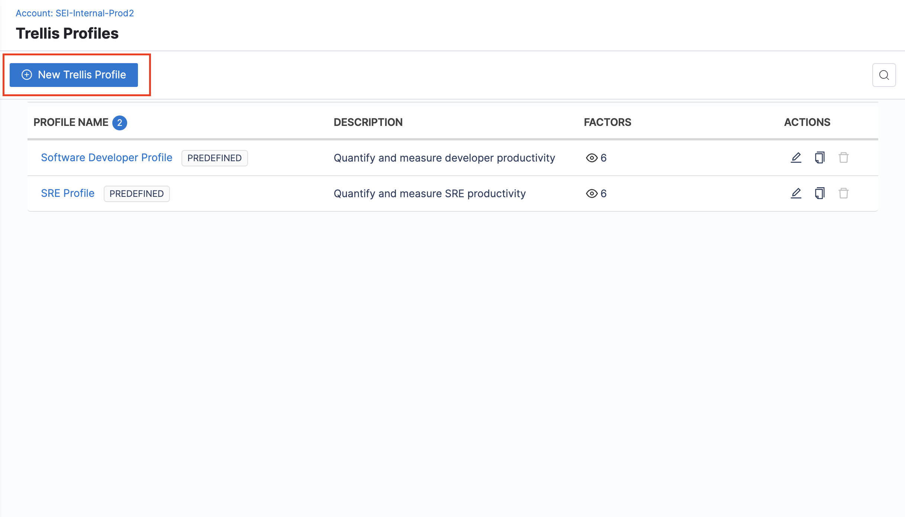

Trellis Scores are a proprietary scoring mechanism from SEI. Your Trellis Score helps you understand your team's productivity. [Trellis Scores](/docs/software-engineering-insights/sei-metrics-and-reports/trellis-score) are calculated from factors such as code quality, code volume, speed, impact, proficiency, and collaboration. You can adjust the weight given to each factor.

:::info
The 202402.1 release included a new experience for the Trellis profile configuration at the Collection level i.e. Trellis Factors settings, which enhance the effectiveness and accuracy of Trellis Scores calculation based on the custom attributes of the contributors.    The feature is currently in BETA. To learn more, go to [Trellis Factors](/docs/software-engineering-insights/early-access/profiles/sei-trellis-factors)
:::

To create or edit a Trellis profile:

1. In your Harness project, go to the SEI module.
2. Select **Account**.
3. Select **Trellis** under **Profiles**.
4. To create a profile, select **+New Trellis  Profile**. To edit an existing profile, select the profile's name in the profiles list.

:::info Predefined Trellis profiles

Some Trellis profiles are automatically created when you create a Harness project or add certain types of [SEI integrations](/docs/category/sei-integrations). You can associate predefined profiles with [Collections](/docs/software-engineering-insights/sei-projects-and-collections/manage-collections).

You can't delete predefined profiles. If you don't want to use a predefined profile, make sure it isn't associated with any Collections.

:::

## Basic Info

Configure basic information for the Trellis profile, such as a **Name** and an optional **Description**.

## Associations and exclusions

In the **Association** section of your Trellis profile, you can map [Collections](/docs/software-engineering-insights/sei-projects-and-collections/manage-collections) to the Trellis profile, map development stages, and configure exclusions.

* **Associations:** Select Collections to associate with this Trellis Profile.
* **Investment profile mapping:** It refers to the allocation of effort investment categories used in the calculation of your Trellis score. 

* **Exclusions:** Exclusions are useful in scenarios where you want to ignore certain types of PRs and commits.
   * **Exclude pull requests:** List PRs to exclude from Trellis Score calculations. If excluding PRs, the commits associated with those PRs are also excluded.
   * **Exclude commits:** List commits to exclude from Trellis Score calculations. If excluding commits, only the commits are excluded. PRs that contain those commits are not excluded, unless you also excluded them in **Exclude pull requests**.

* **Development stage mapping:** Select relevant development stages as defined in your issue management tool. This is useful if you want to attribute scores to developers based on their contributions at different stages of a project's life cycle.

## Factors and Weights

In the **Factors and Weights** section of your Trellis profile, you can configure the factors (Quality, Impact, Volume, Speed, Proficiency, and Leadership and Collaboration) that contribute to your Trellis Score.

In the main **Factors and Weights** section, you can:

* Enable and disable individual factors to include or exclude them from your Trellis Score calculation.
* Adjust the weight of each factor. Assign a low weight (1-5) to make less important factors have a lower impact on your score. Assign a higher weight (5-10) to make more important factors have a higher impact on your score. Weights are relative. For example, if all factors are weighted 5, then all factors are still equal.

In the subsections for the individual factors, you can:

* Adjust the metrics that are included in each factor's calculation. For information about the metrics behind each factor, go to [Trellis Score](/docs/software-engineering-insights/sei-metrics-and-reports/trellis-score).
* Define target performance ranges for each metric.

### Enable the Impact factor

To include the Impact factor in your Trellis score, you must associate an [Investment profile](/docs/software-engineering-insights/sei-profiles/investment-profile) with your Trellis profile. This is required because the categories defined in the Investment profile serve as input parameters for the metrics that contribute to the Impact factor.

1. If you haven't done so already, create an [Investment profile](/docs/software-engineering-insights/sei-profiles/investment-profile).
2. Go to the **Associations** section of your Trellis profile, and select the relevant **Investment Profile**.
3. Go to the **Factors and Weights** section of your Trellis profile, enable the Impact factor, and assign a suitable weight.
4. Go to the **Impact** section of your Trellis profile, and select the metrics and categories that you want to include in the Impact factor.