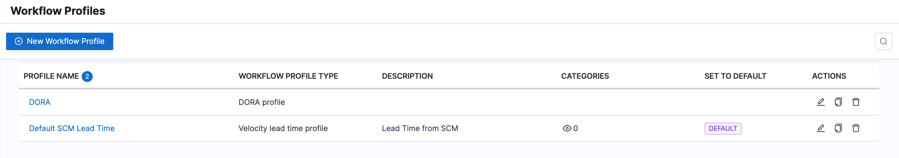
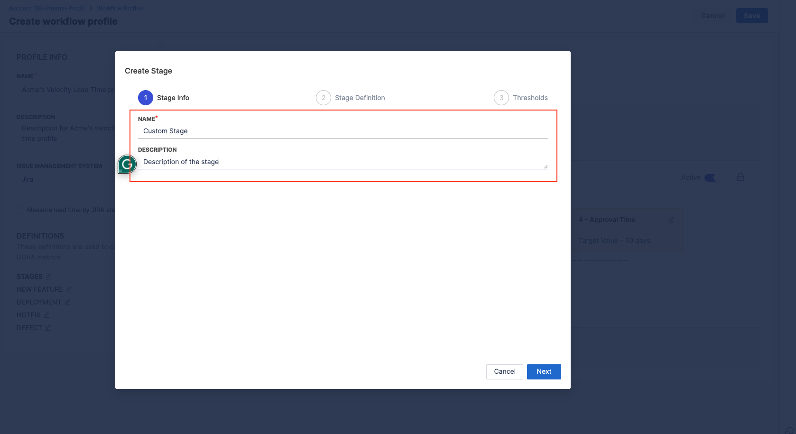
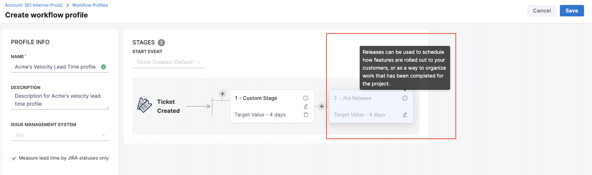

In SEI, users can create **Workflow Profiles** to measure and assess the entire software development lifecycle. These profiles allow you to define the stages, events, and measurement criteria that are relevant to your development process.

By utilizing these workflow profiles, you can measure key metrics such as DORA (DevOps Research and Assessment) and Lead Time, which provide valuable insights into the time taken to ship changes or deploy bug fixes to production.

You can configure the profile depending on the factors you want to include in your calculations. For example, you can:

* Define the **Start of Change** to start calculating lead time, which can be ticket creation in an issue management system, commits to source code, pull requests, or deployments to dev, staging, or prod environments.
* Track time spent in various issue statuses, if your profile includes monitoring for an issue management system, such as Jira.
* Track time spent in source code lifecycle stages, such as commit to merge and activities related to pull requests.
* Track lead time and DORA metrics for your engineering teams through your CI/CD tools.



## Workflow Profile Settings

**Workflow profile settings include:**

When creating a new workflow profile, you will need to choose the profile type. The available profile types include DORA profile & Velocity lead time profile.

* **DORA Profile:** Supports the four key DORA metrics - Lead time for changes, Deployment frequency, Mean time to restore, and Change failure rate. 
* **Velocity Lead Time Profile:** Supports all the pre-defined workflow profile-based Lead Time widgets.


## DORA Profile

DORA metrics are vital for evaluating and enhancing engineering team performance. The available DORA metrics are Lead Time for Changes, Deployment Frequency, Mean Time to Restore, and Change Failure Rate.

### Lead Time for Changes

Lead Time for Changes measures the time it takes for a task to progress from development to production. To configure:

* Choose the tool used for tracking tasks (e.g., new features, stories, epics) in your team.
* Configure the stages involved in your workflow based on the requirements.
* Note that for lead time metrics you can define stages based on either of the following events:
  * Ticket Created: This event ensures that lead time tracking starts in issue management.
  * Commit Created: This event ensures that lead time tracking starts when the first commit is committed.
  * API Event: This This event triggers the lead time calculation based on a custom API event.


  
To learn more about how lead time metrics are calculated, Go to [Lead Time for Changes calculation](/docs/software-engineering-insights/sei-metrics-and-reports/dora-metrics#lead-time-for-changes-calculation).

### Deployment Frequency

Deployment Frequency measures how frequently a team successfully deploys code to production. To configure:

* Specify the tool used for measuring deployments in your team.
* Select any existing integrations you wish to use for calculating deployment frequency.
* Defind the settings for how you want to calculate deployment frequency. The additional filters being used to define the deployments will be applicable to all the integrations that you selected.


### Mean Time to Restore

Mean Time to Restore represents the duration it takes a team to recover from a production failure. To configure:

* Choose the tool used for tracking tasks similar to the Lead Time for Changes metric.
* Configure the stages involved in your workflow based on the requirements.

### Change Failure Rate

Change Failure Rate is computed by dividing the total number of deployments causing failure by the overall number of deployments. To configure:

* Specify the tool used for measuring deployments in your team.
* Choose any existing integrations you want to utilize for calculating the change failure rate.
* Select how to configure your integration between SCM (Source Code Management) and CI/CD.
* Add attributes and filters to identify and define deployments causing failure and total deployments.


Total deployments represent all deployments that have occurred within a specified time range, regardless of whether they resulted in success or failure.

<details>
<summary>Integration configured with SCM</summary>

When the integration is configured with SCM, specify whether deployments causing failure and total deployments are defined based on Pull Requests (PR) or Commits. Describe what defines a deployment causing failure based on the following filters:

* PR merged without closing.
* PR closed without merging.
* A merged PR is closed.

Add any extra attributes that help identify PRs for deployments causing failure. Multiple filters are combined using an 'OR' operation.
</details>

<details>
<summary>Integration configured with CI/CD</summary>

When the integration is configured with CI/CD, define additional attributes to identify deployments causing failure and total deployments. When using multiple filters, they will be combined with an 'AND' operation.

Define job run parameters in key-value pairs. When using multiple job run parameters, they will be combined with an 'OR' operation. Similarly describe what defines a deployment causing failure based on the jobs completed or jobs started events in the selected time range.

</details>

:::info
Note: The additional filters being used to define the deployments will be applicable to all the integrations that you have selected.
:::

## Lead Time Profile

Lead time is based on time spent in stages defined in a Velocity Lead Time type Workflow profile.

For example, the default configuration for a [PR-based Workflow profile](#create-a-profile-to-track-lead-time-in-scm) has four stages:

* PR creation time.
* Time to Comment.
* Approval time.
* Merge time.

Similarly, the default configuration for a [Ticket-based Workflow profile](#configuration-examples) has five stages:

* Lead time to First Commit.
* PR Creation time.
* Time to Comment.
* Approval time.
* Merge time.

When calculating lead time, the time spent in each stage depends on the stages that a PR or issue actually goes through. For example, if your Workflow profile includes a *time to comment* stage, but there are no comments on the PR or ticket, then the *time to comment* is zero.


You can configure grading thresholds (good, acceptable, and slow) for each stage. These thresholds determine grades that appear on your lead time widgets. Grades are reported for each stage as well as a cumulative grade for all stages combined.

You can modify Workflow profile stages and grades according to your team's SDLC process. If your Workflow profile includes stages across issue management, SCM, and CI/CD, make sure the same event is not tracked in multiple tools, such as *Deploy to Production* in Jira and a *CI/CD Deploy* stage.

## Configure Workflow profiles

To add or edit Workflow profiles:

1. In your Harness project, go to the SEI module.
2. Select **Account**.
3. Select **Workflow** under **Profiles**.
4. To create a profile, select **+New Workflow Profile**. To edit a profile, select the profile's name in the profiles list.


:::tip

You can create profiles by copying existing profiles. Make sure to edit copies accordingly and that your Lead Time widgets reference the correct profile.

:::

### Configure the DORA Profile

DORA Profile is a type of Workflow Profile that allows you to define the thresholds for measuring the DORA metrics for your engineering team. Follow the steps below to configure the DORA profile:

#### Step 1: Create a New Workflow Profile

* In the **Workflow** tab under **Profiles** select **+New Workflow Profile**


* Select **DORA profile** as the type for the Workflow profile.


* Enter a **Name** for the profile.
* Add a profile description. (Optional)


#### Step 2: Define the settings for the Lead Time for Changes report

* Select the **Issue Management Platform** that you want to use to track tasks in your team.


   
* Choose the **Start Event** and configure the stages involved in the workflow based on the selected event.
  * For tracking **Lead Time** only using the **SCM** tool, select the start event as **Commit Created**
  * For measuring **Lead Time** using **Issue Management Platform** and **SCM** both or only using **Issue Management Platform**, select the start event as **Ticket Created**.
   


* Configure the stages involved in the workflow based on the selected event. To learn more, go to [Development Stages in Lead Time for Changes](/docs/software-engineering-insights/sei-metrics-and-reports/dora-metrics#development-stages).
* To add custom stages, Click on the plus button within the workflow.
   


* Add the stage name and description.
   


* Define the **Stage Definition** by selecting the trigger event (options include Issue Management, Other CI/CD tools, Harness CI) and setting the event parameters.
   


:::info
SEI currently supports only [HarnessNG integration](/docs/software-engineering-insights/sei-integrations/automated-integrations/sei-integration-harnessng) as the CD tool for configuring stages in the Lead Time workflow.
:::

* Set acceptable time limits and target times (e.g., IDEAL TIME, ACCEPTABLE TIME) for the custom stage and save it.
   


:::note

When configuring a workflow profile in Jira, you have the option to add a release stage to measure Lead Time. This allows you to schedule how features are rolled out to customers or organize completed work for your project.

:::

#### Step 3: Define the settings for the Deployment Frequency report

Modify this settings to define how you want to calculate Deployment Frequency for your engineering team.

* Choose the tool that you want to use to measure deployments in your team.
   


* Select the existing integrations that you would like to use to calculate the Deployment Frequency.
   


* Configure the additional Filters to define the criteria for deployments that are to be considered in the Deployment Frequency calculation.
   


#### Step 4: Define the settings for the Mean Time to Restore report

Define the settings for measuring the time it takes a team to recover from a failure in production. The configuration is similar to the settings for Lead Time.


#### Step 5: Define the settings for the Change Failure Rate report

Define the configuration for measuring the Change Failure Rate for your team.
* Choose the tool that you want to use to measure deployments in your team.


* Select the existing integrations that you would like to use for the calculation. Configuration details vary by SEI integration type. Default values are pre-populated, and you can change them if desired.
   


* Select factors to use to calculate failed deployments and total deployments.
   


* Ensure to select the checkbox in case you want to calculate the Change Failure Rate using only deployments that cause failure.
   

   
#### Step 6: Associate the DORA Profile with the Collection

Associate the **DORA profile** with the **Collection** and **Project** under which you have created the **DORA Insight**.
    


Once you have finished configuring the profile setting click on **Save** to save the profile.

Note that you can also edit existing Collections and associate them with the DORA profile if required.

:::tip
Note that for calculating DORA metrics, each profile can be associated with only one Collection in a one-to-one mapping
:::

You can also associate Collections to existing DORA profiles from the **Collections** Tab. **Collection categories** are shown as tabs on the **Collection Settings** page.

* To associate a **DORA profile** with the existing **Collections**, click on the **Associate Workflow Profile** option under the **Associated Profiles column**.


* Select the **DORA profile** from the available options. The pop-up dialog box will display the list of all the profiles that can be associated with the current collection.


* Select the **DORA profile** and click on the **Associate Profile** button.


### Configure the Lead Time Profile

#### Step 1: Create a New Workflow Profile

To create a **Velocity Lead Time profile**, you need to follow these key steps:

1. In the **Workflow** tab under **Profiles** select **+New Workflow Profile**


2. Select **Velocity lead time profile** as the type for the Workflow profile.


3. Enter a **Name** for the profile.
4. Add a profile description. (Optional)


#### Step 2: Select the Issue Management System

Choose either **JIRA** or **Azure** as your issue management system.


#### Step 3: Configure the Workflow Profile Definition

In this section, you'll define the settings for Stages, New Features, Deployment, Hotfix, and Defects.


#### Step 4: Configure the  Lead Time Workflow Stages

* Choose the Start Event and configure the stages involved in the workflow based on the selected event.
  * For tracking Lead Time only using the SCM tool, select the start event as Commit Created
  * For measuring Lead Time using Issue Management Platform and SCM both or only using Issue Management Platform, select the start event as Ticket Created.
   


* Define the stages involved in the workflow based on the selected event. To learn more, go to [Development Stages in Lead Time calculation](/docs/software-engineering-insights/sei-metrics-and-reports/velocity-metrics-reports/lead-time-reports#development-stages).

* To add custom stages, Click on the plus button within the workflow.


* Add the stage name and description.
  

  
* Define the **Stage Definition** by selecting the trigger event (options include Issue Management, Other CI/CD tools, Harness CI) and set the event parameters.
  


:::info
SEI currently supports only [HarnessNG integration](/docs/software-engineering-insights/sei-integrations/automated-integrations/sei-integration-harnessng) as the CD tool for configuring stages in the Lead Time workflow.
:::
  
* Define the acceptable time limits and target times (e.g., IDEAL TIME, ACCEPTABLE TIME) for the custom stage and save it.
   


#### Step 5: Define the Settings for measuring other Lead Time factors

The following configuration settings apply to all the categories (**New Features**, **Deployment**, **Hotfix**, and **Defects**):

* **Pull Requests to Branches:** Specify values that the branches for pull requests should start with or contain.
* **Pull Requests from Branches:** Define values that the source branches for pull requests should start with or contain.
* **Direct Merges to Branches:** Set criteria for branches that should be considered for direct merges, based on starting or containing specified values.
* **Tags on Commits of Merged PRs:** Specify values that tags on commits of merged pull requests should start with or contain.
* **Labels on Pull Requests:** Define values for labels on pull requests that should start with or contain specific values.

#### New Features

Configure the settings to define the criteria for New Features.


#### Deployment

Configure the settings to define the criteria for Deployment.


#### Hotfix

Configure the settings to define the criteria for Hotfix.


#### Defects

Configure the settings to define the criteria for Defects.


:::tip
Separate multiple values with a comma.
:::

### Stages

Depending on your chosen start event, the stage configuration can vary:

You can change the start event that initiates the first stage, and you can add, edit, and remove stages. When editing stages you can customize the fields, define ideal and acceptable time ranges, grades, and more. This refines how you track KPIs.

* For **Ticket Created** Start Event by default the Development stages are enabled which includes Lead time to first commit, PR creation time, Time to Comment, Approval time, and Merge time (requires destination branch confirmation). For Approval Time you have the option to choose between choosing the First Approval or the Final Approval depending on your workflow's needs.
  
  PR review stages cannot be rearranged. Default values for stages are customizable to meet specific requirements. We can add new custom stages at the beginning of the workflow or after the completion of the Development stages.

* For **Commit Created** Start Event Workflow starts with **Commit Created** followed by PR Creation Time, Time to Comment, Approval Time, and Merge Time stages. Default values are customizable based on specific requirements. Custom stages can only be added after completing the default stages.

* For **API Event** Start Event Development stages are the same as for **Ticket Created** and the PR review stages cannot be rearranged. The default values are customizable and custom stages can be added at the beginning or after the development stages.

### Add a custom stage

To add custom stages, follow these steps:

1. Click on the plus button within the workflow.
2. Add a stage name and description.
3. Define the Stage Definition by selecting the trigger event (options include Issue Management, Other CI/CD tools, Harness CI) and set event parameters.
4. Set acceptable time limits and target times (e.g., IDEAL TIME, ACCEPTABLE TIME) for the custom stage and save it.


### Measure Lead Time by Jira Statuses

You can choose to measure lead time exclusively by **JIRA statuses**. This feature is especially useful for teams using JIRA as their primary issue management tool. It is a mandatory configuration for the JIRA Releases report. Since lead time is being measured by JIRA statuses only, the start event will be **Ticket Created** by default.

You can add custom stages to your workflow, each with a name and description. Additionally, you can define acceptable time limits for each stage to measure the lead time.

These custom stages, along with the JIRA release stage, can be used to replicate your software delivery process and measure the overall lead time.


At least one stage, apart from the release stage, is mandatory when measuring lead time by JIRA statuses. This ensures that the lead time metric captures the entire workflow process with all the steps involved in bringing an issue to its final state.

Intermediate stages allow for a more detailed analysis of the time spent at each phase of the workflow, helping teams identify potential bottlenecks and areas for optimization. These stages can only be added before the release stage.

* For newly created profiles, the release stage is disabled by default in the configuration. Selecting the checkbox to measure lead time using JIRA statuses enables the release stage settings.
* The **Issue Management System** and **Start Event** is disabled and cannot be customized. Since JIRA is selected as the Issue Management Platform, **Ticket Created** is the only start event supported
* If you want to switch to Azure as the Issue Management System, you’ll have to disable the release stage from the profile configuration.
* You cannot choose a start event other than **Ticket Created** when the release stage is configured as it will lead to incorrect settings.

For existing profiles already in use, the release stage remains disabled by default.

### Add the Jira Release stage

The **Jira Release Stage** allows you to track the time it takes for features to be rolled out to customers. This helps derive valuable insights into the end-to-end delivery process, beyond just the internal development lifecycle.



When you enable the JIRA Release Stage, it measures the lead time from the point where a ticket is resolved (i.e., the Last Stage before the Jira Release Stage) to the actual date when the product or feature is released to the users.


By default, the Jira release stage is disabled, so you'll need to enable it to use it. Once enabled, the starting event for the workflow is automatically set to **Ticket Created** and cannot be modified as it will result in incorrect configuration.Similarly, the issue management system is automatically set to Jira by default.

If you want to customize the starting event and Issue Management fields, you'll have to disable the release stage first. Once disabled, you'll be able to customize your starting event and Issue Management configuration for your profile.

In cases where a single ticket is associated with multiple versions, the user can choose between two methods for the calculation:

* **Considering the Earliest Released Version:** This option measures lead time to the first released version linked to the ticket. This approach prioritizes the initial delivery of value to stakeholders, emphasizing the initial completion of the issue and its subsequent release.
* **Considering the Latest Released Version:** This option measures lead time to the most recently released version associated with the ticket. This approach focuses on the final iteration of the issue, capturing the cumulative development effort and ensuring that the lead time reflects the issue's final state as it reaches users.


## Configuration examples​

The following examples describe Workflow profile configurations to track Lead Time.

<details>
<summary>Track Lead Time in SCM​</summary>

Use this profile configuration to track Lead Time across the PR lifecycle and gain insight into your SCM tools, such as GitHub, Bitbucket, GitLab, and so on.

1. Select Workflow under Profiles.
2. Select Add Profile.
3. Under Profile Info, enter a Name and optional Description.
4. Under Lead Time for Changes, select Stages, and set the Start Event to Commit Created.
5. Review the pre populated Stages that represent the PR lifecycle, from PR creation to merge. You can edit, add, and remove stages as needed. You can edit the data or fields that drive each stage, set time range goals, and more.

If you want to include CI/CD builds and deployments in your lead time calculation, edit your Workflow profile, and add stages to track your CI/CD build and deploy jobs.

</details>

<details>
<summary>Track Lead Time in Issue Management and SCM​</summary>

1. Select Workflow under Profiles.
2. Select Add Profile.
3. Under Profile Info, enter a Name and optional Description, and then select the Issue Management System to associate with this profile.
4. Under Lead Time for Changes, select Stages, and set the Start Event to Ticket Created.
5. Review the pre populated Development Stages and edit them, if necessary. These stages represent the progression of code in your SCM tool, from first commit to PR merge.
6. To track progress in your issue management tool, select the + icon to add stages before and after the Development Stages. This allows you to track progress in both your issue management and SCM tools, from issue creation through code deployment.

</details>

<details>
<summary>Include CI/CD in Lead Time​</summary>

If you want to include CI/CD builds and deployments in your lead time calculation, follow the steps to Track Lead Time in SCM or Track Lead Time in issue management and SCM, and then add stages to track your CI/CD build and deploy jobs.

</details>

<details>
<summary>Use a webhook to trigger Lead Time tracking​</summary>

Use this profile configuration to use an API event to initiate Lead Time tracking.

1. Select Workflow under Profiles.
2. Select Add Profile.
3. Under Profile Info, enter a Name and optional Description.
4. Under Lead Time for Changes, select Stages, and set the Start Event to API Event.
5. Use the following REST API request to push custom API events to SEI:

```bash
curl --location --request POST 'https://app.harness.io/gratis/sei/api/v1/generic-events' \ 
--header 'accept: application/json' \
--header 'Content-Type: application/json' \
--header 'Authorization: Apikey <SEI_API_KEY>' \
--header 'Cookie: JSESSIONID=23F...BA12' \
--data-raw '{
    "component": "jira",
    "key": "PROP-1460",
    "event_type": "incident_1",
    "event_time": 1664925769
}'
```

Note that the API endpoint mentioned in the REQUEST is relative to the environment you are using. You will need to replace it with the actual URL that are specific to your environment.

In addition to an API Key and session ID, you must supply relevant values for the `data-raw` object according to the following definitions:

* `component`: The correlation component for the event, such as `jira`, `scm`, `ado`, and so on.
* key: The correlating identifier. For the issue management system, this is the issue ID. For SCM, this is the commit SHA.
* `event_type`: Free form text field identifying the type of event.
* `event_time`: A timestamp, in seconds, identifying when the event occurred.

</details>