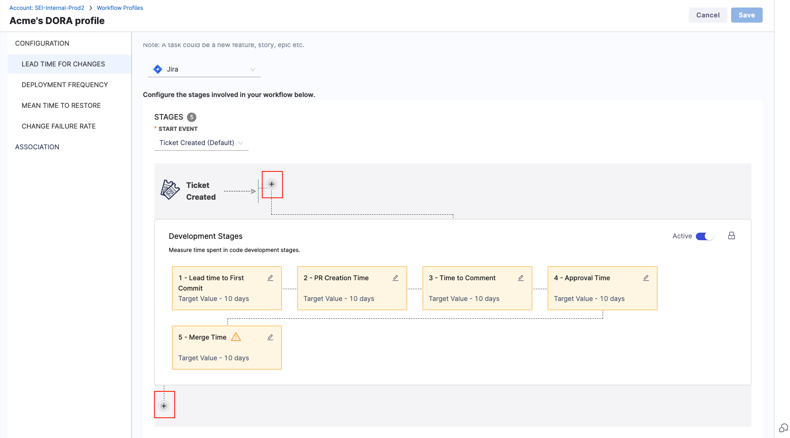
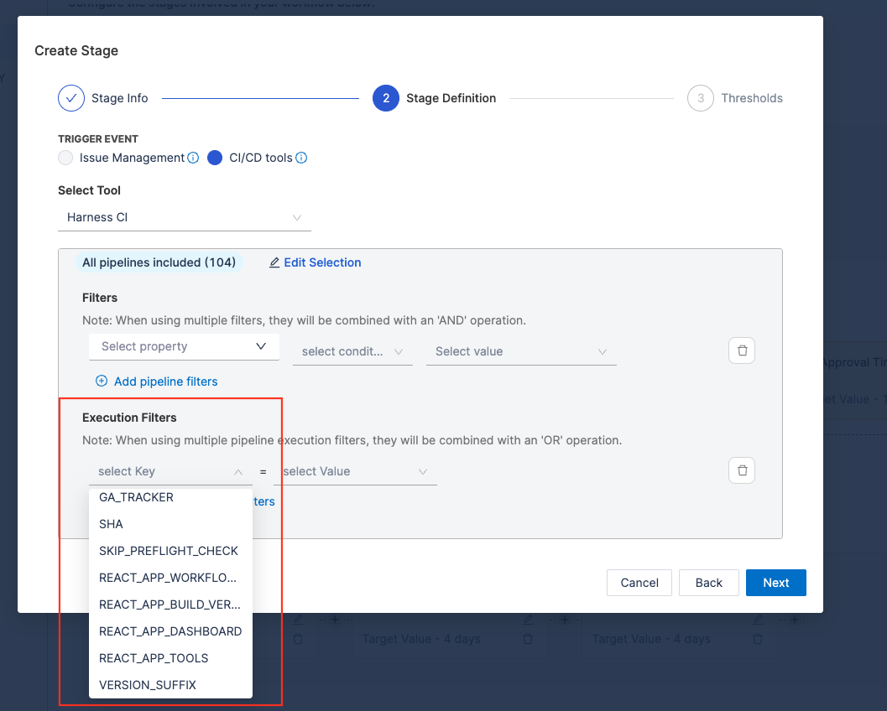
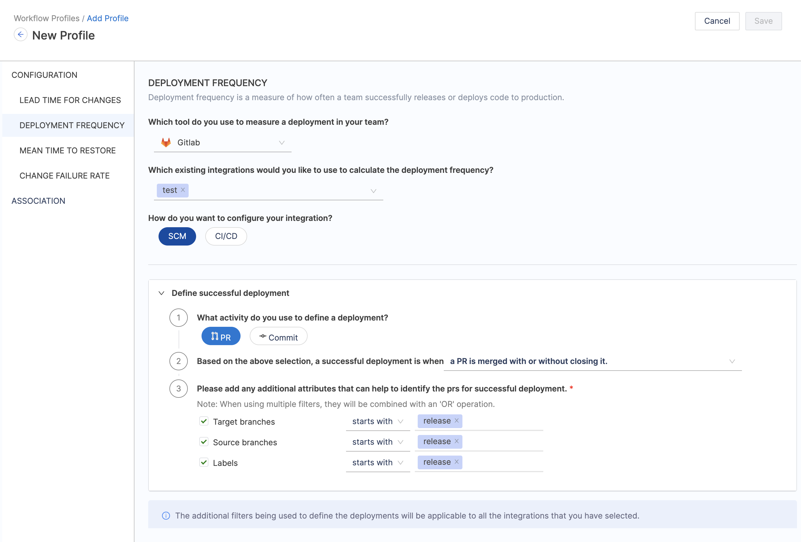
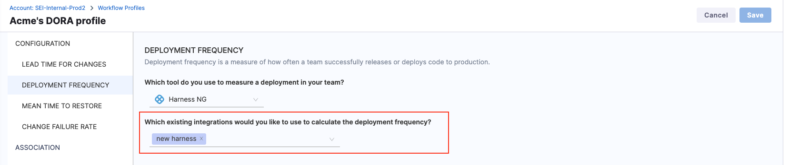
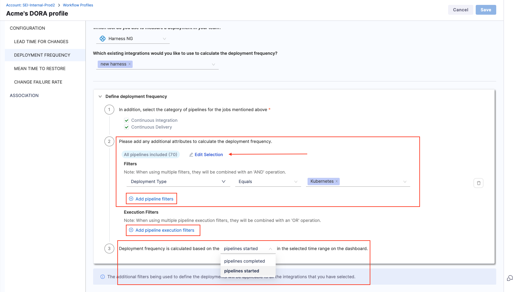
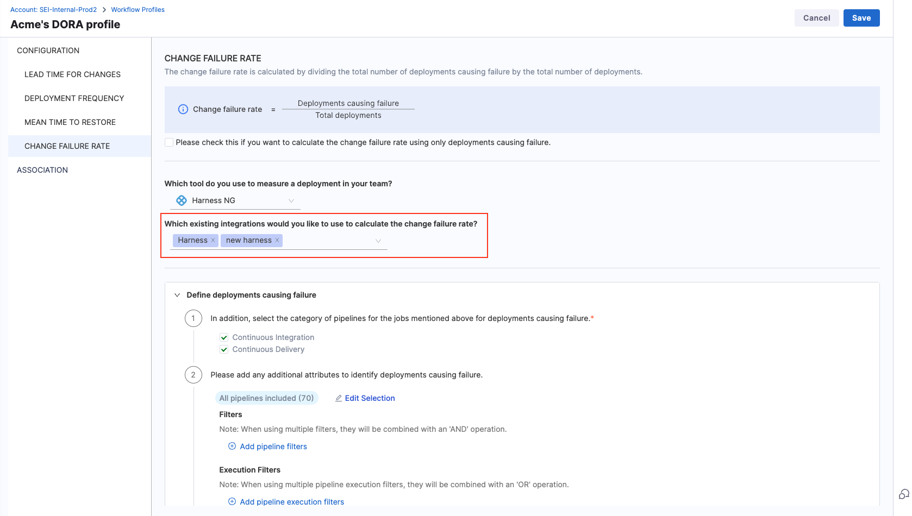
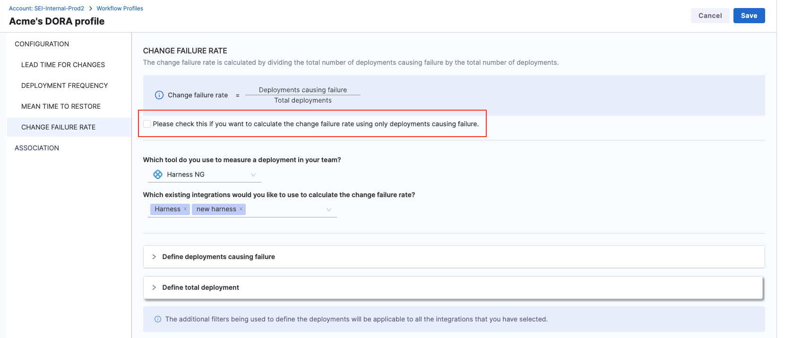
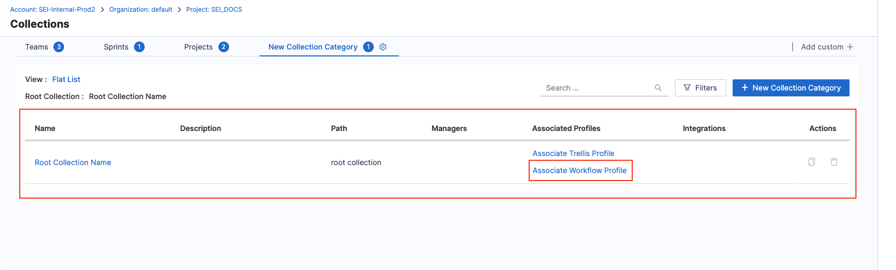

import Tabs from '@theme/Tabs';
import TabItem from '@theme/TabItem';

The DORA profile in Harness SEI sets the definition for measuring the DORA metrics across your organization.
In this topic we cover how you can create and set up the DORA profile and configure the definition for the DORA metrics across various combination of tools.

## Create DORA profiles

To add or edit Workflow profiles:

* In your Harness project, go to the SEI module.
* Select **Account Management**.
* Select **Workflow** under **Profiles**.
* To create a profile, select **+New Workflow Profile**. To edit a profile, select the profile's name in the profiles list.

* Choose **DORA Profile** as the Workflow profile type.

* Enter a **Name** for the profile.
* Add a profile description. (Optional)

:::tip

You can create profiles by copying existing profiles. Make sure to edit copies accordingly and that your Lead Time widgets reference the correct profile.

:::

### Set up Lead Time for Changes

Lead Time for Changes measures how long it takes for a task to move from development to production. This involves defining stages in your workflow that reflect your software delivery process.

#### Configuration steps

* **Choose your ticketing platform:** Select the issue management system (e.g., Jira) that your team uses to track tasks like new features, stories, or epics.
* **Select the Starting event:** Define when Lead Time tracking begins:
  * **Ticket Created:** Starts tracking when a ticket is created in the issue management system.
  * **Commit Created:** Starts tracking when the first commit is made.
  * **API Event:** Uses a custom API event to trigger Lead Time calculation.
* **Define Workflow Stages:**
  * Add stages that represent key phases in your delivery process, such as issue management and CI/CD activities.
  * Default development stages (tracked via your SCM) are by default configured. You can enable or disable these as needed.

Here's an example configuration of how you could configure Lead Time across various tools.

<Tabs>
  <TabItem value="jira" label="Using Only Issue Management" default>

This section covers how to set up the Lead Time for Changes metric definition using only an issue management tool like Jira.

* Select the **Issue Management Platform** that you want to use to track tasks in your team.

   
* Select **Ticket Created** as the start event. This triggers Lead Time tracking whenever a new ticket is created.
   

* Disable development stages as this is a issue management specific definition.

* Add custom stages that align with your Jira workflow:
  * Click the + button within the workflow.
   

  * Add the stage name and description.
   

  * Define the Stage Trigger Event (e.g., Issue Management) and map the stage to statuses in your issue management system.

  * Set acceptable time ranges for the stage, such as Ideal Time and Acceptable Time.

  * Create a series of custom stages to reflect your entire delivery process within the issue management system.

Here’s how a fully configured Issue Management-only DORA Lead Time for Changes definition might look:

</TabItem>

<TabItem value="scm" label="Using Only SCM">

An SCM-only DORA Lead Time for Changes definition focuses exclusively on the pre-configured development stages tracked in your SCM. These stages include:

* PR Creation Time
* Time to Comment
* Approval Time
* Merge Time

You can enable or disable these stages individually based on your organization's specific lead time calculation needs.

#### Define the workflow

* Select **Commit Created** as the start event to trigger Lead Time tracking when the first commit is made for a pull request.
* The workflow definition includes pre-configured development stages based on SCM activity, such as PR Creation Time, Time to Comment and more.

#### Configure PR Creation Time

This is the duration between the first commit in a repository and the creation of the first pull request that includes this commit. It reflects how promptly changes are proposed for review after initial development.

* Select the **PR Creation Time** stage
* You can customize the name and description of the stage
* Choose how SEI calculates PR Creation Time:
  * **Time from commit to first PR creation:** Measures the time to create the initial PR.
  * **Time from commit to last PR creation:** Measures time until the most recent PR involving the commit is created.

* Select an event that identifies the end of the stage (e.g., PR Created or specific labels added to the PR).

* Set acceptable time thresholds, including **Ideal Time**, **Minimum Time**, and **Maximum Time**.
* Click **Save** to apply the configuration.

#### Configure Time to Comment

This stage measures the duration from the moment a pull request is created to the time the first comment is made on it. It's an indicator of the engagement and response time of the team or reviewers.

* Select the **Time to Comment** stage
* You can customize the name and description of the stage
* Choose how would you want SEI to calculate the Time to Comment.
  * **Time from PR creation to first comment:** Measures the time until the first comment appears on the PR.
  * **Time from PR creation to the last comment:** Measures the time until the most recent comment on the PR.

* Set acceptable time thresholds, including **Ideal Time**, **Minimum Time**, and **Maximum Time**.
* You can set the target time by days or hours
* Click **Save** to apply the configuration.

#### Configure Approval Time

This measures the time taken from the creation of a pull request to its first approval. It's a gauge of how quickly a PR is reviewed and approved by the team.

* Select the Approval Time stage
* You can customize the name and description of the stage
* Choose how would you want SEI to calculate the Approval time.
  * **Time from the PR creation to the first approval:** Tracks the time to the first explicit approval.
  * **Time from the PR creation to the last approval:** Measures the time to receive all required approvals.

* Set acceptable time thresholds, including **Ideal Time**, **Minimum Time**, and **Maximum Time**.
* You can set the target time by days or hours
* Click **Save** to apply the configuration.

#### Configure Merge Time

This is the time taken to merge the first pull request after it has been created. It indicates the speed at which changes are integrated into the main branch.

* Select the Merge Time stage
* You can customize the name and description of the stage
* Choose how would you want SEI to calculate the PR merge time.
  * **Time to merge the first PR:** Measures the time to merge the earliest PR for a task.
  * **Time to merge for the last PR merge:** Tracks the time until the final PR is merged.

* Select the branch into which the PR will merge (e.g., main or develop). This ensures accurate tracking aligned with your deployment practices. The available branches are based on the data ingested by the SCM integration in your account.

* Set acceptable time thresholds, including **Ideal Time**, **Minimum Time**, and **Maximum Time**.
* You can set the target time by days or hours
* Click **Save** to apply the configuration.

Here’s how a fully configured SCM-only DORA Lead Time for Changes definition might look:

</TabItem>

<TabItem value="jira-scm" label="Using Issue Management and SCM">

This hybrid configuration involves correlating your Issue Management system (e.g., Jira) with your Source Code Manager (SCM) (e.g., GitHub). It tracks both the planning and coding phases, and requires you to maintain proper hygiene and alignment across both the systems.

#### Define the workflow

Choose **Ticket Created** as the starting event. This begins Lead Time tracking when a new ticket (e.g., story, task, or bug) is created in your Issue Management system.
Why? This ensures that planning efforts before development are accounted for.

#### Add custom stages for tracking issue management statuses

Define stages for key milestones in your Issue Management workflow. For example:

* **To Do:** Represents when a task is added to the backlog.
* **In Progress:** Indicates the start of active work.
* **Configuration:**
  * Click the + button within the workflow.
   

  * Add the stage name and description.
   

  * Define the **Stage Trigger Event** (e.g., Issue Management) and map the stage to statuses in your issue management system. For example:
    * **To Do:** Map to Open or Backlog statuses.
    * **In Progress:** Map to In Progress or Development statuses.

  * Set acceptable time thresholds, including **Ideal Time**, **Minimum Time**, and **Maximum Time**.

  * Click **Save** to finalize the stage.

Repeat this process for each Issue Management stage.

#### Configuring development stages

Set up the SCM stages that reflect key activities in your coding process.

#### Configure Lead Time to First Commit

This measures the time from the creation of a issue to the first commit made in your Source Control Management (SCM). It evaluates how quickly the development process transitions from planning to actual coding.

* Select the **Lead Time to First Commit** stage
* You can customize the name and description of the stage

* Set acceptable time thresholds, including **Ideal Time**, **Minimum Time**, and **Maximum Time**.
* Click **Save** to apply the configuration.

#### Configure PR Creation Time

This is the duration between the first commit in a repository and the creation of the first pull request that includes this commit. It reflects how promptly changes are proposed for review after initial development.

* Select the **PR Creation Time** stage
* You can customize the name and description of the stage
* Choose how SEI calculates PR Creation Time:
  * **Time from commit to first PR creation:** Measures the time to create the initial PR.
  * **Time from commit to last PR creation:** Measures time until the most recent PR involving the commit is created.

* Select an event that identifies the end of the stage (e.g., PR Created or specific labels added to the PR).

* Set acceptable time thresholds, including **Ideal Time**, **Minimum Time**, and **Maximum Time**.
* Click **Save** to apply the configuration.

#### Configure Time to Comment

This stage measures the duration from the moment a pull request is created to the time the first comment is made on it. It's an indicator of the engagement and response time of the team or reviewers.

* Select the **Time to Comment** stage
* You can customize the name and description of the stage
* Choose how would you want SEI to calculate the Time to Comment.
  * **Time from PR creation to first comment:** Measures the time until the first comment appears on the PR.
  * **Time from PR creation to the last comment:** Measures the time until the most recent comment on the PR.

* Set acceptable time thresholds, including **Ideal Time**, **Minimum Time**, and **Maximum Time**.
* You can set the target time by days or hours
* Click **Save** to apply the configuration.

#### Configure Approval Time

This measures the time taken from the creation of a pull request to its first approval. It's a gauge of how quickly a PR is reviewed and approved by the team.

* Select the Approval Time stage
* You can customize the name and description of the stage
* Choose how would you want SEI to calculate the Approval time.
  * **Time from the PR creation to the first approval:** Tracks the time to the first explicit approval.
  * **Time from the PR creation to the last approval:** Measures the time to receive all required approvals.

* Set acceptable time thresholds, including **Ideal Time**, **Minimum Time**, and **Maximum Time**.
* You can set the target time by days or hours
* Click **Save** to apply the configuration.

#### Configure Merge Time

This is the time taken to merge the first pull request after it has been created. It indicates the speed at which changes are integrated into the main branch.

* Select the Merge Time stage
* You can customize the name and description of the stage
* Choose how would you want SEI to calculate the PR merge time.
  * **Time to merge the first PR:** Measures the time to merge the earliest PR for a task.
  * **Time to merge for the last PR merge:** Tracks the time until the final PR is merged.

* Select the branch into which the PR will merge (e.g., main or develop). This ensures accurate tracking aligned with your deployment practices. The available branches are based on the data ingested by the SCM integration in your account.

* Set acceptable time thresholds, including **Ideal Time**, **Minimum Time**, and **Maximum Time**.
* You can set the target time by days or hours
* Click **Save** to apply the configuration.

Here’s how a fully configured SCM and Issue Management System based Lead Time for Changes definition might look for the DORA profile:

</TabItem>

<TabItem value="jira-scm-cicd" label="Using Issue Management + SCM + CI/CD">

This configuration extends the hybrid approach of Issue Management and SCM by including Continuous Integration (CI) and Continuous Deployment (CD) stages after the development phases. It requires defining additional stages specific to CI/CD processes and linking workflows across all tools.

#### Define the workflow

Choose **Ticket Created** as the starting event. This begins Lead Time tracking when a new ticket (e.g., story, task, or bug) is created in your Issue Management system.
Why? This ensures that planning efforts before development are accounted for.

#### Add custom stages for tracking issue management statuses

Define stages for key milestones in your Issue Management workflow. For example:

* **To Do:** Represents when a task is added to the backlog.
* **In Progress:** Indicates the start of active work.
* **Configuration:**
  * Click the + button within the workflow.
   

  * Add the stage name and description.
   

  * Define the **Stage Trigger Event** (e.g., Issue Management) and map the stage to statuses in your issue management system. For example:
    * **To Do:** Map to Open or Backlog statuses.
    * **In Progress:** Map to In Progress or Development statuses.

  * Set acceptable time thresholds, including **Ideal Time**, **Minimum Time**, and **Maximum Time**.

  * Click **Save** to finalize the stage.

Repeat this process for each Issue Management stage.

#### Configuring development stages

Set up the SCM stages that reflect key activities in your coding process.

#### Configure Lead Time to First Commit

This measures the time from the creation of a issue to the first commit made in your Source Control Management (SCM). It evaluates how quickly the development process transitions from planning to actual coding.

* Select the **Lead Time to First Commit** stage
* You can customize the name and description of the stage

* Set acceptable time thresholds, including **Ideal Time**, **Minimum Time**, and **Maximum Time**.
* Click **Save** to apply the configuration.

#### Configure PR Creation Time

This is the duration between the first commit in a repository and the creation of the first pull request that includes this commit. It reflects how promptly changes are proposed for review after initial development.

* Select the **PR Creation Time** stage
* You can customize the name and description of the stage
* Choose how SEI calculates PR Creation Time:
  * **Time from commit to first PR creation:** Measures the time to create the initial PR.
  * **Time from commit to last PR creation:** Measures time until the most recent PR involving the commit is created.

* Select an event that identifies the end of the stage (e.g., PR Created or specific labels added to the PR).

* Set acceptable time thresholds, including **Ideal Time**, **Minimum Time**, and **Maximum Time**.
* Click **Save** to apply the configuration.

#### Configure Time to Comment

This stage measures the duration from the moment a pull request is created to the time the first comment is made on it. It's an indicator of the engagement and response time of the team or reviewers.

* Select the **Time to Comment** stage
* You can customize the name and description of the stage
* Choose how would you want SEI to calculate the Time to Comment.
  * **Time from PR creation to first comment:** Measures the time until the first comment appears on the PR.
  * **Time from PR creation to the last comment:** Measures the time until the most recent comment on the PR.

* Set acceptable time thresholds, including **Ideal Time**, **Minimum Time**, and **Maximum Time**.
* You can set the target time by days or hours
* Click **Save** to apply the configuration.

#### Configure Approval Time

This measures the time taken from the creation of a pull request to its first approval. It's a gauge of how quickly a PR is reviewed and approved by the team.

* Select the **Approval Time** stage
* You can customize the name and description of the stage
* Choose how would you want SEI to calculate the Approval time.
  * **Time from the PR creation to the first approval:** Tracks the time to the first explicit approval.
  * **Time from the PR creation to the last approval:** Measures the time to receive all required approvals.

* Set acceptable time thresholds, including **Ideal Time**, **Minimum Time**, and **Maximum Time**.
* You can set the target time by days or hours
* Click **Save** to apply the configuration.

#### Configure Merge Time

This is the time taken to merge the first pull request after it has been created. It indicates the speed at which changes are integrated into the main branch.

* Select the **Merge Time** stage
* You can customize the name and description of the stage
* Choose how would you want SEI to calculate the PR merge time.
  * **Time to merge the first PR:** Measures the time to merge the earliest PR for a task.
  * **Time to merge for the last PR merge:** Tracks the time until the final PR is merged.

* Select the branch into which the PR will merge (e.g., main or develop). This ensures accurate tracking aligned with your deployment practices. The available branches are based on the data ingested by the SCM integration in your account.

* Set acceptable time thresholds, including **Ideal Time**, **Minimum Time**, and **Maximum Time**.
* You can set the target time by days or hours
* Click **Save** to apply the configuration.

#### Configure Continuous Integration (CI) stage

This section covers how to add Continuous Integration (CI) stage to the Lead Time for Changes definition in your DORA profile. This stage should follow development stages (e.g., Merge Time) to capture build times.

* Click **+ Add Stage**
* Name the stage (e.g., CI Build Time).

* Select the **Trigger Event** as CI/CD Tools
* Choose the CI tool from the available options:
  * GitHub Actions.
  * Harness CI/CD.
  * Custom CI/CD (if using a proprietary tool).

* Define how to measure the stage.
  * **Time for First CI Execution:** Captures the duration from when the first CI build pipeline starts execution to its completion.
  * **Time for Last CI Execution:** Captures the duration from when the final CI build pipeline starts execution to its completion. This is useful for workflows with multiple sequential or parallel builds.

* Specify the event parameters. These parameters filter the data used for calculation:
  * **All Pipelines Included:** Includes all CI pipelines for the project or team. This is a broad selection covering every pipeline linked to the project.
  * **Customize the selection:** You can narrow down the pipelines to specific workflows. For example:
    * Select pipelines related to a particular team, branch, or project.
    * Useful for focusing on critical pipelines (e.g., release builds).

* Use **Filters** to refine which executions are included in the stage. This trims down the pipelines that are included in the stage.
* General filters combine with AND logic for properties and OR logic across execution level filters.

* Define the acceptable time limits **Ideal Time**, **Minimum Time**, and **Maximum Time**for the CI Build Time.

* Click **Save** to apply the configuration.

#### Configure Continuous Deployment (CD) stage

Include stages to measure CD processes after the CI stage. The CD stage can be configured only if a CI stage has been configured earlier.

:::note
Currently, only Harness CD is supported out of the box as a deployment tool for lead time measurement.
:::

* Click **+ Add Stage**
* Name the stage (e.g., CD Time).

* Choose **CI/CD Tools** as the trigger event.
* Select **Harness CD** as the deployment tool.

* Define the measurement criteria:
  * **Time for First CD Execution:** Captures the duration from when the first deployment pipeline starts execution to its completion.
  * **Time for Last CD Execution:** Tracks the duration from when the final deployment pipeline starts execution to its completion.

* Specify the event parameters. This is useful to filter the data that should be used in the calculation.

  * **All Pipelines Included:** Includes all deployment pipelines associated with the project or team.
  * **Customize the selection:** You can narrow down the pipelines to specific workflows. For example:
    * Select pipelines related to a particular team, branch, or project.
    * Useful for focusing on critical pipelines (e.g., prod-deploy).
* Use **Filters** to refine which executions are included in the stage. Filters refine which executions are included, leveraging pipeline properties from Harness CD configurations:
* Similar to the CI stage, the general filters combine with AND logic for properties and OR logic across execution level filters.

* Define the acceptable time limits i.e. **Ideal Time**, **Minimum Time**, and **Maximum Time** for the CD stage.

* Click **Save** to apply the configuration.

Here’s how a fully configured SCM + Issue Management System + CI + CD based Lead Time for Changes definition might look for the DORA profile:

</TabItem>
</Tabs>

### Set up Deployment Frequency

Deployment Frequency measures how frequently a team successfully deploys code to production.

#### Configuration steps

* Select the tool your team uses to track and measure deployments.
* Select any existing integrations you wish to use for calculating deployment frequency.
* Defind the settings for how you want to calculate deployment frequency. The additional filters being used to define the deployments will be applicable to all the integrations that you selected.

Here's an example configuration of how you could configure Deployment Frequency across various tools.

<Tabs>
  <TabItem value="harnesscd" label="Using Harness CD" default>

* Choose **Harness CD** as the tool that you use to measure a deployment in your team.
* Select all the integrations that you would like to use to calculate the deployment frequency.
* Select the category of pipelines ad Continuous Delivery
* Configure the additional attributes to calculate the deployment frequency. Refine the deployment frequency calculation by specifying detailed filters. By default, all pipelines are included in the calculation, but you can customize the selection as follows:
  * Pipeline Filters:
    * Use filters to include or exclude pipelines based on specific properties, conditions, and values from the Harness CD pipeline configuration.
    * Filters combine using an AND operation, meaning all specified conditions must be met.
    * Example: Status = Success AND Environment = Production.
  * Execution Filters:
    * Narrow down the data to specific pipeline executions by defining key-value pairs.
    * Filters combine using an OR operation, meaning any execution meeting the specified conditions will be included.
    * Example: Include executions where JAVA_VERSION = 11 OR Branch = main.
  * Stage Parameter Filters:
    * Apply filters at the stage level within pipelines to focus on specific steps in the deployment process.
    * Filters combine using an OR operation, allowing flexibility to include stages that meet any of the conditions.
* Define how deployment frequency should be tracked:
  * Pipelines Started: Tracks deployment frequency based on the initiation of deployment pipelines.
  * Pipelines Completed: Tracks frequency based on successfully completed deployments.

</TabItem>

<TabItem value="cd-gha" label="Using GitHub Actions">

* Choose Harness CD as the tool that you use to measure a deployment in your team.
* Select all the integrations that you would like to use to calculate the deployment frequency.
* Select the category of pipelines ad Continuous Delivery
* Configure the additional attributes to calculate the deployment frequency. Refine the deployment frequency calculation by specifying detailed filters. By default, all pipelines are included in the calculation, but you can customize the selection as follows:
  * Pipeline Filters:
    * Use filters to include or exclude pipelines based on specific properties, conditions, and values from the Harness CD pipeline configuration.
    * Filters combine using an AND operation, meaning all specified conditions must be met.
    * Example: Status = Success AND Environment = Production.
  * Execution Filters:
    * Narrow down the data to specific pipeline executions by defining key-value pairs.
    * Filters combine using an OR operation, meaning any execution meeting the specified conditions will be included.
    * Example: Include executions where JAVA_VERSION = 11 OR Branch = main.
  * Stage Parameter Filters:
    * Apply filters at the stage level within pipelines to focus on specific steps in the deployment process.
    * Filters combine using an OR operation, allowing flexibility to include stages that meet any of the conditions.
* Define how deployment frequency should be tracked:
  * Pipelines Started: Tracks deployment frequency based on the initiation of deployment pipelines.
  * Pipelines Completed: Tracks frequency based on successfully completed deployments.

</TabItem>
</Tabs>

### Deployment Frequency

Deployment Frequency measures how frequently a team successfully deploys code to production. To configure:

* Specify the tool used for measuring deployments in your team.
* Select any existing integrations you wish to use for calculating deployment frequency.
* Defind the settings for how you want to calculate deployment frequency. The additional filters being used to define the deployments will be applicable to all the integrations that you selected.

### Mean Time to Restore

Mean Time to Restore represents the duration it takes a team to recover from a production failure. To configure:

* Choose the tool used for tracking tasks similar to the Lead Time for Changes metric.
* Configure the stages involved in your workflow based on the requirements.

### Change Failure Rate

Change Failure Rate is computed by dividing the total number of deployments causing failure by the overall number of deployments. To configure:

* Specify the tool used for measuring deployments in your team.
* Choose any existing integrations you want to utilize for calculating the change failure rate.
* Select how to configure your integration between SCM (Source Code Management) and CI/CD.
* Add attributes and filters to identify and define deployments causing failure and total deployments.

Total deployments represent all deployments that have occurred within a specified time range, regardless of whether they resulted in success or failure.

Integration configured with SCM

When the integration is configured with SCM, specify whether deployments causing failure and total deployments are defined based on Pull Requests (PR) or Commits. Describe what defines a deployment causing failure based on the following filters:

* PR merged without closing.
* PR closed without merging.
* A merged PR is closed.

Add any extra attributes that help identify PRs for deployments causing failure. Multiple filters are combined using an 'OR' operation.

Integration configured with CI/CD

When the integration is configured with CI/CD, define additional attributes to identify deployments causing failure and total deployments. When using multiple filters, they will be combined with an 'AND' operation.

Define job run parameters in key-value pairs. When using multiple job run parameters, they will be combined with an 'OR' operation. Similarly describe what defines a deployment causing failure based on the jobs completed or jobs started events in the selected time range.

:::info
Note: The additional filters being used to define the deployments will be applicable to all the integrations that you have selected.
:::

## Lead Time Profile

Lead time is based on time spent in stages defined in a Velocity Lead Time type Workflow profile.

For example, the default configuration for a [PR-based Workflow profile](#create-a-profile-to-track-lead-time-in-scm) has four stages:

* PR creation time.
* Time to Comment.
* Approval time.
* Merge time.

Similarly, the default configuration for a [Ticket-based Workflow profile](#configuration-examples) has five stages:

* Lead time to First Commit.
* PR Creation time.
* Time to Comment.
* Approval time.
* Merge time.

When calculating lead time, the time spent in each stage depends on the stages that a PR or issue actually goes through. For example, if your Workflow profile includes a *time to comment* stage, but there are no comments on the PR or ticket, then the *time to comment* is zero.

You can configure grading thresholds (good, acceptable, and slow) for each stage. These thresholds determine grades that appear on your lead time widgets. Grades are reported for each stage as well as a cumulative grade for all stages combined.

You can modify Workflow profile stages and grades according to your team's SDLC process. If your Workflow profile includes stages across issue management, SCM, and CI/CD, make sure the same event is not tracked in multiple tools, such as *Deploy to Production* in Jira and a *CI/CD Deploy* stage.

### Configure the DORA Profile

DORA Profile is a type of Workflow Profile that allows you to define the thresholds for measuring the DORA metrics for your engineering team. Follow the steps below to configure the DORA profile:

#### Step 1: Create a New Workflow Profile

* In the **Workflow** tab under **Profiles** select **+New Workflow Profile**

* Select **DORA profile** as the type for the Workflow profile.

* Enter a **Name** for the profile.
* Add a profile description. (Optional)

#### Step 2: Define the settings for the Lead Time for Changes report

* Select the **Issue Management Platform** that you want to use to track tasks in your team.

   
* Choose the **Start Event** and configure the stages involved in the workflow based on the selected event.
  * For tracking **Lead Time** only using the **SCM** tool, select the start event as **Commit Created**
  * For measuring **Lead Time** using **Issue Management Platform** and **SCM** both or only using **Issue Management Platform**, select the start event as **Ticket Created**.
   

* Configure the stages involved in the workflow based on the selected event. To learn more, go to [Development Stages in Lead Time for Changes](/docs/software-engineering-insights/sei-metrics-and-reports/dora-metrics#development-stages).
* To add custom stages, Click on the plus button within the workflow.
   

* Add the stage name and description.
   

* Define the **Stage Definition** by selecting the trigger event (options include Issue Management, Other CI/CD tools, Harness CI) and setting the event parameters.
   

:::info
SEI currently supports only [HarnessNG integration](/docs/software-engineering-insights/sei-integrations/harness-cicd/sei-integration-harnesscicd) as the CD tool for configuring stages in the Lead Time workflow.
:::

* Set acceptable time limits and target times (e.g., IDEAL TIME, ACCEPTABLE TIME) for the custom stage and save it.
   

:::note

When configuring a workflow profile in Jira, you have the option to add a release stage to measure Lead Time. This allows you to schedule how features are rolled out to customers or organize completed work for your project.

:::

#### Step 3: Define the settings for the Deployment Frequency report

Modify this settings to define how you want to calculate Deployment Frequency for your engineering team.

* Choose the tool that you want to use to measure deployments in your team.
   

* Select the existing integrations that you would like to use to calculate the Deployment Frequency.
   

* Configure the additional Filters to define the criteria for deployments that are to be considered in the Deployment Frequency calculation.
   

#### Step 4: Define the settings for the Mean Time to Restore report

Define the settings for measuring the time it takes a team to recover from a failure in production. The configuration is similar to the settings for Lead Time.

#### Step 5: Define the settings for the Change Failure Rate report

Define the configuration for measuring the Change Failure Rate for your team.
* Choose the tool that you want to use to measure deployments in your team.

* Select the existing integrations that you would like to use for the calculation. Configuration details vary by SEI integration type. Default values are pre-populated, and you can change them if desired.
   

* Select factors to use to calculate failed deployments and total deployments.
   

* Ensure to select the checkbox in case you want to calculate the Change Failure Rate using only deployments that cause failure.
   

   
#### Step 6: Associate the DORA Profile with the Collection

Associate the **DORA profile** with the **Collection** and **Project** under which you have created the **DORA Insight**.
    

Once you have finished configuring the profile setting click on **Save** to save the profile.

Note that you can also edit existing Collections and associate them with the DORA profile if required.

:::tip
Note that for calculating DORA metrics, each profile can be associated with only one Collection in a one-to-one mapping
:::

You can also associate Collections to existing DORA profiles from the **Collections** Tab. **Collection categories** are shown as tabs on the **Collection Settings** page.

* To associate a **DORA profile** with the existing **Collections**, click on the **Associate Workflow Profile** option under the **Associated Profiles column**.

* Select the **DORA profile** from the available options. The pop-up dialog box will display the list of all the profiles that can be associated with the current collection.

* Select the **DORA profile** and click on the **Associate Profile** button.

