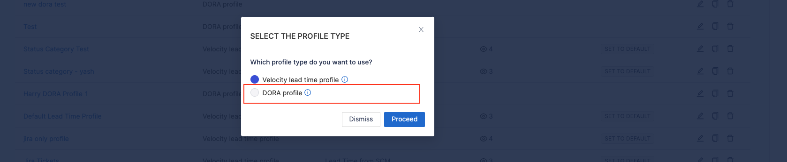
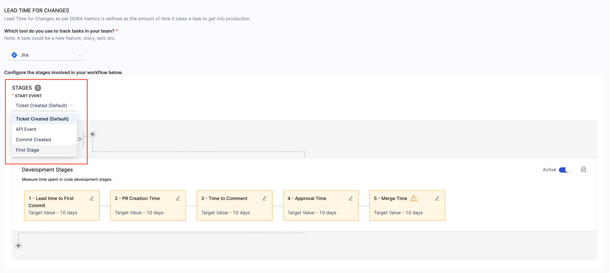
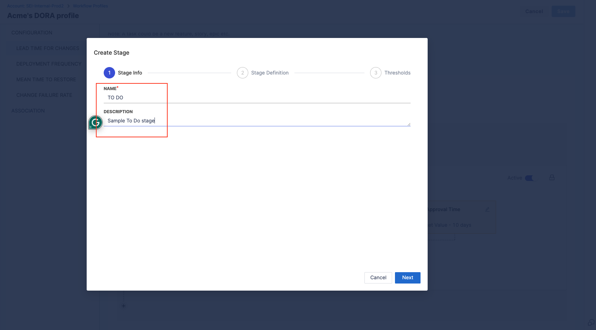
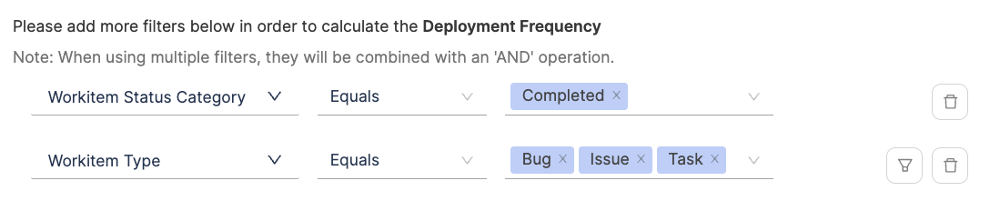
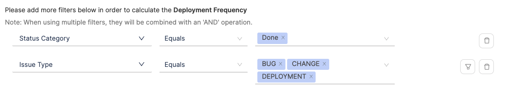
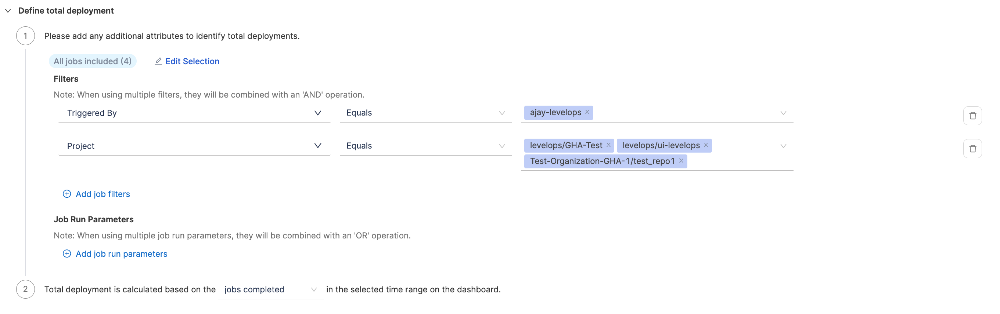
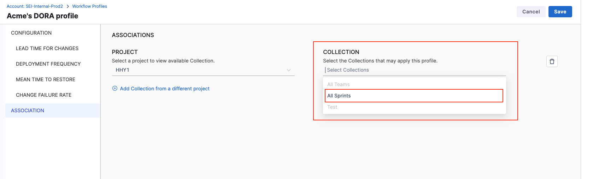

import Tabs from '@theme/Tabs';
import TabItem from '@theme/TabItem';

The DORA profile in Harness SEI sets the definition for measuring the DORA metrics across your organization.
In this topic we cover how you can create and set up the DORA profile and configure the definition for the DORA metrics across various combination of tools.

## Create DORA profiles

To add or edit Workflow profiles:

* In your Harness project, go to the SEI module.
* Select **Account Management**.
* Select **Workflow** under **Profiles**.
* To create a profile, select **+New Workflow Profile**. To edit a profile, select the profile's name in the profiles list.


* Choose **DORA Profile** as the Workflow profile type.



* Enter a **Name** for the profile.
* Add a profile description. (Optional)


:::tip

You can create profiles by copying existing profiles. Make sure to edit copies accordingly and that your Lead Time widgets reference the correct profile.

:::

### Set up Lead Time for Changes

Lead Time for Changes measures how long it takes for a task to move from development to production. This involves defining stages in your workflow that reflect your software delivery process.

#### Configuration steps

* **Choose your ticketing platform:** Select the issue management system (e.g., Jira) that your team uses to track tasks like new features, stories, or epics.
* **Select the Starting event:** Define when Lead Time tracking begins:
  * **Ticket Created:** Starts tracking when a ticket is created in the issue management system.
  * **Commit Created:** Starts tracking when the first commit is made.
  * **API Event:** Uses a custom API event to trigger Lead Time calculation.
* **Define Workflow Stages:**
  * Add stages that represent key phases in your delivery process, such as issue management and CI/CD activities.
  * Default development stages (tracked via your SCM) are by default configured. You can enable or disable these as needed.

Here's an example configuration of how you could configure Lead Time across various tools.

<Tabs>
  <TabItem value="jira" label="Using Only Issue Management"default>

This section covers how to set up the Lead Time for Changes metric definition using only an issue management tool like Jira.

* Select the **Issue Management Platform** that you want to use to track tasks in your team.


   
* Select **Ticket Created** as the start event. This triggers Lead Time tracking whenever a new ticket is created.
   


* Disable development stages as this is a issue management specific definition.


* Add custom stages that align with your Jira workflow:
  * Click the + button within the workflow.
   


  * Add the stage name and description.
   


  * Define the Stage Trigger Event (e.g., Issue Management) and map the stage to statuses in your issue management system.


  * Set acceptable time ranges for the stage, such as Ideal Time and Acceptable Time.


  * Create a series of custom stages to reflect your entire delivery process within the issue management system.

Here’s how a fully configured Issue Management-only DORA Lead Time for Changes definition might look:


</TabItem>

<TabItem value="scm" label="Using Only SCM">

An SCM-only DORA Lead Time for Changes definition focuses exclusively on the pre-configured development stages tracked in your SCM. These stages include:

* PR Creation Time
* Time to Comment
* Approval Time
* Merge Time

You can enable or disable these stages individually based on your organization's specific lead time calculation needs.


#### Define the workflow

* Select **Commit Created** as the start event to trigger Lead Time tracking when the first commit is made for a pull request.
* The workflow definition includes pre-configured development stages based on SCM activity, such as PR Creation Time, Time to Comment and more.


#### Configure PR Creation Time

This is the duration between the first commit in a repository and the creation of the first pull request that includes this commit. It reflects how promptly changes are proposed for review after initial development.

* Select the **PR Creation Time** stage
* You can customize the name and description of the stage
* Choose how SEI calculates PR Creation Time:
  * **Time from commit to first PR creation:** Measures the time to create the initial PR.
  * **Time from commit to last PR creation:** Measures time until the most recent PR involving the commit is created.


* Select an event that identifies the end of the stage (e.g., PR Created or specific labels added to the PR).


* Set acceptable time thresholds, including **Ideal Time**, **Minimum Time**, and **Maximum Time**.
* Click **Save** to apply the configuration.


#### Configure Time to Comment

This stage measures the duration from the moment a pull request is created to the time the first comment is made on it. It's an indicator of the engagement and response time of the team or reviewers.

* Select the **Time to Comment** stage
* You can customize the name and description of the stage
* Choose how would you want SEI to calculate the Time to Comment.
  * **Time from PR creation to first comment:** Measures the time until the first comment appears on the PR.
  * **Time from PR creation to the last comment:** Measures the time until the most recent comment on the PR.


* Set acceptable time thresholds, including **Ideal Time**, **Minimum Time**, and **Maximum Time**.
* You can set the target time by days or hours
* Click **Save** to apply the configuration.


#### Configure Approval Time

This measures the time taken from the creation of a pull request to its first approval. It's a gauge of how quickly a PR is reviewed and approved by the team.

* Select the Approval Time stage
* You can customize the name and description of the stage
* Choose how would you want SEI to calculate the Approval time.
  * **Time from the PR creation to the first approval:** Tracks the time to the first explicit approval.
  * **Time from the PR creation to the last approval:** Measures the time to receive all required approvals.


* Set acceptable time thresholds, including **Ideal Time**, **Minimum Time**, and **Maximum Time**.
* You can set the target time by days or hours
* Click **Save** to apply the configuration.


#### Configure Merge Time

This is the time taken to merge the first pull request after it has been created. It indicates the speed at which changes are integrated into the main branch.

* Select the Merge Time stage
* You can customize the name and description of the stage
* Choose how would you want SEI to calculate the PR merge time.
  * **Time to merge the first PR:** Measures the time to merge the earliest PR for a task.
  * **Time to merge for the last PR merge:** Tracks the time until the final PR is merged.


* Select the branch into which the PR will merge (e.g., main or develop). This ensures accurate tracking aligned with your deployment practices. The available branches are based on the data ingested by all the SCM integrations in your account.


* Set acceptable time thresholds, including **Ideal Time**, **Minimum Time**, and **Maximum Time**.
* You can set the target time by days or hours
* Click **Save** to apply the configuration.


Here’s how a fully configured SCM-only DORA Lead Time for Changes definition might look:


</TabItem>

<TabItem value="jira-scm" label="Using Issue Management and SCM">

This hybrid configuration involves correlating your **Issue Management system (e.g., Jira)** with your **Source Code Manager (SCM) (e.g., GitHub)**. It tracks both the planning and coding phases, and requires you to maintain proper hygiene and alignment across both the systems.

#### Define the workflow

Choose **Ticket Created** as the starting event. This begins Lead Time tracking when a new ticket (e.g., story, task, or bug) is created in your Issue Management system.
Why? This ensures that planning efforts before development are accounted for.

#### Add custom stages for tracking issue management statuses

Define stages for key milestones in your Issue Management workflow. For example:

* **To Do:** Represents when a task is added to the backlog.
* **In Progress:** Indicates the start of active work.
* **Configuration:**
  * Click the + button within the workflow.
   


  * Add the stage name and description.
   


  * Define the **Stage Trigger Event** (e.g., Issue Management) and map the stage to statuses in your issue management system. For example:
    * **To Do:** Map to Open or Backlog statuses.
    * **In Progress:** Map to In Progress or Development statuses.


  * Set acceptable time thresholds, including **Ideal Time**, **Minimum Time**, and **Maximum Time**.


  * Click **Save** to finalize the stage.

Repeat this process for each Issue Management stage.

#### Configuring development stages

Set up the SCM stages that reflect key activities in your coding process.

#### Configure Lead Time to First Commit

This measures the time from the creation of a issue to the first commit made in your Source Control Management (SCM). It evaluates how quickly the development process transitions from planning to actual coding.

* Select the **Lead Time to First Commit** stage
* You can customize the name and description of the stage


* Set acceptable time thresholds, including **Ideal Time**, **Minimum Time**, and **Maximum Time**.
* Click **Save** to apply the configuration.


#### Configure PR Creation Time

This is the duration between the first commit in a repository and the creation of the first pull request that includes this commit. It reflects how promptly changes are proposed for review after initial development.

* Select the **PR Creation Time** stage
* You can customize the name and description of the stage
* Choose how SEI calculates PR Creation Time:
  * **Time from commit to first PR creation:** Measures the time to create the initial PR.
  * **Time from commit to last PR creation:** Measures time until the most recent PR involving the commit is created.


* Select an event that identifies the end of the stage (e.g., PR Created or specific labels added to the PR).


* Set acceptable time thresholds, including **Ideal Time**, **Minimum Time**, and **Maximum Time**.
* Click **Save** to apply the configuration.


#### Configure Time to Comment

This stage measures the duration from the moment a pull request is created to the time the first comment is made on it. It's an indicator of the engagement and response time of the team or reviewers.

* Select the **Time to Comment** stage
* You can customize the name and description of the stage
* Choose how would you want SEI to calculate the Time to Comment.
  * **Time from PR creation to first comment:** Measures the time until the first comment appears on the PR.
  * **Time from PR creation to the last comment:** Measures the time until the most recent comment on the PR.


* Set acceptable time thresholds, including **Ideal Time**, **Minimum Time**, and **Maximum Time**.
* You can set the target time by days or hours
* Click **Save** to apply the configuration.


#### Configure Approval Time

This measures the time taken from the creation of a pull request to its first approval. It's a gauge of how quickly a PR is reviewed and approved by the team.

* Select the Approval Time stage
* You can customize the name and description of the stage
* Choose how would you want SEI to calculate the Approval time.
  * **Time from the PR creation to the first approval:** Tracks the time to the first explicit approval.
  * **Time from the PR creation to the last approval:** Measures the time to receive all required approvals.


* Set acceptable time thresholds, including **Ideal Time**, **Minimum Time**, and **Maximum Time**.
* You can set the target time by days or hours
* Click **Save** to apply the configuration.


#### Configure Merge Time

This is the time taken to merge the first pull request after it has been created. It indicates the speed at which changes are integrated into the main branch.

* Select the Merge Time stage
* You can customize the name and description of the stage
* Choose how would you want SEI to calculate the PR merge time.
  * **Time to merge the first PR:** Measures the time to merge the earliest PR for a task.
  * **Time to merge for the last PR merge:** Tracks the time until the final PR is merged.


* Select the branch into which the PR will merge (e.g., main or develop). This ensures accurate tracking aligned with your deployment practices. The available branches are based on the data ingested by the SCM integration in your account.


* Set acceptable time thresholds, including **Ideal Time**, **Minimum Time**, and **Maximum Time**.
* You can set the target time by days or hours
* Click **Save** to apply the configuration.


Here’s how a fully configured SCM and Issue Management System based Lead Time for Changes definition might look for the DORA profile:


</TabItem>

<TabItem value="jira-scm-cicd" label="Using Issue Management + SCM + CI/CD">

This configuration extends the hybrid approach of **Issue Management** and **SCM** by including **Continuous Integration (CI)** and **Continuous Deployment (CD)** stages after the development phases. It requires defining additional stages specific to CI/CD processes and linking workflows across all tools.

#### Define the workflow

Choose **Ticket Created** as the starting event. This begins Lead Time tracking when a new ticket (e.g., story, task, or bug) is created in your Issue Management system.
Why? This ensures that planning efforts before development are accounted for.

#### Add custom stages for tracking issue management statuses

Define stages for key milestones in your Issue Management workflow. For example:

* **To Do:** Represents when a task is added to the backlog.
* **In Progress:** Indicates the start of active work.
* **Configuration:**
  * Click the + button within the workflow.
   


  * Add the stage name and description.
   


  * Define the **Stage Trigger Event** (e.g., Issue Management) and map the stage to statuses in your issue management system. For example:
    * **To Do:** Map to Open or Backlog statuses.
    * **In Progress:** Map to In Progress or Development statuses.


  * Set acceptable time thresholds, including **Ideal Time**, **Minimum Time**, and **Maximum Time**.


  * Click **Save** to finalize the stage.

Repeat this process for each Issue Management stage.

#### Configuring development stages

Set up the SCM stages that reflect key activities in your coding process.

#### Configure Lead Time to First Commit

This measures the time from the creation of a issue to the first commit made in your Source Control Management (SCM). It evaluates how quickly the development process transitions from planning to actual coding.

* Select the **Lead Time to First Commit** stage
* You can customize the name and description of the stage


* Set acceptable time thresholds, including **Ideal Time**, **Minimum Time**, and **Maximum Time**.
* Click **Save** to apply the configuration.


#### Configure PR Creation Time

This is the duration between the first commit in a repository and the creation of the first pull request that includes this commit. It reflects how promptly changes are proposed for review after initial development.

* Select the **PR Creation Time** stage
* You can customize the name and description of the stage
* Choose how SEI calculates PR Creation Time:
  * **Time from commit to first PR creation:** Measures the time to create the initial PR.
  * **Time from commit to last PR creation:** Measures time until the most recent PR involving the commit is created.


* Select an event that identifies the end of the stage (e.g., PR Created or specific labels added to the PR).


* Set acceptable time thresholds, including **Ideal Time**, **Minimum Time**, and **Maximum Time**.
* Click **Save** to apply the configuration.


#### Configure Time to Comment

This stage measures the duration from the moment a pull request is created to the time the first comment is made on it. It's an indicator of the engagement and response time of the team or reviewers.

* Select the **Time to Comment** stage
* You can customize the name and description of the stage
* Choose how would you want SEI to calculate the Time to Comment.
  * **Time from PR creation to first comment:** Measures the time until the first comment appears on the PR.
  * **Time from PR creation to the last comment:** Measures the time until the most recent comment on the PR.


* Set acceptable time thresholds, including **Ideal Time**, **Minimum Time**, and **Maximum Time**.
* You can set the target time by days or hours
* Click **Save** to apply the configuration.


#### Configure Approval Time

This measures the time taken from the creation of a pull request to its first approval. It's a gauge of how quickly a PR is reviewed and approved by the team.

* Select the **Approval Time** stage
* You can customize the name and description of the stage
* Choose how would you want SEI to calculate the Approval time.
  * **Time from the PR creation to the first approval:** Tracks the time to the first explicit approval.
  * **Time from the PR creation to the last approval:** Measures the time to receive all required approvals.


* Set acceptable time thresholds, including **Ideal Time**, **Minimum Time**, and **Maximum Time**.
* You can set the target time by days or hours
* Click **Save** to apply the configuration.


#### Configure Merge Time

This is the time taken to merge the first pull request after it has been created. It indicates the speed at which changes are integrated into the main branch.

* Select the **Merge Time** stage
* You can customize the name and description of the stage
* Choose how would you want SEI to calculate the PR merge time.
  * **Time to merge the first PR:** Measures the time to merge the earliest PR for a task.
  * **Time to merge for the last PR merge:** Tracks the time until the final PR is merged.


* Select the branch into which the PR will merge (e.g., main or develop). This ensures accurate tracking aligned with your deployment practices. The available branches are based on the data ingested by the SCM integration in your account.


* Set acceptable time thresholds, including **Ideal Time**, **Minimum Time**, and **Maximum Time**.
* You can set the target time by days or hours
* Click **Save** to apply the configuration.


#### Configure Continuous Integration (CI) stage

This section covers how to add Continuous Integration (CI) stage to the Lead Time for Changes definition in your DORA profile. This stage should follow development stages (e.g., Merge Time) to capture build times.

* Click **+ Add Stage**
* Name the stage (e.g., CI Build Time).


* Select the **Trigger Event** as CI/CD Tools
* Choose the CI tool from the available options:
  * GitHub Actions.
  * Harness CI/CD.
  * Custom CI/CD (if using a proprietary tool).


* Define how to measure the stage.
  * **Time for First CI Execution:** Captures the duration from when the first CI build pipeline starts execution to its completion.
  * **Time for Last CI Execution:** Captures the duration from when the final CI build pipeline starts execution to its completion. This is useful for workflows with multiple sequential or parallel builds.


* Specify the event parameters. These parameters filter the data used for calculation:
  * **All Pipelines Included:** Includes all CI pipelines for the project or team. This is a broad selection covering every pipeline linked to the project.
  * **Customize the selection:** You can narrow down the pipelines to specific workflows. For example:
    * Select pipelines related to a particular team, branch, or project.
    * Useful for focusing on critical pipelines (e.g., release builds).


* Use **Filters** to refine which executions are included in the stage. This trims down the pipelines that are included in the stage.
* General filters combine with AND logic for properties and OR logic across execution level filters.


* Define the acceptable time limits **Ideal Time**, **Minimum Time**, and **Maximum Time**for the CI Build Time.


* Click **Save** to apply the configuration.

#### Configure Continuous Deployment (CD) stage

Include stages to measure CD processes after the CI stage. The CD stage can be configured only if a CI stage has been configured earlier.

:::note
Currently, only Harness CD is supported out of the box as a deployment tool for lead time measurement.
:::

* Click **+ Add Stage**
* Name the stage (e.g., CD Time).


* Choose **CI/CD Tools** as the trigger event.
* Select **Harness CD** as the deployment tool.


* Define the measurement criteria:
  * **Time for First CD Execution:** Captures the duration from when the first deployment pipeline starts execution to its completion.
  * **Time for Last CD Execution:** Tracks the duration from when the final deployment pipeline starts execution to its completion.


* Specify the event parameters. This is useful to filter the data that should be used in the calculation.

  * **All Pipelines Included:** Includes all deployment pipelines associated with the project or team.
  * **Customize the selection:** You can narrow down the pipelines to specific workflows. For example:
    * Select pipelines related to a particular team, branch, or project.
    * Useful for focusing on critical pipelines (e.g., prod-deploy).
* Use **Filters** to refine which executions are included in the stage. Filters refine which executions are included, leveraging pipeline properties from Harness CD configurations:
* Similar to the CI stage, the general filters combine with AND logic for properties and OR logic across execution level filters.


* Define the acceptable time limits i.e. **Ideal Time**, **Minimum Time**, and **Maximum Time** for the CD stage.


* Click **Save** to apply the configuration.

Here’s how a fully configured SCM + Issue Management System + CI + CD based Lead Time for Changes definition might look for the DORA profile:


</TabItem>
</Tabs>

### Set up Deployment Frequency

Deployment Frequency measures how frequently a team successfully deploys code to production.

#### Configuration steps

* Select the tool your team uses to track and measure deployments.
* Select any existing integrations you wish to use for calculating deployment frequency.
* Defind the settings for how you want to calculate deployment frequency. The additional filters being used to define the deployments will be applicable to all the integrations that you selected.

:::tip RECOMMENDATION
For accurate tracking, use CI/CD tools (e.g., Harness CD, GitHub Actions) or ITSM tools (e.g., ServiceNow) that provide detailed deployment and change request tracking data.
:::

Here's an example configuration of how you could configure Deployment Frequency across various tools.

<Tabs>
  <TabItem value="harnesscd" label="Using Harness CD" default>

* Choose **Harness CD** as the tool that you use to measure a deployment in your team.


* Select all the integrations that you would like to use to calculate the deployment frequency.


* Select the category of pipelines ad **Continuous Delivery**


* Configure the additional attributes to calculate the deployment frequency. By default, all pipelines are included in the calculation, but you can customize the selection by manually selecting the pipelines.


* Refine the deployment frequency calculation by specifying detailed filters. This filters pipelines that should contribute to the deployment frequency calculations.
  * **Pipeline Filters:**
    * Use filters to include or exclude pipelines based on specific properties, conditions, and values from the Harness CD pipeline configuration.
    * Filters combine using an AND operation, meaning all specified conditions must be met.
    * Example: `Status = Success` AND `Environment = Production`.


  * **Execution Filters:**
    * Narrow down the data to specific pipeline executions by defining key-value pairs.
    * Filters combine using an OR operation, meaning any execution meeting the specified conditions will be included.
    * Example: Include executions where `JAVA_VERSION = 11` OR `Branch = main`.


  * **Stage Parameter Filters:**
    * Apply filters at the stage level within pipelines to focus on specific steps in the deployment process.
    * Filters combine using an OR operation, allowing flexibility to include stages that meet any of the conditions.


* Define how deployment frequency should be tracked:
  * **Pipelines Started:** Tracks deployment frequency based on the initiation of deployment pipelines.
  * **Pipelines Completed:** Tracks frequency based on successfully completed deployments.


</TabItem>

<TabItem value="cd-gha" label="Using GitHub Actions">

* Choose **GitHub Actions** as the tool that you use to measure a deployment in your team.


* Select all the integrations that you would like to use to calculate the deployment frequency.


* * Configure the additional attributes to calculate the deployment frequency. By default, all jobs are included in the calculation, but you can customize the selection by manually selecting the jobs.


* Refine the deployment frequency calculation by specifying detailed filters. This filters jobs that should contribute to the deployment frequency calculations.
  * **Filters:**
    * Use filters to include or exclude jobs based on specific properties, conditions, and values from the GitHub Actions jobs configuration.
    * Filters combine using an AND operation, meaning all specified conditions must be met.
    * Example: `Status = Success` AND `Project = github-org/repository-name`.


  * **Job Run Parameters:**
    * Narrow down the data to specific job executions by defining key-value pairs.
    * Filters combine using an OR operation, meaning any execution meeting the specified conditions will be included.
    * Example: Include executions where `JAVA_VERSION = 11` OR B`ranch = main`.


* Define how deployment frequency should be tracked:
  * **Jobs Started:** Tracks deployment frequency based on the initiation of deployment jobs.
  * **Jobs Completed:** Tracks frequency based on successfully completed jobs.


</TabItem>

<TabItem value="cd-github" label="Using GitHub">

* Choose **GitHub** as the tool that you use to measure a deployment in your team.


* Select all the integrations that you would like to use to calculate the deployment frequency.


#### Option 1: Deployment Defined by PRs

This approach considers PR activity to define what qualifies as a deployment.


* You can decide when a PR activity signifies a successful deployment:
  * **PR Merged:** Deployment occurs when a PR is merged, regardless of whether it’s closed.
  * **PR Closed:** Deployment occurs when a PR is closed, even if it’s not merged.
  * **Merged and Closed:** Deployment happens when a merged PR is subsequently closed.


* To refine what PRs are included in the deployment frequency calculation, you can apply filters like:
  * **Target Branches:** Specify branches where deployments are pushed (e.g., `main`, `release/*`).
  * **Source Branches:** Include branches where development starts (e.g., `feature/*`, `hotfix/*`).
  * **Labels:** Use labels associated with PRs to narrow the scope.
    * **Starts With:** Include PRs with labels starting with a prefix (e.g., release for PRs related to a release).
    * **Contains:** Include PRs with labels containing specific keywords (e.g., `deploy`, `prod`).


:::note
Filters combine using an OR operation. For example, a PR qualifies if it:

Targets the main branch, OR originates from a `feature/* branch`, OR has a label containing `deploy`.
:::

#### Option 2: Deployment Defined by Commits

This approach uses commit activity to define what qualifies as a deployment.


* You can define deployment events based on commits:
  * **Commit Pushed to Target Branch:** Deployment occurs when a commit is directly pushed to a branch (e.g., `prod`), with or without a tag.
  * **Tag Added:** Deployment occurs when a tag (e.g., `v1.0`) is added to a commit, with or without pushing to a branch.
  * **Combined Condition:** Deployment occurs when either a tag is added to a commit OR the commit is pushed to a target branch.


* You can refine commit-based deployments using attributes like:
  * **Commit Branches:** Specify branches for deployment tracking (e.g., `main`, `prod`).
  * **Commit Properties:** Use conditions to filter commits:
    * **Starts With:** Include commits where branch name starts with a prefix (e.g., `fix-`, `deploy-`).
    * **Contains:** Include commits with specific keywords in the branch names (e.g., `hotfix`, `prod deploy`).


:::note
When using multiple filters, they will be combined with an OR operation, allowing commits that meet any condition to qualify.
:::

</TabItem>

<TabItem value="cd-azure-boards" label="Using Azure DevOps">

Azure DevOps can be used to configure deployment frequency definition for DORA profile. The DORA profile can be configured with either of the Azure Devops service as given below:

#### Azure Boards

Deployment Frequency can also be measured based on work items in Azure Boards. This configuration allows tracking deployments by analyzing the lifecycle of work items (e.g., their resolution, creation, or updates).

* Choose **Azure Boards** as the tool that you use to measure a deployment in your team.


* Select the relevant Azure Boards integrations that you wish to use for calculating deployment frequency.


* You can customize the work items included in the deployment frequency calculation using filters. You can add filters using fields from Azure DevOps platform such as:
  * **Work Item Status Category:** Filter based on the status category of work items (e.g., `Completed`, `Resolved`).
    * Example: Work Item Status Category equals Completed.
  * **Project:** Specify the Azure Boards project to include only relevant work items.
    * Example: Project equals Harness.
  * **Labels or Custom Fields:** Use labels or custom fields to narrow down work items further.
    * Example: Labels contain `deploy`.



* Filters are combined using an AND operation, meaning all specified conditions must be met for a work item to qualify.
* Define how deployment frequency should be calculated:
  * **Issue Resolved:** Deployment frequency is measured when work items are resolved (e.g., status changes to `Completed`).
  * **Issue Created:** Deployment frequency is based on the creation of new work items.
  * **Issue Updated:** Deployment frequency reflects updates to existing work items (e.g., adding tags, updating release fields).


#### Azure Pipelines

* Choose **Azure Pipelines** as the tool that you use to measure a deployment in your team.


* Select the relevant Azure DevOps Pipelines integrations that you wish to use for calculating deployment frequency.


* Configure the additional attributes to calculate the deployment frequency. By default, all jobs are included in the calculation, but you can customize the selection by manually selecting the jobs.


* **Filters:** Refine the deployment frequency calculation by specifying detailed filters. This filters jobs that should contribute to the deployment frequency calculations.
    * Use filters to include or exclude jobs based on specific properties, conditions, and values from the Azure Pipelines jobs configuration.
    * Filters combine using an AND operation, meaning all specified conditions must be met.
    * Example: `STATUS = SUCCEEDED` AND `PROJECT EQUALS <PROJECT_NAME>`.


  * **Job Run Parameters:**
    * Narrow down the data to specific job executions by defining key-value pairs.
    * Filters combine using an OR operation, meaning any execution meeting the specified conditions will be included.
    * Example: Include executions where `JAVA_VERSION = 11` OR `BRANCH = main`.


* Define how deployment frequency should be tracked:
  * **Jobs Started:** Tracks deployment frequency based on the initiation of deployment jobs.
  * **Jobs Completed:** Tracks frequency based on successfully completed jobs.


#### Azure Repos

* Choose **Azure Repos** as the tool that you use to measure a deployment in your team.


* Select all the integrations that you would like to use to calculate the deployment frequency.


#### Option 1: Deployment Defined by PRs

This approach considers PR activity to define what qualifies as a deployment.


* You can decide when a PR activity signifies a successful deployment:
  * **PR Merged:** Deployment occurs when a PR is merged, regardless of whether it’s closed.
  * **PR Closed:** Deployment occurs when a PR is closed, even if it’s not merged.
  * **Merged and Closed:** Deployment happens when a merged PR is subsequently closed.


* To refine what PRs are included in the deployment frequency calculation, you can apply filters like:
  * **Target Branches:** Specify branches where deployments are pushed (e.g., `main`, `release/*`).
  * **Source Branches:** Include branches where development starts (e.g., `feature/*`, `hotfix/*`).
  * **Labels:** Use labels associated with PRs to narrow the scope.
    * **Starts With:** Include PRs with labels starting with a prefix (e.g., release for PRs related to a release).
    * **Contains:** Include PRs with labels containing specific keywords (e.g., `deploy`, `prod`).


:::note
Filters combine using an OR operation. For example, a PR qualifies if it:

Targets the main branch, OR originates from a `feature/* branch`, OR has a label containing `deploy`.
:::

#### Option 2: Deployment Defined by Commits

This approach uses commit activity to define what qualifies as a deployment.


* You can define deployment events based on commits:
  * **Commit Pushed to Target Branch:** Deployment occurs when a commit is directly pushed to a branch (e.g., `prod`), with or without a tag.
  * **Tag Added:** Deployment occurs when a tag (e.g., `v1.0`) is added to a commit, with or without pushing to a branch.
  * **Combined Condition:** Deployment occurs when either a tag is added to a commit OR the commit is pushed to a target branch.


* You can refine commit-based deployments using attributes like:
  * **Commit Branches:** Specify branches for deployment tracking (e.g., `main`, `prod`).
  * **Commit Properties:** Use conditions to filter commits:
    * **Starts With:** Include commits where branch name starts with a prefix (e.g., `fix-`, `deploy-`).
    * **Contains:** Include commits with specific keywords in the branch names (e.g., `hotfix`, `prod deploy`).


:::note
When using multiple filters, they will be combined with an OR operation, allowing commits that meet any condition to qualify.
:::

</TabItem>

<TabItem value="cd-jenkins" label="Using Jenkins">

* Choose **Jenkins** as the tool that you use to measure a deployment in your team.


* Select the relevant Jenkins integrations that you wish to use for calculating deployment frequency.


* Configure the additional attributes to calculate the deployment frequency. By default, all jobs are included in the calculation, but you can customize the selection by manually selecting the jobs.


* Refine the deployment frequency calculation by specifying detailed filters. This filters jobs that should contribute to the deployment frequency calculations.
  * **Filters:**
    * Use filters to include or exclude jobs based on specific properties, conditions, and values from the Jenkins jobs configuration.
    * Filters combine using an AND operation, meaning all specified conditions must be met.
    * Example: `Status = Success` AND `Instance Name = <JENKINS_INSTANCE_NAME>`.


  * **Job Run Parameters:**
    * Narrow down the data to specific job executions by defining key-value pairs.
    * Filters combine using an OR operation, meaning any execution meeting the specified conditions will be included.
    * Example: Include executions where `JAVA_VERSION = 11` OR `BRANCH = main`.


* Define how deployment frequency should be tracked:
  * **Jobs Started:** Tracks deployment frequency based on the initiation of deployment jobs.
  * **Jobs Completed:** Tracks frequency based on successfully completed jobs.


</TabItem>

<TabItem value="cd-jira" label="Using Jira">

* Choose **Jira** as the tool that you use to measure a deployment in your team.


* Select the relevant Jira integrations that you wish to use for calculating deployment frequency.


#### Option 1: Identify Deployments Using Filters on Jira Tickets

Refine the Jira issues included in the deployment frequency calculation using customizable filters. For example:

* **Status Category:** Filter issues based on their status (e.g., Done, Resolved).
* **Issue Type:** Include specific issue types such as Bug, Change, Deployment.
* **Labels or Custom Fields:** Narrow down the scope by applying labels or using custom fields.


Filters are combined using an AND operation, meaning all specified conditions must be met for an issue to qualify.



* Define how deployment frequency should be calculated:
  * **Issue Resolved:** Measures deployment frequency when work items are resolved (e.g., status changes to Completed).
  * **Issue Created:** Based on the creation of new Jira tickets.
  * **Issue Updated:** Tracks frequency when existing issues are updated (e.g., adding tags, updating release fields).


#### Option 2: Identify Deployments by Considering Jira Releases

Deployment frequency is measured based on the release versions in Jira.
This calculation considers the number of releases within the selected time range in the insight.


</TabItem>

<TabItem value="df-bb" label="Using BitBucket">

* Choose **BitBucket** / **BitBucket Server** as the tool that you use to measure a deployment in your team.


* Select all the integrations that you would like to use to calculate the deployment frequency.


#### Option 1: Deployment Defined by PRs

This approach considers PR activity to define what qualifies as a deployment.


* You can decide when a PR activity signifies a successful deployment:
  * **PR Merged:** Deployment occurs when a PR is merged, regardless of whether it’s closed.
  * **PR Closed:** Deployment occurs when a PR is closed, even if it’s not merged.
  * **Merged and Closed:** Deployment happens when a merged PR is subsequently closed.


* To refine what PRs are included in the deployment frequency calculation, you can apply filters like:
  * **Target Branches:** Specify branches where deployments are pushed (e.g., `main`, `release/*`).
  * **Source Branches:** Include branches where development starts (e.g., `feature/*`, `hotfix/*`).
  * **Labels:** Use labels associated with PRs to narrow the scope.
    * **Starts With:** Include PRs with labels starting with a prefix (e.g., release for PRs related to a release).
    * **Contains:** Include PRs with labels containing specific keywords (e.g., `deploy`, `prod`).


:::note
Filters combine using an OR operation. For example, a PR qualifies if it:

Targets the main branch, OR originates from a `feature/* branch`, OR has a label containing `deploy`.
:::

#### Option 2: Deployment Defined by Commits

This approach uses commit activity to define what qualifies as a deployment.


* You can define deployment events based on commits:
  * **Commit Pushed to Target Branch:** Deployment occurs when a commit is directly pushed to a branch (e.g., `prod`), with or without a tag.
  * **Tag Added:** Deployment occurs when a tag (e.g., `v1.0`) is added to a commit, with or without pushing to a branch.
  * **Combined Condition:** Deployment occurs when either a tag is added to a commit OR the commit is pushed to a target branch.


* You can refine commit-based deployments using attributes like:
  * **Commit Branches:** Specify branches for deployment tracking (e.g., `main`, `prod`).
  * **Commit Properties:** Use conditions to filter commits:
    * **Starts With:** Include commits where branch name starts with a prefix (e.g., `fix-`, `deploy-`).
    * **Contains:** Include commits with specific keywords in the branch names (e.g., `hotfix`, `prod deploy`).


:::note
When using multiple filters, they will be combined with an OR operation, allowing commits that meet any condition to qualify.
:::

</TabItem>

<TabItem value="df-snow" label="Using ServiceNow">

* Choose **ServiceNow** as the tool that you use to measure a deployment in your team.


* Select the relevant ServiceNow integrations that you wish to use for calculating deployment frequency.


* Select the ticket type for deployment frequency tracking:
  * **Change Request** is the recommended option for measuring deployment frequency.
  * You can alternatively select Incident, though this is not recommended for deployment frequency tracking.


* Refine the deployment frequency calculation by specifying filters:
    * Use filters to include or exclude tickets based on specific fields, conditions, and values in your ServiceNow account.
    * Filters are combined using an AND operation, meaning all specified conditions must be met.
    * Example: `STATUS EQUALS CLOSED` AND `IMPACT EQUALS = <IMPACT_VALUES>`.


* Define how deployment frequency should be tracked:
  * **Change Request Resolved:** Tracks deployment frequency based on when change requests are resolved (e.g., status changes to Closed).
  * **Change Request Updated:** Tracks deployment frequency whenever change requests are updated (e.g., fields like resolution date or status are modified).
  * **Change Request Created:** Tracks deployment frequency based on the creation of new change requests.


</TabItem>

<TabItem value="df-gitlab" label="Using GitLab">

* Choose **GitLab** as the tool that you use to measure a deployment in your team.


* Select all the integrations that you would like to use to calculate the deployment frequency.


* Define the deployment method i.e. specify whether deployment frequency should be based on:
  * GitLab SCM (Source Code Management)
  * GitLab CI/CD


#### Option 1: Deployment Defined by PRs (SCM)

This approach considers PR activity to define what qualifies as a deployment.


* You can decide when a PR activity signifies a successful deployment:
  * **PR Merged:** Deployment occurs when a PR is merged, regardless of whether it’s closed.
  * **PR Closed:** Deployment occurs when a PR is closed, even if it’s not merged.
  * **Merged and Closed:** Deployment happens when a merged PR is subsequently closed.


* To refine what PRs are included in the deployment frequency calculation, you can apply filters like:
  * **Target Branches:** Specify branches where deployments are pushed (e.g., `main`, `release/*`).
  * **Source Branches:** Include branches where development starts (e.g., `feature/*`, `hotfix/*`).
  * **Labels:** Use labels associated with PRs to narrow the scope.
    * **Starts With:** Include PRs with labels starting with a prefix (e.g., release for PRs related to a release).
    * **Contains:** Include PRs with labels containing specific keywords (e.g., `deploy`, `prod`).


:::note
Filters combine using an OR operation. For example, a PR qualifies if it:

Targets the main branch, OR originates from a `feature/* branch`, OR has a label containing `deploy`.
:::

#### Option 2: Deployment Defined by Commits (SCM)

This approach uses commit activity to define what qualifies as a deployment.


* You can define deployment events based on commits:
  * **Commit Pushed to Target Branch:** Deployment occurs when a commit is directly pushed to a branch (e.g., `prod`), with or without a tag.
  * **Tag Added:** Deployment occurs when a tag (e.g., `v1.0`) is added to a commit, with or without pushing to a branch.
  * **Combined Condition:** Deployment occurs when either a tag is added to a commit OR the commit is pushed to a target branch.


* You can refine commit-based deployments using attributes like:
  * **Commit Branches:** Specify branches for deployment tracking (e.g., `main`, `prod`).
  * **Commit Properties:** Use conditions to filter commits:
    * **Starts With:** Include commits where branch name starts with a prefix (e.g., `fix-`, `deploy-`).
    * **Contains:** Include commits with specific keywords in the branch names (e.g., `hotfix`, `prod deploy`).


:::note
When using multiple filters, they will be combined with an OR operation, allowing commits that meet any condition to qualify.
:::

#### Option 3: Deployment Defined by GitLab CI/CD

* GitLab CI/CD-based deployment frequency tracks pipeline job activity.


* **Filters:** Refine the deployment frequency calculation by specifying detailed filters. This filters jobs that should contribute to the deployment frequency calculations.
    * Use filters to include or exclude jobs based on specific properties, conditions, and values from the Jenkins jobs configuration.
    * Filters combine using an AND operation, meaning all specified conditions must be met.
    * Example: `STATUS EQUALS SUCCESS` AND `STAGE NAME = <NAME_OF_STAGE_NAME_IN_GITLAB>`.


  * **Job Run Parameters:**
    * Narrow down the data to specific job executions by defining key-value pairs.
    * Filters combine using an OR operation, meaning any execution meeting the specified conditions will be included.
    * Example: Include executions where `JAVA_VERSION = 11` OR `BRANCH = main`.


* Define how deployment frequency should be tracked:
  * **Jobs Started:** Tracks deployment frequency based on the initiation of deployment jobs.
  * **Jobs Completed:** Tracks frequency based on successfully completed jobs.


</TabItem>

</Tabs>

### Set up Mean Time to Restore

Mean Time to Restore represents the duration it takes a team to recover from a production failure.

#### Configuration steps

* Choose the tool used for measuring the incident recovery time in your team.
* Configure the stages/filters to identify incident tickets based on the requirements.

:::tip RECOMMENDATION
For accurate tracking, use ITSM tools (i.e. ServiceNow or PagerDuty) that provide detailed incident tracking data.
:::

Here's an example configuration of how you could configure Mean Time to Restore across various tools.

<Tabs>
  <TabItem value="mttr-snow" label="Using ServiceNow" default>

* Choose **ServiceNow** as the tool that you use to measure mean time to restore in your team.


* Select the associated **ServiceNow integration**. To learn about how to configure the integration, go to [ServiceNow integration](/docs/software-engineering-insights/sei-integrations/beta-integrations/servicenow/sei-servicenow).


* Select the ticket type for mean time to restore tracking:
  * **Incidents** is the recommended option for measuring DORA MTTR.
  * You can alternatively select Change Requests, though this is not recommended for MTTR tracking.


* Define incident criteria for calculating MTTR by selecting various filters that define incidents you want to track or measure for MTTR calculations.
  * The DORA profile definition supports all the ServiceNow fields including **Priority**, **Urgency**, **Status** etc to be configured as filters. When configuring the filters, the custom fields available dynamically changes based on the selected ticket type.
  * Filters are combined using an AND operation, meaning all specified conditions must be met.
  * Example: `STATUS EQUALS CLOSED` AND `CATEGORY EQUALS = <CATEGORY_VALUES>`.


* Define how mean time to restore should be tracked:
  * **Incident Resolved:** Tracks mean time to restore based on when incidents are resolved (e.g., status changes to Closed).
  * **Incident Updated:** Tracks mean time to restore whenever incidents are updated (e.g., fields like resolution date or status are modified).
  * **Incident Created:** Tracks mean time to restore based on the creation of new incidents.


</TabItem>

<TabItem value="mttr-pagerduty" label="Using PagerDuty">

<DocVideo src="https://www.youtube.com/embed/cKZF4SFxgIE?si=9U7SuECmWTVxxTqz" />

* Choose **PagerDuty** as the tool that you use to measure mean time to restore in your team.


* Select the associated **PagerDuty integration**. To learn about how to configure the integration, go to [PagerDuty integration](/docs/software-engineering-insights/sei-integrations/beta-integrations/sei-integration-pagerduty).


* Define incident criteria for calculating MTTR by selecting various filters that define incidents you want to track or measure for MTTR calculations.
  * The DORA profile definition supports all the Pagerduty fields including **PD Service**, **Incident Priority**, **Incident Urgency**, **Incident Severity**, **Status** and **User ID** etc to be configured as filters. 
  * Filters are combined using an AND operation, meaning all specified conditions must be met.
  * Example: `INCIDENT PRIORITY EQUALS P0/P1/P2` AND `ALERT SEVERITY EQUALS CRITICAL`.


* Define how mean time to restore should be tracked:
  * **Incident Resolved:** Tracks mean time to restore based on when incidents are resolved (e.g., status changes to Closed).
  * **Incident Updated:** Tracks mean time to restore whenever incidents are updated (e.g., fields like resolution date or status are modified).
  * **Incident Created:** Tracks mean time to restore based on the creation of new incidents.


</TabItem>

<TabItem value="mttr-others" label="Others">

You can measure DORA Mean Time to Restore (MTTR) using work items or tickets in your issue management system. However, we recommend using an Incident Monitoring tool for accurate results, as issue management systems require very clean and consistent data to work effectively for this purpose.

If you choose to use an issue management system, here’s how you can set it up:

* Replicate your incident management workflow across issue management, source code manager, and CI/CD systems (if needed) in the workflow settings.
* To get accurate results, your tickets must be consistently labeled and updated.
* Configure widget-level filters to include only relevant tickets:
  * **Status:** Tickets marked as resolved or closed.
  * **Labels:** Tags like incident, failure, or production.
  * **Priority:** High-priority or critical issues.

Here’s an example of how the workflow might look:


:::tip
If maintaining ticket hygiene is challenging, consider using an Incident Monitoring tool for better accuracy and simpler setup.
:::

</TabItem>

</Tabs>

### Set up Change Failure Rate

Change Failure Rate is computed by dividing the total number of deployments causing failure by the overall number of deployments.

The Change Failure Rate (CFR) is calculated by dividing the total number of deployments that cause a failure by the total number of deployments.

```bash
Change Failure Rate = Deployments causing failure / Total deployments
```

By default, it is recommended to calculate CFR using the total number of deployments as the denominator, aligning with industry standards. However, you also have the flexibility to calculate CFR focusing solely on deployments that result in failure, based on your specific needs.


#### Configuration settings

* Specify the tool your team uses to measure Change Failure Rate.
* Choose any existing integrations you want to utilize for calculating the change failure rate.
* Add attributes and filters to identify and define both the total deployments and the deployments causing failure.

:::tip RECOMMENDATION
For accurate tracking, use CI/CD tools (e.g., Harness CD, GitHub Actions) or ITSM tools (e.g., ServiceNow) that provide detailed deployment and incident tracking data.
:::

Here's an example of how you could configure CFR across various tools.

<Tabs>
  <TabItem value="harnesscd" label="Using Harness CD" default>

#### Define the deployments causing failure

* Choose **Harness CD** as the tool to identify failed deployments within your team.


* Select the integrations you want to use for calculating CFR.


* Select the category of pipelines as **Continuous Delivery**


* Configure additional attributes to identify deployments that result in failure. By default, all pipelines are included, but you can customize the selection by manually specifying which pipelines should be included.


* Refine the calculation by specifying detailed filters. This filters pipelines that should contribute to the change failure rate calculations.
  * **Pipeline Filters:**
    * Use filters to include or exclude pipelines based on specific properties, conditions, and values from the Harness CD pipeline configuration.
    * Filters combine using an AND operation, meaning all specified conditions must be met.
    * Example: `Status = Failed` AND `Environment = Production`.


  * **Execution Filters:**
    * Narrow down the data to specific pipeline executions by defining key-value pairs.
    * Filters combine using an OR operation, meaning any execution meeting the specified conditions will be included.
    * Example: Include executions where `JAVA_VERSION = 11` OR `Branch = main`.


  * **Stage Parameter Filters:**
    * Apply filters at the stage level within pipelines to focus on specific steps in the deployment process.
    * Filters combine using an OR operation, allowing flexibility to include stages that meet any of the conditions.


* Define how deployment causing failure should be tracked:
  * **Pipelines Started:** Tracks change failure rate based on the initiation of deployment pipelines.
  * **Pipelines Completed:** Tracks change failure rate based on completed pipelines.

#### Define the total deployments

Total deployments represent all deployments that have occurred within a specified time range, regardless of whether they resulted in success or failure.

Similar to the deployments causing failure definition, you can configure the definition for measuring total deployments. This definition may align with the [DORA Deployment Frequency definition](#set-up-deployment-frequency).
However, note that the total deployments are not linked with Deployment Frequency and are tracked separately for Change Failure Rate calculations.


</TabItem>

<TabItem value="cd-gha" label="Using GitHub Actions">

#### Define the deployments causing failure

* Choose **GitHub Actions** as the tool to identify failed deployments within your team.


* Select the integrations you want to use for calculating CFR.


* Configure additional attributes to identify deployments that result in failure. By default, all pipelines are included, but you can customize the selection by manually specifying which pipelines should be included.


* Refine the calculation by specifying detailed filters. This filters pipelines that should contribute to the change failure rate calculations.
  * **Filters:**
    * Use filters to include or exclude jobs based on specific properties, conditions, and values from the GitHub Actions jobs configuration.
    * Filters combine using an AND operation, meaning all specified conditions must be met.
    * Example: `Status = Failure` AND `Project = github-org/repository-name`.


  * **Job Run Parameters:**
    * Narrow down the data to specific job executions by defining key-value pairs.
    * Filters combine using an OR operation, meaning any execution meeting the specified conditions will be included.
    * Example: Include executions where `JAVA_VERSION = 11` OR `Branch = main`.

* Define how change failure rate should be tracked:
  * **Jobs Started:** Tracks change failure rate based on the initiation of deployment pipelines.
  * **Jobs Completed:** Tracks change failure rate based on completed pipelines.

#### Define the total deployments

Total deployments represent all deployments that have occurred within a specified time range, regardless of whether they resulted in success or failure.

Similar to the deployments causing failure definition, you can configure the definition for measuring total deployments. This definition may align with the [DORA Deployment Frequency definition](#set-up-deployment-frequency).
However, note that the total deployments are not linked with Deployment Frequency and are tracked separately for Change Failure Rate calculations.



</TabItem>

<TabItem value="cd-github" label="Using GitHub">

* Choose **GitHub** as the tool that you use to measure change failure rate in your team.


* Select the integrations you want to use for calculating CFR.


When the integration is configured with GitHub, specify whether deployments causing failure and total deployments are defined based on Pull Requests (PR) or Commits. Describe what defines a deployment causing failure based on the following filters:

* PR merged without closing.
* PR closed without merging.
* A merged PR is closed.

Add any extra attributes that help identify PRs for deployments causing failure. Multiple filters are combined using an 'OR' operation.


:::note
When using multiple filters, they will be combined with an OR operation, allowing commits that meet any condition to qualify.
:::

</TabItem>

<TabItem value="cd-azure-boards" label="Using Azure DevOps">

Azure DevOps can be used to configure change failure rate definition for DORA profile. The DORA profile can be configured with either of the Azure Devops service as given below:

#### Azure Boards

Change Failure Rate (CFR) can also be calculated based on work items in Azure Boards. 
By configuring this, you can track deployments that cause failures by analyzing the lifecycle of work items, such as their creation, resolution, or updates.

* Choose **Azure Boards** as the tool that you use to measure change failure rate in your team.


* Select the relevant Azure Boards integrations that you wish to use for calculating change failure rate.


* Configure additional attributes to define **deployments that result in failure** or **total deployments**. When applying multiple filters, they will be combined using an 'AND' operation. A failed Deployment can be a hotfix or a deployment that led to failure.
* Similarly describe what defines a deployment causing failure based on the issues resolved or issues created or issues updated events in the selected time range.


#### Azure Pipelines

* Choose **Azure Pipelines** as the tool that you use to measure change failure rate in your team.


* Select the relevant Azure DevOps Pipelines integrations that you wish to use for calculating change failure rate.


* Define additional attributes to identify **deployments causing failure** and **total deployments**. When using multiple filters, they will be combined with an 'AND' operation.
* Define job run parameters in key-value pairs. When using multiple job run parameters, they will be combined with an 'OR' operation. Similarly describe what defines a deployment causing failure based on the jobs completed or jobs started events in the selected time range.


#### Azure Repos

* Choose **Azure Repos** as the tool that you use to measure change failure rate in your team.


* Select the integrations you want to use for calculating CFR.


When the integration is configured with Azure Repos, specify whether deployments causing failure and total deployments are defined based on Pull Requests (PR) or Commits. Describe what defines a deployment causing failure based on the following filters:

* PR merged without closing.
* PR closed without merging.
* A merged PR is closed.

Add any extra attributes that help identify PRs for deployments causing failure. Multiple filters are combined using an 'OR' operation.


:::note
Filters combine using an OR operation. For example, a PR qualifies if it:

Targets the main branch, OR originates from a `feature/* branch`, OR has a label containing `deploy`.
:::

</TabItem>

<TabItem value="cd-jenkins" label="Using Jenkins">

#### Define the deployments causing failure

* Choose **Jenkins** as the tool that you use to measure change failure rate in your team.


* Select the relevant Jenkins integrations that you wish to use for calculating change failure rate.


* Configure additional attributes to identify deployments that result in failure. By default, all pipelines are included, but you can customize the selection by manually specifying which pipelines should be included.
* Refine the calculation by specifying detailed filters. This filters pipelines that should contribute to the change failure rate calculations.
  * **Filters:**
    * Use filters to include or exclude jobs based on specific properties, conditions, and values from the Jenkins jobs configuration.
    * Filters combine using an AND operation, meaning all specified conditions must be met.
    * Example: `Status = Failure` AND `Instance Name = <JENKINS_INSTANCE_NAME>`.
  * **Job Run Parameters:**
    * Narrow down the data to specific job executions by defining key-value pairs.
    * Filters combine using an OR operation, meaning any execution meeting the specified conditions will be included.
    * Example: Include executions where `JAVA_VERSION = 11` OR `Branch = main`.

* Define how change failure rate should be tracked:
  * **Jobs Started:** Tracks change failure rate based on the initiation of deployment pipelines.
  * **Jobs Completed:** Tracks change failure rate based on completed pipelines.

#### Define the total deployments

Total deployments represent all deployments that have occurred within a specified time range, regardless of whether they resulted in success or failure.

Similar to the deployments causing failure definition, you can configure the definition for measuring total deployments. This definition may align with the [DORA Deployment Frequency definition](#set-up-deployment-frequency).
However, note that the total deployments are not linked with Deployment Frequency and are tracked separately for Change Failure Rate calculations.


</TabItem>

<TabItem value="cd-jira" label="Using Jira">

Change Failure Rate (CFR) can also be calculated based on tickets in Jira.
By configuring this, you can track deployments that cause failures by analyzing the lifecycle of issues, such as their creation, resolution, or updates.

* Choose **Jira** as the tool that you use to measure change failure rate in your team.


* Select the relevant Jira integrations that you wish to use for calculating change failure rate.


* Configure additional attributes to define **deployments that result in failure** or **total deployments**. When applying multiple filters, they will be combined using an 'AND' operation. A failed Deployment can be a hotfix or a deployment that led to failure.
* Similarly describe what defines a deployment causing failure based on the issues resolved or issues created or issues updated events in the selected time range.


</TabItem>

<TabItem value="df-bb" label="Using BitBucket">

* Choose **BitBucket / BitBucker Server** as the tool that you use to measure change failure rate in your team.


* Select the integrations you want to use for calculating CFR.


When the integration is configured with BitBucket, specify whether deployments causing failure and total deployments are defined based on Pull Requests (PR) or Commits. Describe what defines a deployment causing failure based on the following filters:

* PR merged without closing.
* PR closed without merging.
* A merged PR is closed.

Add any extra attributes that help identify PRs for deployments causing failure. Multiple filters are combined using an 'OR' operation.


:::note
When using multiple filters, they will be combined with an OR operation, allowing commits that meet any condition to qualify.
:::

</TabItem>

<TabItem value="df-snow" label="Using ServiceNow">

#### Define the deployments causing failure

* Choose **ServiceNow** as the tool that you use to measure change failure rate in your team.


* Select the relevant ServiceNow integrations that you wish to use for calculating change failure rate.


* Select the ticket type for deployment frequency tracking:
  * **Incidents** is the recommended option for measuring deployment causing failure.
  * You can alternatively select Change Requests, though this is not recommended for change failure rate tracking.

* Refine the calculation criteria by specifying filters:
    * Use filters to include or exclude tickets based on specific fields, conditions, and values in your ServiceNow account.
    * Filters are combined using an AND operation, meaning all specified conditions must be met.
    * Example: `STATUS EQUALS CLOSED` AND `IMPACT EQUALS = <IMPACT_VALUES>`.

* Define how deployments causing failure should be tracked:
  * **Incident Resolved:** Tracks failure based on when incident type tickets are resolved (e.g., status changes to Closed).
  * **Incident Updated:** Tracks failure whenever incident type tickets are updated (e.g., fields like resolution date or status are modified).
  * **Change Request Created:** Tracks failure based on the creation of new incident type tickets.


#### Define total deployments

* Select the ticket type for measuring total deployments:
  * **Change Request** is the recommended option for measuring total deployments.
  * You can alternatively select Incident, though this is not recommended for calculating total deployments.

* Identify tickets that reflect count of deployments by using filters:
    * Use filters to include or exclude tickets based on specific fields, conditions, and values in your ServiceNow account.
    * Filters are combined using an AND operation, meaning all specified conditions must be met.
    * Example: `STATUS EQUALS CLOSED` AND `IMPACT EQUALS = <IMPACT_VALUES>`.

* Define how total deployments should be tracked:
  * **Change Request Resolved:** Tracks total deployments based on when change requests are resolved (e.g., status changes to Closed).
  * **Change Request Updated:** Tracks total deployments whenever change requests are updated (e.g., fields like resolution date or status are modified).
  * **Change Request Created:** Tracks total deployments based on the creation of new change requests.


</TabItem>

<TabItem value="df-gitlab" label="Using GitLab">

* Choose **GitLab** as the tool that you use to measure change failure rate in your team.


* Select the integrations you want to use for calculating CFR.


#### Option 1: Define CFR using GitLab SCM

When the integration is configured with GitLab SCM, specify whether deployments causing failure and total deployments are defined based on Pull Requests (PR) or Commits. 


Describe what defines a deployment causing failure based on the following filters:

* PR merged without closing.
* PR closed without merging.
* A merged PR is closed.

Add any extra attributes that help identify PRs for deployments causing failure. Multiple filters are combined using an 'OR' operation.


:::note
When using multiple filters, they will be combined with an OR operation, allowing commits that meet any condition to qualify.
:::

#### Option 2: CFR Defined by GitLab CI/CD

* GitLab CI/CD-based change failure rate tracks pipeline job activity.


* Define additional attributes to identify **deployments causing failure** and **total deployments**. When using multiple filters, they will be combined with an 'AND' operation.
* Define job run parameters in key-value pairs. When using multiple job run parameters, they will be combined with an 'OR' operation. Similarly describe what defines a deployment causing failure based on the jobs completed or jobs started events in the selected time range.


</TabItem>

</Tabs>

### Associate profile with Collection

Associate the **DORA profile** with the **Collection** and **Project** under which you have set up the **DORA Insight**.
    




Once you have finished configuring the profile setting click on **Save** to save the profile.

Note that you can also edit existing Collections and associate them with the DORA profile if required.

:::tip
Note that for calculating DORA metrics, each profile can be associated with only one Collection in a one-to-one mapping
:::

You can also associate Collections to existing DORA profiles from the **Collections** Tab. **Collection categories** are shown as tabs on the **Collection Settings** page.

* To associate a **DORA profile** with the existing **Collections**, click on the **Associate Workflow Profile** option under the **Associated Profiles column**.


* Select the **DORA profile** from the available options. The pop-up dialog box will display the list of all the profiles that can be associated with the current collection.


* Select the **DORA profile** and click on the **Associate Profile** button.


## Common set up issues

While configuring the DORA profile, you may encounter some common issues. Below are the detailed explanations and troubleshooting steps to resolve them:

### Missing or unavailable filters

#### Possible Causes

* **Data Ingestion Not Completed:** If the selected integration has not yet completed data ingestion, filters may not appear in the settings.
* **Field Not Ingested:** The required field might not be included as part of the integration ingestion process.

#### Resolution Steps

* **Check Diagnostics:** Navigate to the [Diagnostics](/docs/software-engineering-insights/sei-diagnostics) section and verify whether data is ingested for the selected integrations. If data is not yet available, wait for the ingestion process to complete.
* **Request Field Ingestion:** If the field is not ingested, create a [Harness Support](/docs/software-engineering-insights/sei-support) ticket and request the ingestion of the specific field as part of the integration.

### Values for selected filters don't populate

#### Possible Cause

* Data ingestion for the selected integration may still be in progress or incomplete.

#### Resolution Steps

* **Verify Data Availability:** Use the [Diagnostics](/docs/software-engineering-insights/sei-diagnostics) section to confirm whether the data has been successfully ingested. If the data is not present, wait until ingestion is complete to configure the filters.

### Projects/Collections not available in the association settings

#### Possible Causes

* **Existing DORA Profile Association:** The collection might already be associated with another [DORA profile](/docs/software-engineering-insights/sei-profiles/workflow-profiles/workflow-profile-overview#), as each collection can only be linked to one DORA-type workflow profile. A mismatch between collections and the intended DORA profile can result in the collection not appearing in the association settings.

#### Resolution Steps

* **Verify Collection Settings:** Check the collection settings to ensure the collection is correctly associated with the desired DORA profile. Remember, while a single DORA profile can be associated with multiple collections, each collection can only be linked to one DORA-type workflow profile. Set up the associations accordingly.

## What's next

After setting up the DORA profile, proceed to create the DORA Insight using the available DORA widgets. These widgets enable you to visualize and monitor key DORA metrics, providing actionable insights into your team’s performance.

* [Configure & add the DORA widgets](/docs/software-engineering-insights/sei-metrics-and-reports/dora-metrics/dora-metrics)
* [Create & manage the DORA Insight](/docs/software-engineering-insights/insights/dora-insight)