import Tabs from '@theme/Tabs';
import TabItem from '@theme/TabItem';

The Velocity profile in Harness SEI defines the framework for measuring Lead Time across your organization. 
This topic covers the steps to create and configure a Velocity profile and set up the Lead Time metric across different tool combinations.

## Velocity profile overview

A Velocity profile provides a framework to measuring Lead Time using stages defined within a Workflow profile. Lead Time represents the time spent across these stages in the software delivery process. 

### Default workflow configurations

Lead time is based on time spent in stages defined in a Velocity Lead Time type Workflow profile.

For example, the default configuration for a [PR-based Workflow profile](#create-a-profile-to-track-lead-time-in-scm) has four stages:

* PR creation time.
* Time to Comment.
* Approval time.
* Merge time.

Similarly, the default configuration for a [Ticket-based Workflow profile](#configuration-examples) has five stages:

* Lead time to First Commit.
* PR Creation time.
* Time to Comment.
* Approval time.
* Merge time.

When calculating Lead Time, the time spent in each stage depends on the actual stages a PR or issue goes through. For example, if a profile includes a *Time to Comment* stage but no comments are added, the *Time to Comment* for that PR or ticket is recorded as zero.


### Grading thresholds and customization

Velocity profiles allow you to set grading thresholds (Good, Acceptable, and Slow) for each stage. These thresholds influence grades reported on your Lead Time widgets and provide both per-stage and cumulative grades.

You can customize [Workflow profile stages](#configure-the-workflow-stages) and thresholds to align with your team's Software Development Lifecycle (SDLC) processes. For profiles involving multiple tools like issue management, SCM, and CI/CD, avoid duplicate tracking of the same event (e.g., Deploy to Production in both Jira and CI/CD).


### Workflow stages

The Velocity profile represents lead time as user-configurable stages that reflect your software delivery process. Stages can be configured by selecting start events, defining thresholds, and adding or editing stages.

You can change the start event that initiates the first stage, and you can add, edit, and remove stages. When editing stages you can customize the fields, define ideal and acceptable time ranges, grades, and more. This refines how you track KPIs.


#### Ticket Created Start Event

When the Ticket Created event is selected as the starting point for the Workflow, the default configuration enables a series of development stages. These include:

* Lead Time to First Commit
* PR Creation Time
* Time to Comment
* Approval Time
* Merge Time (requires confirmation of the destination branch)

For the **Approval Time** stage, you can configure the Workflow to track either the first approval or the final approval, depending on the needs of your team. The PR review stages cannot be rearranged, ensuring consistency in the flow.

While the default values for these stages are pre-configured, they are fully customizable to meet specific requirements. Additionally, custom stages can be added to the Workflow either at the beginning or after completing the default development stages.


#### Commit Created Start Event

When the Commit Created event is chosen as the starting point, the Workflow begins with the Commit Created stage. This is followed by:

* PR Creation Time
* Time to Comment
* Approval Time
* Merge Time

The default values for these stages can be adjusted based on your organization's requirements. However, custom stages can only be added after all the default stages are completed.


#### API Event Start Event

When the API Event is selected as the start event, the development stages are identical to those in the Ticket Created Workflow. These include:

* Lead Time to First Commit
* PR Creation Time
* Time to Comment
* Approval Time
* Merge Time (requires confirmation of the destination branch)

As with the Ticket Created Workflow, the PR review stages cannot be rearranged. However, the default values for each stage are customizable, and custom stages can be added either at the beginning or after the development stages are completed.


## Create Velocity profiles

To add or edit Workflow profiles:

* In your Harness project, go to the SEI module.
* Select **Account Management**.
* Select **Workflow** under **Profiles**.
* To create a profile, select **+New Workflow Profile**. To edit a profile, select the profile's name in the profiles list.


* Choose **Velocity Lead Time Profile** as the Workflow profile type.


### Add basic information

* Enter a **Name** for the profile.
* Add a profile description. (Optional)


:::tip

You can create profiles by copying existing profiles. Make sure to edit copies accordingly and that your Lead Time widgets reference the correct profile.

:::

*  Choose the Issue Management System as either **JIRA** or **Azure**.


### Configure the Workflow stages

In this section, you'll define the workflow to replicate your software delivery process into the profile definition.

* **Choose your ticketing platform:** Select the issue management system (e.g., Jira) that your team uses to track tasks like new features, stories, or epics.
* **Select the Starting event:** Define when Lead Time tracking begins:
  * **Ticket Created:** Starts tracking when a ticket is created in the issue management system.
  * **Commit Created:** Starts tracking when the first commit is made.
  * **API Event:** Uses a custom API event to trigger Lead Time calculation.
* **Define Workflow Stages:**
  * Add stages that represent key phases in your delivery process, such as issue management and CI/CD activities.
  * Default development stages (tracked via your SCM) are by default configured. You can enable or disable these as needed.

Here's an example configuration of how you could configure Lead Time across various tools.

<Tabs>
  <TabItem value="jira" label="Using Only Issue Management" default>

This section covers how to set up the lead time metric definition using only an issue management tool like Jira.
   
* Select **Ticket Created** as the start event. This triggers Lead Time tracking whenever a new ticket is created.
   
* Disable development stages as this is a issue management specific definition.

* Add custom stages that align with your Jira workflow:
  * Click the + button within the workflow.


   
  * Add the stage name and description.


   
  * Define the Stage Trigger Event (e.g., Issue Management) and map the stage to statuses in your issue management system.


  * Set acceptable time ranges for the stage, such as Ideal Time and Acceptable Time.


  * Create a series of custom stages to reflect your entire delivery process within the issue management system.

Here’s how a fully configured Issue Management-only velocity lead time definition might look:


</TabItem>

<TabItem value="scm" label="Using Only SCM">

An SCM-only DORA lead time definition focuses exclusively on the pre-configured development stages tracked in your SCM. These stages include:

* PR Creation Time
* Time to Comment
* Approval Time
* Merge Time

You can enable or disable these stages individually based on your organization's specific lead time calculation needs.


#### Define the workflow

* Select **Commit Created** as the start event to trigger Lead Time tracking when the first commit is made for a pull request.
* The workflow definition includes pre-configured development stages based on SCM activity, such as PR Creation Time, Time to Comment and more.


#### Configure PR Creation Time

This is the duration between the first commit in a repository and the creation of the first pull request that includes this commit. It reflects how promptly changes are proposed for review after initial development.

* Select the **PR Creation Time** stage
* You can customize the name and description of the stage
* Choose how SEI calculates PR Creation Time:
  * **Time from commit to first PR creation:** Measures the time to create the initial PR.
  * **Time from commit to last PR creation:** Measures time until the most recent PR involving the commit is created.

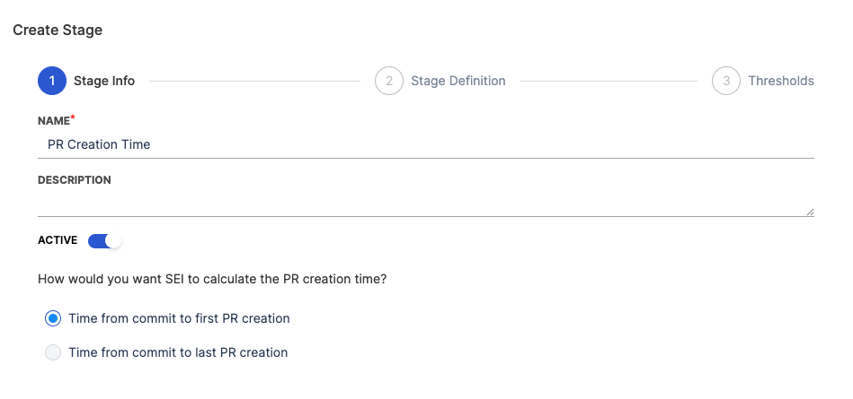

* Select an event that identifies the end of the stage (e.g., PR Created or specific labels added to the PR).


* Set acceptable time thresholds, including **Ideal Time**, **Minimum Time**, and **Maximum Time**.
* Click **Save** to apply the configuration.


#### Configure Time to Comment

This stage measures the duration from the moment a pull request is created to the time the first comment is made on it. It's an indicator of the engagement and response time of the team or reviewers.

* Select the **Time to Comment** stage
* You can customize the name and description of the stage
* Choose how would you want SEI to calculate the Time to Comment.
  * **Time from PR creation to first comment:** Measures the time until the first comment appears on the PR.
  * **Time from PR creation to the last comment:** Measures the time until the most recent comment on the PR.

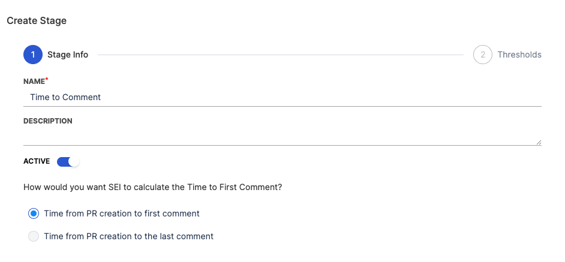

* Set acceptable time thresholds, including **Ideal Time**, **Minimum Time**, and **Maximum Time**.
* You can set the target time by days or hours
* Click **Save** to apply the configuration.

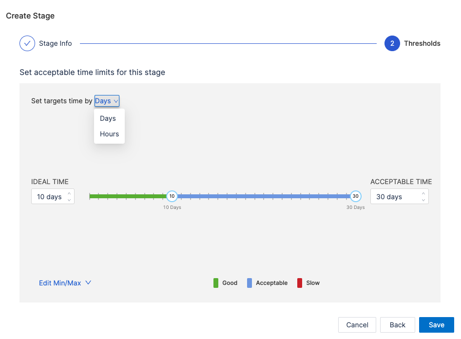

#### Configure Approval Time

This measures the time taken from the creation of a pull request to its first approval. It gives you an understanding of how quickly a PR is reviewed and approved by the team.

* Select the Approval Time stage
* You can customize the name and description of the stage
* Choose how would you want SEI to calculate the Approval time.
  * **Time from the PR creation to the first approval:** Tracks the time to the first explicit approval.
  * **Time from the PR creation to the last approval:** Measures the time to receive all required approvals.


* Set acceptable time thresholds, including **Ideal Time**, **Minimum Time**, and **Maximum Time**.
* You can set the target time by days or hours
* Click **Save** to apply the configuration.

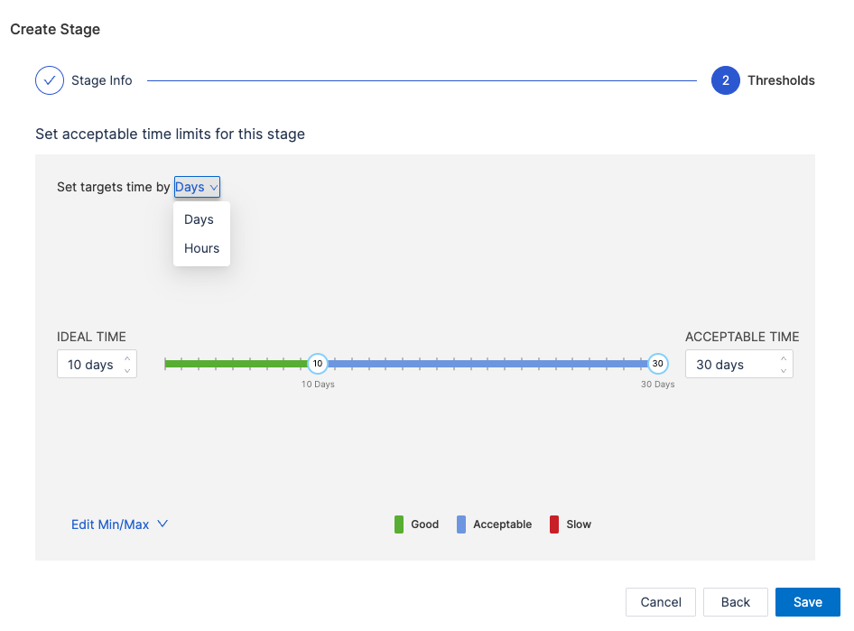

#### Configure Merge Time

This is the time taken to merge the first pull request after it has been created. It indicates the speed at which changes are integrated into the main branch.

* Select the Merge Time stage
* You can customize the name and description of the stage
* Choose how would you want SEI to calculate the PR merge time.
  * **Time to merge the first PR:** Measures the time to merge the earliest PR for a task.
  * **Time to merge for the last PR merge:** Tracks the time until the final PR is merged.


* Select the branch into which the PR will merge (e.g., main or develop). This ensures accurate tracking aligned with your deployment practices. The available branches are based on the data ingested by the SCM integration in your account.


* Set acceptable time thresholds, including **Ideal Time**, **Minimum Time**, and **Maximum Time**.
* You can set the target time by days or hours
* Click **Save** to apply the configuration.


Here’s how a fully configured SCM-only Velocity lead time definition might look:


</TabItem>

<TabItem value="jira-scm" label="Using Issue Management and SCM">

This hybrid configuration involves correlating your **Issue Management system (e.g., Jira)** with your **Source Code Manager (SCM) (e.g., GitHub)**. It tracks both the planning and coding phases, and requires you to maintain proper hygiene and alignment across both the systems.

#### Define the workflow

Choose **Ticket Created** as the starting event. This begins Lead Time tracking when a new ticket (e.g., story, task, or bug) is created in your Issue Management system.
Why? This ensures that planning efforts before development are accounted for.

#### Add custom stages for tracking issue management statuses

Define stages for key milestones in your Issue Management workflow. For example:

* **To Do:** Represents when a task is added to the backlog.
* **In Progress:** Indicates the start of active work.
* **Configuration:**
  * Click the + button within the workflow.
   


  * Add the stage name and description.
   
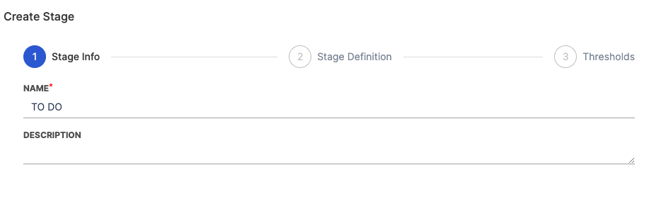

  * Define the **Stage Trigger Event** (e.g., Issue Management) and map the stage to statuses in your issue management system. For example:
    * **To Do:** Map to Open or Backlog statuses.
    * **In Progress:** Map to In Progress or Development statuses.


  * Set acceptable time thresholds, including **Ideal Time**, **Minimum Time**, and **Maximum Time**.


  * Click **Save** to finalize the stage.

Repeat this process for each Issue Management stage.

#### Configuring development stages

Set up the SCM stages that reflect key activities in your coding process.

#### Configure Lead Time to First Commit

This measures the time from the creation of a issue to the first commit made in your Source Control Management (SCM). It evaluates how quickly the development process transitions from planning to actual coding.

* Select the **Lead Time to First Commit** stage
* You can customize the name and description of the stage

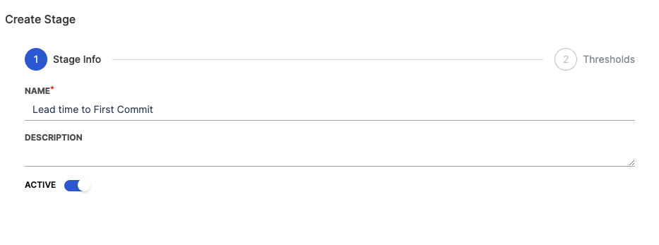

* Set acceptable time thresholds, including **Ideal Time**, **Minimum Time**, and **Maximum Time**.
* Click **Save** to apply the configuration.

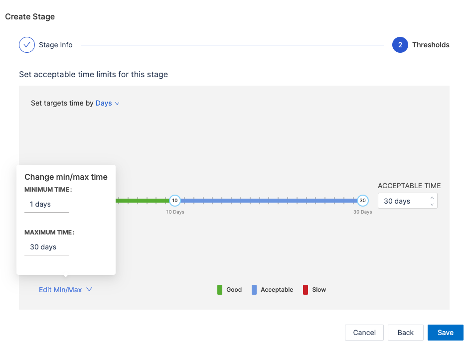

#### Configure PR Creation Time

This is the duration between the first commit in a repository and the creation of the first pull request that includes this commit. It reflects how promptly changes are proposed for review after initial development.

* Select the **PR Creation Time** stage
* You can customize the name and description of the stage
* Choose how SEI calculates PR Creation Time:
  * **Time from commit to first PR creation:** Measures the time to create the initial PR.
  * **Time from commit to last PR creation:** Measures time until the most recent PR involving the commit is created.


* Select an event that identifies the end of the stage (e.g., PR Created or specific labels added to the PR).


* Set acceptable time thresholds, including **Ideal Time**, **Minimum Time**, and **Maximum Time**.
* Click **Save** to apply the configuration.


#### Configure Time to Comment

This stage measures the duration from the moment a pull request is created to the time the first comment is made on it. It's an indicator of the engagement and response time of the team or reviewers.

* Select the **Time to Comment** stage
* You can customize the name and description of the stage
* Choose how would you want SEI to calculate the Time to Comment.
  * **Time from PR creation to first comment:** Measures the time until the first comment appears on the PR.
  * **Time from PR creation to the last comment:** Measures the time until the most recent comment on the PR.


* Set acceptable time thresholds, including **Ideal Time**, **Minimum Time**, and **Maximum Time**.
* You can set the target time by days or hours
* Click **Save** to apply the configuration.


#### Configure Approval Time

This measures the time taken from the creation of a pull request to its first approval. It's a gauge of how quickly a PR is reviewed and approved by the team.

* Select the Approval Time stage
* You can customize the name and description of the stage
* Choose how would you want SEI to calculate the Approval time.
  * **Time from the PR creation to the first approval:** Tracks the time to the first explicit approval.
  * **Time from the PR creation to the last approval:** Measures the time to receive all required approvals.


* Set acceptable time thresholds, including **Ideal Time**, **Minimum Time**, and **Maximum Time**.
* You can set the target time by days or hours
* Click **Save** to apply the configuration.


#### Configure Merge Time

This is the time taken to merge the first pull request after it has been created. It indicates the speed at which changes are integrated into the main branch.

* Select the Merge Time stage
* You can customize the name and description of the stage
* Choose how would you want SEI to calculate the PR merge time.
  * **Time to merge the first PR:** Measures the time to merge the earliest PR for a task.
  * **Time to merge for the last PR merge:** Tracks the time until the final PR is merged.


* Select the branch into which the PR will merge (e.g., main or develop). This ensures accurate tracking aligned with your deployment practices. The available branches are based on the data ingested by the SCM integration in your account.


* Set acceptable time thresholds, including **Ideal Time**, **Minimum Time**, and **Maximum Time**.
* You can set the target time by days or hours
* Click **Save** to apply the configuration.


Here’s how a fully configured SCM and Issue Management System based lead time definition might look for the DORA profile:


</TabItem>

<TabItem value="jira-scm-cicd" label="Using Issue Management + SCM + CI/CD">

This configuration extends the hybrid approach of **Issue Management** and **SCM** by including **Continuous Integration (CI)** and **Continuous Deployment (CD)** stages after the development phases. It requires defining additional stages specific to CI/CD processes and linking workflows across all tools.

#### Define the workflow

Choose **Ticket Created** as the starting event. This begins Lead Time tracking when a new ticket (e.g., story, task, or bug) is created in your Issue Management system.
Why? This ensures that planning efforts before development are accounted for.

#### Add custom stages for tracking issue management statuses

Define stages for key milestones in your Issue Management workflow. For example:

* **To Do:** Represents when a task is added to the backlog.
* **In Progress:** Indicates the start of active work.
* **Configuration:**
  * Click the + button within the workflow.
   


  * Add the stage name and description.
   


  * Define the **Stage Trigger Event** (e.g., Issue Management) and map the stage to statuses in your issue management system. For example:
    * **To Do:** Map to Open or Backlog statuses.
    * **In Progress:** Map to In Progress or Development statuses.


  * Set acceptable time thresholds, including **Ideal Time**, **Minimum Time**, and **Maximum Time**.


  * Click **Save** to finalize the stage.

Repeat this process for each Issue Management stage.

#### Configuring development stages

Set up the SCM stages that reflect key activities in your coding process.

#### Configure Lead Time to First Commit

This measures the time from the creation of a issue to the first commit made in your Source Control Management (SCM). It evaluates how quickly the development process transitions from planning to actual coding.

* Select the **Lead Time to First Commit** stage
* You can customize the name and description of the stage


* Set acceptable time thresholds, including **Ideal Time**, **Minimum Time**, and **Maximum Time**.
* Click **Save** to apply the configuration.


#### Configure PR Creation Time

This is the duration between the first commit in a repository and the creation of the first pull request that includes this commit. It reflects how promptly changes are proposed for review after initial development.

* Select the **PR Creation Time** stage
* You can customize the name and description of the stage
* Choose how SEI calculates PR Creation Time:
  * **Time from commit to first PR creation:** Measures the time to create the initial PR.
  * **Time from commit to last PR creation:** Measures time until the most recent PR involving the commit is created.


* Select an event that identifies the end of the stage (e.g., PR Created or specific labels added to the PR).


* Set acceptable time thresholds, including **Ideal Time**, **Minimum Time**, and **Maximum Time**.
* Click **Save** to apply the configuration.


#### Configure Time to Comment

This stage measures the duration from the moment a pull request is created to the time the first comment is made on it. It's an indicator of the engagement and response time of the team or reviewers.

* Select the **Time to Comment** stage
* You can customize the name and description of the stage
* Choose how would you want SEI to calculate the Time to Comment.
  * **Time from PR creation to first comment:** Measures the time until the first comment appears on the PR.
  * **Time from PR creation to the last comment:** Measures the time until the most recent comment on the PR.


* Set acceptable time thresholds, including **Ideal Time**, **Minimum Time**, and **Maximum Time**.
* You can set the target time by days or hours
* Click **Save** to apply the configuration.


#### Configure Approval Time

This measures the time taken from the creation of a pull request to its first approval. It's a gauge of how quickly a PR is reviewed and approved by the team.

* Select the **Approval Time** stage
* You can customize the name and description of the stage
* Choose how would you want SEI to calculate the Approval time.
  * **Time from the PR creation to the first approval:** Tracks the time to the first explicit approval.
  * **Time from the PR creation to the last approval:** Measures the time to receive all required approvals.


* Set acceptable time thresholds, including **Ideal Time**, **Minimum Time**, and **Maximum Time**.
* You can set the target time by days or hours
* Click **Save** to apply the configuration.


#### Configure Merge Time

This is the time taken to merge the first pull request after it has been created. It indicates the speed at which changes are integrated into the main branch.

* Select the **Merge Time** stage
* You can customize the name and description of the stage
* Choose how would you want SEI to calculate the PR merge time.
  * **Time to merge the first PR:** Measures the time to merge the earliest PR for a task.
  * **Time to merge for the last PR merge:** Tracks the time until the final PR is merged.


* Select the branch into which the PR will merge (e.g., main or develop). This ensures accurate tracking aligned with your deployment practices. The available branches are based on the data ingested by the SCM integration in your account.


* Set acceptable time thresholds, including **Ideal Time**, **Minimum Time**, and **Maximum Time**.
* You can set the target time by days or hours
* Click **Save** to apply the configuration.


#### Configure Continuous Integration (CI) stage

This section covers how to add Continuous Integration (CI) stage to the lead time definition in your DORA profile. This stage should follow development stages (e.g., Merge Time) to capture build times.

* Click **+ Add Stage**
* Name the stage (e.g., CI Build Time).


* Select the **Trigger Event** as CI/CD Tools
* Choose the CI tool from the available options:
  * GitHub Actions.
  * Harness CI/CD.
  * Custom CI/CD (if using a proprietary tool).

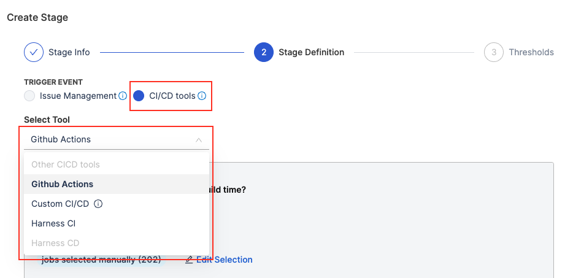

* Define how to measure the stage.
  * **Time for First CI Execution:** Captures the duration from when the first CI build pipeline starts execution to its completion.
  * **Time for Last CI Execution:** Captures the duration from when the final CI build pipeline starts execution to its completion. This is useful for workflows with multiple sequential or parallel builds.


* Specify the event parameters. These parameters filter the data used for calculation:
  * **All Pipelines Included:** Includes all CI pipelines for the project or team. This is a broad selection covering every pipeline linked to the project.
  * **Customize the selection:** You can narrow down the pipelines to specific workflows. For example:
    * Select pipelines related to a particular team, branch, or project.
    * Useful for focusing on critical pipelines (e.g., release builds).


* Use **Filters** to refine which executions are included in the stage. This trims down the pipelines that are included in the stage.
* General filters combine with AND logic for properties and OR logic across execution level filters.


* Define the acceptable time limits **Ideal Time**, **Minimum Time**, and **Maximum Time**for the CI Build Time.

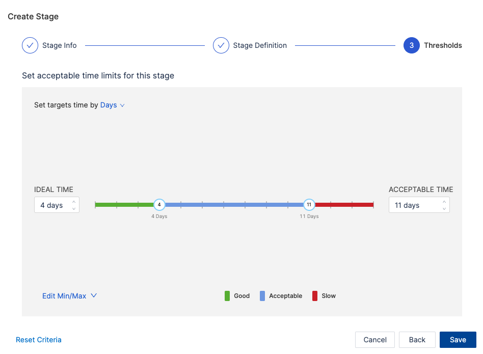

* Click **Save** to apply the configuration.

#### Configure Continuous Deployment (CD) stage

Include stages to measure CD processes after the CI stage. The CD stage can be configured only if a CI stage has been configured earlier.

:::note
Currently, only Harness CD is supported out of the box as a deployment tool for lead time measurement.
:::

* Click **+ Add Stage**
* Name the stage (e.g., CD Time).


* Choose **CI/CD Tools** as the trigger event.
* Select **Harness CD** as the deployment tool.

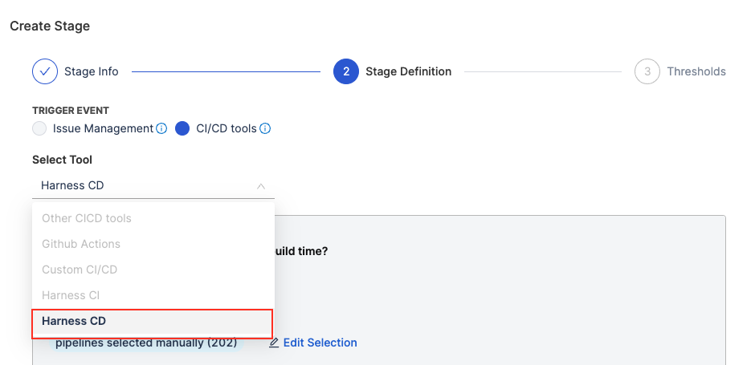

* Define the measurement criteria:
  * **Time for First CD Execution:** Captures the duration from when the first deployment pipeline starts execution to its completion.
  * **Time for Last CD Execution:** Tracks the duration from when the final deployment pipeline starts execution to its completion.


* Specify the event parameters. This is useful to filter the data that should be used in the calculation.

  * **All Pipelines Included:** Includes all deployment pipelines associated with the project or team.
  * **Customize the selection:** You can narrow down the pipelines to specific workflows. For example:
    * Select pipelines related to a particular team, branch, or project.
    * Useful for focusing on critical pipelines (e.g., prod-deploy).
* Use **Filters** to refine which executions are included in the stage. Filters refine which executions are included, leveraging pipeline properties from Harness CD configurations:
* Similar to the CI stage, the general filters combine with AND logic for properties and OR logic across execution level filters.


* Define the acceptable time limits i.e. **Ideal Time**, **Minimum Time**, and **Maximum Time** for the CD stage.


* Click **Save** to apply the configuration.

Here’s how a fully configured SCM + Issue Management System + CI + CD based lead time definition might look for the Velocity profile:


</TabItem>
</Tabs>

### Set up the other categories

The following configuration settings apply to all the categories (**New Features**, **Deployment**, **Hotfix**, and **Defects**):

* **Pull Requests to Branches:** Specify values that the branches for pull requests should start with or contain.
* **Pull Requests from Branches:** Define values that the source branches for pull requests should start with or contain.
* **Direct Merges to Branches:** Set criteria for branches that should be considered for direct merges, based on starting or containing specified values.
* **Tags on Commits of Merged PRs:** Specify values that tags on commits of merged pull requests should start with or contain.
* **Labels on Pull Requests:** Define values for labels on pull requests that should start with or contain specific values.

#### New Features

Configure the settings to define the criteria for New Features.


#### Deployment

Configure the settings to define the criteria for Deployment.


#### Hotfix

Configure the settings to define the criteria for Hotfix.

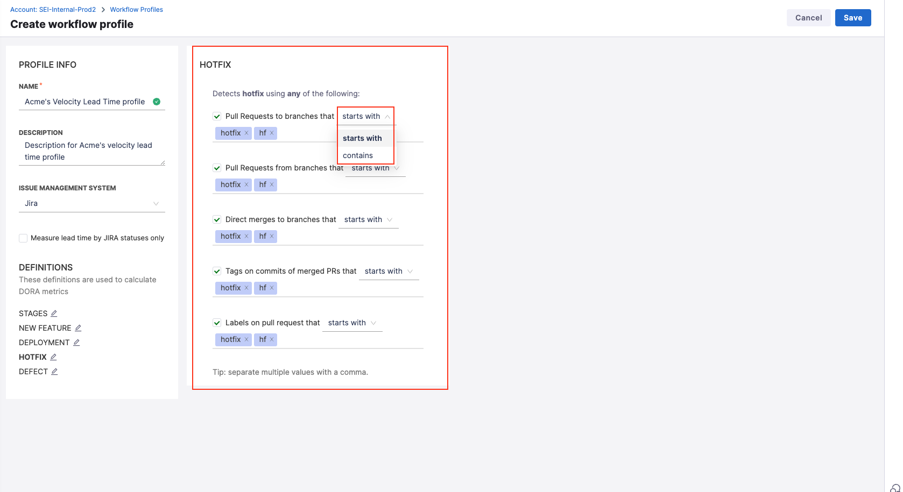


#### Defects

Configure the settings to define the criteria for Defects.


:::tip
Separate multiple values with a comma.
:::

### Measure lead time by Jira statuses

Harness SEI allows you to measure lead time exclusively by Jira statuses, providing an ideal solution for teams using [Jira](/docs/software-engineering-insights/sei-integrations/jira/sei-jira-integration) as their primary issue management tool. This configuration is mandatory for generating the Jira releases Report. Since lead time is based solely on Jira statuses, the **Ticket Created** event is automatically set as the default start event.

You can customize the workflow by adding custom stages, each defined with a name, description, and acceptable time limits. These stages, along with the [Jira release stage](#add-the-jira-release-stage), can mirror your software delivery process, providing a detailed measure of overall lead time.


#### Key Details

* At least one custom stage (in addition to the release stage) is mandatory, ensuring the lead time metric captures the entire workflow.
* Intermediate stages provide insights into time spent in each workflow phase, helping to identify bottlenecks and opportunities for optimization. These stages can only be added before the release stage.
* For new profiles, the release stage is disabled by default. Enable it by selecting the checkbox to measure lead time using Jira statuses.

#### Restrictions

* The **issue management system** is fixed to [Jira](/docs/software-engineering-insights/sei-integrations/jira/sei-jira-integration), and the **Start Event** is locked as **Ticket Created** when measuring lead time by Jira statuses.
* To switch to [Azure](/docs/software-engineering-insights/sei-integrations/azure-devops/sei-integration-azure-devops) or another issue management system, you must disable the release stage.
* Modifying the start event is not allowed when the release stage is enabled, as it can lead to incorrect configurations.
* For profiles already in use, the Jira release stage remains disabled by default unless explicitly enabled.

### Add the Jira release stage

The Jira release Stage provides visibility into the time it takes for features to be delivered to customers. It extends the lead time measurement beyond internal development efforts, capturing the time between ticket resolution and product release.


#### How it Works

* Once enabled, the Jira release stage measures the lead time from the point when a ticket is resolved (i.e., the last stage before the release stage) to the actual release date of the feature or product.
* The start event is automatically set to Ticket Created, and the issue management system defaults to Jira to ensure consistent configurations.

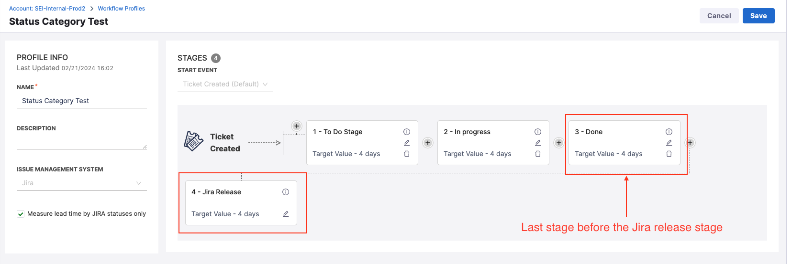

By default, the Jira release stage is disabled, so you'll need to enable it to use it. Once enabled, the starting event for the workflow is automatically set to **Ticket Created** and cannot be modified as it will result in incorrect configuration. Similarly, the issue management system is automatically set to Jira by default.

If you want to customize the starting event and Issue Management fields, you'll have to disable the release stage first. Once disabled, you'll be able to customize your starting event and Issue Management configuration for your profile.

#### Handling Tickets with Multiple Versions

When a ticket is associated with multiple versions, the Jira release stage provides two calculation methods to reflect the appropriate lead time:

* **Earliest Released Version:** Measures lead time to the first released version linked to the ticket. This option emphasizes the initial value delivery to stakeholders and reflects the time taken for the issue’s first release.

* **Latest Released Version:** Measures lead time to the most recent released version associated with the ticket. This method captures the cumulative effort and reflects the time to final delivery as the issue reaches users.


## Configuration examples​

The following examples describe Workflow profile configurations to track Lead Time.

<details>
<summary>Track Lead Time in SCM​</summary>

Use this profile configuration to track Lead Time across the PR lifecycle and gain insight into your SCM tools, such as GitHub, Bitbucket, GitLab, and so on.

1. Select Workflow under Profiles.
2. Select Add Profile.
3. Under Profile Info, enter a Name and optional Description.
4. Under lead time, select Stages, and set the Start Event to Commit Created.
5. Review the pre populated Stages that represent the PR lifecycle, from PR creation to merge. You can edit, add, and remove stages as needed. You can edit the data or fields that drive each stage, set time range goals, and more.

If you want to include CI/CD builds and deployments in your lead time calculation, edit your Workflow profile, and add stages to track your CI/CD build and deploy jobs.

</details>

<details>
<summary>Track Lead Time in Issue Management and SCM​</summary>

1. Select Workflow under Profiles.
2. Select Add Profile.
3. Under Profile Info, enter a Name and optional Description, and then select the Issue Management System to associate with this profile.
4. Under lead time, select Stages, and set the Start Event to Ticket Created.
5. Review the pre populated Development Stages and edit them, if necessary. These stages represent the progression of code in your SCM tool, from first commit to PR merge.
6. To track progress in your issue management tool, select the + icon to add stages before and after the Development Stages. This allows you to track progress in both your issue management and SCM tools, from issue creation through code deployment.

</details>

<details>
<summary>Include CI/CD in Lead Time​</summary>

If you want to include CI/CD builds and deployments in your lead time calculation, follow the steps to Track Lead Time in SCM or Track Lead Time in issue management and SCM, and then add stages to track your CI/CD build and deploy jobs.

</details>

<details>
<summary>Use a webhook to trigger Lead Time tracking​</summary>

Use this profile configuration to use an API event to initiate Lead Time tracking.

1. Select Workflow under Profiles.
2. Select Add Profile.
3. Under Profile Info, enter a Name and optional Description.
4. Under lead time, select Stages, and set the Start Event to API Event.
5. Use the following REST API request to push custom API events to SEI:

```bash
curl --location --request POST 'https://app.harness.io/gratis/sei/api/v1/generic-events' \ 
--header 'accept: application/json' \
--header 'Content-Type: application/json' \
--header 'Authorization: Apikey <SEI_API_KEY>' \
--header 'Cookie: JSESSIONID=23F...BA12' \
--data-raw '{
    "component": "jira",
    "key": "PROP-1460",
    "event_type": "incident_1",
    "event_time": 1664925769
}'
```

Note that the API endpoint mentioned in the REQUEST is relative to the environment you are using. You will need to replace it with the actual URL that are specific to your environment.

In addition to an API Key and session ID, you must supply relevant values for the `data-raw` object according to the following definitions:

* `component`: The correlation component for the event, such as `jira`, `scm`, `ado`, and so on.
* key: The correlating identifier. For the issue management system, this is the issue ID. For SCM, this is the commit SHA.
* `event_type`: Free form text field identifying the type of event.
* `event_time`: A timestamp, in seconds, identifying when the event occurred.

</details>