import Tabs from '@theme/Tabs';
import TabItem from '@theme/TabItem';

Collections are groupings representing subdivisions of a [Collection category](/docs/software-engineering-insights/sei-projects-and-collections/manage-collection-cat). By default, each Collection category has one root, or **All**, Collection. For example, the **Teams** category automatically has an **All Teams** Collection. Under the root Collection, you can create any number of Collections and Collection levels.

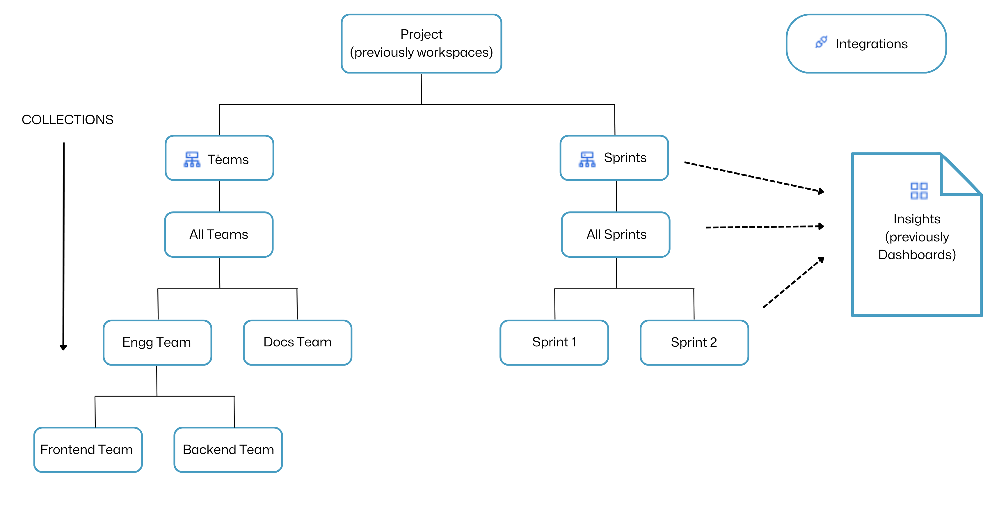

For example, in the **Teams** category, you can have a Collection for your **Engineering Teams**, and then you can create a child Collection for the **Front End Team** under the **Engineering Teams** Collection. The resulting hierarchy might look like this:

* Harness project
  * Teams (Collection category)
    * All Teams (Root Collection)
      * Engineering teams (Parent Collection)
        * Front End team (Child Collection)
        * Other Engineering teams...
      * Other teams...

Inheritance flows down the Collection levels. For example, Collection categories and Collections inherit [SEI integrations](/docs/category/sei-integrations) from the associated [Harness project](/docs/category/organizations-and-projects), and child Collections inherit [Insights associations](#manage-insights-associations) from their ancestor Collections. For more information about the relationship between projects, Collection categories, and Collections, go to [Collection hierarchies](/docs/software-engineering-insights/sei-projects-and-collections/manage-collection-cat).

## Types of Collection

Depending upon how Insights should be driven across teams for your organization Collections can be configured in two distinct approaches:

1. Asset-Based Collections
2. People-Based Collections

<DocVideo src="https://www.youtube.com/embed/3sD8K-ratYM?si=h4u6dpUpmYLI_ZEg" />

### Asset-Based Collections

Asset-based Collections are defined based on digital assets, primarily utilizing Jira projects (or any other Issue Management Platform) and GitHub (or any other SCM) repositories, and other integrations as their foundational elements.

These teams are organized based on digital assets and code repositories, with the flexibility to apply additional filters as per the requirements.

* Asset-based Collections are centered around specific Jira (Issue Management) projects and GitHub (SCM) repositories, which serve as their primary assets.
* All Insights and Metrics in this type of Collection are aligned with the assets defined for each team. For example, if a team defines its focus on a particular Project, all metrics and dashboards will correspond to that particular project.
* It is recommended to create the DORA Insight and Sprints Insight exclusively with People-Based Collections.

### Configure Asset Based Collection

The **Collection Definition** section allows you to configure the Collection as either a people-based or asset-based Collection. Asset-based collections are defined based on a specific asset.

To define a collection based on a specific asset, you will have to add the respective integration and associated integration filters in the Collection definition settings. This enables you to define the criteria that determine how contributors will be associated with the collection.

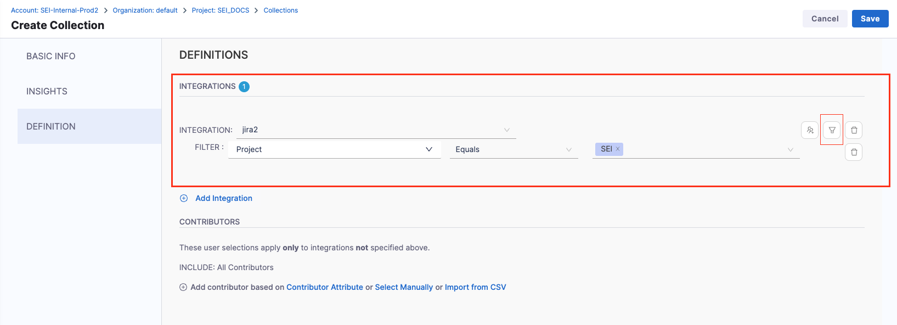

### People-Based Collections

People-based Collections are created based on individual members who belong to a definition that can be considered as a logical unit. These people-based Collections take into account the members' associations with tools such as Jira, Bitbucket, and others.

* People-based Collections are defined based on the individuals within the team and their interactions with tools like Jira and Bitbucket. SEI establishes this connection through the individual’s identifiers as provided and generates the team's insights and metrics.
* It is recommended to use Trellis exclusively with People-Based Collections. Example: If a team member contributes to three different projects, the metrics and insights from all three projects are considered when evaluating that team member’s performance and contributions.
* This user-centric approach allows for a comprehensive assessment of an individual’s impact across multiple projects.

### Configure People-Based Collection

**People-Based Collections** are defined based on the Contributor data.
To define a people-based Collection you can add the respective contributor-level filters on the Contributor Attributes in the Collection Definition settings, select the Contributor data manually or import the data using a CSV.

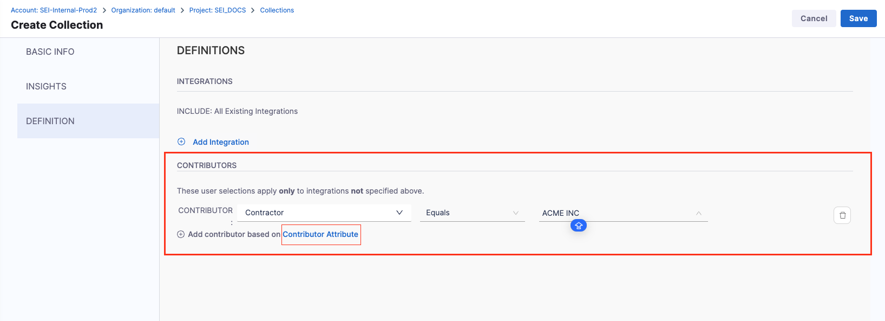

## View Collections

In your Harness project, go to the SEI module, select your **Project**, and then select **Collections**.

<!-- image: where to find Collections list -->

Collection categories are shown as tabs on the **Collections** page. Select a category tab to view the Collections under that category. This page shows only Collection categories and Collections relevant to the current project. Switch projects to view Collection categories and Collections for other projects.

<!-- image: Collections list page -->

The **Flat List** view shows a summary of the Collections in the Collection category. The **Path** is the Collection's hierarchical position in the Collection category. Select a Collection's **Name** to view or edit it.

<!-- image: Collections - Flat List view -->

Select **Tree View** to switch to a hierarchical outline view. Use the arrow icons to expand and collapse Collections levels.

Options for editing Collections are only available on **Flat List** view.

<!-- image: Collections - tree view -->

## Add and edit Collections

<Tabs>
<TabItem value="Asset Based">

Follow the steps to define an Asset Based Collection.

1. In your Harness project, go to the SEI module, select your **Project**, and then select **Collections**.
2. Select the tab for the Collection category where you want to add or edit a Collection. This page shows only **Collection categories** and **Collections** relevant to the current project. Make sure you are in the correct project before creating or editing Collections.
3. To edit an existing Collection, select the Collection in the **Name** column. To add a Collection, select **+ [Collection Category]**. For example, in the **Teams** category, select **+ Teams**.

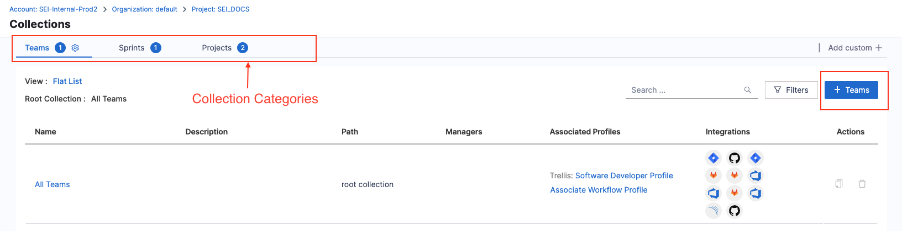

4. In the **Basic Info** settings, you can:

   * Enter the **Name**, **Description**, and **Tags**. Note that Collection names must be unique within each project.
   * Identify the hierarchy position at which the new **Collection** should be created and then define the Collection's position in the hierarchy by customizing the **Parent Collection** field.

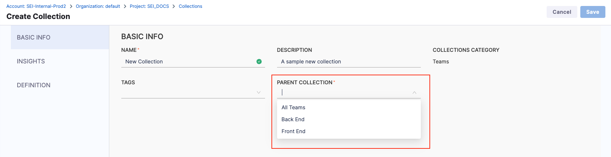

5. Use the **Insights** settings to [manage Insights associations](#manage-insights-associations). By default, child Collections automatically inherit Insights associations from their ancestor Collections.

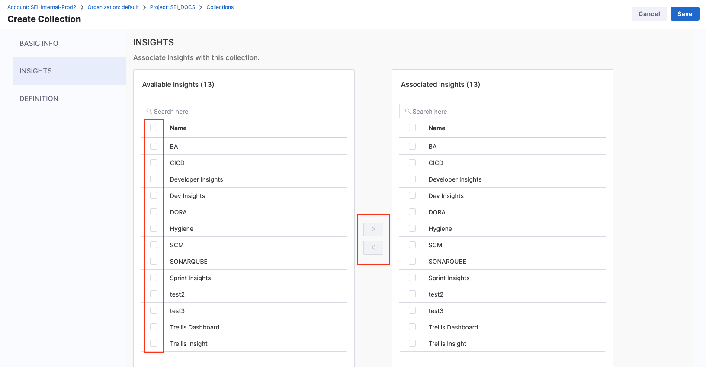

6. Use the **Definition** settings to define [integrations](/docs/category/integrations) associated with the Collection. By default, if you don't specify any integrations, the Collection automatically inherits integrations from the associated project.

7. In the **Collection Definition** settings, add the relevant [Integration](/docs/software-engineering-insights/sei-integrations/sei-integrations-overview) to define the digital asset.  

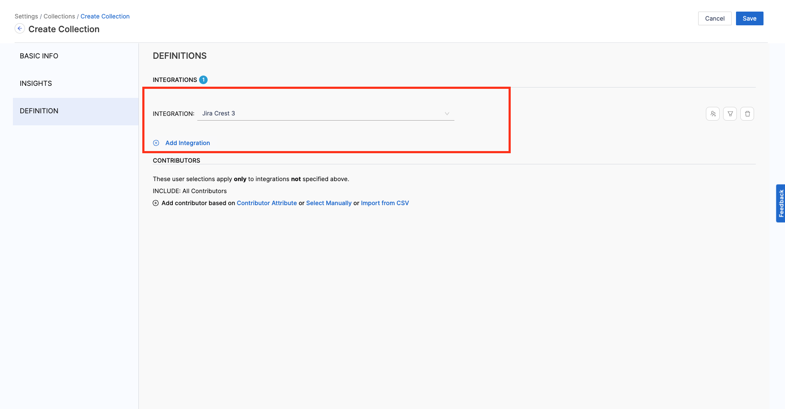

8. Add the **Integration Filters** to determine the criteria to associate Contributors with the Collection. 

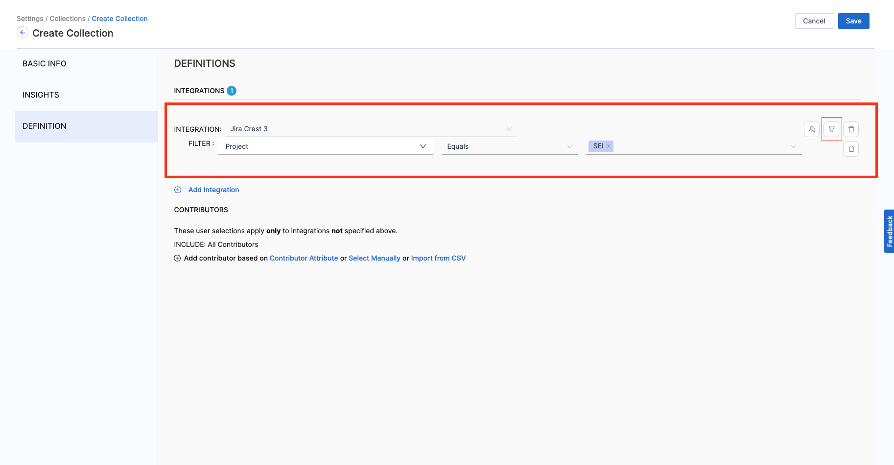

9. Once you’ve configured the **Collection Definition** and **Insight Association** settings, click on **Save** to create the new Collection.

</TabItem>

<TabItem value="People Based">

Follow the steps to define an People Based Collection.

1. In your Harness project, go to the SEI module, select your **Project**, and then select **Collections**.
2. Select the tab for the Collection category where you want to add or edit a Collection. This page shows only **Collection categories** and **Collections** relevant to the current project. Make sure you are in the correct project before creating or editing Collections.
3. To edit an existing Collection, select the Collection in the **Name** column. To add a Collection, select **+ [Collection Category]**. For example, in the **Teams** category, select **+ Teams**.

4. In the **Basic Info** settings, you can:

   * Enter the **Name**, **Description**, and **Tags**. Note that Collection names must be unique within each project.
   * Identify the hierarchy position at which the new **Collection** should be created and then define the Collection's position in the hierarchy by customizing the **Parent Collection** field.

5. Use the **Insights** settings to [manage Insights associations](#manage-insights-associations). By default, child Collections automatically inherit Insights associations from their ancestor Collections.

6. Use the **Definition** settings to define [integrations](/docs/category/integrations) associated with the Collection. By default, if you don't specify any integrations, the Collection automatically inherits integrations from the associated project.

7. In the **Collection Definition** settings, Select the **Configure Attribute** option under the **Collections** section.   

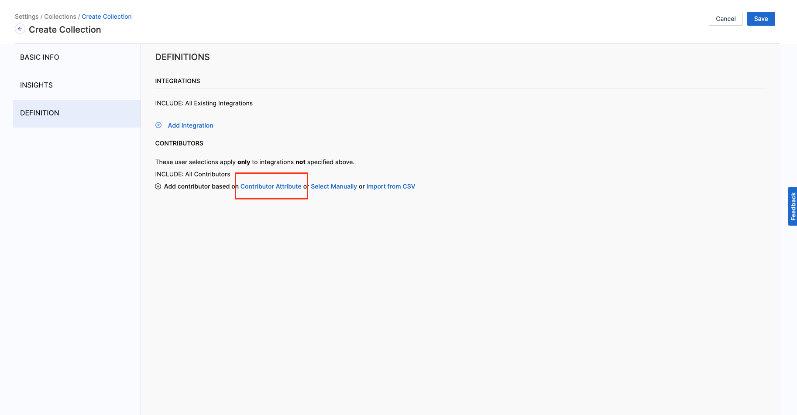

8. Add **Filters** using the custom attributes to define the criteria to associate contributors with the Collection.  

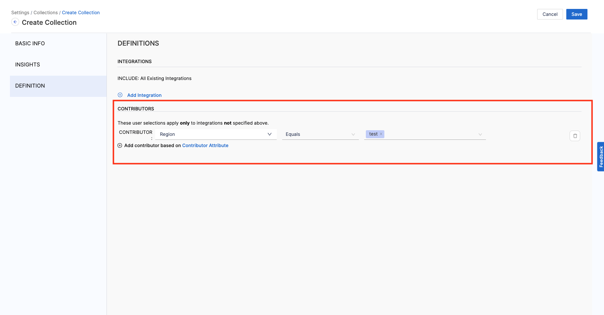

9. Once you’ve configured the **Collection Definition** and **Insight Association** settings, click on **Save** to create the new Collection.

</TabItem>
</Tabs>

## Manage Insights associations

All [Insights](/docs/software-engineering-insights/insights/sei-insights) must be associated with at least one Collection. You can configure these associations through Collection settings or when creating or editing Insights. For information about creating and editing Insights, go to [Insights](/docs/software-engineering-insights/insights/sei-insights).

:::info Inheritance

By default, a child Collection automatically inherits Insights associations from its ancestor Collections. Inherited associations can't be removed from child Collections.

Adding an Insight association to a Collection also adds that association to any descendant Collections.

Adding an Insight association to a Collection category applies the association to all Collections under that category.

:::

To view or edit a Collection's Insights associations:

1. Follow the steps to [add and edit Collections](#add-and-edit-collections), and go to the Collection's **Insights** settings.
2. Select Insights on the **Available Insights** list and use the left and right arrows to move them to the **Associated Insights** list.
3. Use the up and down arrows on the **Associated Insights** list to change the order in which the Insights are presented when viewing Insights on the Insights list or the **All Insights** dropdown menu on the Insights header.
4. Select **Set as Default** to designate the default Insight for the Collection.

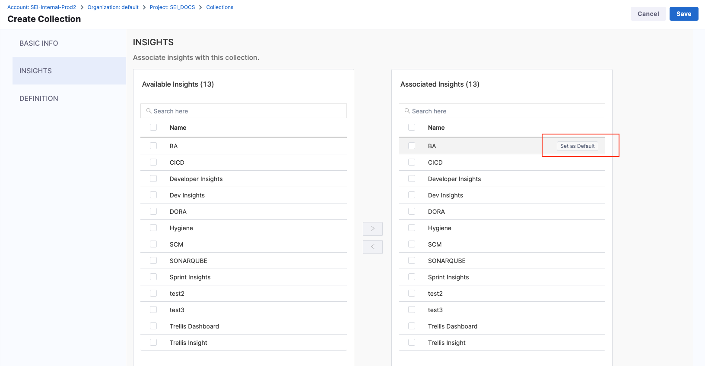

5. Select **Save**.
