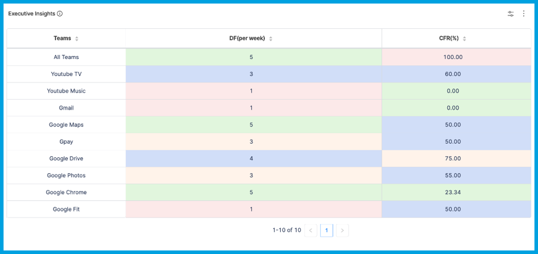

Propels are a no-code/low-code automation framework that can work together with your orchestration scripts and additionally bring in human judgment. Users can get alerts, along with software development metrics, from Jira, GitHub, Jenkins, and many other tools. Propels can send reminders, route problems to the right people for solutions, and even escalate if a particular task is not completed within a given duration.

For example, if your team needs to create Jira issues for all PRs that are getting merged, you can send reminders by Slack, Microsoft Teams, and email. Propels can consume user input within Slack or email and, based on the responses, determine the next steps.

By incorporating human-in-the-loop (HITL) automation, Propels can add a new level of automation for your teams or help you get the most out of the DevOps automation that you already have in place. Propels help you automate mundane, repetitive tasks and bring in human judgment at critical decision points.

Here are some example use cases for Propels:

Use case: Release deployment checklist

Propels can maintain a HITL automation checklist. Certain tasks, such as the successful completion of a Jenkins job, can trigger this playbook. SEI can then notify all stakeholders and set their tasks in motion, for example:

* Notify the documentation team to update or publish technical documentation.
* Notify support or marketing to notify customers.

Once all stakeholders have finished their tasks, they can just mark their tasks as completed in Slack.

SEI can also send reminders and escalate to management if deadlines are not met. Based on the responses from team members, SEI can take a variety of actions, such as notifying Ops, pushing a deployment to production, or enabling feature flags, as needed.

Use case: PR hygiene

Here are two ways you can use Propels for PR hygiene:

* **PR SLA nudges:** Orphans and long-lived PRs are not great for code hygiene. You can use Propels to encourage compliance with SLAs to close PRs. If a PR stays open for too long, in any stage, SEI can send reminders to the author, creator, committers, or reviewers to close or merge the PRs.
* **PRs without tickets:** Propels can help ensure all PRs are associated with Jira issues or ADO work items to improve the traceability of requirements and defects. If the PR doesn't have a detectable issue associated with it, SEI can send a reminder to the author, creator, or committer to add the issue number.

## Write Propels

For information and examples for writing Propels, go to the [Propels JavaScript reference](./propels-reference.md).

## Example: Use Propels and Tables to present executive insights

You can use the [Table report](./table-reports.md#table-report) to provide executive insights at the **All Teams** level to your organization's executives who are interested in evaluating how the entire organization is performing on an industry benchmark or a self-determined benchmark.

<!--  -->

<docimage path={require('../static/table_report1.png')} />

Rather than manually populating a table, you can write Propels that invoke SEI's internal APIs to obtain the necessary values and add them to a [Table](./tables.md). Then, add [Table reports and Custom Table reports](./table-reports.md) to your Insights to render data contained in the Tables.

Your Propel can also apply [color coding](./tables.md#apply-color-coding) based on performance targets:

* Elite: Green, `#9ACCBF`
* High: Blue, `#B1C1DB`
* Acceptable: Orange, `#E9DF99`
* Low: Red, `#E4BB8A`
