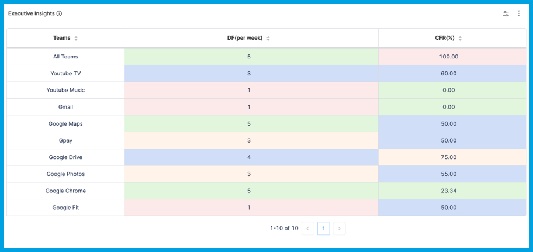
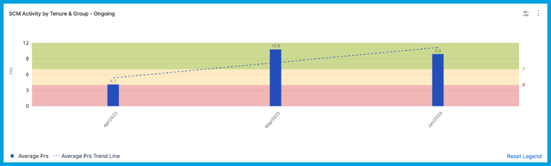

Add Table reports to your [Insights](../sei-insights.md) to analyze data from [Tables](./tables.md).

While both Custom Table Reports and Table Reports ingest imported CSVs (stored in SEI Tables), the difference is that Table Reports are used to analyze an entire Table, whereas Custom Table Reports can focus on specific segments of Table data, such as specific columns.

## Table report

Use this report to present data from an entire [Table](./tables.md). This report allows minimal customization. If you want to present data from specific rows or columns, use the [Custom Table report](#custom-table-report).

:::tip

You can use Propels to populate and modify Tables for presentation on Table reports. For example, you can [use Propels and Tables to present executive insights](./propels-overview.md#example-use-propels-and-tables-to-present-executive-insights).

:::

<!--  -->

<docimage path={require('../static/table_report1.png')} />

To add the **Table report** widget to Insights:

1. Prepare the [Table](./tables.md) that you want to present on the Table report, including any Table-level customization, such as color coding and hyperlinks.
2. Go to the Insight where you want to add the widget. Make sure you are in the correct project.
3. Select **Settings**, and then select **Add Widget**.
4. Select the **Table report** widget.
5. Configure the widget settings as desired.
6. Select **Next: Place Widget**, place the widget on the Insight, and then select **Save Layout**.

## Table Single Stat

Use the Table Single Stat widgets to present a single metric from a Table. This is useful for providing a quick, summary value, such as an overall score or a KPI.

When you configure a single stat widget:

* You can create filters for any data that can be viewed as a single value, such as issue type, priority, status, percentage, and so on.
* The available filters depend on the selected [Table](./tables.md).
* If you use multiple filters, the filters are inherently combined by `AND` operators.
* Keep in mind that single stat widgets intend to show a single value, such as the total number of tickets or the sum of story points. Determine what single stat you want to show, and then create your filters accordingly.

You might want to set the time range to **Use Insight time**, which allows the user to select a time range when viewing the Insight where this widget is present.

## Custom Table report

Use this report to inspect specific rows and columns in a [Table](./tables.md), such as providing trend analysis at the executive level across several teams and specific use cases not addressed by other built-in widgets.

<!--  -->

<docimage path={require('../static/custom_table_report1.png')} />

To add the **Custom Table report** widget to Insights:

1. Prepare the Table that you want to present on the Custom Table report, including [Custom table report features](#custom-table-report-features) and [Table-level customization](./tables.md#customize-tables), such as color coding and hyperlinks.
2. Go to the Insight where you want to add the widget. Make sure you are in the correct project.
3. Select **Settings**, and then select **Add Widget**.
4. Select the **Custom Table report** widget.
5. Configure the widget settings as desired.
6. Select **Next: Place Widget**, place the widget on the Insight, and then select **Save Layout**.

### Custom Table report features

The Custom Table report supports trendlines, filters, grouping, and color coding based on baselines. Supported visualizations include bar graphs, line graphs, area graphs, and donut graphs. The Custom Table report doesn't support raw table view; use [Table reports](#table-report) for raw table view.

#### Baselines

Define up to three baselines for a given metric that you want to measure. Baselines can be different across different teams. For example:

* Team 1 has a baseline of 10 commits per month as average and 5 commits per month as poor.
* Team 2 has a baseline of 20 commits per month as average and 12 commits per month as poor.
* These two teams are differentiated based on their `collection_id` and have different baseline values specified.

To configure baselines and apply baseline coloring, [edit the Table](./tables.md#customize-tables). For each baseline column, set the column data type to **Baseline**, and set the column name to the corresponding threshold: `baseline_low`, `baseline_medium`, and `baseline_high`.

Baseline color coding is fixed and automatically applied:

* Low: Red
* Medium: Blue
* High: Green

If you have two baselines, these baselines must be `baseline_low` and `baseline_high`. `baseline_medium` is only valid if you have three baselines.

#### Trendlines

Trendlines are supported for bar graph visualizations. This helps you understand how metrics are trending over the X-axis values. The X-axis can represent time, teams, projects, and so on.

#### Filters

You can add filters at the [Table level](./tables.md#apply-filters) or on the Custom Reports widget.

#### Bar graph color scheme

With bar graph visualizations, you can modify color schemes by selecting from the color palette provided in the widget settings.

#### Grouping and stacking

Currently, grouping is only supported at one level. You can group by any column. Baselines and trendlines are compatible with grouping. Here is an example of a bar graph with a low baseline of 4 and a high baseline of 7, as well as a trendline.

<!--  -->

<docimage path={require('../static/custom_table_report1.png')} />

If you use grouping, you can also also apply stacking based on any column. Stacks control how data is arranged in each X-axis increment.

For example, assume you have a bar graph where the X-axis represents time in months, and the Y-axis represents the total number of tickets. Each bar on the X-axis represents the number of tickets for that month. If you stack by **Status**, then each bar is subdivided by ticket status.
