SEI Tables can contain any custom data that you enter manually, pull from a [Propel](./propels-overview.md), or import from a CSV file. You can then display Table data on [Table reports](./table-reports.md).

## Import CSVs

1. In your Harness project, go to the SEI module, and select **Account**.
2. Select **Tables** under **Advanced Features**.
3. Select **Import CSV**, select the file to import, and select **Import**.
4. [Customize the Table](#customize-tables) as desired.
5. Select **Save**.

### Re-import CSV

After creating a Table from an imported CSV, you can re-import the CSV to update the Table data.

1. In your Harness project, go to the SEI module, and select **Account**.
2. Select **Tables** under **Advanced Features**.
3. Select the Table you want to edit.
4. Select **Re-import CSV**, select the file to import, and select **Import**.
5. Select **Save**.

## Manually create Tables

1. In your Harness project, go to the SEI module, and select **Account**.
2. Select **Tables** under **Advanced Features**.
3. Select **Add Table**, enter a **Name**, and select **Create**.
4. Enter row and column data.
5. [Customize the Table](#customize-tables) as desired.
6. Select **Save**.

## Customize Tables

There are many ways to customize Tables. You can add or remove rows and columns, apply color coding, configure preset values, and more.

:::tip

Each time you save a Table, SEI creates a **Version**. When viewing a Table, select **Version** to switch to a different version of the Table.

:::

### Add or remove rows and columns

To add or remove rows and columns, select the **Arrow** in any non-header cell, and select **Insert Column**, **Delete Column**, **Insert Row**, or **Delete Row**.

Rows and columns are added or removed relative to the selected cell. If you want to delete a row or column, make sure you select a cell in the row or column that you want to delete.

<!-- 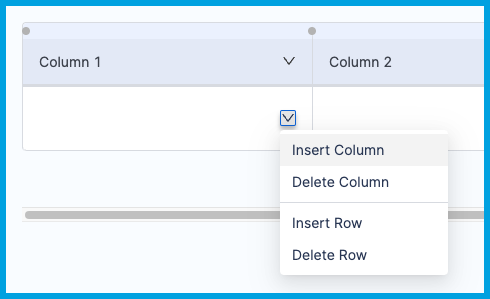 -->

<docimage path={require('../static/customize_table3.png')} />

To resize rows and columns, select and drag the borders between rows and columns.

### Rename Tables and columns

To rename a Table, select **Settings**, enter the new name, and select **Update**.

To rename a column, select the column header cell, enter the new name, and then press the Tab key.

<!-- 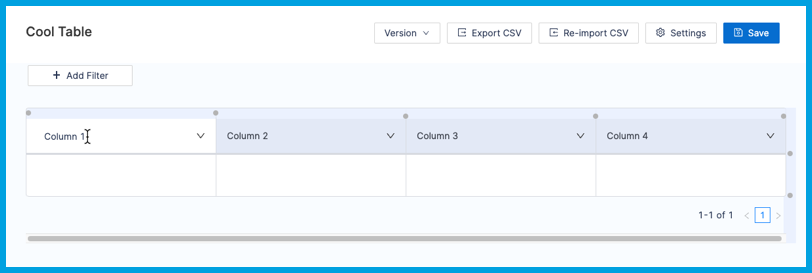 -->

<docimage path={require('../static/customize_table1.png')} />

### Set column data types

You can specify the column data type to ensure uniformly-formatted values. Data types include:

* **Text:** Cells can contain any free text value. This is equivalent to string.
* **Baseline:** Use this option to configure baselines for [Custom Table reports](./table-reports.md). Baselines establish value ranges, such as target performance ranges or low/medium/high performance thresholds.
* **Boolean:** Cells must contain either `True` or `False`.
* **Date:** Cells must contain date-formatted values.
* **Preset:** Cells can only contain values from a predefined list of possible values. If you select this option, you must add predefined values.

To set a column's data type:

1. Select the **Arrow** in the column header, select **Column Type**, and then select the desired data type.

   <!-- 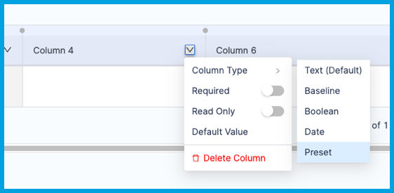 -->

   <docimage path={require('../static/customize_table7.png')} />

2. Select the desired data type.
3. If you selected **Preset**, add preset values.

   <!-- 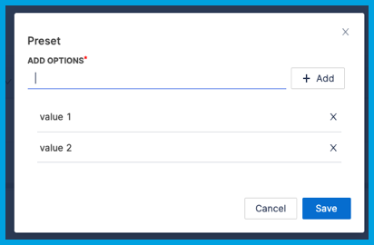 -->

   <docimage path={require('../static/customize_table6.png')} />

4. Select **Save**.

### Set a default value

Default values prevent columns from having empty cells.

To add a default value:

1. Select the **Arrow** in the column header, and select **Default Value**.

   <!-- 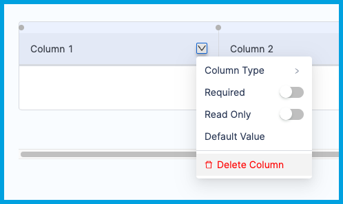 -->

   <docimage path={require('../static/customize_table2.png')} />

2. Enter the desired default value, and select **Set**.
3. The next time you save the Table, any empty cells in this column are populated with the default value.

To remove a previously-set default value:

1. Select the **Arrow** in the column header, and select **Default Value**.
2. Clear the default value field, and select **Set**.
3. Select **Save**. Values in column cells don't change when you remove the default value. Any cells containing the former default value retain that value.

### Set required or read-only columns

To specify required or read-only columns, select the **Arrow** in the column header, and select **Required** or **Read-Only**.

<!--  -->

<docimage path={require('../static/customize_table2.png')} />

Required columns are indicated by an asterisk (`*`) in the column header.

Read-only columns are indicated by shading. As long as the column is marked read-only, you can't edit the data in the column or the [column data type](#set-column-data-types).

<!-- 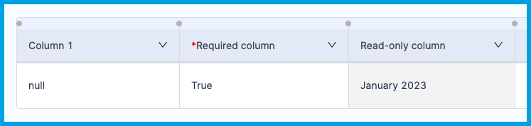 -->

<docimage path={require('../static/customize_table4.png')} />

If a column is both **Required** or **Read-Only**, you *must* specify a [default value](#set-a-default-value). If you have not already set a default value, you're prompted to provide one upon selecting both **Required** and **Read-Only**.

<!-- 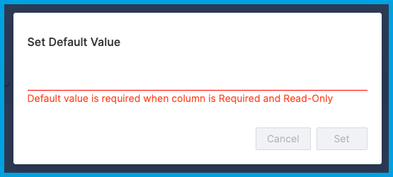 -->

<docimage path={require('../static/customize_table5.png')} />

### Apply color coding

You can apply color coding to change how cells look in [Table reports](./table-reports.md). Color coding is useful for quickly identifying low/medium/high values.

<!-- 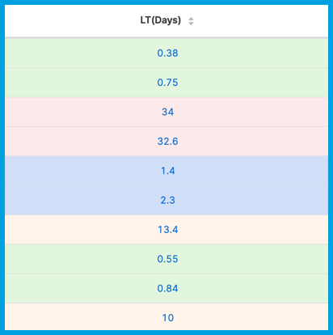 -->

<docimage path={require('../static/customize_table10.png')} />

1. For any column that you want to have color coding, [add a column](#add-or-remove-rows-and-columns) with the same name and the suffix of `_color_code`.

   For example, if you want to apply color coding to a column called `CFR percentage`, add a column named `CFR percentage_color_code`.

   <!-- 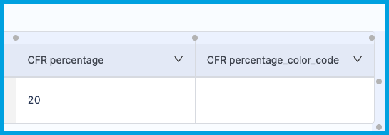 -->

   <docimage path={require('../static/customize_table11.png')} />

2. In the `_color_code` column, enter a hexadecimal code in each cell to define the color you want to use for each value.

   <!-- 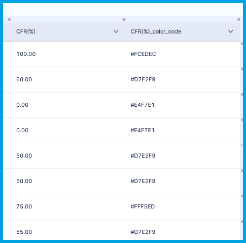 -->

   <docimage path={require('../static/customize_table12.png')} />

3. Select **Save**.

### Apply filters

Table filters are similar to report filters. By applying a filter to a Table, you can refine the data before displaying it on a [Table report](./table-reports.md), which may include additional filters for further refinement and focus.

To add a filter:

1. Select **Add Filter**.
2. Select one or more columns, and then select **OK**. One filter is added for each selected column.
3. Enter or select the filter value in the filter field. The table updates in real time to reflect your filter value.

   <!-- 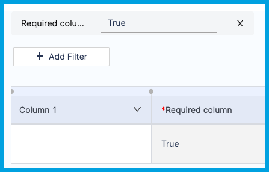 -->

   <docimage path={require('../static/customize_table8.png')} />

Table filters have a one-to-one relationship between columns and filter values. To apply dynamic and complex filters, use a [Table report](./table-reports.md) on an Insight.

### Insert hyperlinks

You can use Markdown-formatted hyperlinks (`[value](link)`) in any cell where you want to provide additional information through a hyperlink.

<!-- 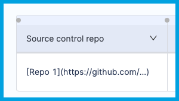 -->

<docimage path={require('../static/customize_table9.png')} />

The links are rendered as in-line hyperlinks when presented on a [Table report](./table-reports.md).

<!--  -->

<docimage path={require('../static/customize_table10.png')} />
