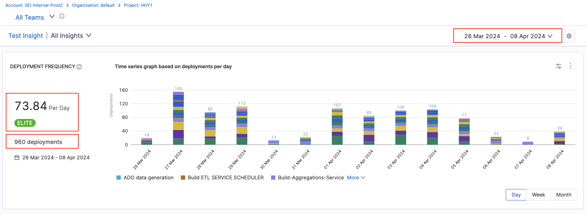

### What is Deployment Frequency?

Deployment Frequency represents how often an organization successfully releases software to production.

To monitor Deployment Frequency, you must create a **DORA type Workflow profile** and add the **Deployment Frequency** report to your Insights.

To learn more, go to [DORA Reports](/docs/software-engineering-insights/sei-metrics-and-reports/dora-metrics)

### Deployment Frequency scoring

Deployment Frequency performance is ranked on the following grading scale:

* **Elite:** More than one deployment per day.
* **High:** Deployments occur anywhere from once per day to once per week.
* **Medium:** Deployments occur anywhere from once per week to once per month.
* **Low:** Deployment occur less than once per month.

The Deployment Frequency formula depends on whether you are tracking issue
management, SCM, or CI/CD. The following factors can contribute to Deployment
Frequency calculations:

* The [SEI integration](/docs/software-engineering-insights/sei-integrations/sei-integrations-overview) chosen in the Workflow profile.
* For Issue Management Platforms, SEI counts the Number of issues deployed.
* For SCM SEI integrations, SEI counts the number of PRs deployed.
* For CI/CD SEI integrations, SEI counts the number of jobs deployed
* Filters applied to the Workflow profile.
* Collection-level filters.
* Widget-level filters.
* Insight time range, which is the time range selected by the user when viewing the
Insight.

### Calculation Example using Deployment Platform

Consider the following Deployment Frequency configuration:

* **SEI integration:** Harness NG
* **Filter:** Project Category Equals SEI/Demo
* **Calculation parameter:** Calculate based on the pipelines started in the selected time range on the Insight
* **Time Range selected on the Insight:** Last 2 weeks

The following table shows the data ingested by the Harness NG SEI integration.

| Field | Value |
| - | - |
| Integration | Harness NG |
| Total Deployments | 960 |
| Duration | Last 2 weeks = 14 Days |
| Project | SEI/Demo |

With this configuration, the Deployment Frequency widget shows the total number of times pipeline was started in the Project named SEI/Demo in the given time range.

```bash
Deployment Frequency = (Total Number of Pipeline Executions) / (Days in the Insight Time Range - 1)
```

```bash
Deployment Frequency = 960 / 14 - 1 = 73.84
```



### Calculation Example using Issue Management Platform

Consider the following Deployment Frequency configuration:

* **SEI integration:** Jira
* **Filter:** Status Category Equals Done
* **Calculation parameter:** Ticket resolved in Insight time range
* **Time Range selected on the Insight:** Last 3 months

With the above configuration settings, the Deployment Frequency widget shows the total number of
tickets with a status of Done in the given time range.

```bash
Daily Deployment Frequency = ( Tickets in Done status ) / ( Days in the Insight Time Range )

Daily Deployment Frequency = 24 / 91 = 0.263

Weekly Deployment Frequency = ( Tickets in Done status ) / ( Days in the Insight Time Range / 7 )

Weekly Deployment Frequency = 24 / 13 = 1.846

```

Assuming there are **24 tickets in Done status** in the **Last 91 days**, then the **Deployment Frequency is 0.263 Deployments Per Day** and **1.846 Deployments Per Week**.