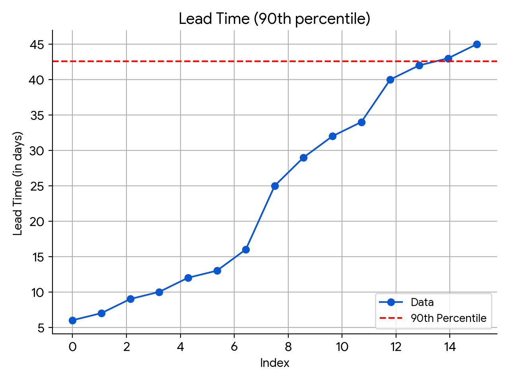

### What is Lead Time?

The Lead Time calculation measures the total time taken from the moment a ticket is created to the point when it is released to production. Below are examples that demonstrate how Lead Time is calculated across different scenarios.

To learn more, go to [DORA Reports](/docs/software-engineering-insights/sei-metrics-and-reports/dora-metrics)

## Calculation

The Lead Time for a stage is calculated as the time difference between the start time of the current stage and the start time of the previous stage. This means that the Lead Time for a particular stage is calculated as the time taken for the issue to reach that stage for the first time, rather than the time spent in that stage itself. The Total Lead Time is calculated by summing the Lead Time of all the individual stages.

### Average

When configured to calculate the Lead Time as the **Average time in stage**, the individual lead time for each stage is calculated as the average across all the tickets, The overall lead time is then calculated as the sum of all the stages.

### Median

The median lead time is the duration by which half of the tasks or tickets are completed. It gives a sense of the typical completion time by showing the point where half of the tasks are finished faster and the other half take longer.
This is the standard way to calculate the median lead time:

For each stage in the worlkflow (for example: Stage 1, Stage 2, Stage 3, ..., Stage N), the median lead time is calculated across all tickets:

```bash
Median Lead Time for Stage 1 = Median(Stage 1 Lead Times for all tickets)
Median Lead Time for Stage 2 = Median(Stage 2 Lead Times for all tickets)
...
Median Lead Time for Stage N = Median(Stage N Lead Times for all tickets)
```

The overall median lead time is calculated as the sum these individual stage medians:

```bash
Overall Median Lead Time = Median Lead Time for Stage 1 + Median Lead Time for Stage 2 + ... + Median Lead Time for Stage N
```

### 90th Percentile

The 90th percentile lead time is the duration within which 90% of tasks or tickets are completed, representing an upper bound for typical completion times while excluding the most extreme delays.

To provide a better understanding of how the 90th percentile lead time is calculated for a stage, here's a step-by-step explanation of the process:

* **Step 1:** The lead times for tickets within a specific stage is firstly sorted from the shortest to the longest. This helps in arrange them in order of completion duration.

* **Step 2:** Each sorted lead time is then assigned a unique index. For example, if you have four tickets, each is assigned with indices from 1 to 4.

* **Step 3:** The range of indices is divided into 100 equal parts to capture the detailed distribution of lead times. This allows the system to find a precise value for the 90th percentile.

* **Step 4:** To determine the 90th percentile, SEI calculates the position that corresponds to 90% of the sorted lead times. This is done by multiplying 90% by the total number of intervals and adding the result to the starting index.

```bash
Position = Min Index + (90/100) × (Max Index − Min Index)
```

* **Step 5:** SEI then locates the interval where this position falls and use linear interpolation to estimate the lead time at this percentile. Linear interpolation helps us find a value within a range based on two known points. The formula for linear interpolation between two points (x1,y1) and (x2,y2) is given below:

```bash
y = y1 + [ (x - x1) / (x2 - x1) ] × (y2 - y1)
```

* **Step 6:** By using the interpolation formula, the system computes the exact lead time for the 90th percentile. This value represents the time within which 90% of tasks or tickets are completed.

```bash
Overall 90th Percentile Lead Time = p90 Lead Time for Stage 1 + p90 Lead Time for Stage 2 + ... + p90 Lead Time for Stage N
```

### 95th Percentile

The 95th percentile lead time is the duration within which 95% of tasks or tickets are completed, representing an upper bound for typical completion times while excluding the most extreme delays. The calculation of the 95th percentile lead time follows the same steps as the 90th percentile, with the only difference being the percentile value used.

```bash
Overall 95th Percentile Lead Time = p95 Lead Time for Stage 1 + p95 Lead Time for Stage 2 + ... + p95 Lead Time for Stage N
```



## Calculation Examples

The examples below uses the **Average** calculation method across each individual stages in a workflow profile for measuring lead time.

### Calculation Example 1: One Pull Request associated with a Single Jira Ticket


In this example, we consider a use case where a single pull request (PR) is associated with a single Jira ticket. The Lead Time calculation includes several stages as shown below.

The table provides details on the different stages, their descriptions, formulas, and an example calculation.

The Lead Time calculation in this case consists of the following stages:

| Stage | Description | Formula | Example |
|-------|--------------|----------|---------|
| Ticket In Progress Time | The time taken for a ticket to move from the Created state to the In Progress state. | `In Progress Time - Ticket Created Time` | 10:00 AM - 9:50 AM = 10 minutes |
| First Commit Time | The time taken to make the first commit after the ticket was moved to the In Progress state. | `First Commit Time - First In Progress Time` | 10:05 AM - 10:00 AM = 5 minutes |
| First Pull Request Creation Time | The time taken to create the first pull request (PR) after the first commit. | `First PR Creation Time - First Commit Time` | 10:10 AM - 10:05 AM = 5 minutes |
| First Pull Request Approval Time | The time taken for the first approval after the first pull request is created. | `First PR Approval Time - PR Creation Time` | 10:11 AM - 10:10 AM = 1 minute |
| Last Pull Request Merge Time | The time taken to merge the pull request after it is approved. | `Last PR Merged Time - First PR Approval Time` | 10:15 AM - 10:11 AM = 4 minutes |
| First Continuous Integration Time | The time taken to complete the continuous integration (CI) pipelines for the first time after the last pull request is merged. | `CI Completion Time for First Time - Last PR Merged Time` | 10:16 AM - 10:15 AM = 1 minute |
| First Continuous Deployment Time | The time taken for the continuous deployment (CD) pipelines to complete for the first time after the CI process is finished. | `CD Completion Time for First Time - CI Completion Time for First Time` | 10:17 AM - 10:16 AM = 1 minute |
| First Issue Management Done Time | The time taken to mark the issue as `Done` in the Issue Management System (e.g., Jira) after the CD process is completed. | `Time  at which the JIRA was marked as Done status for the First Time - CD Completion Time for First Time` | 10:20 AM - 10:17 AM = 3 minutes |
| First Release Time | The time at which the fix version added to the issue is released in Jira after the issue was marked as Done for the first time. | Jira Release Time - Time  at which the JIRA was marked as Done status for the First Time | 11:00 AM - 10:20 AM = 40 minutes |

#### Total Lead Time

**Total Lead Time** is the sum of all the above stages:

```
Total Lead Time = 10 min + 5 min + 5 min + 1 min + 4 min + 1 min + 1 min + 3 min + 40 min
             = 70 minutes
```

Therefore, the Total Lead Time is **70 minutes**.

### Calculation Example 2 - Two Sequential PRs associated with a Single Jira Ticket


In the case where two pull requests (PRs) are associated with a single Jira ticket in a sequential manner, the Lead Time calculation can be broken down into the following stages.

The following table outlines the different stages, their descriptions, formulas, and example calculations.

| Stage | Description | Formula | Example |
|-------|--------------|----------|---------|
| Ticket In-progress Time | The time taken for a ticket to move from the Created state to the In Progress state. | `In-Progress Time - Ticket Created Time` | `10:00 AM - 9:50 AM = 10 minutes` |
| First Commit Time | The time taken to make the first commit after the ticket was moved to the In Progress state. | `First Commit Time - First In-Progress Time` | `10:05 AM - 10:00 AM = 5 minutes` |
| First Pull Request Creation Time | The time taken to create the first pull request (PR) after the first commit. | `First PR Creation Time - First Commit Time` | `10:10 AM - 10:05 AM = 5 minutes` |
| First Pull Request Approval Time | The time taken to approve the first pull request after it is created. | `First PR Approval Time - PR Creation Time` | `10:11 AM - 10:10 AM = 1 minute` |
| Last Pull Request Merge Time | The time taken to merge the last (second) pull request after it is approved. | `Last PR Merged Time - First PR Approval Time` | `10:45 AM - 10:11 AM = 34 minutes` |
| First Continuous Integration Time | The time taken to complete the continuous integration (CI) pipelines for the first time after the last pull request is merged. | `CI Completion Time for First Time - Last PR Merged Time` | `10:16 AM - 10:45 AM = 0 minute` |
| First Continuous Deployment Time | The time taken for the continuous deployment (CD) pipelines to complete for the first time after the CI process is finished. | `CD Completion Time for First Time - CI Completion Time for First Time` | `10:17 AM - 10:16 AM = 1 minute` |
| First Issue Management Done Time | The time taken to mark the issue as 'Done' in the issue management system (e.g., Jira) after the CD process is completed. | `Time  at which the JIRA was marked as Done status for the First Time - CD Completion Time for First Time` | `10:20 AM - 10:17 AM = 3 minutes` |
| First Release Time | The time at which the fix version added to the issue is released in Jira after the issue was marked as Done for the first time. | `Jira Release Time - Time  at which the JIRA was marked as Done status for the First Time` | `11:00 AM - 10:20 AM = 40 minutes` |

#### Total Lead Time

**Total Lead Time** is the sum of all the above stages:

```
Total Lead Time = 10 min + 5 min + 5 min + 1 min + 34 min + 0 min + 1 min + 3 min + 40 min
             = 99 minutes
```

Therefore, the Total Lead Time is **99 minutes**.

### Calculation Example 3 - Two Overlapping PRs associated with a Single Jira Ticket


In the case where two pull requests (PRs) are associated with a single Jira ticket in an overlapping manner, the lead time calculation can be broken down into the various stages.

The following table outlines the different stages, their descriptions, formulas, and example calculations.

| Stage | Description | Formula | Example |
|-------|--------------|----------|---------|
| Ticket In-progress Time | The time taken for a ticket to move from the Created state to the In Progress state. | `In-Progress Time - Ticket Created Time` | `10:00 AM - 9:50 AM = 10 minutes` |
| First Commit Time | The time taken to make the first commit after the ticket was moved to the In Progress state. | `First Commit Time - First In-Progress Time` | `10:05 AM - 10:00 AM = 5 minutes` |
| First Pull Request Creation Time | The time taken to create the first pull request (PR) after the first commit. | `First PR Creation Time - First Commit Time` | `10:08 AM - 10:05 AM = 3 minutes` |
| First Pull Request Approval Time | The time taken to approve the first pull request after it is created. | `First PR Approval Time - PR Creation Time` | `10:11 AM - 10:08 AM = 3 minutes` |
| Last Pull Request Merge Time | The time taken to merge the last (second) pull request after it is approved. | `Last PR Merged Time - First PR Approval Time` | `10:15 AM - 10:11 AM = 4 minutes` |
| First Continuous Integration Time | The time taken to complete the continuous integration (CI) pipelines for the first time after the last pull request is merged. | `CI Completion Time for First Time - Last PR Merged Time` | `10:16 AM - 10:15 AM = 1 minute` |
| First Continuous Deployment Time | The time taken for the continuous deployment (CD) pipelines to complete for the first time after the CI process is finished. | `CD Completion Time for First Time - CI Completion Time for First Time` | `10:17 AM - 10:16 AM = 1 minute` |
| First Issue Management Done Time | The time taken to mark the issue as 'Done' in the issue management system (e.g., Jira) after the CD process is completed. | `Time  at which the JIRA was marked as Done status for the First Time - CD Completion Time for First Time` | `10:20 AM - 10:17 AM = 3 minutes` |
| First Release Time | The time at which the fix version added to the issue is released in Jira after the issue was marked as Done for the first time. | `Jira Release Time - Time  at which the JIRA was marked as Done status for the First Time` | `11:00 AM - 10:20 AM = 40 minutes` |

#### Total Lead Time

**Total Lead Time** is the sum of all the above stages:

```
Total Lead Time = 10 min + 5 min + 3 min + 3 min + 4 min + 1 min + 1 min + 3 min + 40 min
             = 70 minutes
```

Therefore, the Total Lead Time is **70 minutes**.

### Calculation Example 4 - Two Overlapping PRs associated with a Single Jira Ticket with Jira Re-Entry


In this case, two pull requests (PRs) are associated with a single Jira ticket in an overlapping manner, and there is a re-entry into the Jira ticket after the initial completion.

The following table outlines the different stages, their descriptions, formulas, and example calculations.

| Stage | Description | Formula | Example |
|-------|--------------|----------|---------|
| Ticket In-progress Time | The time taken for a ticket to move from the Created state to the In Progress state. | `In-Progress Time - Ticket Created Time` | `10:00 AM - 9:50 AM = 10 minutes` |
| First Commit Time | The time taken to make the first commit after the ticket was moved to the In Progress state. | `First Commit Time - First In-Progress Time` | `10:05 AM - 10:00 AM = 5 minutes` |
| First Pull Request Creation Time | The time taken to create the first pull request (PR) after the first commit. | `First PR Creation Time - First Commit Time` | `10:08 AM - 10:05 AM = 3 minutes` |
| First Pull Request Approval Time | The time taken to approve the first pull request after it is created. | `First PR Approval Time - PR Creation Time` | `10:11 AM - 10:08 AM = 3 minutes` |
| Last Pull Request Merge Time | The time taken to merge the last (second) pull request after it is approved. | `Last PR Merged Time - First PR Approval Time` | `10:50 AM - 10:11 AM = 39 minutes` |
| First Continuous Integration Time | The time taken to complete the continuous integration (CI) pipelines for the first time after the last pull request is merged. | `CI Completion Time for First Time - Last PR Merged Time` | `10:16 AM - 10:50 AM = 0 minute` |
| First Continuous Deployment Time | The time taken for the continuous deployment (CD) pipelines to complete for the first time after the CI process is finished. | `CD Completion Time for First Time - CI Completion Time for First Time` | `10:17 AM - 10:16 AM = 1 minute` |
| First Issue Management Done Time | The time taken to mark the issue as 'Done' in the issue management system (e.g., Jira) after the CD process is completed. | `Time  at which the JIRA was marked as Done status for the First Time - CD Completion Time for First Time` | `10:20 AM - 10:17 AM = 3 minutes` |
| First Release Time | The time at which the fix version added to the issue is released in Jira after the issue was marked as Done for the first time. | `Jira Release Time - Time  at which the JIRA was marked as Done status for the First Time` | `11:00 AM - 10:20 AM = 40 minutes` |

#### Total Lead Time

**Total Lead Time** is the sum of all the above stages:

```
Total Lead Time = 10 min + 5 min + 3 min + 3 min + 39 min + 0 min + 1 min + 3 min + 40 min
             = 104 minutes
```

Therefore, the Total Lead Time is **104 minutes**.

### Calculation Example 5 - Two PRs associated with a Single Jira Ticket and Jira Ticket was re-opened after Release


In this case, two pull requests (PRs) are associated with a single Jira ticket, and the Jira ticket is reopened after the initial release.

The following table outlines the different stages, their descriptions, formulas, and example calculations.

| Stage | Description | Formula | Example |
|-------|--------------|----------|---------|
| Ticket In-progress Time | The time taken for a ticket to move from the Created state to the In Progress state. | `In-Progress Time - Ticket Created Time` | `10:00 AM - 9:50 AM = 10 minutes` |
| First Commit Time | The time taken to make the first commit after the ticket was moved to the In Progress state. | `First Commit Time - First In-Progress Time` | `10:05 AM - 10:00 AM = 5 minutes` |
| First Pull Request Creation Time | The time taken to create the first pull request (PR) after the first commit. | `First PR Creation Time - First Commit Time` | `10:08 AM - 10:05 AM = 3 minutes` |
| First Pull Request Approval Time | The time taken to approve the first pull request after it is created. | `First PR Approval Time - PR Creation Time` | `10:11 AM - 10:08 AM = 3 minutes` |
| Last Pull Request Merge Time | The time taken to merge the last (second) pull request after it is approved. | `Last PR Merged Time - First PR Approval Time` | `11:50 AM - 10:11 AM = 99 minutes` |
| First Continuous Integration Time | The time taken to complete the continuous integration (CI) pipelines for the first time after the last pull request is merged. | `CI Completion Time for First Time - Last PR Merged Time` | `10:16 AM - 11:50 AM = 0 minute` |
| First Continuous Deployment Time | The time taken for the continuous deployment (CD) pipelines to complete for the first time after the CI process is finished. | `CD Completion Time for First Time - CI Completion Time for First Time` | `10:17 AM - 10:16 AM = 1 minute` |
| First Issue Management Done Time | The time taken to mark the issue as 'Done' in the issue management system (e.g., Jira) after the CD process is completed. | `Time  at which the JIRA was marked as Done status for the First Time - CD Completion Time for First Time` | `10:20 AM - 10:17 AM = 3 minutes` |
| First Release Time | The time at which the fix version added to the issue is released in Jira after the issue was marked as Done for the first time. | `Jira Release Time - Time  at which the JIRA was marked as Done status for the First Time` | `11:00 AM - 10:20 AM = 40 minutes` |

#### Total Lead Time

**Total Lead Time** is the sum of all the above stages:

```
Total Lead Time = 10 min + 5 min + 3 min + 3 min + 99 min + 0 min + 1 min + 3 min + 40 min
             = 164 minutes
```

Therefore, the Total Lead Time is **164 minutes**.

### Calculation Example 6 - No Associated PR or Commit (No Ticket ID Mentioned in PRs)


In this case, there are no pull requests (PRs) or commits associated with the Jira ticket, as the ticket ID was not mentioned in the PRs.

The following table outlines the different stages, their descriptions, formulas, and example calculations.

| Stage | Description | Formula | Example |
|-------|--------------|----------|---------|
| Ticket In-progress Time | The time taken for a ticket to move from the Created state to the In Progress state. | `In-Progress Time - Ticket Created Time` | `10:00 AM - 9:50 AM = 10 minutes` |
| First Commit Time | The time taken to make the first commit after the ticket was moved to the In Progress state. | `First Commit Time - First In-Progress Time` | `0 - 0 = 0 minutes` |
| First Pull Request Creation Time | The time taken to create the first pull request (PR) after the first commit. | `First PR Creation Time - First Commit Time` | `0 - 0 = 0 minutes` |
| First Pull Request Approval Time | The time taken to approve the first pull request after it is created. | `First PR Approval Time - PR Creation Time` | `0 - 0 = 0 minutes` |
| Last Pull Request Merge Time | The time taken to merge the last pull request after it is approved. | `Last PR Merged Time - First PR Approval Time` | `0 - 0 = 0 minutes` |
| First Continuous Integration Time | The time taken to complete the continuous integration (CI) pipelines for the first time after the last pull request is merged. | `CI Completion Time for First Time - Last PR Merged Time` | `0 - 0 = 0 minutes` |
| First Continuous Deployment Time | The time taken for the continuous deployment (CD) pipelines to complete for the first time after the CI process is finished. | `CD Completion Time for First Time - CI Completion Time for First Time` | `0 - 0 = 0 minutes` |
| First Issue Management Done Time | The time taken to mark the issue as 'Done' in the issue management system (e.g., Jira) after the CD process is completed. | `Time  at which the JIRA was marked as Done status for the First Time - CD Completion Time for First Time` | `10:20 AM - 0 = 20 minutes` |
| First Release Time | The time at which the fix version added to the issue is released in Jira after the issue was marked as Done for the first time. | `Jira Release Time - Time  at which the JIRA was marked as Done status for the First Time` | `11:00 AM - 10:20 AM = 40 minutes` |

#### Total Lead Time

In this case, since there are no pull requests (PRs) or commits associated with the Jira ticket, several stages in the lead time calculation have zero values. The lead time calculation in this case gets computed based on the time taken for the ticket to move through the `In Progress`, `Done`, and `Released` states in the Issue Management System (e.g., Jira).

For the given example, the **Total Lead Time** is calculated as the sum of all the above stages:

```
Total Lead Time = 10 min + 0 min + 0 min + 0 min + 0 min + 0 min + 0 min + 20 min + 40 min
             = 70 minutes
```

Therefore, the Total Lead Time is **70 minutes**.

### Calculation Example 7 - Same Job for CI and CD


In this case, a single job is responsible for both the continuous integration (CI) and continuous deployment (CD) processes.

The following table outlines the different stages, their descriptions, formulas, and example calculations.

| Stage | Description | Formula | Example |
|-------|--------------|----------|---------|
| Ticket In-progress Time | The time taken for a ticket to move from the Created state to the In Progress state. | `In-Progress Time - Ticket Created Time` | `10:00 AM - 9:50 AM = 10 minutes` |
| First Commit Time | The time taken to make the first commit after the ticket was moved to the In Progress state. | `First Commit Time - First In-Progress Time` | `10:05 AM - 10:00 AM = 5 minutes` |
| First Pull Request Creation Time | The time taken to create the first pull request (PR) after the first commit. | `First PR Creation Time - First Commit Time` | `10:10 AM - 10:05 AM = 5 minutes` |
| First Pull Request Approval Time | The time taken to approve the first pull request after it is created. | `First PR Approval Time - PR Creation Time` | `10:11 AM - 10:10 AM = 1 minute` |
| Last Pull Request Merge Time | The time taken to merge the last pull request after it is approved. | `Last PR Merged Time - First PR Approval Time` | `10:15 AM - 10:11 AM = 4 minutes` |
| First CI and CD Completion Time | The time taken for the single job to complete both the continuous integration (CI) and continuous deployment (CD) processes after the last pull request is merged. | `CI/CD Completion Time for First Time - Last PR Merged Time` | `10:20 AM - 10:15 AM = 5 minutes` |
| First Issue Management Done Time | The time taken to mark the issue as 'Done' in the issue management system (e.g., Jira) after the CI and CD processes are completed. | `First JIRA Done Time - CI/CD Completion Time for First Time` | `10:20 AM - 10:20 AM = 0 minutes` |
| First Release Time | The time at which the fix version added to the issue is released in Jira after the issue was marked as Done for the first time. | `Jira Release Time - Time  at which the JIRA was marked as Done status for the First Time` | `11:00 AM - 10:20 AM = 40 minutes` |

#### Total Lead Time

**Total Lead Time** is the sum of all the above stages:

```
Total Lead Time = 10 min + 5 min + 5 min + 1 min + 4 min + 5 min + 0 min + 40 min
             = 70 minutes
```

Therefore, the Total Lead Time is **70 minutes**.

In this case, a single job handles both the CI and CD processes, so the **First CI and CD Completion Time** stage represents the time taken for this single job to complete both processes. The **First Issue Management Done Time** is zero because the issue is marked as `Done` immediately after the CI and CD processes are completed by this single job.

### Calculation Example 8 - Different Jobs for CI and CD


In this case, there are separate jobs for the continuous integration (CI) and continuous deployment (CD) processes.

The following table outlines the different stages, their descriptions, formulas, and example calculations.

| Stage | Description | Formula | Example |
|-------|--------------|----------|---------|
| Ticket In-progress Time | The time taken for a ticket to move from the Created state to the In Progress state. | `In-Progress Time - Ticket Created Time` | `10:00 AM - 9:50 AM = 10 minutes` |
| First Commit Time | The time taken to make the first commit after the ticket was moved to the In Progress state. | `First Commit Time - First In-Progress Time` | `10:05 AM - 10:00 AM = 5 minutes` |
| First Pull Request Creation Time | The time taken to create the first pull request (PR) after the first commit. | `First PR Creation Time - First Commit Time` | `10:10 AM - 10:05 AM = 5 minutes` |
| First Pull Request Approval Time | The time taken to approve the first pull request after it is created. | `First PR Approval Time - PR Creation Time` | `10:11 AM - 10:10 AM = 1 minute` |
| Last Pull Request Merge Time | The time taken to merge the last pull request after it is approved. | `Last PR Merged Time - First PR Approval Time` | `10:15 AM - 10:11 AM = 4 minutes` |
| First Continuous Integration Time | The time taken to complete the continuous integration (CI) pipelines for the first time after the last pull request is merged. | `CI Completion Time for First Time - Last PR Merged Time` | `10:18 AM - 10:15 AM = 3 minutes` |
| First Continuous Deployment Time | The time taken for the continuous deployment (CD) pipelines to complete for the first time after the CI process is finished. | `CD Completion Time for First Time - CI Completion Time for First Time` | `10:20 AM - 10:18 AM = 2 minutes` |
| First Issue Management Done Time | The time taken to mark the issue as 'Done' in the issue management system (e.g., Jira) after the CD process is completed. | `Time  at which the JIRA was marked as Done status for the First Time - CD Completion Time for First Time` | `10:30 AM - 10:20 AM = 10 minutes` |
| First Release Time | The time at which the fix version added to the issue is released in Jira after the issue was marked as Done for the first time. | `Jira Release Time - Time  at which the JIRA was marked as Done status for the First Time` | `11:00 AM - 10:30 AM = 30 minutes` |

#### Total Lead Time

**Total Lead Time** is the sum of all the above stages:

```
Total Lead Time = 10 min + 5 min + 5 min + 1 min + 4 min + 3 min + 2 min + 10 min + 30 min
             = 70 minutes
```

Therefore, the Total Lead Time is **70 minutes**.

In this case, the **First Continuous Integration Time** and **First Continuous Deployment Time** stages represent the separate times taken for the CI and CD processes, respectively, as they are handled by different jobs.