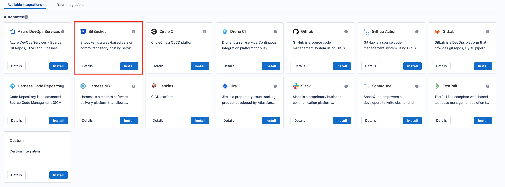
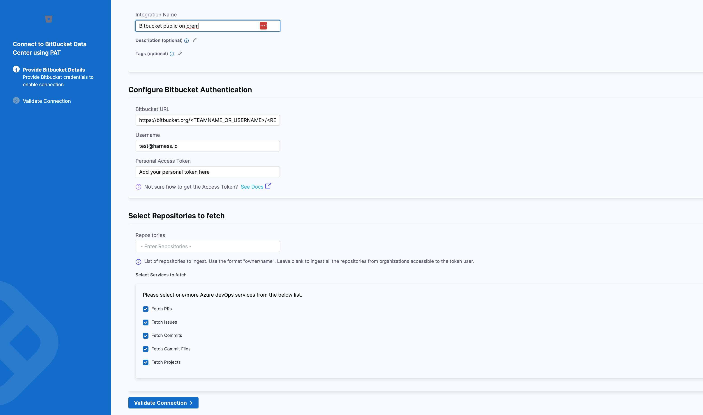

Bitbucket is a web-based version control repository hosting service, for source code and development projects that use either Mercurial or Git revision control systems.

This topic describes the settings and permissions for the Bitbucket integration. Harness SEI supports both Cloud and Data Center (On-Prem) versions of Bitbucket. The following settings are applicable to Bitbucket Data Center.

### Requirements

The following permissions and settings are required to use the SEI Bitbucket integration:

* You have a Bitbucket account.
* Your role is **Member** or higher.

:::info
If you have enabled an allow list in your Bitbucket account, certain Harness IP addresses must be added to it in order to allow communication between the Harness Platform and Bitbucket. If the necessary IPs are not whitelisted, the integration may fail to authenticate or sync data properly.

To ensure your integration can work correctly, please refer to the list of [Harness Platform IPs](/docs/platform/references/allowlist-harness-domains-and-ips) that may need to be whitelisted in your firewall.
:::

import Tabs from '@theme/Tabs';
import TabItem from '@theme/TabItem';

### Add the integration

[Bitbucket Data Center (also known as Bitbucket Enterprise)](https://www.atlassian.com/software/bitbucket/enterprise) is a self-managed solution for source code collaboration. Harness SEI supports connecting with both private and public Bitbucket On-Prem instances.

1. In your **Harness Project**, select the **SEI Module**, and go to your **Account**.
2. Select **Integrations** under **Data Settings**.
3. Select **Available Integrations**, and locate the **Bitbucket integration**, and select **Install**



4. Select the type of your Bitbucket account as **Data Center**.
5. Choose **Authentication Method**:
   1. Use **Personal Access Token (PAT)** to connect to a **Public On-Prem Bitbucket** server.
   2. Use **Ingestion Satellite** to connect to a **Private On-Prem Bitbucket** server


<Tabs>
  <TabItem value="pat" label="Direct Public Connection" default>

* Enter a **Name** for the integration.
* The **Description** and **Tags** are optional.
* Enter the **URL** for the **Bitbucket Public On-Prem Instance** in the format `https://bitbucket.org/<TEAMNAME_OR_USERNAME>/<REPOSITORY_NAME>/src`
* In the **Username** field, enter the Bitbucket account username as specified in your **Bitbucket Account settings**.
* Enter the **Bitbucket Personal Access Token**. To generate an PAT token for your Bitbucket account, go to [Managing PAT tokens for Bitbucket](https://support.atlassian.com/bitbucket-cloud/docs/create-a-repository-access-token/).
* Enter **Tags** and the **List of repositories** you want to ingest. You can leave this option blank if you want to ingest all the repositories from organizations accessible to the token user.
* You can select the **Filters** to define the type of data you want to ingest. The available options are **Fetch Commits**, **Fetch PRs**, **Fetch PRs Reviews**, **Fetch Commits Fields**.
* Click on **Validate Connection** to run the pre-flight checks and validate the connection. Once successful, you'll have the integration set up under the **Your Integrations** tab.



</TabItem>

  <TabItem value="satellite" label="Using Ingestion Satellite">

* Enter a **Name** for the integration.
* The **Description** and **Tags** are optional.
* Enter the **URL** for the **Bitbucket Public On-Prem Instance** in the format `https://bitbucket.org/<TEAMNAME_OR_USERNAME>/<REPOSITORY_NAME>/src`
* In the **Username** field, enter the Bitbucket account username as specified in your **Bitbucket Account settings**.
* Enter the **Bitbucket Personal Access Token**. To generate an PAT token for your Bitbucket account, go to [Managing PAT tokens for Bitbucket](https://support.atlassian.com/bitbucket-cloud/docs/create-a-repository-access-token/).
* Enter **Tags** and the **List of repositories** you want to ingest. You can leave this option blank if you want to ingest all the repositories from organizations accessible to the token user.
* You can select the **Filters** to define the type of data you want to ingest. The available options are **Fetch Commits**, **Fetch PRs**, **Fetch PRs Reviews**, **Fetch Commits Fields**.
* Download the `satellite.yml` file and update it following the instructions [here](/docs/software-engineering-insights/setup-sei/sei-ingestion-satellite/satellite-overview).

If you experience any issues while configuring the integration using the Ingestion Satellite, refer to the [Ingestion Satellite Troubleshooting and FAQs](/docs/software-engineering-insights/setup-sei/sei-ingestion-satellite/satellite-troubleshooting-and-faqs).

Here’s a sample `satellite.yaml`:

```yaml
satellite:
  tenant: <ACCOUNT_ID>
  api_key: <ACCOUNT_API_KEY>
  url: 'https://app.harness.io/gratis/sei/api' 
  # Note that this URL is relative to the Environment of your Harness Account

integrations:
  - id: '<INTEGRATION_ID>'
    application: bitbucket_server
    url: 'https://bitbucket.org/<TEAMNAME_or_USERNAME>/<REPO_NAME>/src'
    username: <BITBUCKET_USERNAME>
    api_key: <BITBUCKET_API_KEY>
    metadata:
      fetch_prs: true
      fetch_pr_reviews: true
      fetch_commits: true
      fetch_commit_files: true
      repos: <REPOSITORIES>
    satellite: true

```

</TabItem>
</Tabs>

### See also

* [Connect with Bitbucket Cloud](/docs/software-engineering-insights/setup-sei/configure-integrations/bitbucket/sei-bitbucket-cloud)
* [Reauthenticate](/docs/software-engineering-insights/setup-sei/configure-integrations/reauthenticate-integration)
* [Ingested data](/docs/software-engineering-insights/setup-sei/configure-integrations/bitbucket/sei-bitbucket-datasheet)