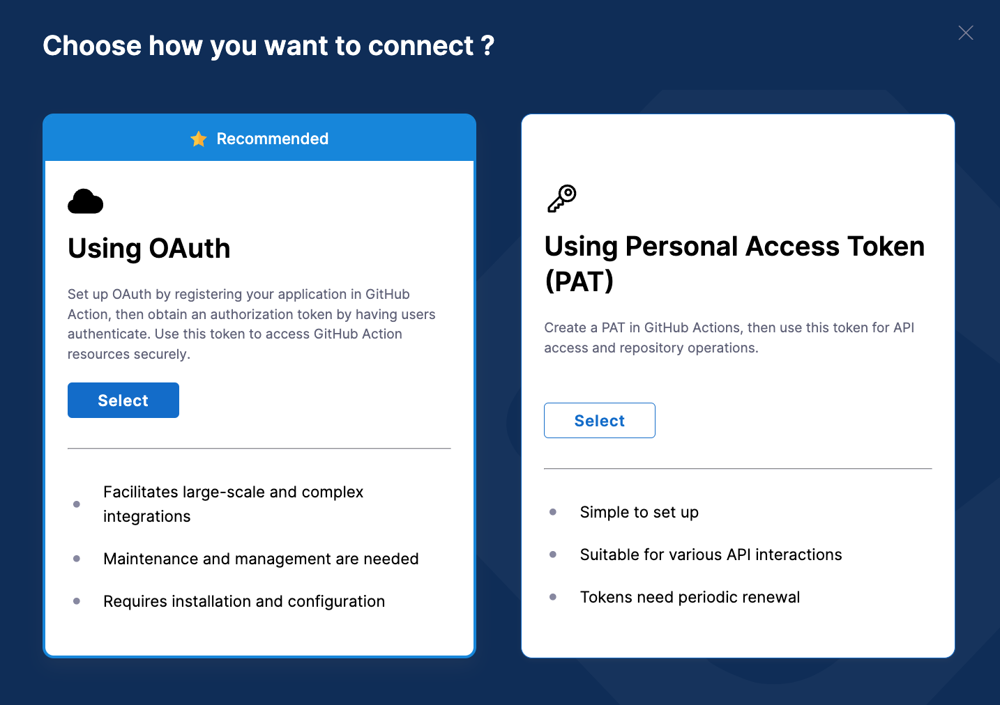
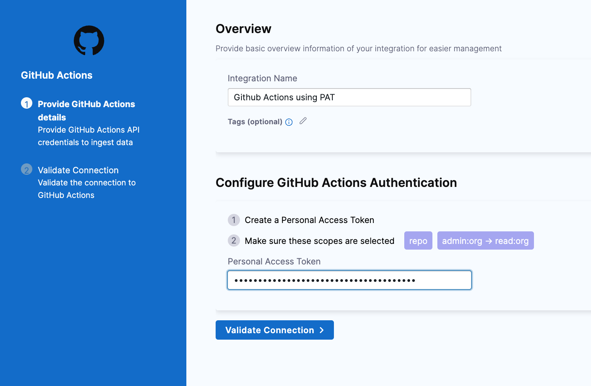

[GitHub Actions](https://docs.github.com/en/actions/learn-github-actions/understanding-github-actions) is a GitHub feature that enables you to automate various event-driven activities in GitHub, such as cloning a repository, generating Docker images, and testing scripts.

You can find over 10,000 GitHub Actions on the [GitHub Marketplace](https://github.com/marketplace?type=actions) or create your own Actions.

You can use the GitHub Action integration to integrate GitHub Actions with SEI.

## Requirements

You can either configure the integration using **Github OAuth** or use a **Github Personal Access Token (PAT)**. 
If you can't use OAuth, you must create a GitHub personal access token to configure the SEI GitHub Actions integration.

1. Log in to your GitHub account and create a personal access token. For instructions, go to the GitHub documentation on [Managing your personal access tokens](https://docs.github.com/en/authentication/keeping-your-account-and-data-secure/managing-your-personal-access-tokens).
2. Select the following permissions for your personal access token
   - All repo scopes, including the parent repo scope. The top-level repo scope is required for SEI to have the required visibility into your repos. (repoadmin:org -> read:org permission.)
   - If your GitHub organization uses SAML SSO, enable SSO for your personal access token. For instructions, go to the GitHub documentation on [Authorizing a personal access token for use with SAML SSO](https://docs.github.com/en/enterprise-cloud@latest/authentication/authenticating-with-saml-single-sign-on/authorizing-a-personal-access-token-for-use-with-saml-single-sign-on).


:::info
If you have enabled an allow list in your GitHub account, certain Harness IP addresses must be added to it in order to allow communication between the Harness Platform and GitHub. If the necessary IPs are not whitelisted, the integration may fail to authenticate or sync data properly.

To ensure your integration can work correctly, please refer to the list of [Harness Platform IPs](/docs/platform/references/allowlist-harness-domains-and-ips) that may need to be whitelisted in your firewall.
:::

import Tabs from '@theme/Tabs';
import TabItem from '@theme/TabItem';

## Connect with Github Actions (Cloud)

1. Select **Integrations** under **Data Settings**.
2. Select **Available Integrations**, locate the **Github Actions** integration.
3. Select **Install**.
4. Select the type of the Github Actions instance as **Cloud**.


<Tabs>
  <TabItem value="oauth" label="Using OAuth" default>

* Select an authentication method as **Using OAuth**.



* Follow the prompts to grant access to **GitHub**.
* In **Integration Name**, enter a name for the integration.
* Select repositories to associate with the integration or select **Ingest All Repos** to associate all current and future repos in your **GitHub organization**.
* Click on **Validate Connection** to run the pre-flight checks and validate the connection. Once successful, you'll have the integration set up under the **Your Integrations** tab.

</TabItem>
  <TabItem value="pat" label="Using Personal Accesss Token">

This authentication method is simple to set up and is suitable for various API interactions. Note that the access token needs periodic renewal based on the timeline of the generated token. 

* In **Integration Name**, enter a **Name** for the integration.
* Add a **Description** for the integration. (Optional)
* Enter the **Personal Access Token** that you generated earlier.
* Click **Validate Connection** to run pre-flight checks and confirm the connection. Once validated, your Github Actions integration will appear under **Your Integrations**.



</TabItem>
</Tabs>

## Connect with Github Actions (On-Prem)

To connect Harness SEI with on-prem instance of Github Actions, you'll need to use the [Ingestion Satellite](/docs/software-engineering-insights/setup-sei/sei-ingestion-satellite/run-the-satellite-container).

The steps for configuring the integration using the **Ingestion Satellite** is similar to configuring the integration on Cloud, with the exception of using satellite to communicate with the Github server.

1. In **Integration Name**, enter a **Name** for the integration.
2. Add a **Description** for the integration. (Optional)
3. Enter the **Personal Access Token** that you generated earlier.
4. In the **Github Actions URL** field, add the URL where your GitHub Actions instance is hosted.
5. Click on the **Download YAML File** button and save the `satellite.yml` file. Update it following the instructions [here](/docs/software-engineering-insights/setup-sei/sei-ingestion-satellite/run-the-satellite-container).


If you experience any issues while configuring the integration using the Ingestion Satellite, refer to the [Ingestion Satellite Troubleshooting and FAQs](/docs/software-engineering-insights/setup-sei/sei-ingestion-satellite/satellite-troubleshooting-and-faqs).

Here’s a sample `satellite.yml` file:

```yaml
satellite:
  tenant: <ACCOUNT_ID>
  api_key: <ACCOUNT_API_KEY>
  url: "https://app.harness.io/gratis/sei/api" 
  # Note that this URL is relative to the Environment of your Harness Account.
  
integrations:
  - id: "<INTEGRATION_ID>"
    application: github_actions
    url: "<GITHUB_INSTANCE_URL>"
    authentication: apikey
```

:::note
The `Triage Rule` and `Trend` custom fields are not supported as the Stacks and Aggregation option when using the Github Actions integration.
:::

<details>
<summary>Supported Reports</summary>

Following reports are supported for the Github Action integration:

- CICD Job Count Report
- CICD Job Count Trend Report
- CICD Job Duration Report
- CICD Job Duration Single Stat
- CICD Job Duration Trend Report
- CICD Jobs Count Single Stat
- CICD Pipeline Jobs Count Report
- CICD Pipeline Jobs Count Trend Report
- CICD Pipeline Jobs Duration Report
- CICD Pipeline Jobs Duration Trend Report
- Deployment Frequency - Dora widget
- Change Failure Rate - Dora widget

</details>