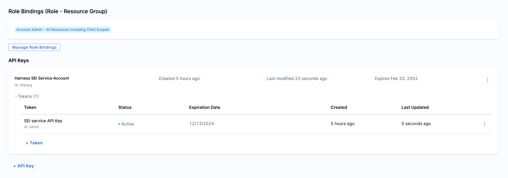

Use the SEI HarnessNG integration to integrate Software Engineering Insights with the Harness Continuous Delivery & GitOps and Continuous Integration modules.

### Requirements

To configure the SEI Harness integration, you need:

* Your Harness account ID. You can find this under **Account Settings**.
* A [Harness API key and token](/docs/platform/automation/api/add-and-manage-api-keys).
* The **Harness Service Account** used to generate the API key must have a role binding as **Account Viewer** with the resource group set to **All Resources Including Child Scopes**. Copy the account ID and token somewhere that you can retrieve them when you configure the integration.



import Tabs from '@theme/Tabs';
import TabItem from '@theme/TabItem';

### Add the integration

1. In your **Harness Project**, go to the **SEI Module**, and select **Account**.
2. Select **Integrations** under **Data Settings**.
3. Select **Available Integrations**, locate the **Harness NG integration**, and select **Install**.

<Tabs>
  <TabItem value="cloud" label="Cloud" default>

* Select the type of the **HarnessNG account** as **Cloud**.


* Configure and **Save** the integration.
   * **URL**: Enter `https://app.harness.io`.
   * **API key**: Enter your Harness personal access token.
   * **Account ID**: Enter your Harness account ID.
   * **Name**: Enter a name for the integration.
   * **Description** and **Tags** are optional.
   * **Organization**: Enter your organization name. If you have multiple organizations, you can use a comma-separated list.
     
     For example, "Youtube, YouTubeTV." Please note that organization names are case-sensitive. You can leave this field blank to include all organizations accessible to the token user.
   * **Project**: Enter your project name. Similarly, you can use a comma-separated list if you have multiple projects.
     
     For example, "`org/project`, `org2/project2`" Like organization names, project names are case-sensitive. Leaving this field blank will ingest all the projects from organizations accessible to the token user.
* Click on **Validate Connection** to run the pre-flight checks and validate the connection. Once successful, you'll have the integration set up under the **Your Integrations** tab.


</TabItem>

<TabItem value="harness-smp" label="Harness Self-Managed Enterprise Edition">

You can connect Harness SEI with Harness Self-Managed Enterprise Edition (Harness On-Prem), using the [Ingestion Satellite](/docs/software-engineering-insights/setup-sei/sei-ingestion-satellite/run-the-satellite-container)

The steps for configuring the integration using **Satellite** is similar to configuring the integration on cloud using the API key, with the exception of using satellite to communicate with the Harness NG server.

* Select the type of the **HarnessNG account** as **On-Prem**.


* Configure and **Save** the integration.
   * **URL**: Enter `https://app.harness.io`.
   * **API key**: Enter your Harness personal access token.
   * **Account ID**: Enter your Harness account ID.
   * **Name**: Enter a name for the integration.
   * **Description** and **Tags** are optional.
   * **Organization**: Enter your organization name. If you have multiple organizations, you can use a comma-separated list.
     
     For example, "Youtube, YouTubeTV." Please note that organization names are case-sensitive. You can leave this field blank to include all organizations accessible to the token user.
   * **Project**: Enter your project name. Similarly, you can use a comma-separated list if you have multiple projects.
     
     For example, "`org/project`, `org2/project2`" Like organization names, project names are case-sensitive. Leaving this field blank will ingest all the projects from organizations accessible to the token user.
* Click on **Download YAML File** and save the `satellite.yml` file. Update it following the instructions [here](/docs/software-engineering-insights/setup-sei/sei-ingestion-satellite/satellite-overview).


If you experience any issues while configuring the integration using the Ingestion Satellite, refer to the [Ingestion Satellite Troubleshooting and FAQs](/docs/software-engineering-insights/setup-sei/sei-ingestion-satellite/satellite-troubleshooting-and-faqs).

Here’s a sample `satellite.yml` file:

```yaml
satellite:
  tenant: <ACCOUNT_ID>
  api_key: <ACCOUNT_API_KEY>
  url: 'https://app.harness.io/gratis/sei/api'
  # Note that this URL is relative to the Environment of your Harness Account.

integrations:
  - id: '<INTEGRATION_ID>'
    application: harnessng
    url: '<HARNESS_URL>'
    api_key: <HARNESS_API_KEY>
    metadata:
      accountId: <HARNESS_NG_ACCOUNTID>
      organization: default
      project: default

```

</TabItem>
</Tabs>
