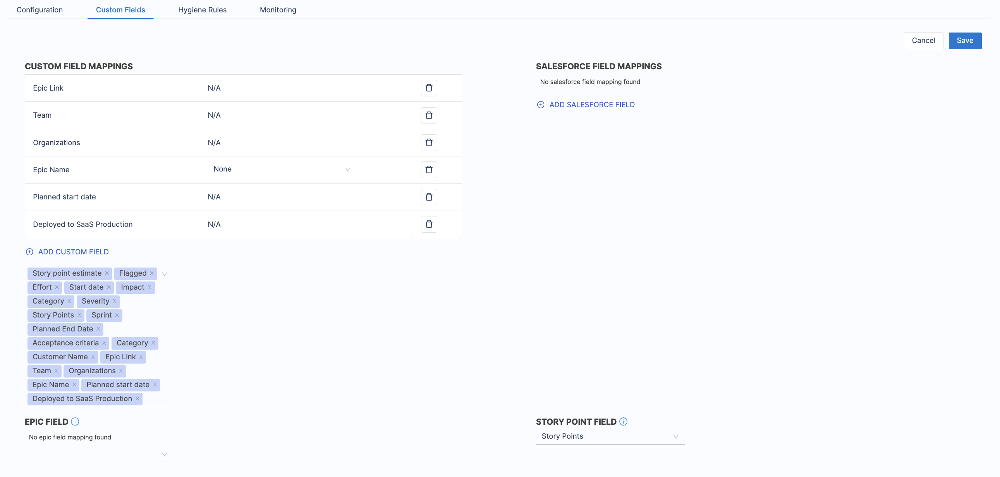

You can map the custom fields from Jira into the SEI system. This will let you use this custom field as filters while setting up the widget settings, collection definition, and profile settings while using the Jira integration.

### Custom fields

To add custom fields mapping, follow the steps below

1. In your **Jira** integration, go to the Custom Field settings.
2. Click on +Custom Field to map a new custom field
3. Select all the custom fields from Jira that you want to use in the SEI system
4. Click **Save** to save the define settings.

### Epic field

This is an optional field and defaults to Epic Link. Select the value if any other custom field is used to link tickets with epics.

### Story point field

This is an optional field and defaults to Story Points. Select a value if ticket story points are tracked via a non-standard custom field.

