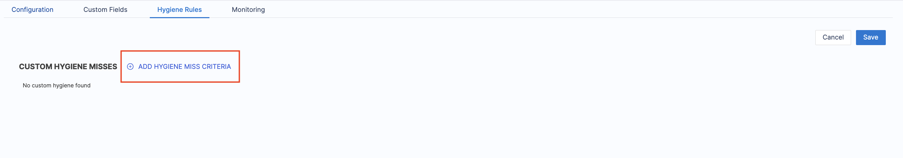
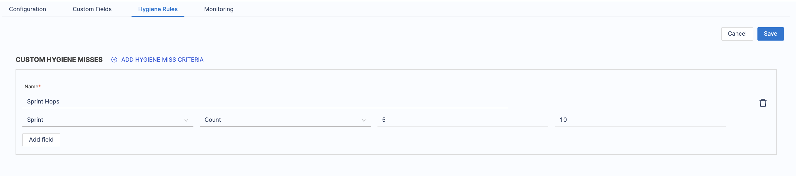

The [Issue Hygiene Report widget](/docs/software-engineering-insights/sei-metrics-and-reports/hygiene-metrics#issue-hygiene-reports) uses data from Jira to calculate hygiene scores.

These scores represent _hygiene misses_ in a designated time frame. A hygiene miss means that a ticket in your issue management system was missing an important field, failed to change status while sprint was active, or was assigned to an inactive user.

What constitutes a miss depends on your _hygiene categories_. There are several built-in [hygiene categories](/docs/software-engineering-insights/sei-metrics-and-reports/hygiene-metrics.md#issue-hygiene-categories), and you can add custom hygiene categories by configuring **Custom Hygiene Misses** in your issue management integration.

To add custom hygiene categories:

1. In your **Harness Project**, select the **SEI Module**, and go to your **Account**.
2. Select **Integrations** under **Data Settings**.
3. Find your **Jira** integration and edit it.
4. Select **Add Hygiene Miss Criteria** and configure the new hygiene category:

   - **Name:** Enter a name for the category. This name appears on the Issue Hygiene Report widget along with the category's score.
   - **Field:** Select the Jira field that provides data for this category.
   - **Operator:** Specify the operator, such as **Missing** or **Greater Than**, that determines if there was a hygiene miss for this category.

   The **Operator** represents an undesired state for the specified **Field**. For example, if your _desired state_ is for the specified **Field** to be populated, then your _undesired state_ is that the field is empty. Therefore, you would set the **Operator** to **Missing**.

5. To get scores for custom hygiene categories, you must modify the category **Weights** in your Issue Hygiene Report widgets. Custom categories don't have an initial weight, so you must modify all instances of the widget to include your custom categories in the hygiene score calculations. For detail instructions, go to [Configure the Issue Hygiene Report](/docs/software-engineering-insights/sei-metrics-and-reports/hygiene-metrics#configure-the-issue-hygiene-report).