import Tabs from '@theme/Tabs';
import TabItem from '@theme/TabItem';

If your integration health is failing due to expired credentials, you can easily re-authenticate by following these steps to update your access token:

<Tabs>
<TabItem value="jira" label="Jira" default>

:::warning
The support for reauthentication is not available for the Jira Connect App.
:::

To reauthenticate with Jira software using an Atlassian API Key, follow these steps:

* Go to the **Integrations**, and select your Jira integration from the **Your Integrations** tab.

* This will open the integration configuration settings.

* Click on the **Re-Authenticate** button at the top right corner.

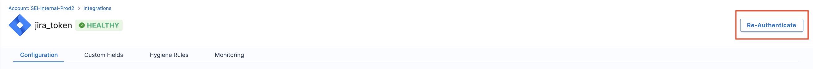

* Follow the prompts and enter your email and the new **API Key**. Note that you cannot switch authentication type or update any existing configuration settings apart from the new token.

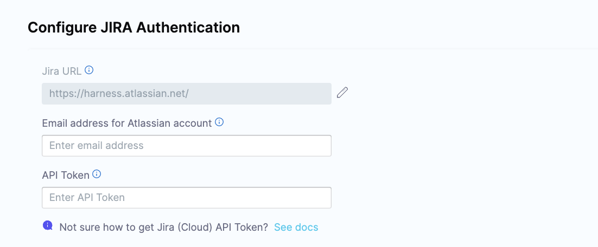

* Click **Validate Connection** to complete the re-authentication process.
 
By following these steps, you'll successfully re-authenticate with the Jira platform using your new access token, resolving any issues caused by expired credentials.

</TabItem>

<TabItem value="github" label="GitHub">

:::warning
The support for reauthentication is not available for the GitHub App.
:::

To reauthenticate with GitHub software using an Personal Access Token, follow these steps:

* Go to the **Integrations**, and select your GitHub integration from the **Your Integrations** tab.

* This will open the integration configuration settings.

* Click on the **Re-Authenticate** button at the top right corner.

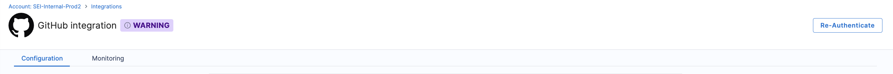

* Follow the prompts and enter your email and the new **PAT Token**. To resolve rate-limiting issues, add multiple PATs generated using multiple service accounts. Note that you cannot switch authentication type or update any existing configuration settings apart from the new token.

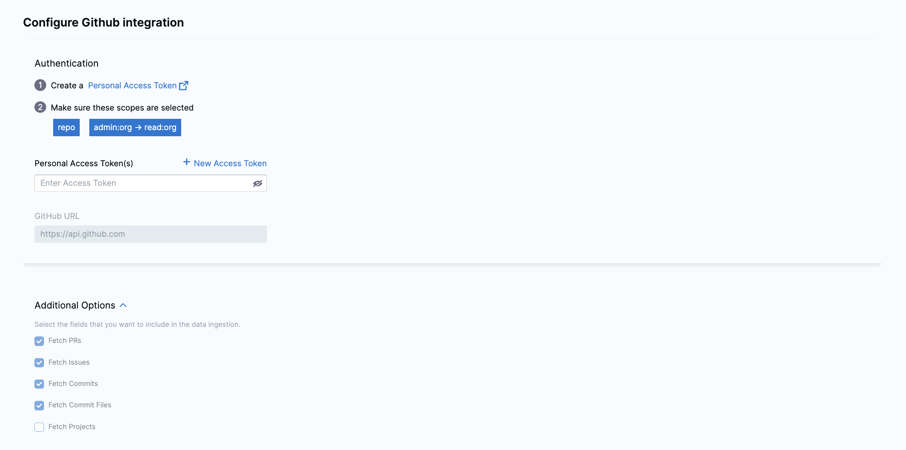

* Click **Validate Connection** to complete the re-authentication process.
 
By following these steps, you'll successfully re-authenticate with the Jira platform using your new access token, resolving any issues caused by expired credentials.

</TabItem>

<TabItem value="bitbucket" label="Bitbucket">

* Go to the **Integrations**, and select your Bitbucket integration from the **Your Integrations** tab.

* This will open the integration configuration settings.

* Click on the **Re-Authenticate** button at the top right corner.

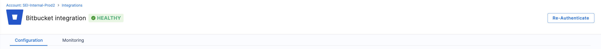

* Follow the authentication steps based on your setup:
  * For OAuth authentication, you’ll be redirected to Bitbucket, where you can grant permissions for the integration. Bitbucket will confirm authorization, returning you to the re-authentication setup page.
  * If the integration was set up using the Atlassian API, follow the prompts to enter your email and the new API Key. Please note that you cannot switch the authentication type or modify existing configuration settings aside from entering the updated token.

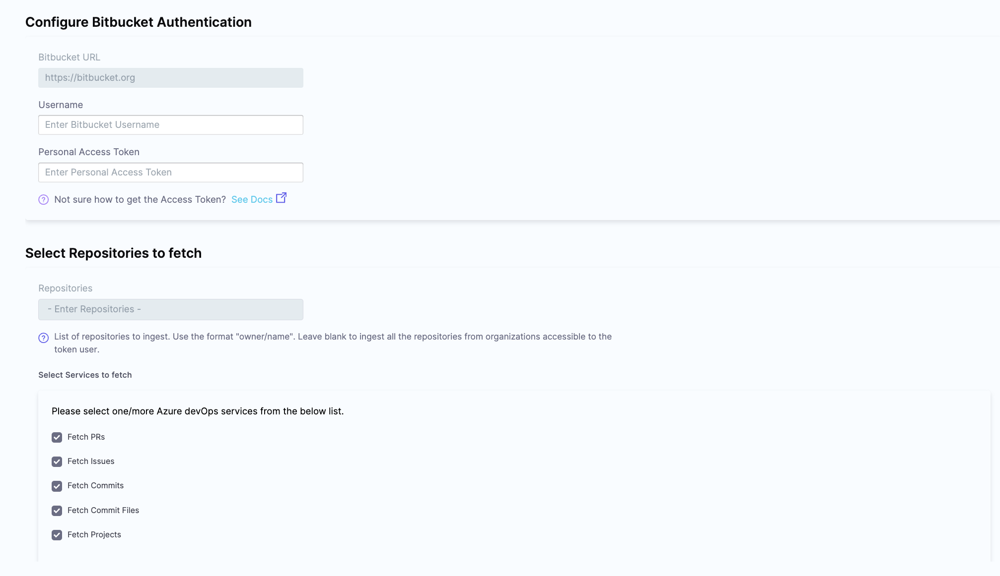

* Click **Validate Connection** to complete the re-authentication process.
 
By following these steps, you'll successfully re-authenticate with the Jira platform using your new access token, resolving any issues caused by expired credentials.

</TabItem>

<TabItem value="ado" label="Azure DevOps">

To set up re-authentication for Azure Devops, you'll need to reauthenticate the any of the Azure DevOps integration (i.e. either Boards, Repos or Pipelines). Once the reauthentication is completed for one service it will be automatically updated for the other two services.

To reauthenticate with Azure DevOps platform, follow these steps:

* Go to the **Integrations**, and select your Azure DevOps integration from the **Your Integrations** tab.

* This will open the integration configuration settings.

* Click on the **Re-Authenticate** button at the top right corner.

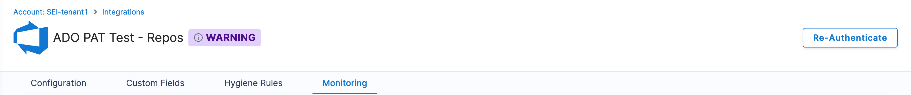

* Follow the authentication steps based on your setup:
  * For **OAuth authentication**, you’ll be redirected to Azure DevOps, where you can grant permissions for the integration. The Azure DevOps platform will confirm authorization, returning you to the re-authentication setup page.
  * If the integration was set up using the **Azure DevOps PAT Token**, follow the prompts to enter your email and the new PAT token. Please note that you cannot switch the authentication type or modify existing configuration settings aside from entering the updated token.

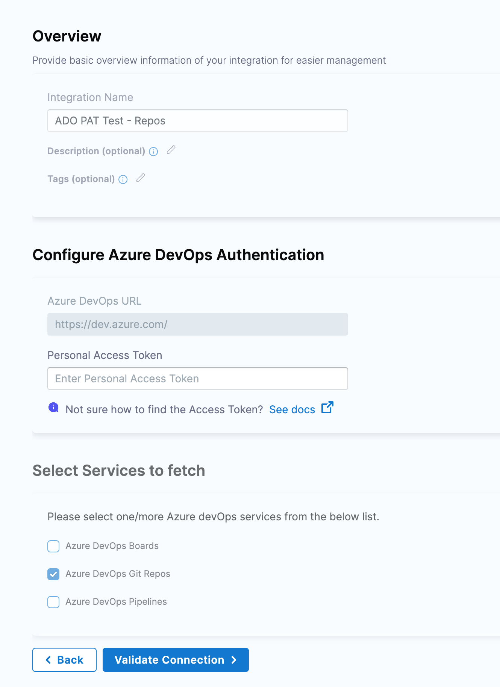

* Click **Validate Connection** to complete the re-authentication process.
 
By following these steps, you'll successfully re-authenticate with the Jira platform using your new access token, resolving any issues caused by expired credentials.

</TabItem>

<TabItem value="harness" label="Harness CI/CD">

* Go to the **Integrations**, and select your Harness CI/CD integration from the **Your Integrations** tab.

* This will open the integration configuration settings.

* Click on the **Re-Authenticate** button at the top right corner.

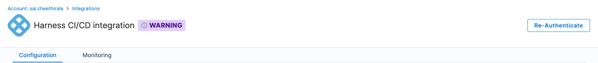

* Follow the prompts and enter your email and the new **API Key**. Please note that you cannot switch the authentication type or modify existing configuration settings aside from entering the updated token.

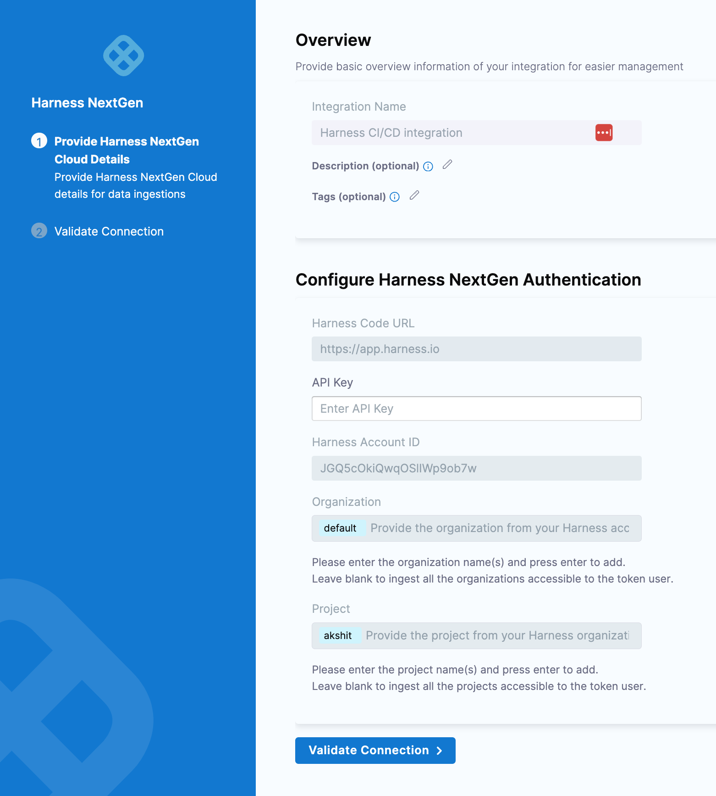

* Click **Validate Connection** to complete the re-authentication process.
 
By following these steps, you'll successfully re-authenticate with the Jira platform using your new access token, resolving any issues caused by expired credentials.

</TabItem>

<TabItem value="gitlab" label="GitLab">

* Go to the **Integrations**, and select your GitLab integration from the **Your Integrations** tab.

* This will open the integration configuration settings.

* Click on the **Re-Authenticate** button at the top right corner.

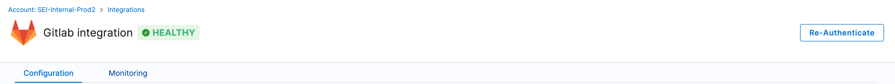

* Follow the prompts and enter the new **PAT Token**. Please note that you cannot switch the authentication type or modify existing configuration settings aside from entering the updated token.

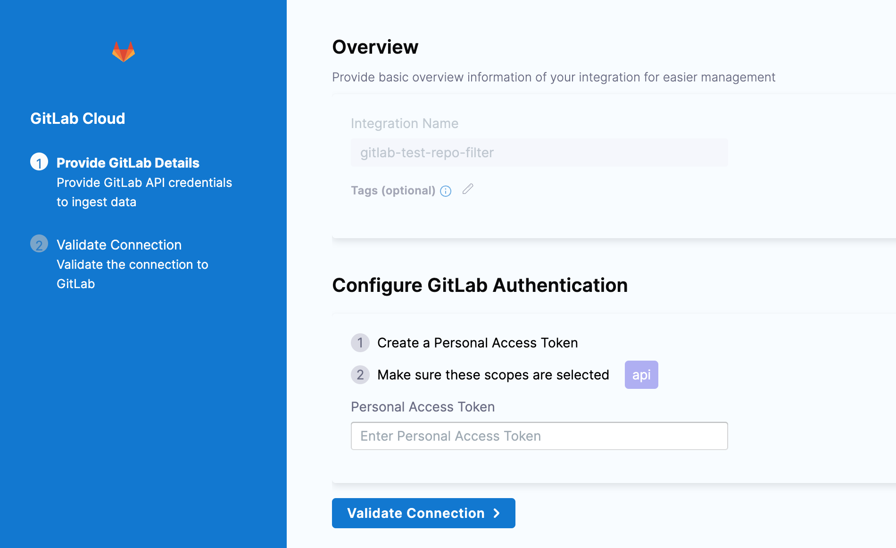

* Click **Validate Connection** to complete the re-authentication process.
 
By following these steps, you'll successfully re-authenticate with the Jira platform using your new access token, resolving any issues caused by expired credentials.

</TabItem>

<TabItem value="gha" label="GitHub Actions">

* Go to the **Integrations**, and select your GitHub Actions integration from the **Your Integrations** tab.

* This will open the integration configuration settings.

* Click on the **Re-Authenticate** button at the top right corner.

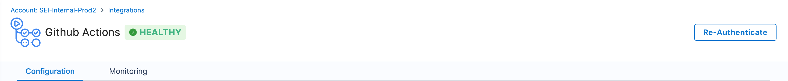

* Follow the prompts and enter your email and the new **PAT Token**. To resolve rate-limiting issues, add multiple PATs generated using multiple service accounts. Please note that you cannot switch the authentication type or modify existing configuration settings aside from entering the updated token.

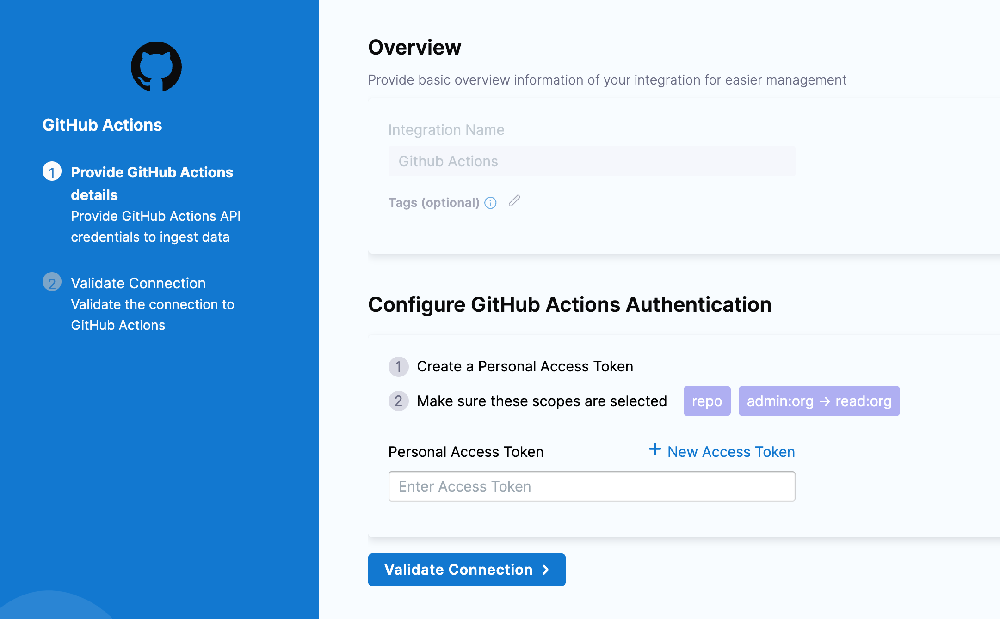

* Click **Validate Connection** to complete the re-authentication process.
 
By following these steps, you'll successfully re-authenticate with the Jira platform using your new access token, resolving any issues caused by expired credentials.

</TabItem>

<TabItem value="sonarqube" label="SonarQube">

* Go to the **Integrations**, and select your SonarQube integration from the **Your Integrations** tab.

* This will open the integration configuration settings.

* Click on the **Re-Authenticate** button at the top right corner.

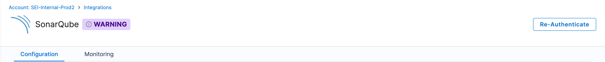

* Follow the prompts and enter the SonarQube account username and the new **API Key**. Please note that you cannot switch the authentication type or modify existing configuration settings aside from entering the updated token.

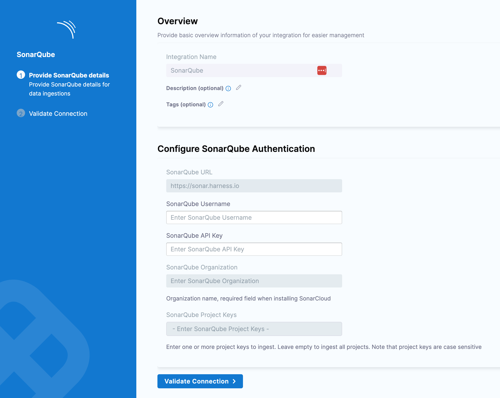

* Click **Validate Connection** to complete the re-authentication process.
 
By following these steps, you'll successfully re-authenticate with the Jira platform using your new access token, resolving any issues caused by expired credentials.

</TabItem>
</Tabs>