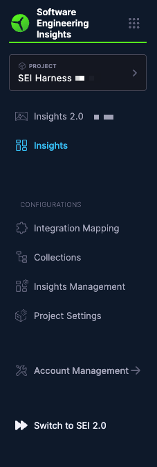
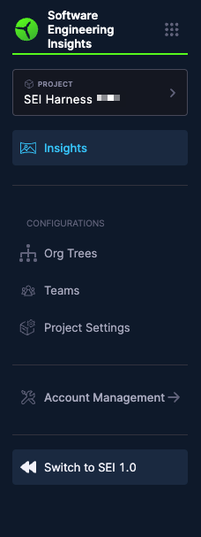

SEI is not a lift-and-shift or one-click upgrade from Engineering Insights Classic. Instead, it represents a fresh, forward-looking setup that is purpose-built to deliver clarity, efficiency, and scalability for modern engineering organizations. This page outlines the experience and steps needed for [Engineering Insights Classic](/docs/software-engineering-insights/propelo-sei/setup-sei/configure-integrations/github/sei-github-integration) users to transition successfully to [SEI](/docs/software-engineering-insights/harness-sei/sei-overview).

SEI is a re-imagined platform. It will live side-by-side with Engineering Insights Classic during your transition journey. You will continue to have full access to Engineering Insights Classic while setting up SEI from the ground up.

There is no automated migration or porting of Engineering Insights Classic configurations, dashboards, or metrics into SEI. The transition allows you to re-establish what matters most and configure SEI for maximum business alignment and usability.

This transition is your opportunity to start fresh, remove technical debt, and align SEI to the priorities of your engineering org today. SEI was built to scale, simplify, and support deep insights—and this transition enables exactly that.

| Role | Responsibilities |
|:---:|:---:|
| SEI Admin | Leads Org Tree and Profile setup. Manages rollout of Insights. |
| Team Manager | Supports Team Tools and Developer configuration. Enables feedback. |
| Harness Team | Product support, and onboarding guidance via online documentation and videos. |

## Transition workflow

:::info 
- Harness creates the SEI experience initially using existing Engineering Insights Classic context (if applicable).
- SEI Admin and Managers can validate, provide feedback, and adjust structures.
:::

1. **Enablement**
   
   - At General Availability (GA), SEI is in disabled state within the same Harness account as Engineering Insights Classic for customers who are already on Engineering Insights Classic. To enable access to SEI please reach out to SEI customer support.
   - Once enabled, It will appear as “Insights 2.0” under a new navigation item for Account Admins.
   - Can be created in the same or a separate project.
   - Engineering Insights Classic remains fully operational and unchanged until formal sign-off.

1. **Org Tree & Profile Creation**
   
   - Led by SEI Admin
   - [Import Developers](/docs/software-engineering-insights/harness-sei/setup-sei/manage-developers) into Harness SEI using a CSV file.
   - [Define Org Trees](/docs/software-engineering-insights/harness-sei/setup-sei/setup-org-tree): Reflect your org structure, teams, and reporting.
   - [Create Profiles](/docs/software-engineering-insights/harness-sei/setup#step-2-set-up-profiles): Align metrics to teams, roles, and use cases.

1. **Team & Developer Setup**
   
   - Led by Team Managers
   - Configure team settings and map developers to the right profiles.
   - Ensure accurate ownership for insights and feedback loops.

1. **Insights Activation**
   
   - Enable and configure [SEI insights](/docs/software-engineering-insights/harness-sei/insights/) as features roll out.
   - Include DORA metrics, Productivity metrics, and Business Alignment widgets.

1. **Validation & Feedback**

   - Iterate through early use and gather stakeholder feedback.
   - Refine Org Trees, Profiles, and Metrics definitions based on goals.

1. **Sign-Off & Cutover**
   
   - When confident, formally sign off on SEI.
   - Engineering Insights Classic can then be deprecated; SEI becomes the sole experience.

## What stays the same during the transition

- Your Engineering Insights Classic data, dashboards, and reports remain untouched 
- Teams can continue to operate as-is in Engineering Insights Classic while exploring SEI

## What changes with SEI

- Re-imagined user experience and UI 
- Near real-time data infrastructure 
- Streamlined metrics setup and ownership

## Engineering Insights Classic to Engineering Insights

To access the latest [SEI](/docs/software-engineering-insights/harness-sei/sei-overview) experience, click **Switch to 2.0** below **Account Management** in the Harness SEI navigation menu.

## Engineering Insights to Engineering Insights Classic

To return to the [Engineering Insights Classic](/docs/software-engineering-insights/propelo-sei/get-started/overview) experience, click **Switch to 1.0** below **Account Management** in the Harness SEI navigation menu.

You can switch back at any time without losing your existing data.