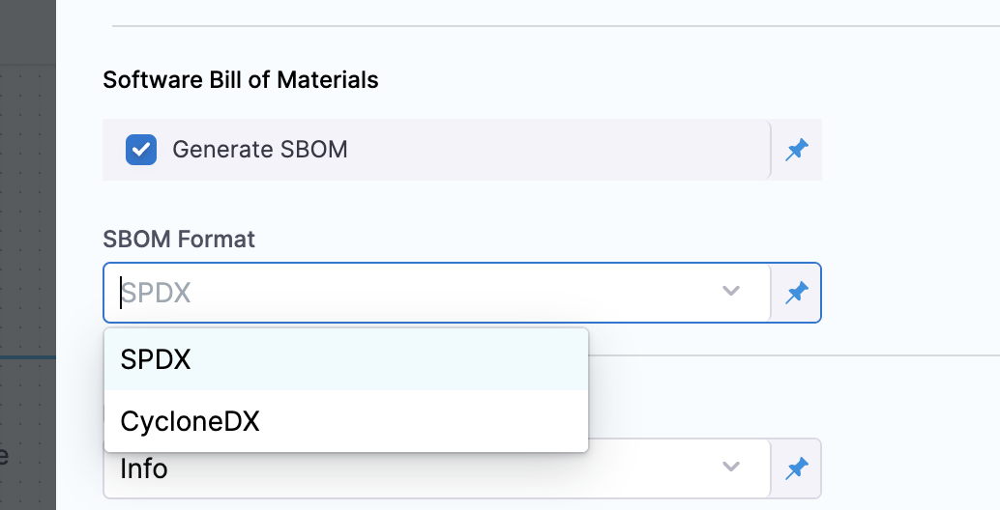

### Workflow for ingesting SBOM data generated by a Blackduck STO step ingested into SSCA

The following workflow describes how to set up an ingestion pipeline for [Blackduck STO step](docs/security-testing-orchestration/sto-techref-category/black-duck-hub-scanner-reference.md) generating an SBOM in [SPDX](https://spdx.dev/learn/overview/) or [CycloneDx](https://cyclonedx.org/specification/overview/) JSON format. 

1. First configure [Blackduck STO step](docs/security-testing-orchestration/sto-techref-category/black-duck-hub-scanner-reference.md) 

2. Once the [Blackduck STO step](docs/security-testing-orchestration/sto-techref-category/black-duck-hub-scanner-reference.md) is set up, ensure Generate SBOM and the expected SBOM format is selected.

# 

5. The Blackduck step provides a JOB_ID [output variable](https://developer.harness.io/docs/continuous-integration/use-ci/run-ci-scripts/run-step-settings/#output-variables), this can be used to construct the path to the sbom file. We will need this path to configure the SCA Orchestration step in the next step. One approach is to replace stageID and stepID in the following expression:

   ```
   /addon/results/<+pipeline.stages.[stageID].spec.execution.steps.[stepID].output.outputVariables.JOB_ID>.sbom
   ```

   An alternative way is to grab the output variable expression from an already executed pipeline from the output tab on an already executed pipeline. 

# 

1. Configure an SSCA Orchestration step in [ingestion mode](docs/software-supply-chain-assurance/ingest-sbom-data.md).
   1. Step Mode should be set to Ingestion
   2. Specify the SBOM File Path to match the file created in the prior step (see the previous step)
   3. Configure the Container Registry and image where the SBOM should be attached
   4. Configure the SBOM Attestation Private Key and Password 

# 


