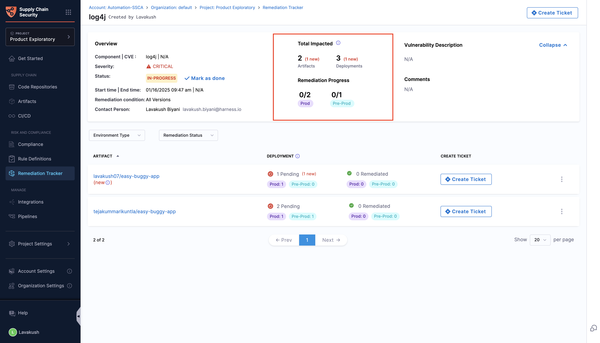

# Track Remediation Progress

This document focuses on how to track the progress of your remediation within a tracker. We'll delve into a few key aspects and showcase the prominent features that facilitate effective tracking of your remediation progress.

## Prerequisites

As this guide concentrates on tracking progress, it assumes that you already have a tracker set up. If you are unsure about how to create one, please refer to the [Create a Remediation Tracker](./create-remediation-tracker) document for detailed instructions.

## Understanding the Tracker Status

<DocImage path={require('./static/tracker-status-overview.png')} width="100%" height="80%" />

The remediation tracker operates with two stages: 'In-progress' and 'Done'. Upon creation, when the tracker identifies affected artifacts and their deployments, it sets its status to 'In-progress.' The update of the tracker's status is contingent on the deployment status of all artifacts within the tracker. When every deployment related to these artifacts is patched, resulting in zero pending deployments, the tracker's status will automatically change to 'Done'.

### Tracking your Patch status

For every artifact listed, the tracker offers a status overview, displaying the number of deployments that need attention, marked as 'Pending,' and those that have been patched, labeled as 'Remediated.' When a patch is applied, the tracker uses the predefined conditions set at its creation to assess the artifacts and update their status. If your artifact meets the specified conditions, it is categorized as 'Remediated.' Conversely, if it fails to meet these conditions, it is classified under the 'Pending' category. The change in deployment status will be regularly updated each time you open the tracker.

<DocImage path={require('./static/remediation-deploy.png')} width="100%" height="80%" />

### Tracking the new deployments
The tracker is capable of identifying any new deployments using the affected artifact. It signals these updates by adding a 'new' marker to the artifact listing and showing the number of new deployments. This marker is key for keeping track of deployments that occur after the tracker's implementation.

<DocImage path={require('./static/newartifact.png')} width="100%" height="80%" />

### Tracking the overall Remediation progress

While you can view the status of each individual artifact, the Remediation Progress section within the tracker provides a comprehensive overview of the overall status. It includes the total number of impacted artifacts and environments. Importantly, it displays the active status of both production and pre-production environments that require patching, providing a clear picture of what is necessary for a complete and successful remediation.

## Completing the Remediation

As outlined in the initial section of this document, your remediation tracker will automatically reach completion once all artifacts are successfully patched, at which point the status of the tracker is automatically set to 'Done.' Additionally, the tracker provides the option to manually close it by clicking on the 'Mark as done' button found in the overview section. While manual closure is possible, it is recommended to allow the tracker to close automatically, ensuring that all artifacts are remediated.

<DocImage path={require('./static/close-remediation.png')} width="100%" height="80%" />

:::info
The states of all artifacts and their deployments remain accessible in the tracker until closure, and it’s important to note that once the tracker is closed, it cannot be reopened.
:::