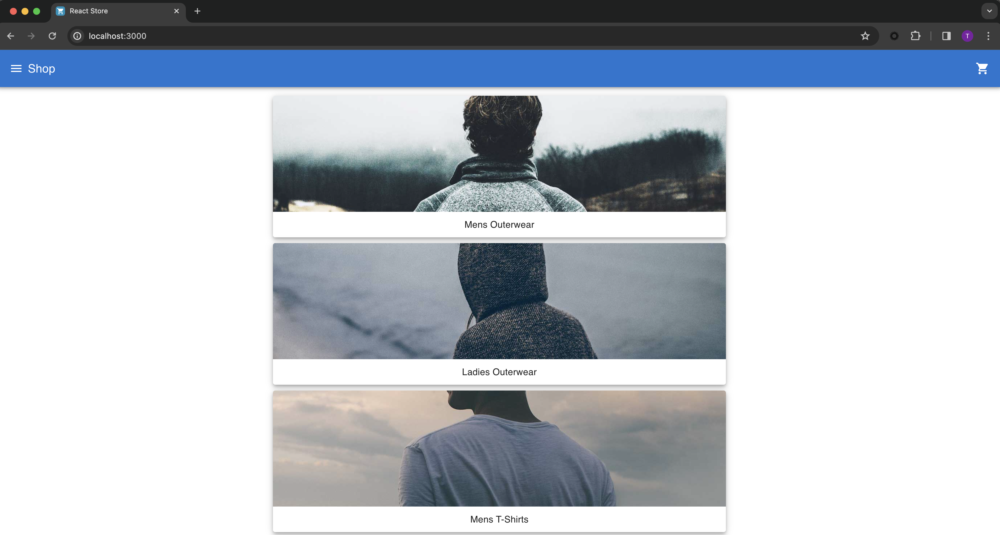

In this tutorial, we'll walk you through setting up a pipeline in Harness to automatically track changes in the Software Bill of Materials (SBOM) for your GitHub project. Our focus will be on creating a pipeline that triggers whenever there's a new pull request (PR). This pipeline will compare the SBOM from the PR with the SBOM of the main branch to identify any differences and generate a drift report. Once the PR is merged, it will also update the SBOM for the main branch, ensuring it's always up-to-date for future tracking. By incorporating this process into your software delivery cycle, you can easily review and approve SBOM changes before they merge, keeping your project safe from risky components and updates.

Here's a breakdown of the process:
1. A PR is submitted to the main branch.
2. GitHub triggers the pipeline.
3. The pipeline generates the SBOM for your feature branch.
4. The pipeline identifies changes in the SBOM and provides a report
5. Whenever the PR gets merged, the SBOM of the main branch will be updated.


:::info
For maintaining consistency, we'll refer to our `main` branch as both the base and default branch throughout this tutorial. You can choose to use your respective branch as you follow along.
:::

## Prerequisites

Before you begin, make sure you understand [SBOM generation](/docs/software-supply-chain-assurance/sbom/generate-sbom) and [SBOM drift](/docs/software-supply-chain-assurance/sbom/sbom-drift).

You need:

* A Harness account with access to the SCS module.
* A GitHub account
* A [GitHub connector](/docs/platform/connectors/code-repositories/connect-to-code-repo) for your GitHub account.
* An IDE or code editor. This tutorial uses Visual Studio Code.

## Set up the sample app

For this tutorial, we will use a sample store application built using ReactJS, called [react-store](https://github.com/google-pay/react-store), this is freely accessible on GitHub. You can use your own repository or follow along with the react-store app for this tutorial.

1. Fork the main branch of the react-store repository.
2. Clone the forked repository to your local/remote machine.
3. Open the cloned codebase in your preferred code editor.
4. Execute the command `npm install` in your terminal to install the necessary dependencies.
5. Launch the application by running `npm start`, and then open `localhost:3000` in your web browser to view the sample app.



In the upcoming sections, we'll make some changes by introducing new libraries to the codebase. Following these changes, when we raise a PR, we'll configure a trigger in the Harness pipeline. This trigger will automatically generate an SBOM Drift report, showcasing the differences before and after the modifications.

## Set up the Harness CI pipeline

Now that your repository is all set, let's move on to configuring the Harness CI pipeline. If you're already familiar with this setup or have an existing pipeline, feel free to jump ahead to the next sections.

1. Access the Harness platform and navigate to the SCS module.
2. In your project, select **Pipelines**, and then select **Create a Pipeline**.
3. Enter a name, such as `SBOM Drift for React Store`.
4. Select either **Inline** (store pipeline in the Harness Platform) or **Remote** (store pipeline in a Git repo).
5. Select **Third-party Git provider** as the source for your pipeline code, and then select your GitHub connector for **Git Connector**. The connector must have access to the account where you forked the sample repo for this tutorial.
7. Enter the repository name, such as `react-store` or the name of your own app repo.
8. Select the default branch. This tutorial uses `main`.
9. The YAML path for your pipeline configuration should be auto-populated. If necessary, you can manually enter the location where you wish to store the YAML files of the pipeline.
10. Select **Start** to create the pipeline.

<DocImage path={require('./static/automate-sbom-drift/set-up-the-pipeline.png')} width="70%" height="70%" title="Click to view full size image" />

### Set up the build stage

Once you create the pipeline, you should be able to create a new stage.

1. Select **Add Stage** and add a **Build** stage.
2. Enter a name, such as `Build`.
3. Make sure **Clone Codebase** is enabled.
4. Configure the pipeline to use the repo you want to use for this tutorial, such as the sample `react-store` repo.
5. Select **Set up Stage**.

<DocImage path={require('./static/automate-sbom-drift/set-build-stage.png')} width="50%" height="50%" title="Click to view full size image" />

A build stage has four tabs for configuration: Overview, Infrastructure, Execution, and Advanced. For the purposes of this tutorial, you'll use the Infrastructure and Execution tabs.

**Infrastructure:** Select the infrastructure to run your build. For the quickest setup, use Harness Cloud build infrastructure to run your build on Harness-managed runners.
**Execution:** Add steps to the stage. In this tutorial, you'll add steps to generate the SBOM and drift.

### Add a step to install dependencies

Before we proceed with generating the SBOM, it's important to understand that its creation depends on the `package-lock.json` file present in your project. Additionally, having the `node_modules` directory brings more visibility and increases the quality of the generated SBOM. Therefore, we will incorporate steps to install the necessary dependencies prior to the SBOM generation.

:::info
For SBOM generation, it's essential to have dependency locking files within your project, such as package-lock.json, pipfile.lock, cargo.lock, etc., depending on the technology stack you're using. While you may choose to skip the dependency installation step, it's important to note that having the dependencies installed produces a higher-quality SBOM.
:::

On the **Build** stage's **Execution** tab,

1. Select **Add Step**, and add a **Run** step.
2. Enter a name, such as `Install dependencies`.
3. Select **Sh** for **Shell**, and enter the following code in **Command**:

   ```
   rm -rf ./node_modules package-lock.json
   npm install
   ```

   These commands remove any existing `node_modules` and `package-lock.json` before installing the dependencies anew.

4. Under **Optional Configuration**, select a [Docker connector](/docs/platform/connectors/cloud-providers/ref-cloud-providers/docker-registry-connector-settings-reference) for **Container Registry**. You can use your own connector or the built-in `account.harnessImage` connector.
5. In **Image**, enter `node:14`.
6. Select **Apply Changes** to save the step.

   <DocImage path={require('./static/automate-sbom-drift/run-step.png')} width="50%" height="50%" title="Click to view full size image" />

### Add the SBOM Orchestration step

Next, add an [SBOM Orchestration step](https://developer.harness.io/docs/software-supply-chain-assurance/sbom/generate-sbom#add-the-ssca-orchestration-step). This step is where the SBOM will be generated.

1. Select **Add Step** and an **SBOM Orchestration** step.
2. Enter a name, such as `Generate SBOM`.
3. For **Method**, select **Generation**.
4. For **SBOM Tool**, select **Syft**, and set the **Format** to **SPDX**.
5. For **Artifact Type**, select **Repository**, and enter the URL of your tutorial app repository, such as `https://github.com/tejakummarikuntla/react-store`.
6. For **Branch Name**, enter the following [Harness expression](/docs/platform/variables-and-expressions/harness-variables):

   ```
   <+ <+trigger.sourceBranch>==null?"main":<+trigger.sourceBranch> >
   ```

   This expression utilizes a ternary operator to get information from a trigger that we will use to kick off the pipeline. Expressions are resolved at pipeline run time. This expression returns `main` if no feature branch is present in the repo, or, if a feature branch exists, the expression returns the name of the feature branch. This functionality will be more clear when you add the trigger to the pipeline later in this tutorial.

7. Select **SBOM Drift** and enter `main` for the **Git Branch**.

   <DocImage path={require('./static/automate-sbom-drift/sbom-orchestration.png')} width="50%" height="50%" title="Click to view full size image" />

8. Select **Apply Changes** to save the step, and then select **Save** to save the pipeline.

   <DocImage path={require('./static/automate-sbom-drift/steps-and-stages.png')} width="50%" height="50%" title="Click to view full size image" />

## Create the Git event triggers

With the pipeline now set up, the next step is to configure the [pipeline trigger](/docs/platform/triggers/triggering-pipelines). Git event triggers execute a pipeline whenever a specific event occurs in the GitHub repo associated with the pipeline. We'll create two triggers:

* Trigger on push to the main branch.
* Trigger on Pull Request submission.

### Create the "push to main" trigger

1. In your pipeline, select **Triggers** in the Pipeline Studio header.
2. Select **New Trigger**, and select the **GitHub** webhook trigger.
3. Configure the basic trigger details as follows, and then select **Continue**.
    1. Name: `Trigger on push to the main branch`
    2. Connector: Select your GitHub connector.
    3. Repository Name: Enter `react-store` (or a different name, if you used a different repo in your pipeline)
    4. Event Type: Select **Push**
4. On the **Conditions** tab, set the **Branch Name operator** to `Equals` and **Matches value** to `main`, and then select **Continue**.
5. On the **Pipeline Input** tab, create an input set, set the CI Codebase **Build type** to **Git Branch**, and enter `<+trigger.branch>` as the branch name input.
6. Select **Create Trigger**.

   <DocImage path={require('./static/automate-sbom-drift/trigger-commit-to-main.png')} width="50%" height="50%" title="Click to view full size image" />

### Create the "Pull Request submission" trigger

1. In your pipeline, select **Triggers** in the Pipeline Studio header.
2. Select **New Trigger**, and select the **GitHub** webhook trigger.
3. Configure the basic trigger details as follows, and then select **Continue**.
    1. Name: `Trigger on Pull Request submission`
    2. Connector: Select your GitHub connector.
    3. Repository Name: Enter `react-store` (or a different name, if you used a different repo in your pipeline)
    4. Event Type: Select **Pull Request**, and select **Any Actions**.
4. Skip the **Conditions** tab.
5. On the **Pipeline Input** tab, create an input set, set the CI Codebase **Build type** to **Git Branch**, and enter `<+trigger.sourceBranch>` as the branch name input.
6. Select **Create Trigger**.

<DocImage path={require('./static/automate-sbom-drift/new-input-set.png')} width="100%" height="100%" title="Click to view full size image" />

## Generate SBOM for the main branch

Now that the trigger is in place, you can initiate it by either making a commit to the main branch or merging an existing PR. These actions activate the `push to main` trigger, and, when the pipeline runs, it generates and stores the SBOM for the `main` branch.

:::warning
It's crucial to have the SBOM for the main branch available to monitor any drift from new pull requests. Additionally, maintaining an up-to-date SBOM for the main branch is essential for successfully detecting SBOM drift when the `pull request submission` trigger is activated.
:::

After you trigger the pipeline and it executes successfully, you will find the SBOM for the main branch in the **Artifacts** section within SCS.

<DocImage path={require('./static/automate-sbom-drift/main-branch-sbom.png')} width="100%" height="100%" title="Click to view full size image" />

With the SBOM for the main branch in place, it's time to introduce some changes to the codebase and prepare a PR. If you're working with your own project and already have a feature branch ready for a PR, feel free to skip ahead to the [Trigger the pipeline on PR submission](#trigger-the-pipeline-on-pr-submission) section.

## Introduce new components in the sample app

If you're using your own project for the tutorial, consider creating a new branch to experiment with adding and using various libraries. If you're following the `react-store` example, let's proceed by setting up a new branch and applying some updates to the codebase.

### Create a new branch

1. Open a terminal and go to the folder where you've cloned the project.
2. Execute the command `git checkout -b time_stamp` to create and switch to a new branch named `time_stamp`.

### Install new packages

1. Ensure your project is ready to install new packages by running `npm install .`
2. Execute `npm install moment lodash@4.17.15 && npm i --save-dev @types/lodash`

This command sequence will install moment and lodash at version 4.17.15, along with the development dependencies for lodash's TypeScript definitions. While both moment and lodash are somewhat antiquated and not typically recommended for new projects, we will explore how SBOM Drift can help us effortlessly identify these outdated libraries in the following sections.

### Modify App.tsx

Keeping it straightforward, we'll use the moment and lodash libraries for a simple functionality: Generating a timestamp with moment and transforming this text to uppercase using lodash. This task involves adding a few lines of code to import these libraries and apply their capabilities. 

Updating your App.tsx file with the following code snippet, and then save the file and run `npm start` to apply the changes.

```
import { useEffect, useMemo, useState } from 'react';
import { Route, BrowserRouter, Routes } from 'react-router-dom';
import moment from 'moment'; // Import moment
import _ from 'lodash'; // Import lodash

import Cart from './Store/Cart';
import Checkout from './Store/Checkout';
import Confirmation from './Store/Confirmation';
import Header from './Store/Header';
import Home from './Store/Home';
import ItemDetails from './Store/ItemDetails';
import List from './Store/List';

import { CartContext } from './Store/CartContext';
import { StoreData } from './Store/StoreData';
import { CategoryDetails } from './interfaces/CategoryDetails';
import { CartItemDetails } from './interfaces/CartItemDetails';

import './App.css';

/**Builds the base React app */
function App() {
 // Products, cart, and other shopping info
 const storeData = useMemo(() => new StoreData(), []);

 // T-shirt categories
 const [categories, setCategories] = useState([] as CategoryDetails[]);

 // Current user's shopping cart
 const [cart, setCart] = useState(storeData.getCart());

 // Updates the user's shopping cart
 function updateCart(cart: CartItemDetails[]) {
   storeData.setCart(cart);
   setCart(cart);
 }

 // Create list of categories and details
 useEffect(() => {
   storeData.getCategories().then(data => setCategories(data));
 }, [storeData]);

 // Generate the current timestamp with moment.js
 const currentTime = moment().format('MMMM Do YYYY, h:mm:ss a');

 // Use lodash to transform the timestamp to uppercase
 const uppercaseTimestamp = _.toUpper(currentTime);

 // Create the router
 return (
   <CartContext.Provider value={{ cart, setCart: updateCart }}>
     <BrowserRouter>
       <Header />
       <div style={{ textAlign: 'center', margin: '20px 0' }}>
         {/* Display the uppercase timestamp */}
         <h2>Current Date and Time: {uppercaseTimestamp}</h2>
       </div>
       <Routes>
         <Route path="/" element={<Home categories={categories} />} />
         <Route path="/list/:listId/:itemId" element={<ItemDetails />} />
         <Route path="/list/:listId" element={<List categories={categories} />} />
         <Route path="/cart" element={<Cart />} />
         <Route path="/checkout" element={<Checkout />} />
         <Route path="/confirm" element={<Confirmation />} />
       </Routes>
     </BrowserRouter>
   </CartContext.Provider>
 );
}

export default App;

```

### Push the branch

Commit and push the changes your remote repository.

## Trigger the pipeline on PR submission

After pushing the changes to your remote repo, you can create a pull request from your `time_stamp` branch to your `main` branch. This action triggers the `pull request submission` trigger and kicks off your pipeline so it can generate the SBOM for the `time_stamp` branch. It will also track and display any changes in components compared to the `main` branch SBOM.

You can observe the pipeline execution on the **Build details** page in Harness.

<DocImage path={require('./static/automate-sbom-drift/PR-to-main.png')} width="70%" height="70%" title="Click to view full size image" />

## View the SBOM Drift

To view the SBOM generated for the `time_stamp` branch:

1. Open your PR on GitHub, expand the PR checks, and select **Details** to open the pipeline execution in Harness. Alternately, go to your pipeline in Harness, select **Execution History**, and open the execution for your PR.
2. On the **Artifacts** tab, you can find the generated SBOM.
3. Select **Drift** to compare the changes in the `time_stamp` branch SBOM against the `main` branch SBOM.

<DocImage path={require('./static/automate-sbom-drift/sbom-drift.png')} width="70%" height="70%" title="Click to view full size image" />

The **All** tab in the drift report displays all additions, deletions, and modifications to the components. You can navigate to specific tabs to view these changes separately.

<DocImage path={require('./static/automate-sbom-drift/added-drift.png')} width="70%" height="70%" title="Click to view full size image" />

The SBOM for the `time_stamp` branch has been updated with two new libraries: lodash and moment. This view provides an easy way to identify the newly added libraries. In our case, both moment and lodash are significantly outdated, which can be promptly identified for any necessary action. These libraries are used here for demonstration purposes.

## Conclusion

To wrap this up, you have learned how to set up automatic tracking of changes in your software's components directly from your GitHub repo with Harness's SCS module. You've learned to create a pipeline that kicks in every time someone submits a new pull request. This pipeline does a couple of things: it generates a detailed list of all the components in your branch and checks if anything's changed compared to the baseline SBOM. If there's something new, removed, or updated, you get a report about it.

This setup is super handy for keeping an eye on the software pieces you use and making sure nothing risky slips through when updates happen.
