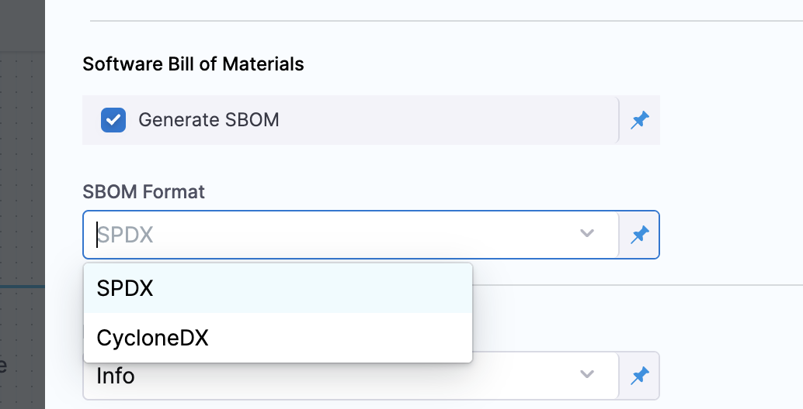
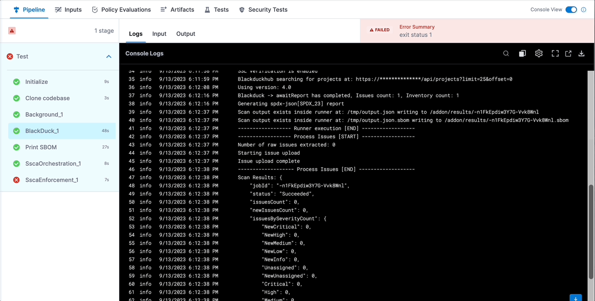
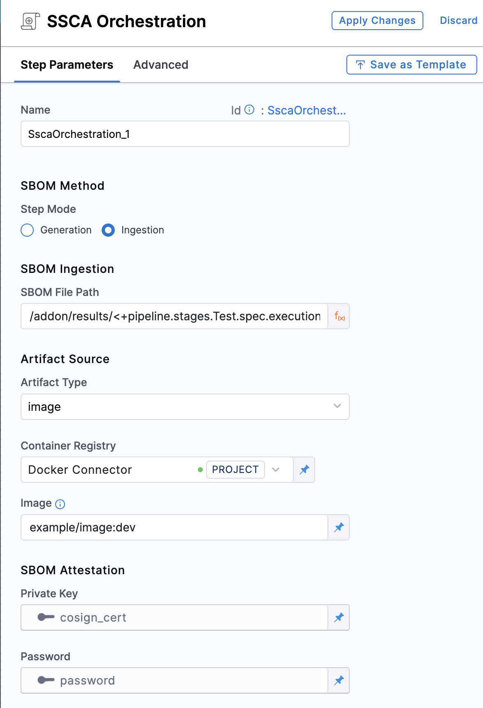

Harness SSCA can ingest SBOM generated from STO scanner steps, such as the [Blackduck STO step](/docs/security-testing-orchestration/sto-techref-category/black-duck-hub-scanner-reference.md), if the resulting SBOM is in JSON [SPDX](https://spdx.dev/learn/overview/) or [CycloneDx](https://cyclonedx.org/specification/overview/) format.

This topic explains how to configure a pipeline to ingest SBOM generated by a Blackduck STO scanner step.

You can also [generate SBOM using built-in SBOM tools](./generate-sbom.md) or [ingest SBOM from any SBOM tool](./ingest-sbom-data.md).

## Generate a key pair

Keys are used to sign and verify attestations.

1. Generate a public and private key pair. For example, you can use [Cosign](https://docs.sigstore.dev/key_management/signing_with_self-managed_keys/) to generate key pairs.
2. Create two [Harness file secrets](/docs/platform/secrets/add-file-secrets), one for the private key file and one for the public key file.
3. Create a [Harness text secret](/docs/platform/Secrets/add-use-text-secrets) to store the password for the private key.

## Configure the STO scan step to generate SBOM

Configure an STO scanner step, such as the [Blackduck STO step](/docs/security-testing-orchestration/sto-techref-category/black-duck-hub-scanner-reference.md), and make sure you select **Generate SBOM** and the **SBOM Format**.



## Get the SBOM file path

The Blackduck STO step creates a `JOB_ID` [output variable](/docs/continuous-integration/use-ci/run-ci-scripts/run-step-settings.md#output-variables) that you can use to reference the SBOM file path in the **SSCA Orchestration** step.

1. Replace `STAGE_ID` and `STEP_ID` in the following [Harness expression](/docs/platform/variables-and-expressions/runtime-inputs.md#expressions) with the stage ID and step ID for your Blackduck STO step.

   ```
   <+pipeline.stages.STAGE_ID.spec.execution.steps.STEP_ID.output.outputVariables.JOB_ID>
   ```

2. Use the expression in your SBOM file path. The exact path depends on where your scanner outputs SBOM files. For example, this filepath references a Blackduck STO step with the ID `myblackduckstep` in a stage with the ID `mybuildstage`:

   ```
   /addon/results/<+pipeline.stages.mybuildstage.spec.execution.steps.myblackduckstep.output.outputVariables.JOB_ID>.sbom
   ```

:::tip

Alternately, you can get the output path and output variable expression from a previous run of the same pipeline. To do this, go to the execution details page, select the stage with the STO scanner step, and then select the STO scanner step. In the step's logs, you can find the output path, and you can get the output variable from the **Output** tab.



:::

## Configure the SSCA Orchestration step

Add an [SSCA Orchestration step](./generate-sbom.md#add-the-ssca-orchestration-step) configured to ingest the SBOM.

* Set the **Step Mode** to **Ingestion**.
* For **SBOM File Path**, enter the SBOM file path that uses the `JOB_ID` value, as explained in [Get the SBOM file path](#get-the-sbom-file-path).
* For **Container Registry**, select the [Docker Registry connector](/docs/platform/Connectors/Cloud-providers/ref-cloud-providers/docker-registry-connector-settings-reference) that is configured for the Docker-compliant container registry where you stored the artifact associated with the SBOM, such as Docker Hub, Amazon ECR, or GCR.
* For **Image**, enter the repo path (in your container registry) and tag for the image associated with the SBOM, such as `my-docker-repo/my-artifact:latest`.
* **Private Key:** The [Harness file secret](/docs/platform/secrets/add-file-secrets) containing the private key to use to sign the attestation.
* **Password:** The [Harness text secret](/docs/platform/Secrets/add-use-text-secrets) containing the password for the private key.



:::info ECR and GCR repos

If you're using Docker-compliant ECR or GCR repositories, you must:

1. Configure your [Docker Registry connector](/docs/platform/Connectors/Cloud-providers/ref-cloud-providers/docker-registry-connector-settings-reference) as a valid [artifact source](/docs/continuous-delivery/x-platform-cd-features/services/artifact-sources).
   * For ECR, go to [Use Docker Registry for ECR](/docs/continuous-delivery/x-platform-cd-features/services/artifact-sources#amazon-elastic-container-registry-ecr).
   * For GCR, go to [Use Docker Registry for GCR](/docs/continuous-delivery/x-platform-cd-features/services/artifact-sources#google-container-registry-gcr)
2. Use the full URI for the **Image** in your **SSCA Orchestration** step, such as `1234567890.dkr.ecr.REGION.amazonaws.com/IMAGE_NAME:TAG`.

:::
