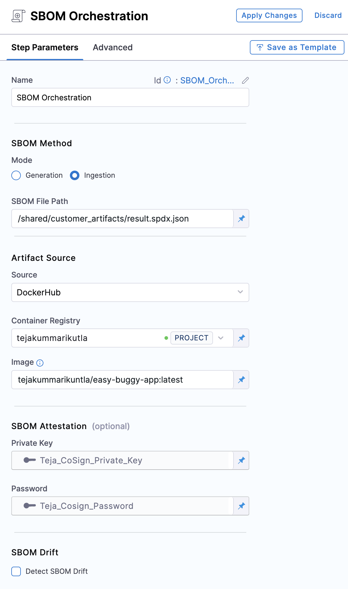
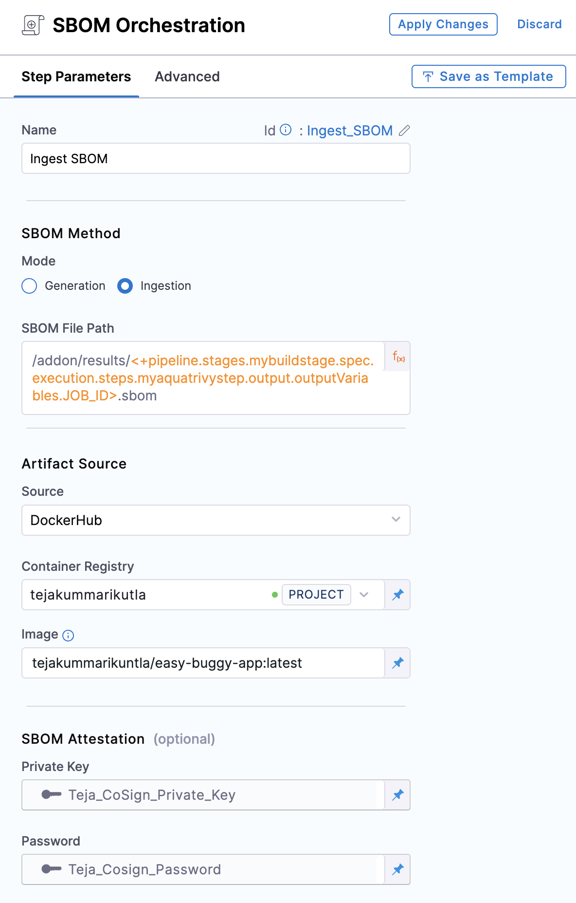

This workflow describes how to ingest Snyk scan results into a Harness pipeline. STO supports the following scan approaches for the following Snyk products:

- Snyk Container SBOM via an ingestion workflow
- Snyk Open Source SBOM via [STO Snyk step](docs/security-testing-orchestration/sto-techref-category/snyk/snyk-scans#snyk-repository-orchestration-example)


# Generating and ingesting a Snyk Container SBOM

A [Software Bill of Materials (SBOM)](https://cyclonedx.org/capabilities/sbom/) is a list of all the components, libraries, and other dependencies used in a software application. Harness SSCA can ingest [JSON SPDX](https://spdx.dev/learn/overview/) or [CycloneDx](https://cyclonedx.org/specification/overview/) formatted SBOM from any tool that can generate these report formats.

:::info

Use this configuration for scanners that don't have built-in support in SSCA. For scanners with built-in support, [use the SSCA Orchestration step to generate SBOM](./generate-sbom.md) or [configure your pipeline to ingest results from an STO scanner step](./generate-sbom-blackduck.md). For a list of all SSCA-supported scanners, go to [What's supported for STO](/docs/security-testing-orchestration/whats-supported).

:::

## Generate a key pair

Keys are used to sign and verify attestations.

1. Generate a public and private key pair. For example, you can use [Cosign](https://docs.sigstore.dev/key_management/signing_with_self-managed_keys/) to generate key pairs.
2. Create two [Harness file secrets](/docs/platform/secrets/add-file-secrets), one for the private key file and one for the public key file.
3. Create a [Harness text secret](/docs/platform/Secrets/add-use-text-secrets) to store the password for the private key.

## Configure your pipeline to ingest SBOM

1. In your Harness pipeline, go to the stage where you want to ingest the SBOM, and select the **Overview** tab.
2. In **Shared Paths**, enter a path to a location where your SBOM can be stored on the build machine, such as `/shared/customer_artifacts`.

   

3. Add a step to your stage that generates an SBOM, such as a **Run**, **Plugin**, or **GitHub Action** step.

   For example, this **Run** step uses [Synk](https://docs.snyk.io/snyk-cli/commands/container-sbom) to generate an SBOM.

   

   ```
   snyk container sbom --format=spdx2.3+json \
    ubuntu:22.04 > /shared/customer_artifacts/result.spdx.json
   ```

4. If your SBOM tool can't output directly to your **Shared Path**, then add commands or a **Run** step to copy the SBOM into the directory specified in **Shared Paths**.
5. Add an [SSCA Orchestration step](./generate-sbom.md#add-the-ssca-orchestration-step) configured to ingest the SBOM:
   * Set the **Step Mode** to **Ingestion**.
   * For **SBOM File Path**, enter the path to the SBOM file generated by your SBOM tool.
   * For **Container Registry**, select the [Docker Registry connector](/docs/platform/Connectors/Cloud-providers/ref-cloud-providers/docker-registry-connector-settings-reference) that is configured for the Docker-compliant container registry where you stored the artifact associated with the SBOM, such as Docker Hub, Amazon ECR, or GCR.
   * For **Image**, enter the repo path (in your container registry) and tag for the image associated with the SBOM, such as `my-docker-repo/my-artifact:latest`.
   * **Private Key:** The [Harness file secret](/docs/platform/secrets/add-file-secrets) containing the private key to use to sign the attestation.
   * **Password:** The [Harness text secret](/docs/platform/Secrets/add-use-text-secrets) containing the password for the private key.

   

:::info ECR and GCR repos

If you're using Docker-compliant ECR or GCR repositories, you must:

1. Configure your [Docker Registry connector](/docs/platform/Connectors/Cloud-providers/ref-cloud-providers/docker-registry-connector-settings-reference) as a valid [artifact source](/docs/continuous-delivery/x-platform-cd-features/services/artifact-sources).
   * For ECR, go to [Use Docker Registry for ECR](/docs/continuous-delivery/x-platform-cd-features/services/artifact-sources#amazon-elastic-container-registry-ecr).
   * For GCR, go to [Use Docker Registry for GCR](/docs/continuous-delivery/x-platform-cd-features/services/artifact-sources#google-container-registry-gcr)
2. Use the full URI for the **Image** in your **SSCA Orchestration** step, such as `1234567890.dkr.ecr.REGION.amazonaws.com/IMAGE_NAME:TAG`.

:::

## Generate and ingest a Snyk Open Source SBOM

Harness SSCA can ingest SBOM generated from STO scanner steps, such as the [Snyk STO step](/docs/security-testing-orchestration/sto-techref-category/snyk/snyk-scans#snyk-repository-orchestration-example), if the resulting SBOM is in JSON [SPDX](https://spdx.dev/learn/overview/) or [CycloneDx](https://cyclonedx.org/specification/overview/) format.

This topic explains how to configure a pipeline to ingest SBOM generated by an STO scanner step. It uses the Snyk STO step as an example.

You can also [generate SBOM using built-in SBOM tools](./generate-sbom.md) or [ingest SBOM from any SBOM tool](./ingest-sbom-data.md).

## Generate a key pair

Keys are used to sign and verify attestations.

1. Generate a public and private key pair. For example, you can use [Cosign](https://docs.sigstore.dev/key_management/signing_with_self-managed_keys/) to generate key pairs.
2. Create two [Harness file secrets](/docs/platform/secrets/add-file-secrets), one for the private key file and one for the public key file.
3. Create a [Harness text secret](/docs/platform/Secrets/add-use-text-secrets) to store the password for the private key.

## Configure the STO scan step to generate SBOM

Configure the [Snyk STO scanner step](/docs/security-testing-orchestration/sto-techref-category/snyk/snyk-scans#snyk-repository-orchestration-example), and make sure you select **Generate SBOM** and the **SBOM Format**.


## Get the SBOM file path

The Snyk STO step creates a `JOB_ID` [output variable](/docs/continuous-integration/use-ci/run-ci-scripts/run-step-settings.md#output-variables) that you can use to reference the SBOM file path in the **SSCA Orchestration** step.

1. Replace `STAGE_ID` and `STEP_ID` in the following [Harness expression](/docs/platform/variables-and-expressions/runtime-inputs.md#expressions) with the stage ID and step ID for your Snyk STO step.

   ```
   <+pipeline.stages.STAGE_ID.spec.execution.steps.STEP_ID.output.outputVariables.JOB_ID>
   ```

2. Use the expression in your SBOM file path. The exact path depends on where your scanner outputs SBOM files. For example, this filepath references a Snyk STO step with the ID `mysnykstep` in a stage with the ID `mybuildstage`:

   ```
   /addon/results/<+pipeline.stages.mybuildstage.spec.execution.steps.mysnykstep.output.outputVariables.JOB_ID>.sbom
   ```

:::tip

Alternately, you can get the output path and output variable expression from a previous run of the same pipeline. To do this, go to the execution details page, select the stage with the STO scanner step, and then select the STO scanner step. In the step's logs, you can find the output path, and you can get the output variable from the **Output** tab.


:::

## Configure the SSCA Orchestration step

Add an [SSCA Orchestration step](./generate-sbom.md#add-the-ssca-orchestration-step) configured to ingest the SBOM.

* Set the **Step Mode** to **Ingestion**.
* For **SBOM File Path**, enter the SBOM file path that uses the `JOB_ID` value, as explained in [Get the SBOM file path](#get-the-sbom-file-path).
* For **Container Registry**, select the [Docker Registry connector](/docs/platform/Connectors/Cloud-providers/ref-cloud-providers/docker-registry-connector-settings-reference) that is configured for the Docker-compliant container registry where you stored the artifact associated with the SBOM, such as Docker Hub, Amazon ECR, or GCR.
* For **Image**, enter the repo path (in your container registry) and tag for the image associated with the SBOM, such as `my-docker-repo/my-artifact:latest`.
* **Private Key:** The [Harness file secret](/docs/platform/secrets/add-file-secrets) containing the private key to use to sign the attestation.
* **Password:** The [Harness text secret](/docs/platform/Secrets/add-use-text-secrets) containing the password for the private key.



:::info ECR and GCR repos

If you're using Docker-compliant ECR or GCR repositories, you must:

1. Configure your [Docker Registry connector](/docs/platform/Connectors/Cloud-providers/ref-cloud-providers/docker-registry-connector-settings-reference) as a valid [artifact source](/docs/continuous-delivery/x-platform-cd-features/services/artifact-sources).
   * For ECR, go to [Use Docker Registry for ECR](/docs/continuous-delivery/x-platform-cd-features/services/artifact-sources#amazon-elastic-container-registry-ecr).
   * For GCR, go to [Use Docker Registry for GCR](/docs/continuous-delivery/x-platform-cd-features/services/artifact-sources#google-container-registry-gcr)
2. Use the full URI for the **Image** in your **SSCA Orchestration** step, such as `1234567890.dkr.ecr.REGION.amazonaws.com/IMAGE_NAME:TAG`.

:::
