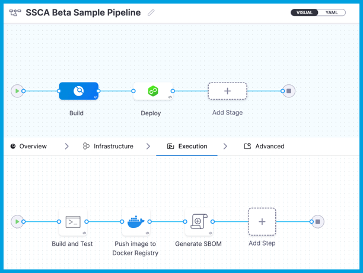
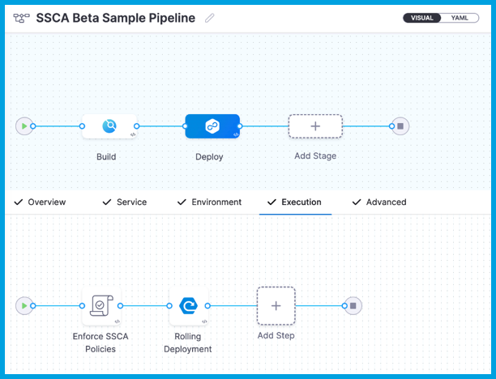

import Tabs from '@theme/Tabs';
import TabItem from '@theme/TabItem';

import SbomAbout from '/docs/software-supply-chain-assurance/shared/sbom-about.md';

<SbomAbout />

## Generate SBOM in Harness

These instructions describe how to generate SBOM with the Harness **SSCA Orchestration** step. This step uses Syft. For other SBOM tools, go to [Ingest SBOM](./ingest-sbom-data.md).

:::tip Tutorial

For a step-by-step walkthrough, try this tutorial: [Generate SBOM and enforce policies](/tutorials/secure-supply-chain/generate-sbom).

:::

### Prepare a pipeline

To generate SBOM in Harness, you need a pipeline with a [CI (build) stage](/docs/continuous-integration/use-ci/prep-ci-pipeline-components), a [CD (deploy) stage](/docs/continuous-delivery/get-started/key-concepts#stage), or both.

### Generate a key pair

Keys are used to sign and verify attestations.

1. Use [Cosign](https://docs.sigstore.dev/key_management/signing_with_self-managed_keys/) to generate a public and private key pair
2. Create two [Harness file secrets](/docs/platform/secrets/add-file-secrets), one for the private key file and one for the public key file.
3. Create a [Harness text secret](/docs/platform/Secrets/add-use-text-secrets) to store the password for the private key.

### Add the SSCA Orchestration step

Use the **SSCA Orchestration** step to generate an SBOM in either the **Build** or **Deploy** stage of a Harness pipeline.

* In a **Build** stage, add the **SSCA Orchestration** step after the artifact (image) has been pushed to an artifact repository.
* In a **Deploy** stage, add the **SSCA Orchestration** step before the deployment step.

:::info 

SSCA Orchestration and Enforcement steps in deploy stage can only be used in the [Containerized Step Groups](/docs/continuous-delivery/x-platform-cd-features/cd-steps/containerized-steps/containerized-step-groups.md)

:::

The **SSCA Orchestration** step includes various settings for generating the SBOM for both Containers and Repositories. We will delve into the different fields that need to be configured for each option to support the generation of the SBOM.

<Tabs>
  <TabItem value="container" label="Container" default>

* **Name:** Enter a name for the step.

* **Step Mode:** Select **Generation**.

* **SBOM Tool:** Select **Syft**, which is the tool Harness uses to generate the SBOM. For other SBOM tools, go to [Ingest SBOM](./ingest-sbom-data.md).

* **SBOM Format:** Select **SPDX** or **CycloneDX**.

* **Artifact Type:** Select **Container**.

* **Container Registry:** Select the [Docker Registry connector](/docs/platform/Connectors/Cloud-providers/ref-cloud-providers/docker-registry-connector-settings-reference) that is configured for the Docker-compliant container registry where the artifact is stored, such as Docker Hub, Amazon ECR, or GCR.

* **Image:** The repo path (in your container registry) and tag for the image for which you're generating an SBOM, such as `my-docker-repo/my-artifact:latest`.

* **Private Key:** The [Harness file secret](/docs/platform/secrets/add-file-secrets) containing the private key to use to sign the attestation.

* **Password:** The [Harness text secret](/docs/platform/Secrets/add-use-text-secrets) containing the password for the private key.

<!--  -->

<DocImage path={require('../static/container_sbom.png')} />

:::info ECR and GCR repos

If you're using Docker-compliant ECR or GCR repositories, you must:

1. Configure your [Docker Registry connector](/docs/platform/Connectors/Cloud-providers/ref-cloud-providers/docker-registry-connector-settings-reference) as a valid [artifact source](/docs/continuous-delivery/x-platform-cd-features/services/artifact-sources).
   * For ECR, go to [Use Docker Registry for ECR](/docs/continuous-delivery/x-platform-cd-features/services/artifact-sources#amazon-elastic-container-registry-ecr).
   * For GCR, go to [Use Docker Registry for GCR](/docs/continuous-delivery/x-platform-cd-features/services/artifact-sources#google-container-registry-gcr)
2. Use the full URI for the **Image** in your **SSCA Orchestration** step, such as `1234567890.dkr.ecr.REGION.amazonaws.com/IMAGE_NAME:TAG`.

:::

<!--  -->

</TabItem>
  <TabItem value="Repository" label="Repository">

* **Name:** Enter a name for the step.
* **Step Mode:** Select **Generation**.
* **SBOM Tool:** Select **Syft**, which is the tool Harness uses to generate the SBOM. For other SBOM tools, go to [Ingest SBOM](https://developer.harness.io/docs/software-supply-chain-assurance/sbom/ingest-sbom-data).
* **SBOM Format:** Select **SPDX** or **CycloneDX**.
* **Artifact Type:** Select **Repository**.

    :::info
    Selecting "Repository" requires setting up a process to clone your repository into the workspace. This setup can be achieved through various approaches, such as a [Git Clone step](https://developer.harness.io/docs/continuous-delivery/x-platform-cd-features/cd-steps/containerized-steps/git-clone-step/), a [Run step](https://developer.harness.io/docs/continuous-delivery/x-platform-cd-features/cd-steps/containerized-steps/run-step/), or during the stage creation process. It's essential that the SBOM Orchestration operates on the successfully cloned repository.
    :::
* **Repository URL:** The Repository URL you've configured for cloning into the workspace.
* **Source Path:** This field is designated for specifying the path within the codebase for which you aim to generate the SBOM. It enables the generation of an SBOM for particular sections of the code inside the repository. You should start the path with a '/'. For instance, if your repository URL is `https://github.com/username/repo` and you intend to generate an SBOM for a specific part of the repository found at `https://github.com/username/repo/service-core/source`, then you should input `/service-core/source` as the path.
* **Git Branch:** The branch of the repository for which you want to generate the SBOM.
* **Workspace:** If the cloned codebase is stored in a directory other than the default `/harness`, enter the path in the format `/harness/<path>`. If you have cloned into the default `/harness`, this field can be skipped.

<DocImage path={require('../static/repo_sbom.png')} />

<!--  -->

</TabItem>
</Tabs>

### Run the pipeline

When the pipeline runs, the **SSCA Orchestration** step performs the following actions:

- Generates an SBOM in the chosen format for both Containers and Repositories.
- Specifically for Containers:
  - Generates and signs an attestation using the provided key and password.
  - Stores the SBOM in Harness and uploads the `.att` file to your container registry to accompany the image.

The signed attestation for an Image, stored as an `.att` file, is placed in the artifact repository alongside the Image. 

SBOMs for both Containers and Code Repositories are accessible in the [Artifacts view](../artifact-view.md). Additionally, you can locate the SBOM for any artifact on the **Artifacts** tab within the **Execution Details** page in Harness. For detailed insights, including viewing attestations and identifying violations, please refer to the [View Attestations and Violations](../ssca-view-results.md) documentation.

:::tip

After generating an SBOM, you can use it to [enforce SSCA policies](../ssca-policies/enforce-ssca-policies.md).

:::
