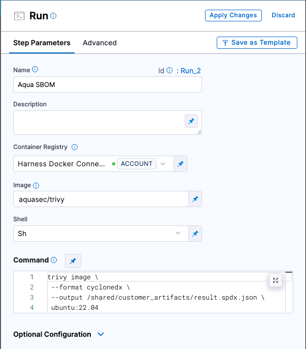
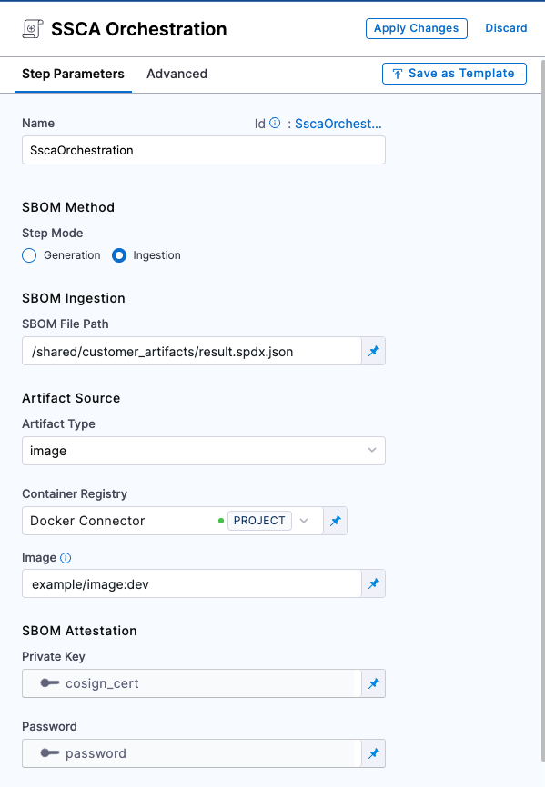

A [Software Bill of Materials (SBOM)](https://cyclonedx.org/capabilities/sbom/) is a list of all the components, libraries, and other dependencies used in a software application. Harness SSCA can ingest [JSON SPDX](https://spdx.dev/learn/overview/) or [CycloneDx](https://cyclonedx.org/specification/overview/) formatted SBOM from any tool that can generate these report formats.

:::info

Use this configuration for scanners that don't have built-in support in SSCA. For scanners with built-in support you can: 

* [Use the SSCA Orchestration step to generate SBOM.](./generate-sbom.md) 
* [Ingest results from a Blackduck STO scan step.](./generate-sbom-blackduck.md)
* [Ingest results from an Aqua Trivy STO scan step.](./generate-sbom-aqua-trivy.md)

For a list of all SSCA-supported scanners, go to [What's supported for STO](/docs/security-testing-orchestration/whats-supported).

:::

## Generate a key pair

Keys are used to sign and verify attestations.

1. Generate a public and private key pair. For example, you can use [Cosign](https://docs.sigstore.dev/key_management/signing_with_self-managed_keys/) to generate key pairs.
2. Create two [Harness file secrets](/docs/platform/secrets/add-file-secrets), one for the private key file and one for the public key file.
3. Create a [Harness text secret](/docs/platform/Secrets/add-use-text-secrets) to store the password for the private key.

## Configure your pipeline to ingest SBOM

1. In your Harness pipeline, go to the stage where you want to ingest the SBOM, and select the **Overview** tab.
2. In **Shared Paths**, enter a path to a location where your SBOM can be stored on the build machine, such as `/shared/customer_artifacts`.

   

3. Add a step to your stage that generates an SBOM, such as a **Run**, **Plugin**, or **GitHub Action** step.

   For example, this **Run** step uses [Aqua Trivy](https://aquasecurity.github.io/trivy/dev/docs/supply-chain/sbom/) to generate an SBOM.

   ```
    trivy image \
     --format spdx-json \
     --output /shared/customer_artifacts/result.spdx.json \
     ubuntu:22.04
   ```

   

   :::tip

   You can also configure pipelines to [ingest SBOM from STO scanner steps](./generate-sbom-blackduck.md).

   :::

4. If your SBOM tool can't output directly to your **Shared Path**, then add commands or a **Run** step to copy the SBOM into the directory specified in **Shared Paths**.
5. Add an [SSCA Orchestration step](./generate-sbom.md#add-the-ssca-orchestration-step) configured to ingest the SBOM:
   * Set the **Step Mode** to **Ingestion**.
   * For **SBOM File Path**, enter the path to the SBOM file generated by your SBOM tool.
   * For **Container Registry**, select the [Docker Registry connector](/docs/platform/Connectors/Cloud-providers/ref-cloud-providers/docker-registry-connector-settings-reference) that is configured for the Docker-compliant container registry where you stored the artifact associated with the SBOM, such as Docker Hub, Amazon ECR, or GCR.
   * For **Image**, enter the repo path (in your container registry) and tag for the image associated with the SBOM, such as `my-docker-repo/my-artifact:latest`.
   * **Private Key:** The [Harness file secret](/docs/platform/secrets/add-file-secrets) containing the private key to use to sign the attestation.
   * **Password:** The [Harness text secret](/docs/platform/Secrets/add-use-text-secrets) containing the password for the private key.

   

:::info ECR and GCR repos

If you're using Docker-compliant ECR or GCR repositories, you must:

1. Configure your [Docker Registry connector](/docs/platform/Connectors/Cloud-providers/ref-cloud-providers/docker-registry-connector-settings-reference) as a valid [artifact source](/docs/continuous-delivery/x-platform-cd-features/services/artifact-sources).
   * For ECR, go to [Use Docker Registry for ECR](/docs/continuous-delivery/x-platform-cd-features/services/artifact-sources#amazon-elastic-container-registry-ecr).
   * For GCR, go to [Use Docker Registry for GCR](/docs/continuous-delivery/x-platform-cd-features/services/artifact-sources#google-container-registry-gcr)
2. Use the full URI for the **Image** in your **SSCA Orchestration** step, such as `1234567890.dkr.ecr.REGION.amazonaws.com/IMAGE_NAME:TAG`.

:::
