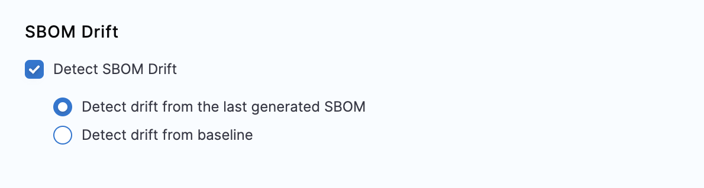
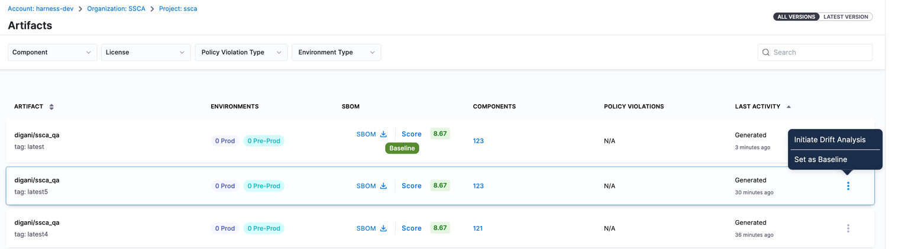
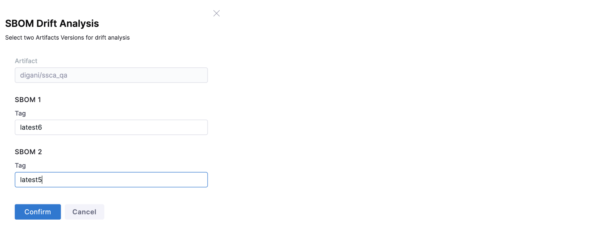
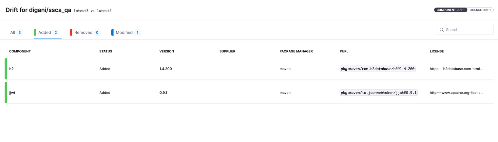
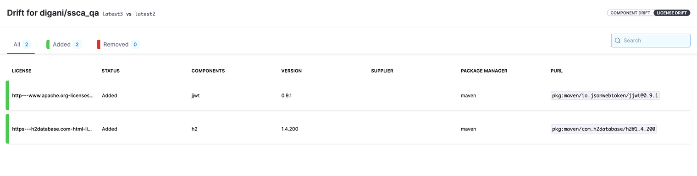

Harness SCS's SBOM Drift Detection feature is designed for detecting changes in Software Bill of Materials (SBOM) over a period of time. It provides a detailed analysis of the addition or removal of components and licenses, facilitating better management and oversight of software artifacts.

## Key Features of SBOM Drift

**Focus on Changes**: Tracks the addition and removal of components and licenses in SBOMs.

**Support for Images and Repositories**: Enables diff generation for SBOMs for both container images and code repositories.


## SBOM Drift Generation
### For Images
SBOM Drift for images can be generated in two ways:

**During Pipeline Execution:**

* Select the SBOM Drift option in the SBOM Orchestration step.


* Automatically compare the newly generated SBOM with a pre-existing baseline or the latest artifact tag




To set any artifact version as baseline, go to artifact view and click on three dots on the artifact version that you want to set as baseline for generating drift.


**Artifact View Comparison:**
* Manually select two versions of the same artifact within the Artifact View.

* Generate a drift to analyze changes between these versions.

 

Click on “Initiate Drift Analysis” in the three dots menu on the artifact version  




Select the 2nd tag of the same artifact and confirm to see the drift




### For Repositories

SBOM Drift for repositories is generated during pipeline execution:

* **Branch Comparison**: During pipeline execution, the SBOM Drift can compare the SBOM of the current branch against a specified target branch, such as 'main'.

* **Impact Analysis**: Understand how changes in the branch will affect the software post-merge.

 

 

## SBOM Drift View
You can view the generated SBOM Drift on the UI. There are two views

* Shows the added / removed / modified components

* Shows the added / removed licenses

 

**Component drift view:**




**License drift view:**




 

## Output Variables

SBOM drift generates the following output variables in the SBOM Orchestration step:

* **componentsAdded** - number of new components that got added to the SBOM

* **componentsDeleted** - number of existing components that got deleted in the SBOM

* **componentsModified** - number of components that got modified e.g. got upgraded to a latest version

* **licenseAdded** - number of new licenses that got introduced

* **licenseDeleted** - number of existing licenses that got deleted

 

You can use these variables to trigger an action such as manual review. For example, if a new license has been added, you may want to review it before approving the pipeline execution. For this you can add an approval stage and in the stage’s advanced configuration tab check for following in the Conditional Execution section

```
<+pipeline.stages.Build.spec.execution.steps.SscaOrchestration_1.artifact_SscaOrchestration_1.stepArtifacts.publishedSbomArtifacts[0].drift.licenseAdded> > 0

```

Note: Use the variable expression as applicable for your pipeline

 

 

## Benefits

**Effective Change Management:** Stay informed and manage changes in software components and licenses effectively.

**Proactive Risk Management:** Early detection and mitigation of risks associated with changes in SBOMs.

**Ensured Compliance:** Continuous monitoring and alignment with licensing and security policies.

 

 
