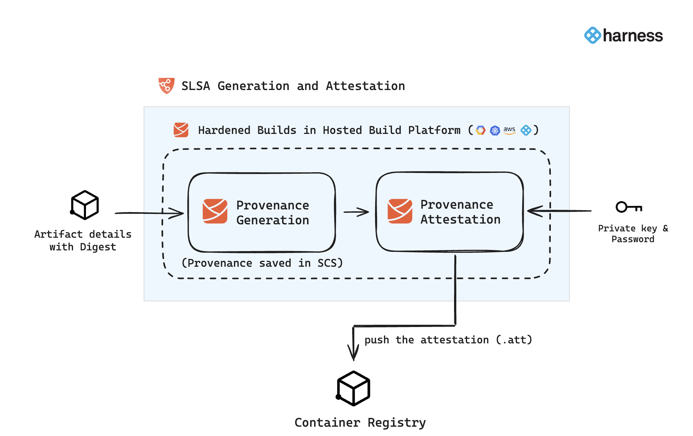

import CosignKeyGeneration from '/docs/software-supply-chain-assurance/shared/generate-cosign-key-pair.md';

## Introduction
Harness SCS when used along with Harness CI Hosted Builds([Harness Cloud](https://developer.harness.io/docs/continuous-integration/use-ci/set-up-build-infrastructure/use-harness-cloud-build-infrastructure/)), ensures that the resulting artifacts have **SLSA Level 3** provenance that every consumer (including the following deployment stage) can verify for artifact integrity prior to making use of this artifact. Build hardening for Level 3 compliance is achieved through: 

1. Built-in infrastructure isolation for every build where new infrastructure is created for every run and deleted after the run completes. 
2. OPA policy enforcement on CI stage templates with non-privileged, hosted containerized steps that do not use volume mounts. This disallows the build steps to access the provenance key information in compliance with SLSA specifications. 

End result is that hackers cannot do tampering during the build process. This capability when coupled with open source governance through [SBOM lifecycle management](https://developer.harness.io/docs/software-supply-chain-assurance/sbom/generate-sbom) provides the most advanced shift-left supply chain security solution in the market today.

In Harness SCS, when you configure your pipeline to generate and attest SLSA provenance, it performs this during the image build process as outlined in subsequent sections. This involves generating the provenance, attesting it with keys, and then pushing both the attestation and the image to the designated container registry.




<DocVideo src="https://youtu.be/shU2tbSoC1k?si=ZHftRb_gpnCHEtUi" />

### Use CI Build and Push steps

To generate the SLSA provenance and attestation, it's crucial to understand that this process is exclusive to the use of the Build and Push steps in Harness. This means provenance generation and attestation only occur when building your container images through these specific steps, Build and Push to [Docker](https://developer.harness.io/docs/continuous-integration/use-ci/build-and-upload-artifacts/build-and-push/build-and-push-to-docker-registry/), [ACE](https://developer.harness.io/docs/continuous-integration/use-ci/build-and-upload-artifacts/build-and-push/build-and-push-to-acr/), [GCR](https://developer.harness.io/docs/continuous-integration/use-ci/build-and-upload-artifacts/build-and-push/build-and-push-to-gcr/), and [ECR](https://developer.harness.io/docs/continuous-integration/use-ci/build-and-upload-artifacts/build-and-push/build-and-push-to-ecr-step-settings/). You can use these steps in the execution tab for building your image.


<DocImage path={require('./static/build-push-steps.png')} width="70%" height="70%" />


:::info

* Harness will extend SLSA provenance generation support to additional build and push steps in the near future.
* You can also verify the SLSA provenance in the Build stage.

:::


## Generate SLSA Provenance

In you Harness pipeline, navigate to the **Overview tab** in your Build stage and enable the "Generate SLSA Provenance" option. This will ensure to generate the provenance describing how the artifact was built, including the build platform, build process, and top-level inputs.

<DocImage path={require('./static/enable-slsa.png')} width="70%" height="70%" />

## Attest the SLSA Provenance
After enabling the "Generate SLSA Provenance" option, you can provide the private key and password to generate the provenance attestation, you can use [Cosign](https://docs.sigstore.dev/key_management/signing_with_self-managed_keys/) to generate keys and [Harness Secret Manager](https://developer.harness.io/docs/category/secrets-management) to save. here’s how you can generate the keys using Cosign

<details>
<summary>Generate key pairs using Cosign for SLSA provenance attestation</summary>

<CosignKeyGeneration />

</details>

<DocImage path={require('./static/attest-slsa.png')} width="70%" height="70%" />


## Run the pipeline

When you run a pipeline with SLSA generation enabled, Harness SCS:

* Generates an SLSA Provenance for the image created by the Build and Push steps in the Build stage.
* Generates and signs an attestation using the provided key and password.
* Stores the SLSA Provenance in Harness and uploads the `.att` file to your container registry alongside the image.

The signed attestation is stored, as an .att file, in the artifact repository along with the image. You can also find the SLSA Provenance on the **Supply Chain** tab on the Execution details page in Harness. For more information, go to [view pipeline execution results](https://developer.harness.io/docs/software-supply-chain-assurance/ssca-view-results).


## Provenance example

Here's an example of an SLSA Provenance generated by Harness SCS. The information in your SLSA Provenance might vary depending on your build and changes to the provenance structure applied in SCS updates. Identifiers, repo names, and other details in this example are anonymized or truncated.

```json
// Predicate:
{
  "predicateType": "https://slsa.dev/provenance/v1",
  "predicate": {
    "buildDefinition": {
      "buildType": "https://...",
      "externalParameters": {
        "codeMetadata": {
          "repositoryURL": "https://github.com/ORG_NAME/REPO_NAME.git",
          "branch": "main",
          "commitSha": "ff...c4a"
        },
        "triggerMetadata": {
          "triggerType": "MANUAL",
          "triggeredBy": "firstName lastName"
        },
        "buildMetadata": {
          "image": "DOCKER-ACCOUNT/IMAGE-NAME"
        }
      },
      "internalParameters": {
        "pipelineExecutionId": "BUILD-ID",
        "accountId": "HARNESS-ACCOUNT-ID",
        "pipelineIdentifier": "PIPELINE-ID"
      }
    },
    "runDetails": {
      "builder": {
        "id": "https://...",
        "version": {
          "ci-manager": "1.0.5801-000",
          "plugins/kaniko": "1.7.5"
        }
      },
      "runDetailsMetadata": {
        "invocationId": "P2...Q",
        "startedOn": "2023-09-15T08:17:49.673Z",
        "finishedOn": "2023-09-15T08:19:47.590Z"
      }
    }
  }
}
```

## Verify SLSA Provenance

After generating SLSA Provenance, you can [configure your pipeline to verify SLSA Provenance](./verify-slsa.md).
