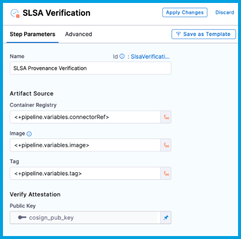
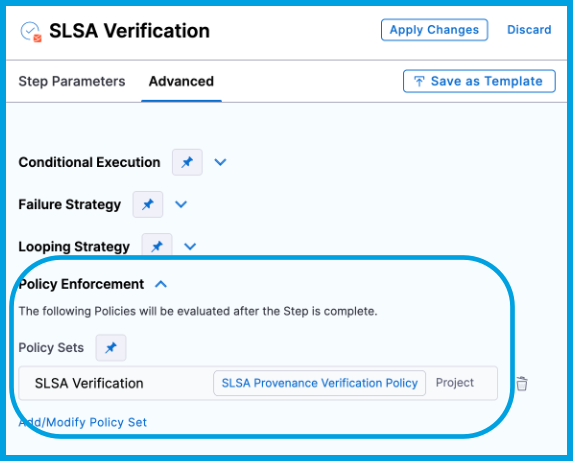

You can use Harness SSCA to verify SLSA Provenance and confirm that you can trust an artifact before deployment. You can also use SSCA to [generate SLSA Provenance](./generate-slsa.md).

:::tip Tutorial

For a step-by-step walkthrough, try this tutorial: [Generate and verify SLSA Provenance](/tutorials/secure-supply-chain/generate-slsa).

:::

## Prepare a pipeline

To verify SLSA Provenance in Harness, you need a pipeline with a [CD (deploy) stage](/docs/continuous-delivery/get-started/key-concepts#stage).

## Get the public key

Keys are used to sign and verify provenance.

Create a [Harness file secret](/docs/platform/secrets/add-file-secrets) containing the public key file that corresponds with the private key file that was used to sign and attest the provenance.

For example, if your pipeline includes [provenance generation](./generate-slsa.md), then you need to use the public key that corresponds to the private key you used for provenance generation.

## Create SLSA policies

You must create a set of OPA policies that you want Harness SSCA to use for SLSA Provenance verification. You can create a dedicated SLSA Provenance verification policy set or use existing policy sets that you've already created. For more information about creating policies in Harness, go to the [Harness Policy As Code overview](/docs/platform/Governance/Policy-as-code/harness-governance-overview).

:::info

OPA polices used for SLSA Provenance verification are different from [SSCA policies](/docs/software-supply-chain-assurance/ssca-policies/create-ssca-policies) used for SSCA policy enforcement.

:::

1. In your Harness Project, under **Project Setup**, go to **Policies**. You can also create policies at the Account and Org scopes.
2. Select **Policies**, and then [create policies](/docs/platform/Governance/Policy-as-code/harness-governance-quickstart#create-the-policy) for the individual rules that you want to enforce. You can select from the policy library or write your own policies.
3. [Create policy sets](/docs/platform/Governance/Policy-as-code/harness-governance-quickstart#step-3-create-a-policy-set) to group related policies. You must have at least one policy set.

### SLSA policy example

Here's an example of an OPA policy that could be used to verify an [SLSA Provenance generated in Harness](./generate-slsa.md). If you are verifying provenance from a third-party build system provider, make sure your OPA policies reflect the provenance structure used by that build system provider. Different providers might use different SLSA Provenance structures.

```
package slsa

# Build repo must be 'https://github.com/abc/abc-sample'. SLSA verification fails if a different repo is detected.
deny[msg]{
  input[0].outcome.stepArtifacts.provenanceArtifacts[0].predicate.buildDefinition.externalParameters.codeMetadata.repositoryURL != "https://github.com/abc/abc-sample"
  msg := "Repository verification failed in Provenance"  
}

# Build branch must be 'main'. SLSA verification fails if a different branch is detected.
deny[msg]{
  input[0].outcome.stepArtifacts.provenanceArtifacts[0].predicate.buildDefinition.externalParameters.codeMetadata.branch != "main"
  msg := "Branch verification failed in provenance"  
}
```

## Add the SLSA Verification step

Use the **SLSA Verification** step in a **Deploy** stage to verify provenance. This is a container step that must be inside a [container group](/docs/continuous-delivery/x-platform-cd-features/cd-steps/containerized-steps/containerized-step-groups).

### Configure SLSA Verification step settings

The **SLSA Verification** step has the following settings:

* **Name:** Enter a name for the step.
* **Container Registry:** Select the [Docker Registry connector](/docs/platform/Connectors/Cloud-providers/ref-cloud-providers/docker-registry-connector-settings-reference) that is configured for the Docker-compliant container registry where the artifact is stored, such as Docker Hub, Amazon ECR, or GCR.
* **Image:** Enter the repo path (in your container registry) for the image that you want to verify, such as `my-docker-repo/my-artifact`.
* **Tag:** Enter the tag for the image, such as `latest`.
* **Public Key:** Select the [Harness file secret](/docs/platform/secrets/add-file-secrets) containing the [public key](#get-the-public-key) to use to verify the authenticity of the attestation.

<!--  -->

<docimage path={require('./static/slsa-verify-step-basic.png')} />

:::info ECR and GCR repos

If you're using Docker-compliant ECR or GCR repositories, you must:

1. Configure your [Docker Registry connector](/docs/platform/Connectors/Cloud-providers/ref-cloud-providers/docker-registry-connector-settings-reference) as a valid [artifact source](/docs/continuous-delivery/x-platform-cd-features/services/artifact-sources).
   * For ECR, go to [Use Docker Registry for ECR](/docs/continuous-delivery/x-platform-cd-features/services/artifact-sources#amazon-elastic-container-registry-ecr).
   * For GCR, go to [Use Docker Registry for GCR](/docs/continuous-delivery/x-platform-cd-features/services/artifact-sources#google-container-registry-gcr)
2. Use the full URI for the **Image** in your **SSCA Orchestration** step, such as `1234567890.dkr.ecr.REGION.amazonaws.com/IMAGE_NAME:TAG`.

:::

### Select SLSA policies to enforce

On the **Advanced** tab for the **SLSA Verification** step, expand the **Policy Enforcement** section, and then add your SLSA Provenance verification [OPA policies](#create-slsa-policies).

<!--  -->

<docimage path={require('./static/slsa-verify-step-adv.png')} />

## Run the pipeline

When the pipeline runs, the **SLSA Verification** step does the following:

* Verifies the authenticity of the attestation.
* Verifies the provenance data by applying the specified policy set.
* Records the policy evaluation results in the step's logs.
* Reports the overall pass/fail for SLSA verification on the **Artifacts** tab.

For more information about inspecting SLSA verification results, go to [View attestations and violations](../ssca-view-results.md).

## Verify provenance from third-party build systems

You can use Harness SSCA to verify provenance generated by third-party build systems.

To do this:

1. [Get the public key](#get-the-public-key).
2. [Create SLSA policies](#create-slsa-policies) that verify the provenance data according to the provenance structure used by in the build system provider.
3. [Add the SLSA Verification step](#add-the-slsa-verification-step).
