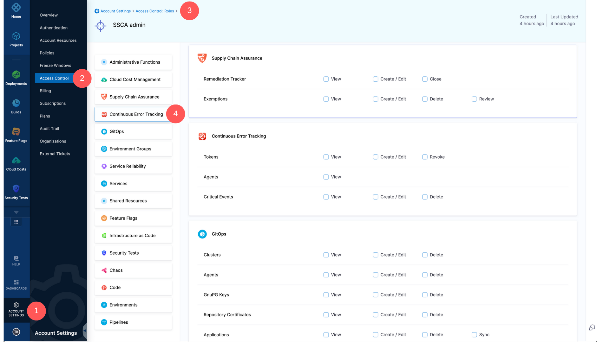

# Manage SCS Access Control

Harness's RBAC system enables you to precisely manage the user access to specific features or resources and the scope of actions they are permitted to perform. To delve deeper into the specifics of RBAC within Harness, refer to the documentation on [Role-based Access Control (RBAC)](https://developer.harness.io/docs/platform/role-based-access-control/rbac-in-harness/).

## RBAC for Remediation Tracker

The configuration of RBAC for the Remediation Tracker is possible at three levels: Account, Organization, and Project.

### Creating and Managing Roles

Here's a guide to creating a role or managing permissions for the Remediation Tracker at the account level:

1. Navigate to **Account Settings** > **Access Control** > **Roles** within your Harness Account.
2. Add a new role or select an existing one to modify.
3. Within the role, select Supply Chain Security. This action will display the SCS Permissions.

The Remediation Tracker is governed by the following permissions:

* **View**: Grants users the ability to view trackers in a read-only mode.
* **Create/Edit**: Enables users to create new trackers and edit existing ones.
* **Close:** Allows users to close any trackers.

For the Organization level, open the same account settings and proceed to **Organizations**. Choose your organization and under **Organization Level Access Control and Audit Trail**, select **Access Control**. Here, configure the roles and permissions at the organization level in a manner similar to the account level process.

To set roles and permissions at the Project level, navigate to the **Project** section from the module navigation bar, and select **Access Control**. Follow similar steps as above to establish the roles and permissions for the project level.

### Creating and Managing Resource Groups

Here's how you can create and manage resource groups for the remediation tracker at the account level. Additionally,  you can refer to [Manage Resource Groups](https://developer.harness.io/docs/platform/role-based-access-control/add-resource-groups/) document to learn more.

1. Navigate to **Account Settings** > **Access Control** > **Resource groups** within your Harness Account.
2. Add a new resource group or select an existing one to modify.
3. Set the "Resource Scope" accordinlgy if you are creating one.
4. Within the Resources, select Supply Chain Assurance.

For configuring at both the organization and project levels, the navigation process is similar to what was detailed in the previous section.