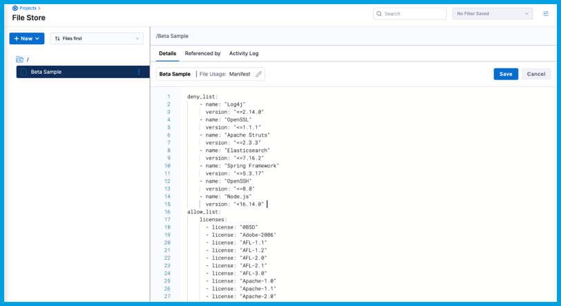

With Harness SSCA, you can [define](./define-ssca-policies.md) and [enforce](./enforce-ssca-policies.md) policies governing the use of open-source components within your software artifacts. This policy management and enforcement capability helps you ensure compliance with your security, legal, and operational requirements.

You must create an [OPA policy set](/docs/continuous-delivery/x-platform-cd-features/advanced/cd-governance/harness-governance-overview/) containing rules that you want Harness SSCA to enforce. When you enforce SSCA policies in a Harness pipeline, the policy rules are evaluated against each component in the artifact's SBOM.

You can define OPA policy sets at project, org, and account levels. A typical SBOM policy set has three sections:

* `deny_list`: Rules for denying the use of components based on specified criteria.
* `allow_list`: Rules for allowed licenses, suppliers, and PURLs.
* `Enforcement Logic`: Don't edit this part. It provides policy examples and logic that ensures your policies are consistently enforced.

:::warning

When writing SBOM OPA policies, select one of the sample policies from the Policy library and change *only* the `deny_list` and `allow_list` sections according to the rules you want to enforce.

**Do not** change anything below `#### DO NOT CHANGE THE FOLLOWING SCRIPT ####`. The content below this comment line is required to consistently enforce your SBOM OPA policy rules.

:::

When creating a policy set for SBOM, set the **Entity Type** to **SBOM**.

<!--  -->

<DocImage path={require('./static/sbom-opa-policy-set.png')} />

For more information about writing SBOM OPA policies, go to [Write policy definitions](./define-ssca-policies.md).
