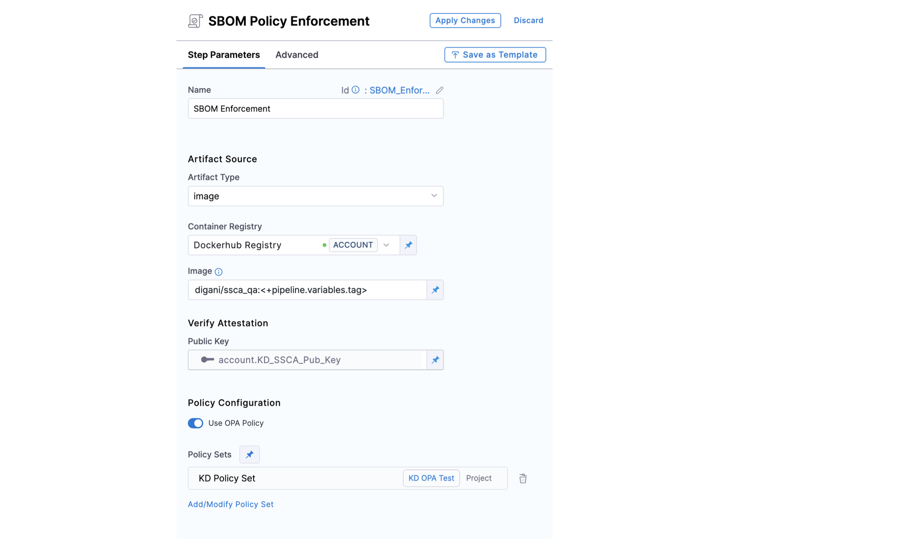

Enforce SSCA policies in the CI and CD stages of your Harness pipelines to ensure that your artifacts only contain approved components.

:::tip Tutorial

For an end-to-end walkthrough, try this tutorial: [Generate SBOM and enforce policies](/tutorials/secure-supply-chain/generate-sbom).

:::

## Requirements

To enforce SSCA policies in a Harness pipeline, you need:

* A pipeline that includes [SBOM generation](../generate-sbom.md).
* An [SSCA policy file](./create-ssca-policies.md).
* A [Harness file secret](/docs/platform/secrets/add-file-secrets) containing the public key from the [key pair used to sign and attest the SBOM](../generate-sbom.md#generate-a-key-pair).

## Add an SSCA Enforcement step

You can add the **SSCA Enforcement** step to either the **Build** or **Deploy** stage of a Harness pipeline.

* In a **Build** stage, add the **SSCA Enforcement** step after the artifact (image) has been pushed to an artifact repository.
* In a **Deploy** stage, add the **SSCA Enforcement** step before the deployment step.

The **SSCA Enforcement** step has the following settings:

* **Name:** Enter a name for the step.
* **Artifact Type:** Select **Image**.
* **Container Registry:** Select the [Docker Registry connector](/docs/platform/Connectors/Cloud-providers/ref-cloud-providers/docker-registry-connector-settings-reference) that is configured for the Docker-compliant container registry where your artifact is stored, such as Docker Hub, Amazon ECR, or GCR.
* **Image:** Enter the repo path (in your container registry) and tag for the relevant image, such as `my-docker-repo/my-artifact:latest`.
* **Public Key:** Select the [Harness file secret](/docs/platform/secrets/add-file-secrets) containing the public key to use to verify the authenticity of the attestation.
* **File Path:** Provide the path to your [SSCA policy file](./create-ssca-policies.md).

<!--  -->

<docimage path={require('./static/policy-ssca-enforce-step.png')} />

:::info ECR and GCR repos

If you're using Docker-compliant ECR or GCR repositories, you must:

1. Configure your [Docker Registry connector](/docs/platform/Connectors/Cloud-providers/ref-cloud-providers/docker-registry-connector-settings-reference) as a valid [artifact source](/docs/continuous-delivery/x-platform-cd-features/services/artifact-sources).
   * For ECR, go to [Use Docker Registry for ECR](/docs/continuous-delivery/x-platform-cd-features/services/artifact-sources#amazon-elastic-container-registry-ecr).
   * For GCR, go to [Use Docker Registry for GCR](/docs/continuous-delivery/x-platform-cd-features/services/artifact-sources#google-container-registry-gcr).
2. Use the full URI for the **Image** in your **SSCA Orchestration** step, such as `1234567890.dkr.ecr.REGION.amazonaws.com/IMAGE_NAME:TAG`.

:::

## Run the pipeline

When the pipeline runs, the **SSCA Enforcement** step does the following:

* Verifies the authenticity of the attestation.
* Applies policies defined in the specified policy file.
* Records policy violations and shows them on the **Artifacts** tab on the **Execution details** page.

SSCA evaluates the components described in the artifact's SBOM against your [policy definitions](./define-ssca-policies.md). For a component to pass the evaluation, it must meet these conditions:

* The component *must not* be denied based on the rules in the `deny_list`.
* The component *must* be allowed based on the rules in the `allow_list`.
* If the `allow_list` has multiple sections, the component must be allowed by *all* sections. For example, if the `allow_list` has `licenses` and `suppliers` sections, then the component's license must be allowed according to the `licenses` section, and the component's supplier must be allowed according to the `suppliers` section. If the component fails to pass either section, the policy evaluation fails for that component.

All components must meet the conditions described in *both* the `allow_list` and `deny_list` to fully pass the policy evaluation.

You can review policy violations on the **Execution details** page in Harness. For more information, go to [View attestations and violations](../ssca-view-results.md).
