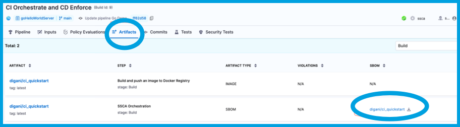

The SBOM, SLSA Provenance, policy enforcement results, and attestations generated by SSCA are stored in Harness or your container registry. This topic explains where to find these files.

## Attestations

When an SBOM or SLSA Provenance is generated along with a signed attestation in a Harness pipeline run, the signed attestation is stored, as an `.att` file, in the artifact repository along with the image.

<!--  -->

<docimage path={require('./static/view-result-att-in-docker-hub.png')} />

## SBOM and SLSA Provenance

On the **Execution details** page in Harness, you can view and download the SBOM or SLSA Provenance from the **SBOM** or **SLSA** columns on the **Artifacts** tab.

<!--  -->

<docimage path={require('./static/view-result-sbom-artifact.png')} />

:::tip

If your pipeline has multiple stages, the **Artifacts** tab is filtered by stage. Use the dropdown menu to select the relevant stage.

:::

## Policy violations

If your pipeline included an **SSCA Enforcement** step, you can see the number of policy violations in the **Violations** column on the **Artifacts** tab.

<!--  -->

<docimage path={require('./static/view-result-policy-violations.png')} />

Select the number to inspect the details of the violations.

<!--  -->

<docimage path={require('./static/view-result-policy-violations-detail.png')} />

:::tip

If your pipeline has multiple stages, the **Artifacts** tab is filtered by stage. Use the dropdown menu to select the relevant stage.

:::
