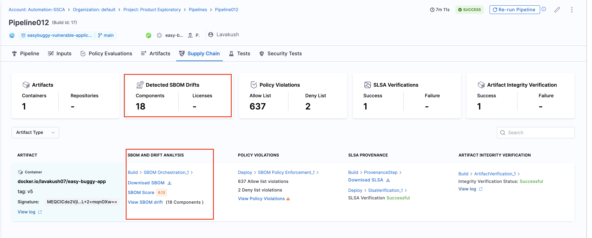
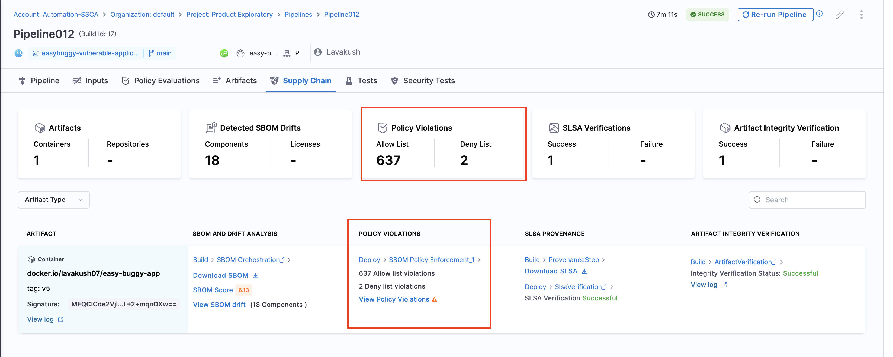
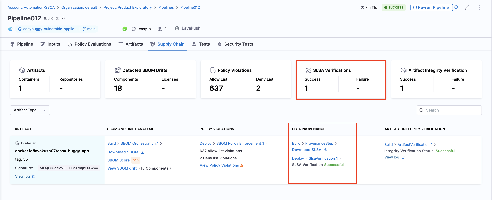
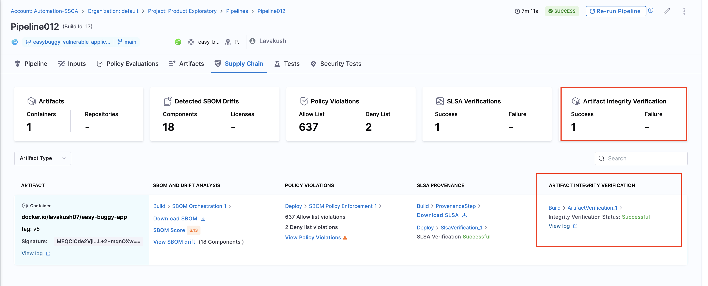

Upon the completion of your pipeline execution, the outcomes derived from the SCS steps are displayed in the "Software Supply Chain" tab within the pipeline execution window. This tab offers a comprehensive overview and serves as a centralized location to view the results from every stage of your pipeline at the artifact/repository level. In this tab, you can:

* Get your SBOM
* View the SBOM Score
* Analyze SBOM Drift
* View SBOM Policy violations
* Download your SLSA Provenance
* Check the SLSA verification status
* Check the Signed Artifact verification status

<DocImage path={require('./static/execution-results.png')} width="100%" height="80%" />

## View SBOM and Drift analysis

The **SBOM Orchestration step** in your pipeline leads to the creation of the SBOM and drift analysis report. You can view these details specific to your artifact or repository in the Supply Chain tab. Additionally, this tab provides an overview of the total number of components and licenses detected from your SBOM drift report.

## View policy violations

The policy violations arising from the **SBOM Policy Enforcement step** in your pipeline are accessible under  the "Policy Violations" section of the artifact list. Also, the Policy Violations card in the overview displays a cumulative count of all the allow list and deny list items across all artifacts.

## View SLSA Provenance and verification status

Under the **SLSA Provenance** section, you can download your SLSA provenance and find the status of the **SLSA verification step**. The overview section presents a cumulative count of all Success and failure cases.

## View Signed Artifact verification status

Under the **Artifact Integrity Verification section**, you can find the status of the **Artifact verification step** and the link to view the logs. The overview section presents a cumulative count of all Success and failure cases.

