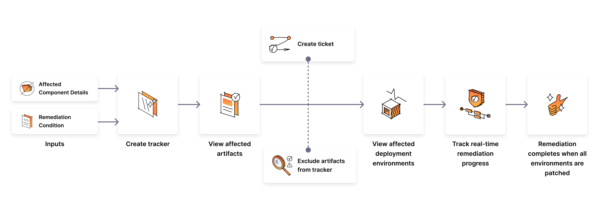

# Remediation Tracker

## Overview
Organizations often grapple with the urgent need to respond to zero-day exploits swiftly. The ever-expanding complexity of codebases, coupled with the prevalence of indirect dependencies, poses a significant challenge. When a zero-day vulnerability emerges, organizations may find it challenging to promptly identify and remediate affected artifacts, potentially leaving their software exposed to security threats.

The Remediation Tracker emerges as a vital solution within the Supply Chain Security(SCS) module in Harness. This tool equips organizations with the means to proactively tackle zero-day vulnerabilities by providing a centralized platform for tracking vulnerable artifacts. It enables monitoring across deployed artifacts, environments, and pipelines, empowering organizations to respond effectively and minimize the risk posed by zero-day exploits.

## Key features

### View affected artifacts

The Remediation Tracker simplifies the process of monitoring vulnerable components in software deployments. It takes component data and remediation conditions as inputs, scans through all deployed artifacts, identifies those utilizing the specified component, and generates a detailed list of all impacted artifacts.

### View artifact deployment environments

Upon listing the artifacts, the tracker offers detailed insights into their deployments and environments. You can see where each artifact is deployed, including in both 'prod' (production) and 'pre-prod' (pre-production) environments. Additionally, it displays the specific pipeline details that were used for the deployment purpose. This feature is instrumental in understanding the extent and impact of vulnerabilities across various deployment environments.

### Exclude artifacts from the tracker

This feature allows the selective exclusion of artifacts from the remediation process. It offers control, enabling you to make choices about which artifacts need remediation and which can be safely excluded, ensuring alignment with specific requirements and priorities.

### Create tickets

The tracker seamlessly integrates with project management software like Jira, offering the capability to create and assign tickets directly within the tracker. These tickets can be generated for the tracker overall, or be specific to each individual artifact. This integration enables effective collaboration among teams and ensures accurate tracking of the remediation process.

### Track real-time Remediation Progress

The tracker effectively oversees the remediation progress across all artifacts by keeping track of all deployments and clearly indicating the ongoing status of environments, whether pending or remediated. It provides a real-time and up-to-date count of the total number of impacted artifacts and environments. This comprehensive overview ensures you always have accurate and updated information.

### Remediation completes when all environments are patched

Offering real-time tracking, the tracker consistently updates its status, showing the number of deployments needing patching alongside those already remediated. When it identifies that all pending deployments associated with every artifact in the tracker have been patched, it automatically updates its status to 'closed.' For more flexibility, there's also an option to manually close the tracker when necessary.

With these features, the SCS Remediation Tracker provides essential tools and information for promptly identifying affected artifacts and taking decisive action to mitigate potential security threats, enhancing software supply chain security.

## Next Steps

* [Create and Manage a Remediation tracker](./create-remediation-tracker)
* [Track Remediation Progress](./track-remediation-progress)