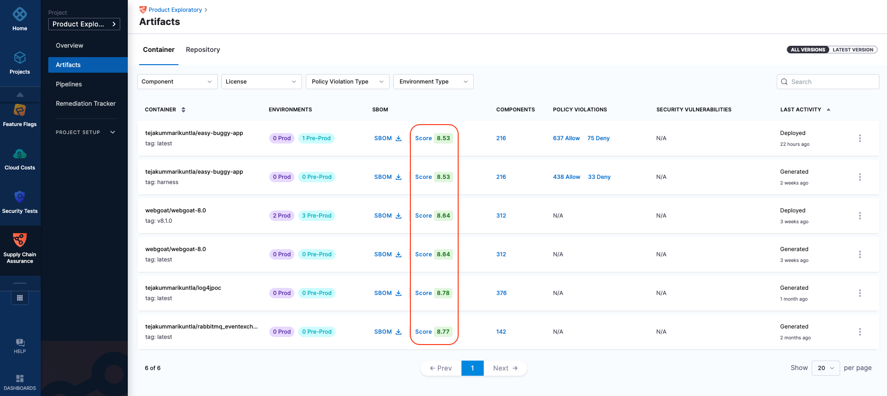
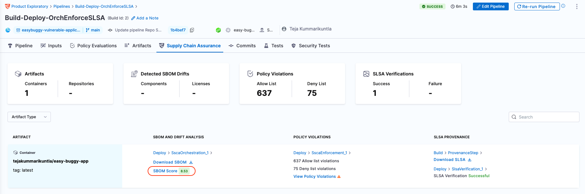

You can see the quality score of every SBOM that’s generated by SCS module. This feature evaluates the quality of the Software Bill of Materials (SBOM) in various categories, utilizing a scoring system ranging from 0 to 10.

## Scoring Criteria

The SBOM Quality Score is calculated based on the following categories:

**NTIA-Minimum-Elements**: Assesses compliance with NTIA minimum element guidelines.

**Structural**: Checks adherence to underlying specifications of SPDX or CycloneDX.

**Semantic**: Evaluates the correctness of SBOM field meanings specific to their standard.

**Quality**: Determines the overall data quality present in the SBOM.

**Sharing**: Assesses the SBOM's readiness for sharing.

Each category contributes to an overall score reflecting the SBOM's quality, compliance, and readiness for sharing.

## How It Works

**SBOM Generation**: Upon generating an SBOM in SCS, it undergoes quality scoring.

**Scoring Process**: The [sbomqs](https://github.com/interlynk-io/sbomqs/) tool evaluates the SBOM across the defined categories.

**Score Display**: The final score, ranging from 0 to 10, is displayed alongside the SBOM details within SCS.

## Viewing the Score
You can view the scores of all generated SBOMs from the **Artifacts view**. Additionally, the score of an SBOMs generated from a specific pipeline execution can be found in the **Supply Chain** tab within the pipeline execution window.

### Artifact view in SCS
Go to SCS module, and navigate to [Artifacts](../artifact-view.md) section.
You can view the score alongside the SBOM under the SBOM column.

By clicking on the score, you see the complete breakdown of scores in various categories. You can expand each category to see the score of individual items

### Supply Chain Tab 
The scores of the SBOM for a specific pipeline execution can be found in the **Supply Chain** tab within the pipeline execution window.

## Score Interpretation

**Score Range**: 0 (lowest) to 10 (highest).

**Higher Scores**: Indicate better quality, compliance, and readiness for sharing.

**Lower Scores**: Suggest areas for improvement or further investigation.

For more detailed information on the scoring criteria, please visit the [sbomqs GitHub repository](https://github.com/interlynk-io/sbomqs/).