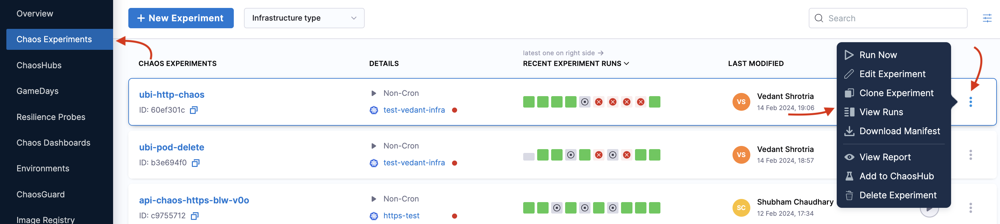
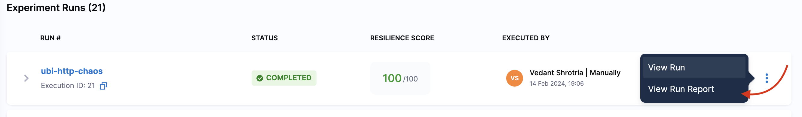

---
title: Troubleshooting guide 
description: Solutions to common pain points.
sidebar_position: 1
--- 

This section walks you through some common pain points and their workarounds.

## Memory stress fault stressng flag usage

When a memory stress fault (such as [Linux memory stress](/docs/chaos-engineering/technical-reference/chaos-faults/linux/linux-memory-stress) or [Linux CPU stress](/docs/chaos-engineering/technical-reference/chaos-faults/linux/linux-cpu-stress)) is executed, the fault utilises all of the available resources in the target system, thereby simulating an out of memory scenario. 
You can use another fault parameter, `stressNGFlags` to provide flexibility in the parameters passed to the VM.

### Workaround

The `stressNGFlags` can be used in the following manner:

[embedmd]:# (./static/manifests/stressng-flag.yaml yaml)

```yaml
apiVersion: litmuschaos.io/v1alpha1
kind: LinuxChaosExperiment
metadata:
  name: linux-memory-stress-dev
  labels:
    experimentID: "f7e4a412-74ef-4a0a-9b94-d894afb24be9"
    experimentRunID: "9caeb3ca-b6f3-4e82-b96b-97d57428ef59"
    context: linux-memory-stress
    name: linux-memory-stress-dev
spec:
  experimentId: "f7e4a412-74ef-4a0a-9b94-d894afb24be9"
  experimentRunId: "9caeb3ca-b6f3-4e82-b96b-97d57428ef59"
  cleanupPolicy: retain
  steps:
  - - name: task-1
  tasks:
  - name: task-1
    taskType: "chaos"
    weight: 10
    chaosInfra: "b8d4e0e6-e883-48ad-8b6c-1886bf6edc21"
    definition:
      chaos:
        experiment: linux-memory-stress
        stressChaos/inputs:
          duration: 30s
          workers: 1
          memory: 5m
          stressNGFlags: "--vm-populate"
```

:::tip
The `--vm-populate` in the above manifest populates the memory, thereby stressing it. This is an example to demonstrate how the `stressNGFlags` flag attribute can be utilised.
:::

## Unable to connect to Kubernetes infrastructure server

Most times, chaos infrastructure errors are a result of issues with the chaos infrastructure setup. 

### Workaround

If you are unable to connect to the Kubernetes infrastructure server, try the following:

* Use **ping** on the subscriber or any other pod to test if the response times for app.harness.io or another URL are reasonable and consistent.
* Use traceroute on app.harness.io to check the network route.
* Use **nslookup** to confirm that the DNS resolution is working for app.harness.io.
* Connect using the IP address for app.harness.io (you can get the IP address using `nslookup`). For example, `http://35.23.123.321/#/login`.
* Check for local network issues, such as proxy errors or NAT license limits.
* For some cloud platforms, like AWS EC2, ensure that the security groups allow outbound traffic on HTTPS 443.


## Cluster in GCP has unschedulable pods

GCP may throw an error stating that a cluster has unschedulable pods. This may occur if you don't have sufficient space in your Kubernetes cluster. 


### Workaround

Depending on the size of the cluster you are using, without [autoscaling](https://cloud.google.com/kubernetes-engine/docs/how-to/scaling-apps#autoscaling_deployments) enabled or enough space, your cluster can't run the delegate (remote component that helps access your k8s cluster and inject faults.
To fix this issue, perform the following steps:
1. Add more space or turn on autoscaling
2. Wait for the cluster to restart
3. Reconnect to the cluster
4. Now rerun the following command:

```
$ kubectl apply -f harness-chaos-enable.yml
```

## Environment variable and secret usage references in source mode of command probe

You can use secrets and environment variables in the [**source mode**](/docs/chaos-engineering/technical-reference/probes/cmd-probe#source-mode) of the command probe using the manifest in the following manner:

```yaml
source:
  env:
  - name: name
    value: test
  volumes:
  - name: volume-secret
    secrets:
    - name: vm-credentials
  volumeMount:
  - name: volume-secret
    mountPath: /etc/volume-secret
 ```

## Executing an experiment moves it to QUEUED state

When you execute an experiment but it moves to the `Queued` state, it means the [Chaos manager](/docs/chaos-engineering/technical-reference/architecture/#chaos-manager) was unable to send the experiment to the [subscriber](/docs/chaos-engineering/technical-reference/architecture/kubernetes#subscriber). 

This could be due to a variety of reasons, such as:

1. The chaos manager couldn't create the task for experiment creation.
2. Kubernetes IFS couldn't fetch the task for experiment creation.
3. The subscriber is unable to reach the Kubernetes IFS.

### Debug

1. Check the subscriber's health; if the subscriber isn’t active, it can’t fetch the tasks to create the experiment. In such a case, check the logs of the subscriber and restart the subscriber pod.
2. Check the logs of the control plane components, such as Chaos Manager and Kubernetes IFS.

## While executing an experiment, it directly moves to ERROR state and the execution data for the run is absent

If you execute a chaos experiment but it directly moves to the ERROR state without providing any execution data, it means that the experiment was successfully sent to the subscriber, but the subscriber failed to start the experiment. 

This could be due to a variety of reasons, such as:

1. Lack of relevant permissions for the subscriber while creating the experiment on the Kubernetes cluster.
2. The name of the experiment is too long, and it can't be applied to the Kubernetes cluster due to the need to adhere to certain Kubernetes policies.
3. Incorrect syntax of the chaos experiment may not allow the subscriber to start the experiment.

### Debug

Check the logs of the subscriber, which will display the actual issue/error.

## Executed an experiment, but the UI shows one run without any state for it. (similar to a pending workflow)

If the UI shows one run of the experiment but doesn't show the state (such as **QUEUED** or **ERROR**), this means the experiment was successfully sent to the execution plane, and the subscriber was able to apply the experiment to the cluster, but the workflow controller couldn't start the experiment.

To verify the earlier statement:
1. Go to **Chaos Experiments** in the UI and navigate to the experiment you created. 



2. Click the `⋮` icon and click **View runs**. Navigate to the specific run and click the `⋮` icon and click **View Run Report**. 



3. If you don't see the **experiment run ID** in the **Run details**, it means the experiment run couldn't start, since an ID is generated after an experiment run begins.

This could be due to a variety of reasons, such as:

1. The experiment name is too long, and when the workflow controller tries to create a run for it by adding a hash to it, the name exceeds the threshold value.
2. The experiment doesn’t have a label as an instance ID. 
3. Workflow has a label instance ID, but it doesn't match the instance ID available in the workflow controller configmap.

### Debug

1. As the first step, check the workflow controller logs.
  
    1. If the logs suggest that the experiment run name exceeds the limit, change/reduce the length of the experiment name.

2. If the experiment doesn’t have a label as an instance ID (aka infrastructure ID), check if you deployed the experiment manually or generated it from the UI (frontend). 
    1. The manifest generated from the UI will always have a label associated with it. If you don't see a label, use the infrastructure ID of the chaos infrastructure on which you are running the experiment. Also report the issue to [Harness support](mailto:support@harness.io).
    2. If you are using an API to generate the manifest, check the manifest for any erroneous values.

3. If the workflow has a label instance ID but it doesn't match the instance ID available in the workflow controller configmap:
    1. Compare both the instance IDs of the experiment and the configmap. If they don't match:
      1. Verify that the instance ID from the configmap is correct. The instance ID and the infra ID should match. 
        1. If they don't match, it means you have not applied the Kubernetes infrastructure manifest correctly.
        2. If the instance ID matches the infra ID, it means the experiment has the wrong label. In such a case, you can update the label instance ID with the infrastructure ID.

## Started executing an experiment, but one of the experiment step nodes is in a PENDING state

If you execute an experiment but one of the nodes in the experiment is in a `PENDING` state, it means that the experiment was successfully sent to the execution plane, the workflow controller started the experiment, and the experiment pods were created, but the pod could not start. 

This could be because there weren't adequate resources to facilitate the pod's start.

### Debug 

You can describe the pending workflow pod (the pod associated with the experiment begins with the same name as the experiment) using the command:

```
kubectl describe pod <pod-name> -n <namespace>
```

The events section of the result of executing the earlier command will help determine whether the issue is related to memory/CPU. If so, you can free the required memory/CPU.