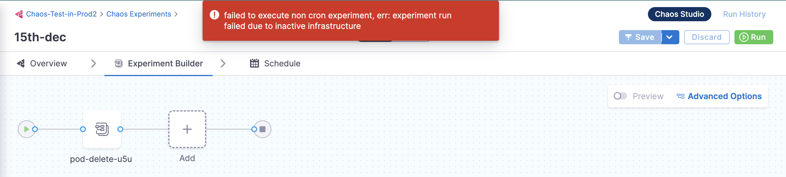
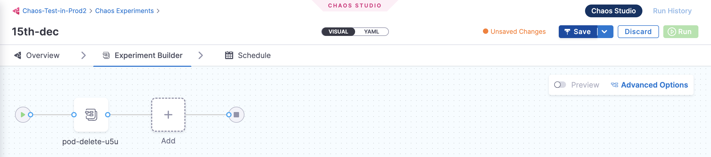

---
title: Troubleshooting guide 
description: Solutions to common pain points.
sidebar_position: 1
--- 

This section walks you through some common pain points and their workarounds.

## Memory stress fault stressng flag usage

When a memory stress fault (such as [node memory hog](../../chaos-engineering/technical-reference/chaos-faults/kubernetes/node/node-memory-hog) or [pod memory hog](../../chaos-engineering/technical-reference/chaos-faults/kubernetes/pod/pod-memory-hog)) is executed, the fault utilizes all of the available resources in the target system, thereby simulating out of memory scenario. 
You can use another fault parameter, `stressNGFlags` to provide flexibility in the parameters passed to the VM.

### Workaround

The `stressNGFlags` can be used in the following manner. 

[embedmd]:# (./static/manifests/stressng-flag.yaml yaml)

```yaml
apiVersion: litmuschaos.io/v1alpha1
kind: LinuxChaosExperiment
metadata:
  name: linux-memory-stress-dev
  labels:
    experimentID: "f7e4a412-74ef-4a0a-9b94-d894afb24be9"
    experimentRunID: "9caeb3ca-b6f3-4e82-b96b-97d57428ef59"
    context: linux-memory-stress
    name: linux-memory-stress-dev
spec:
  experimentId: "f7e4a412-74ef-4a0a-9b94-d894afb24be9"
  experimentRunId: "9caeb3ca-b6f3-4e82-b96b-97d57428ef59"
  cleanupPolicy: retain
  steps:
  - - name: task-1
  tasks:
  - name: task-1
    taskType: "chaos"
    weight: 10
    chaosInfra: "b8d4e0e6-e883-48ad-8b6c-1886bf6edc21"
    definition:
      chaos:
        experiment: linux-memory-stress
        stressChaos/inputs:
          duration: 30s
          workers: 1
          memory: 5m
          stressNGFlags: "--vm-populate"
```

:::tip
The `--vm-populate` in the above manifest is an example to demonstrate how the `stressNGFlags` flag attribute can be utilized. The actual flags placed are entirely your choice (as long as you can validate the said flag in the original stress-ng cmd). 
:::

## Cleanup chaos pods in a namespace

When you execute chaos experiments, multiple pods are created with respect to these experiments. If you wish to cleanup the chaos pods in your namespace, execute the commands below:

### Workaround

* List all the pods in your namespace:

```
kubectl get pod -n <namespace_name>
```

* To delete specific pods in your namespace:

```
kubectl delete pod <pod_name> -n <namespace_name>
```

* To delete all evicted pods in your namespace:

```
kubectl delete pods --namespace=<namespace_name> --field-selector=status.phase=Failed
```

## Chaos infrastructure is inactive, how to activate it?

When you try to execute a previously created experiment but the chaos infrastructure is inactive, you can activate it by following the below steps.



### Workaround

* Navigate to **Overview** tab. Select an infrastructure from the dropdown menu. Click **Next**.


* Click **Save** to save your changes, and click **Run** to execute the chaos experiment.


