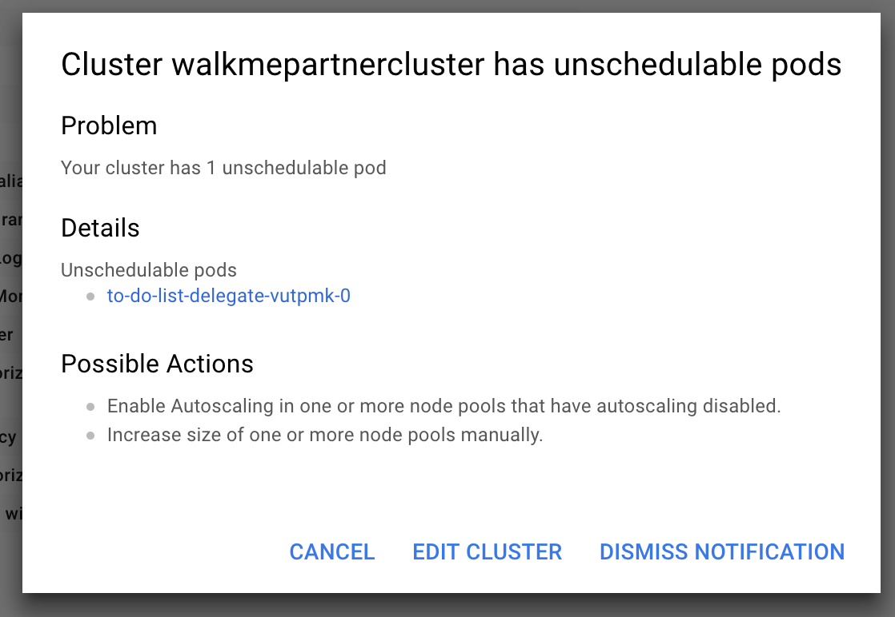

---
title: Troubleshooting guide 
description: Solutions to common pain points.
sidebar_position: 1
--- 

This section walks you through some common pain points and their workarounds.

## Memory stress fault stressng flag usage

When a memory stress fault (such as [Linux memory stress](../../chaos-engineering/technical-reference/chaos-faults/linux/linux-memory-stress) or [Linux CPU stress](../../chaos-engineering/technical-reference/chaos-faults/linux/linux-cpu-stress)) is executed, the fault utilizes all of the available resources in the target system, thereby simulating out of memory scenario. 
You can use another fault parameter, `stressNGFlags` to provide flexibility in the parameters passed to the VM.

### Workaround

The `stressNGFlags` can be used in the following manner. 

[embedmd]:# (./static/manifests/stressng-flag.yaml yaml)

```yaml
apiVersion: litmuschaos.io/v1alpha1
kind: LinuxChaosExperiment
metadata:
  name: linux-memory-stress-dev
  labels:
    experimentID: "f7e4a412-74ef-4a0a-9b94-d894afb24be9"
    experimentRunID: "9caeb3ca-b6f3-4e82-b96b-97d57428ef59"
    context: linux-memory-stress
    name: linux-memory-stress-dev
spec:
  experimentId: "f7e4a412-74ef-4a0a-9b94-d894afb24be9"
  experimentRunId: "9caeb3ca-b6f3-4e82-b96b-97d57428ef59"
  cleanupPolicy: retain
  steps:
  - - name: task-1
  tasks:
  - name: task-1
    taskType: "chaos"
    weight: 10
    chaosInfra: "b8d4e0e6-e883-48ad-8b6c-1886bf6edc21"
    definition:
      chaos:
        experiment: linux-memory-stress
        stressChaos/inputs:
          duration: 30s
          workers: 1
          memory: 5m
          stressNGFlags: "--vm-populate"
```

:::tip
The `--vm-populate` in the above manifest populates the memory thereby stressing it. This is an example to demonstrate how the `stressNGFlags` flag attribute can be utilized.
:::

## Unable to connect to Kubernetes infrastructure server

Most times, chaos infrastructure errors are a result of issues with chaos infrastructure setup. 

### Workaround 
If you are unable to connect to the Kubernetes infrastructure server, try the following:

* Use **ping** on the subscriber or any other pod to test if the response times for app.harness.io or another URL are reasonable and consistent.
* Use traceroute on app.harness.io to check the network route.
* Use **nslookup** to confirm that the DNS resolution is working for app.harness.io.
* Connect using the IP address for app.harness.io (you can get the IP address using `nslookup`). For example, `http://35.23.123.321/#/login`.
* Check for local network issues, such as proxy errors or NAT license limits.
* For some cloud platforms, like AWS EC2, ensure that the security groups allow outbound traffic on HTTPS 443.


## Cluster in GCP has unschedulable pods

GCP may throw an error stating that a cluster has unschedulable pods. This may occur if you don't have sufficient space in your Kubernetes cluster. 



### Workaround
Depending on the size of the cluster you are using, without [autoscaling](https://cloud.google.com/kubernetes-engine/docs/how-to/scaling-apps#autoscaling_deployments) enabled or enough space, your cluster can't run the delegate (remote component that helps access your k8s cluster and inject faults.
To fix this issue, perform the following steps:
1. Add more space or turn on autoscaling
2. Wait for the cluster to restart
3. Reconnect to the cluster
4. Now rerun the following command:

```
$ kubectl apply -f harness-chaos-enable.yml
```

## Environment variable and secret usage references in source mode of command probe

You can use secrets and environment variables in the [**source mode**](../../chaos-engineering/technical-reference/probes/cmd-probe#source-mode) of the command probe using the manifest in the following manner:

```yaml
source:
  env:
  - name: name
    value: test
  volumes:
  - name: volume-secret
    secrets:
    - name: vm-credentials
  volumeMount:
  - name: volume-secret
    mountPath: /etc/volume-secret
 ```