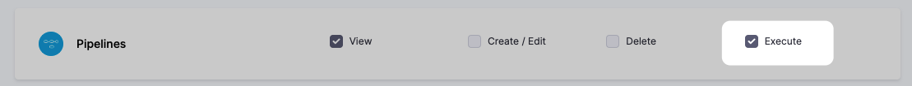
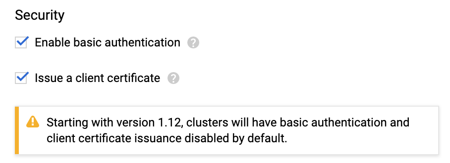
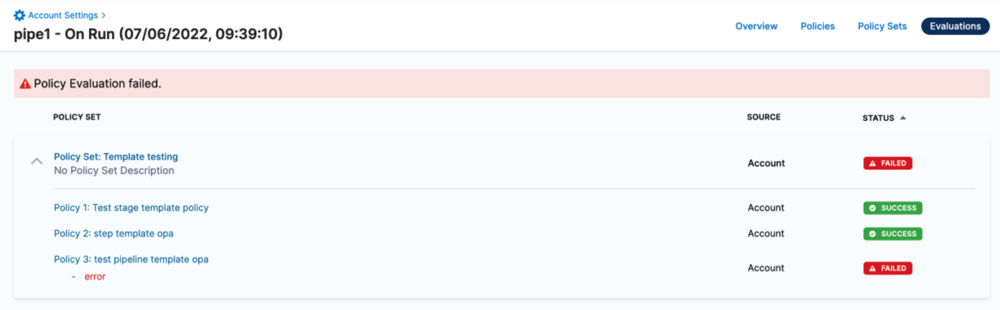
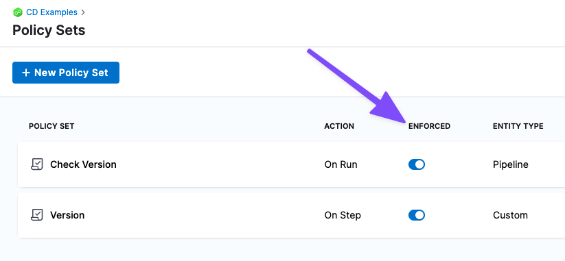

This topic contains general troubleshooting information for error messages and other issues.

If you cannot find a resolution, please contact [Harness Support](mailto:support@harness.io) or [Harness Community Forum](https://community.harness.io/).

### Contents
<!-- TOC start -->
- [Contents](#contents)
- [Login issues](#login-issues)
  - [Logged out automatically](#logged-out-automatically)
    - [Troubleshooting steps](#troubleshooting-steps)
    - [Notes](#notes)
- [Delegate issues](#delegate-issues)
  - [Failure to assign a delegate to a perpetual task](#failure-to-assign-a-delegate-to-a-perpetual-task)
  - [Duplicate output in deployment logs](#duplicate-output-in-deployment-logs)
  - [Running multiple delegates on the same host](#running-multiple-delegates-on-the-same-host)
  - [Delegate setup](#delegate-setup)
  - [Delegate can't connect to Harness Manager](#delegate-cant-connect-to-harness-manager)
  - [Delegate successes followed by failures](#delegate-successes-followed-by-failures)
  - [No delegates could reach the resource](#no-delegates-could-reach-the-resource)
  - [Google Cloud Platform: cluster has unschedulable pods](#google-cloud-platform-cluster-has-unschedulable-pods)
    - [Cause](#cause)
    - [Solution](#solution)
  - [Deleting a Kubernetes delegate](#deleting-a-kubernetes-delegate)
  - [Self-destruct sequence initiated](#self-destruct-sequence-initiated)
    - [Cause](#cause-1)
    - [Solution](#solution-1)
  - [Need to use long polling for delegate connection to Harness Manager](#need-to-use-long-polling-for-delegate-connection-to-harness-manager)
  - [KubernetesClientException: Operation: \[list\] for kind: \[Deployment\] with name: \[null\] in namespace: \[default\] failed](#kubernetesclientexception-operation-list-for-kind-deployment-with-name-null-in-namespace-default-failed)
- [Artifact collection](#artifact-collection)
  - [Stage hanging on artifact collection](#stage-hanging-on-artifact-collection)
- [Common errors and alerts](#common-errors-and-alerts)
  - [No delegates could reach the resource](#no-delegates-could-reach-the-resource-1)
  - [Harness SecretStore is not able to encrypt/decrypt](#harness-secretstore-is-not-able-to-encryptdecrypt)
  - [You are not authorized to perform this operation: AmazonEC2: Status code 403](#you-are-not-authorized-to-perform-this-operation-amazonec2-status-code-403)
  - [Git-upload-pack not permitted](#git-upload-pack-not-permitted)
- [Naming conventions](#naming-conventions)
- [Secrets](#secrets)
  - [Secrets values hidden In log output](#secrets-values-hidden-in-log-output)
  - [AWS KMS 403](#aws-kms-403)
- [Triggers](#triggers)
  - [zsh: no matches found](#zsh-no-matches-found)
  - [User does not have "Deployment: execute" permission](#user-does-not-have-deployment-execute-permission)
- [Continuous delivery](#continuous-delivery)
  - [Error in log when there is no error](#error-in-log-when-there-is-no-error)
- [Continuous integration](#continuous-integration)
- [Helm](#helm)
  - [Unable to get an update from the chart repository](#unable-to-get-an-update-from-the-chart-repository)
- [Kubernetes](#kubernetes)
  - [The deployment is invalid...may not be specified when `value` is not empty](#the-deployment-is-invalidmay-not-be-specified-when-value-is-not-empty)
  - [NullPointerException: release name is reserved for internal Harness ConfigMap](#nullpointerexception-release-name-is-reserved-for-internal-harness-configmap)
  - [The server doesn't have a resource type "deployments"](#the-server-doesnt-have-a-resource-type-deployments)
  - [Invalid value LabelSelector](#invalid-value-labelselector)
  - [Cannot create property](#cannot-create-property)
- [Terraform](#terraform)
  - [Provisioned resources already exist (Terraform state file locked)](#provisioned-resources-already-exist-terraform-state-file-locked)
  - [TerraformValidation - Terraform validation result: false](#terraformvalidation---terraform-validation-result-false)
- [AWS ECS](#aws-ecs)
- [Harness secret managers](#harness-secret-managers)
- [SAML SSO](#saml-sso)
  - [Signed in user is not assigned to a role for the project (Harness)](#signed-in-user-is-not-assigned-to-a-role-for-the-project-harness)
    - [Cause](#cause-2)
    - [Solution](#solution-2)
- [Shell scripts](#shell-scripts)
  - [FileNotFoundExeption inside shell script execution task](#filenotfoundexeption-inside-shell-script-execution-task)
- [Harness policy engine](#harness-policy-engine)
  - [Policy evaluation failed](#policy-evaluation-failed)
<!-- TOC end -->

### Login issues

The following issues can occur when logging in to Harness.

#### Logged out automatically

You are logged out of your Harness Manager session automatically, forcing you to log back in.

:::note
If you log out of Harness Manager in one browser tab, Harness might log you out of all tabs.Typically, the solution is to clear local storage.
:::

##### Troubleshooting steps

1. Log out of Harness Manager from all Chrome tabs. (Harness only supports the Chrome desktop browser.)
2. Clear Chrome Local Storage for `app.harness.io` in **chrome://settings/siteData**.
3. Open a new tab and log into Harness Manager.

You should not be logged out anymore.

##### Notes

* Chrome [Session storage](https://developers.google.com/web/tools/chrome-devtools/storage/sessionstorage) is used by Harness Manager. If you close all the tabs running Harness Manager and then open a new tab running Harness Manager, you will likely need to log in again.
* A Chrome session will timeout after 5 minutes, but a session timeout can also happen if the tab running Harness Manager is idle for 24 hours. However, as long as the tab is not closed, Harness Manager will continue keep polling to check if a refresh is needed for the token. For example, if you have kept the tab open for 3 days, you might still be logged in, as long as the workstation has not been turned off or entered sleep mode preventing the refresh.

### Delegate issues

The Harness delegate runs as a service in your target deployment environment, on a host, a pod, a container, or as a task. The delegate makes outbound HTTPS connections over port 443 to run remote SSH and API calls. The delegate uses the credentials you provide in Harness connections to cloud providers and artifact servers.

When delegates experience issues, it’s usually because of network connectivity.  For example, changes in ports and misconfigured proxies can interfere with delegate connections to providers and servers. Less common problems occur because of invalid credentials, access issues due to policy configuration, and the cross-project requirements of cloud vendors.

If you suspect network connectivity is causing the delegate to fail, troubleshoot your network. If the problem is not resolved, check the validity of the delegate credentials.

The following sections provide solutions to delegate issues.

#### Failure to assign a delegate to a perpetual task

Harness does many background operations on a regular basis, such as collecting information about your cluster and deployed software. This ensures that the number of instances we report is correct, among other information.

This error message is related to these background operations. Subsequent, scheduled attempts typically clears these messages.

If these errors clear, typically a local or remote networking or similar issue is the cause.

#### Duplicate output in deployment logs

This is a symptom of running duplicate delegates. We call this the double delegate problem.

If two Harness delegates with the same name are running in different clusters, they will show up as one delegate in Harness Manager. This will make it seem as though only one delegate is running.

**Do not run delegates with the same name in different clusters.** Replace one of the delegates and the issue will go away.

You might see errors such as `IllegalArgumentException` and multiple `Initializing` and `Rendering` lines:


```
Initializing..  
  
Rendering manifest files using go template  
Only manifest files with [.yaml] or [.yml] extension will be processed  
  
Initializing..  
  
Rendering manifest files using go template  
  
Only manifest files with [.yaml] or [.yml] extension will be processed  
  
IllegalArgumentException: Custom Resource Definition Optional[destinationrules.networking.istio.io] is not found in cluster https://0.00.0.1:443/  
  
Failed.
```
#### Running multiple delegates on the same host

If deployment entities are getting added and removed in the same deployment, you might have two delegates running on the same host.

Do not run multiple delegates on the same host, pod, or container. This will result in the delegates overwriting each other's tasks.

#### Delegate setup

Most often, Delegate errors are the result of delegate setup issues. Ensure you are familiar with how the delegate and Harness Manager work together. See [Delegate installation overview](/docs/platform/2_Delegates/delegate-concepts/delegate-overview.md).

Another common issue is the SSH key used by the delegate to deploy to a target host is incorrect. This can happen if the SSH key in [Harness secrets management](/docs/platform/Secrets/Secrets-Management/harness-secret-manager-overview) was set up incorrectly, or if it is not the correct key for the target host, or the target host is not set up to allow SSH connections.

The delegate is monitored locally using its Watcher component. The Watcher component has a watcher.log file that can provide delegate version information for troubleshooting.

#### Delegate can't connect to Harness Manager

If the delegate can't connect to Harness Manager, try the following:

1. Use **ping** on the Delegate host to test if response times for **app.harness.io** or another URL are reasonable and consistent.
2. Use **traceroute** on **app.harness.io** to check the network route.
3. Use **nslookup** to confirm that DNS resolution is working for **app.harness.io**.
4. Connect using the IP address for **app.harness.io** (get the IP address using nslookup), for example: `http://35.23.123.321/#/login`.
5. Flush the client's DNS cache
	1. Windows: `ipconfig /flushdns`
	2. Mac/Linux: `sudo killall -HUP mDNSResponder;sudo killall mDNSResponderHelper;sudo dscacheutil -flushcache`
6. Check for local network issues, such as proxy errors or NAT license limits.
7. For some cloud platforms, like AWS EC2, ensure that security groups allow outbound traffic on HTTPS 443.
8. Try a different workstation or a smartphone to confirm the connection issue is not local to a single host.

#### Delegate successes followed by failures

If you have incorrectly used the same Kubernetes delegate YAML file for multiple delegates, you will see delegate successes followed by failures in the delegate logs. This sequence is the result of one delegate succeeding in its operation and the same operation failing with the second delegate.

:::note
To avoid any delegate conflicts, always use a new Kubernetes delegate YAML download for each delegate you install, and a unique name.
:::

For Kubernetes delegates, you can increase the number of replicas run using a single delegate download YAML file (change the `replicas` setting in the file), but to run multiple delegates, use a new delegate download from Harness for each delegate.

#### No delegates could reach the resource

This error means that no delegate could meet the URL criteria for validation. For more information, see [How does Harness Manager pick delegates?](/docs/platform/2_Delegates/delegate-concepts/delegate-overview.md#how-does-harness-manager-pick-delegates).

#### Google Cloud Platform: cluster has unschedulable pods

If you do not have enough space available in your Kubernetes cluster, you might receive the following error:


##### Cause

Depending on the size of your cluster, without autoscaling enabled or enough space, your cluster cannot run the delegate.

##### Solution

Add more space or turn on autoscaling, wait for the cluster to restart, reconnect to the cluster, and then rerun the following command:

`$ kubectl apply -f harness-delegate.yaml`

For more information, see [Autoscaling deployments](https://cloud.google.com/kubernetes-engine/docs/how-to/scaling-apps#autoscaling_deployments) from Google.

#### Deleting a Kubernetes delegate

In the case where you have to delete a Harness delegate from your Kubernetes cluster, you can delete the StatefulSet for the delegate.

Once created, the StatefulSet ensures that the desired number of pods are running and available at all times. Deleting the pod without deleting the StatefulSet will result in the pod being recreated.

For example, if you have the delegate pod name `mydelegate-vutpmk-0`, you can delete the StatefulSet with the following command:

`$ kubectl delete statefulset -n harness-delegate mydelegate-vutpmk`

Note that the `-0` suffix in the pod name is removed for the StatefulSet name.

#### Self-destruct sequence initiated

This rare error can be noticed in delegate logs:


```
Sending heartbeat...  
  
Delegate 0000 received heartbeat response 0s after sending. 26s since last response.  
  
Self destruct sequence initiated...
```
##### Cause

Delegate self-destructing because there are two delegates with the same name, probably deployed to two different clusters.

##### Solution

Remove one delegate. Typically, one delegate is in the wrong cluster. Remove that delegate.

#### Need to use long polling for delegate connection to Harness Manager

By default, the Harness delegate connects to Harness Manager over a TLS-backed WebSocket connection, sometimes called a Secure WebSocket connection, using the `wss://` scheme ([RFC 6455](https://tools.ietf.org/html/rfc6455#section-11.1.2)).

Some network intermediaries, such as transparent proxy servers and firewalls that are unaware of WebSocket, might drop the WebSocket connection. To avoid this uncommon error, you can instruct the delegate to use long polling.

To set up the delegate to use long polling, you use the delegate YAML file.

For a Kubernetes Delegate, you can set the `POLL_FOR_TASKS` setting to `true` in the **harness-delegate.yaml** file:


```
...  
        env:  
        ...  
        - name: POLL_FOR_TASKS  
          value: "true"  
...
```
#### KubernetesClientException: Operation: [list] for kind: [Deployment] with name: [null] in namespace: [default] failed

If you have a proxy set up on the network where the Harness Kubernetes Delegate is running, you need to add the cluster master host name or IP address in the delegate harness-delegate.yaml `NO_PROXY` list.

For example, you might see a log error like this:


```
io.fabric8.kubernetes.client.KubernetesClientException: Operation: [list]  for kind: [Deployment]  with name: [null]  in namespace: [default]  failed.
```
1. Obtain the cluster master host name or IP address (`kubectl cluster-info`).
2. Open the **harness-delegate.yaml** you used to create the delegate, and add the cluster master host name or IP address to the `NO_PROXY` setting in the `StatefulSet` spec:


```
        - name: NO_PROXY  
          value: "192.0.2.0"
```
3. Apply harness-delegate.yaml again to restart the Kubernetes delegate (`kubectl apply -f harness-delegate.yaml`).

### Artifact collection

This section lists common errors you might receive when Harness attempts to collect artifacts.

#### Stage hanging on artifact collection

If a delegate has been offline for an extended period of time, you might need to reset the Harness connector credentials.

### Common errors and alerts

This section lists common error and alert messages you might receive.

#### No delegates could reach the resource

This error means that no delegate could meet the URL validation criteria. When a task is ready to be assigned, Harness Manager first validates its lists of delegates to see which delegate should be assigned the task. It validates the delegate by using the URL in the task, such as an API call or SSH command. See [How does Harness Manager pick delegates?](/docs/platform/2_Delegates/delegate-concepts/delegate-overview.md#how-does-harness-manager-pick-delegates).

#### Harness SecretStore is not able to encrypt/decrypt

Error message:


```
Secret manager Harness SecretStore of type KMS is not able to encrypt/decrypt. Please check your setup
```
This error results when Harness Secret Manager (named **Harness SecretStore**) is not able to encrypt or decrypt keys stored in AWS KMS. The error is usually transitory and is caused by a network connectivity issue or brief service outage.

Check [Harness site status](https://status.harness.io/) and [AWS status](https://status.aws.amazon.com/) (search for **AWS Key Management Service**).

#### You are not authorized to perform this operation: AmazonEC2: Status code 403

This error occurs when you are testing a Harness AWS connector and the credentials used for the connection do not include a policy with the [DescribeRegions](https://docs.aws.amazon.com/AWSEC2/latest/APIReference/API_DescribeRegions.html) action.

The DescribeRegions action is required for all AWS connectors. Harness tests the connection using an API call for the DescribeRegions action.

This is described in [Add an AWS connector](/docs/platform/Connectors/Cloud-providers/add-aws-connector).

Ensure that one of the IAM roles assigned to the user account used for AWS connector credentials contains the DescribeRegions action.

#### Git-upload-pack not permitted

One possible cause of this error is if you are using a personal access token (PAT) for your GitHub connector and your GitHub organization uses SAML single sign-on (SSO).

To use a personal access token with a GitHub organization that uses SAML single sign-on (SSO), you must first authorize the token. See [Authorizing a personal access token for use with SAML single sign-on](https://docs.github.com/en/enterprise-cloud@latest/authentication/authenticating-with-saml-single-sign-on/authorizing-a-personal-access-token-for-use-with-saml-single-sign-on) from GitHub.


```
org.eclipse.jgit.api.errors.TransportException: https://github.com/*******/*******: git-upload-pack not permitted on 'https://github.com/*******/*******/'
```
### Naming conventions

:::note
Typically, names for Harness entities can only contain alphanumerics, \_ and -.
:::

Some naming conventions in repositories and other artifact sources, or in target infrastructures, cannot be used by Harness. For example, if a Harness trigger webhook uses a push notification from a Git repo branch that contains a dot in its name, the trigger is unlikely to work.

Character support in Harness environment and infrastructure definition entity names is restricted to alphanumeric characters, underlines, and hyphens. The restriction is due to compatibility issues with Harness backend components, database keys, and the YAML flow where Harness creates files with entity names on file systems.

### Secrets

The following issues can occur when using Harness secrets.

#### Secrets values hidden In log output

If a secret's unencrypted value shares some content with the value of another Harness variable, Harness will hide the secret's value in any logs. Harness replaces the secret's conflicting value with the secret's name in any log displays. This is for security only, and the actual value of the secrets and variables are still substituted correctly.

#### AWS KMS 403

The Harness delegate runs in your target deployment environment and needs access to the default Harness AWS KMS for secrets management. If it does not have access, the following error can occur:


```
Service: AWSKMS; Status Code: 403
```
Ensure that the delegate can reach the Harness KMS URL by logging into the delegate host(s) and entering the following cURL command:


```
curl https://kms.us-east-1.amazonaws.com
```
Next, ensure that your proxies are not blocking the URL or port 443.

If this does not fix your error, and you are not using the default Harness KMS secret store, the AWS KMS access key provided in Harness for your own KMS store is likely invalid.

### Triggers

This section covers error messages you might see when creating, updating, deleting, or executing a trigger. It includes authorization or permission steps to resolve the errors.

#### zsh: no matches found

If you are using macOS Catalina, the default shell is zsh. The zsh shell requires that you escape the ? character in your cURL command or put quotes around the URL.

For example, this command fails:


```
curl -X POST -H 'content-type: application/json' --url https://app.harness.io/gateway/api/webhooks/xxx?accountId=xxx -d '{"application":"fCLnFhwsTryU-HEdKDVZ1g","parameters":{"Environment":"K8sv2","test":"foo"}}'
```
The following command works:


```
curl -X POST -H 'content-type: application/json' --url "https://app.harness.io/gateway/api/webhooks/xxx?accountId=xxx -d '{"application":"fCLnFhwsTryU-HEdKDVZ1g","parameters":{"Environment":"K8sv2","test":"foo"}}'"
```
#### User does not have "Deployment: execute" permission

Error messages of the form `User does not have "Deployment: execute" permission` indicate that your user group's role settings do not include **Pipeline:** **Execute**.



To resolve this, see [Add and manage roles](../platform/4_Role-Based-Access-Control/9-add-manage-roles.md).

### Continuous delivery

The following issues can occur when running Pipeline deployments.

#### Error with release name too long

In the deployment logs in Harness you may get an error similar to this:

```
6m11s Warning FailedCreate statefulset/release-xxx-xxx create Pod release-xxx-xxx-0 in StatefulSet release-xxx-xxx failed error: Pod "release-xxx-xxx-0" is invalid: metadata.labels: Invalid value: "release-xxx-argus-xxx": must be no more than 63 characters
```

This is an error coming from the kubernetes cluster stating that the release name is too long.  This can be adjusted in Environments > click Name of the Environment in Question > Infrastructure Definitions > click Name of the Infrastructure Definition in Question > scroll down > expand Advanced > modify the Release name to be something shorter

#### Error in log when there is no error

When Harness captures commands output, it captures both standard out (stdout) and standard error (stderr) to the screen. Information from stdout receives the prefix `INFO` while information from stderr receives the prefix `ERROR`. This is meant to allow our users to know where the information they see comes from.

Unfortunately, several Linux commands and applications use standard out as a way to print information to the screen that will not be captured if the output is captured to a file.

For example, the cURL command shows a download progress indication on the screen. If you redirect cURL output to a file the progress indicator is not captured in the file. This is done by showing the progress indicator in standard out. This is a very useful feature for many users, but for Harness is causes the progress indicator to be seen with the `ERROR` prefix.

You can test this for yourself with the following short example:


```
curl https://app.harness.io/version.txt >out.txt 2>err.txt  
  
cat out.txt  
  
cat err.txt
```
As you can see, the err.txt file has the cURL command output that in Harness will show with the `ERROR` prefix.

If Harness does not show standard error, then many errors will not be captured, confusing customers. Therefore, Harness shows the standard error in its logs.

### Continuous integration

For troubleshooting advice specific to Continuous Integration, go to [Troubleshoot CI](/docs/continuous-integration/troubleshoot-ci/troubleshooting-ci.md).

### Helm

The following troubleshooting information should help you diagnose common Helm problems.

#### Unable to get an update from the chart repository

If Harness cannot get an update from a chart repo you have set up for your Helm service, during deployment, you might see the following message:


```
Unable to get an update from the "XYZ" chart repository ... read: connection reset by peer
```
To fix this, find the delegate that the Helm update ran on, and then SSH to the delegate host and run the Helm commands manually. This will confirm if you are having an issue with your Harness setup or a general connectivity issue.

### Kubernetes

The following problems can occur when developing and deploying to Kubernetes.

#### The deployment is invalid...may not be specified when `value` is not empty

Every Harness deployment creates a new release with an incrementally increasing number. Release history is stored in the Kubernetes cluster in a ConfigMap. This ConfigMap is essential for release tracking, versioning, and rollback.

See [Kubernetes releases and versioning](../continuous-delivery/deploy-srv-diff-platforms/kubernetes/cd-k8s-ref/kubernetes-releases-and-versioning.md).

If the ConfigMap is edited using kubectl or another tool between deployments future deployments often fail.

This type of error is experienced in standard Kubernetes deployments when attempting to use `kubectl apply` on a manifest whose resources have been previously modified using `kubectl edit`. For example, see the comments in this [Kubernetes issue](https://github.com/kubernetes/kubernetes/issues/78607).

#### NullPointerException: release name is reserved for internal Harness ConfigMap

The release name you enter in the infrastructure definition **Release name** is reserved for the internal Harness ConfigMap used for tracking the deployment.

**Do not create a ConfigMap that uses the same name as the release name.** Your ConfigMap will override the Harness internal ConfigMap and cause a NullPointerException.

See [Define your kubernetes target infrastructure](/docs/continuous-delivery/deploy-srv-diff-platforms/kubernetes/define-your-kubernetes-target-infrastructure.md).

#### The server doesn't have a resource type "deployments"

When you attempt to connect to the Kubernetes cluster via **GCP**, the Kubernetes cluster must have **Basic authentication enabled** or the connection will fail. For more information, see [Control plane security](https://cloud.google.com/kubernetes-engine/docs/concepts/security-overview#control_plane_security) from GCP. From GCP:

You can handle cluster authentication in Google Kubernetes Engine by using Cloud IAM as the identity provider. However, legacy username-and-password-based authentication is enabled by default in Google Kubernetes Engine. For enhanced authentication security, you should ensure that you have disabled Basic Authentication by setting an empty username and password for the MasterAuth configuration. In the same configuration, you can also disable the client certificate which ensures that you have one less key to think about when locking down access to your cluster.

* If Basic authentication is inadequate for your security requirements, use the [Kubernetes cluster connector](/docs/platform/Connectors/Cloud-providers/add-a-kubernetes-cluster-connector).
* While it can be easier to use the [Kubernetes cluster connector](/docs/platform/Connectors/Cloud-providers/add-a-kubernetes-cluster-connector) for Kubernetes cluster deployments, to use a Kubernetes cluster on Google GKE, Harness requires a combination of basic authentication and/or client certificate to be enabled on the cluster:



This is required because some API classes, such as the [MasterAuth class](https://developers.google.com/resources/api-libraries/documentation/container/v1/java/latest/com/google/api/services/container/model/MasterAuth.html), require HTTP basic authentication or client certificates.

#### Invalid value LabelSelector

If you are deploying different Harness pipelines to the same cluster during testing or experimentation, you might encounter a selector error such as this:


```
The Deployment “harness-example-deployment” is invalid: spec.selector:   
  Invalid value: v1.LabelSelector{MatchLabels:map[string]string{“app”:“harness-example”},   
  MatchExpressions:[]v1.LabelSelectorRequirement{}}: field is immutable
```
This error means that, in the cluster, there is a deployment with same name which uses a different pod selector.

Delete or rename the deployment. Let's look at deleting the deployment. First, get a list of the deployments:


```
kubectl get all  
...  
  
NAME                                             TYPE           CLUSTER-IP      EXTERNAL-IP      PORT(S)        AGE  
service/kubernetes                               ClusterIP      10.83.240.1     <none>           443/TCP        18d  
  
NAME                                             DESIRED   CURRENT   UP-TO-DATE   AVAILABLE   AGE  
deployment.apps/harness-example-deployment       1         1         1            1           4d  
...
```
And then delete the deployment:


```
kubectl delete deploy/harness-example-deployment svc/kubernetes  
  
deployment.extensions "harness-example-deployment" deleted  
  
service "kubernetes" deleted
```
Rerun the Harness deployment and the error should not occur.

#### Cannot create property

The following error message can appear if a property, such as the security settings (securityContext) in the pod or container, are located in the wrong place in the specification:


```
ConstructorException: Cannot create property=spec for JavaBean=class V1StatefulSet
```
Ensure that your YAML specification is formed correctly.

For steps on how to add a security context for a pod or container, see [Configure a security context for a pod or container](https://kubernetes.io/docs/tasks/configure-pod-container/security-context/) from Kubernetes.

Here is an example:


```
apiVersion: v1  
kind: Pod  
metadata:  
  name: security-context-demo-2  
spec:  
  securityContext:  
    runAsUser: 1000  
  containers:  
  - name: sec-ctx-demo-2  
    image: gcr.io/google-samples/node-hello:1.0  
    securityContext:  
      runAsUser: 2000  
      allowPrivilegeEscalation: false
```
### Terraform

The following are resolutions to common configuration problems when [Terraform provisioning with Harness](../continuous-delivery/cd-infrastructure/terraform-infra/terraform-provisioning-with-harness.md).

#### Provisioned resources already exist (Terraform state file locked)

When a [Terraform Apply](../continuous-delivery/cd-infrastructure/terraform-infra/run-a-terraform-plan-with-the-terraform-apply-step.md) step fails because of a timeout, subsequent deployments might see following error message:


```
Error creating [object]. The [object] already exists.
```
Use a longer timeout for the Terraform Apply step.

When the Terraform Apply times out, Terraform locks the Terraform state file. A Terraform [Force Unlock](https://www.terraform.io/docs/language/state/locking.html#force-unlock) needs to be performed.

:::note
Locking and unlocking of tfstate files is handled by Terraform automatically. You can disable state locking for most commands with the `-lock` flag but it is not recommended. See [State locking](https://www.terraform.io/docs/language/state/locking.html) from Terraform.
:::

After timeout, no resources may be added to the state file. A manual cleanup of any resources created must be performed as well.

#### TerraformValidation - Terraform validation result: false

Harness performs the following validation when you use Terraform in a deployment:

1. Is Terraform installed on the Harness delegate? Harness installs it automatically, but it might have been removed.
2. Can the Harness delegate connect to the Git repo?

If the Harness delegate does not have Terraform installed, you will see a log entry such as the following:


```
2020-04-21 19:26:19,134 INFO software.wings.delegatetasks.validation.TerraformValidation - Running terraform validation for task  
  
2020-04-21 19:26:19,157 INFO software.wings.delegatetasks.validation.TerraformValidation - Terraform validation result: false
```
The message `Terraform validation result: false` means Terraform is not installed on the delegate.

Install Terraform on the delegate to fix this.

### AWS ECS

In some Harness CloudFormation and ECS deployments you might get failures with `ThrottlingException` or `Rate exceeded` errors for CloudFormation and ECS API calls.

For more information, go to [AWS backoff strategy](https://developer.harness.io/docs/platform/Connectors/Cloud-providers/ref-cloud-providers/aws-connector-settings-reference#aws-backoff-strategy).

### Harness secret managers

If the Harness delegate(s) cannot authenticate with a secret manager, you might see an error message such as this:


```
Was not able to login Vault using the AppRole auth method.   
Please check your credentials and try again
```
For most authentication issues, try to connect to the [Harness Secrets Manager](/docs/platform/Secrets/Secrets-Management/harness-secret-manager-overview) from the host running your Harness delegate(s). This is done simply by using a cURL command and the same login credentials you provided when you set up the Harness Secrets Manager.

For example, here is a cURL command for HashiCorp Vault:


```
curl -X POST -d '{"role_id":"<APPROLE_ID>", "secret_id":"<SECRET_ID>"}' https://<HOST>:<PORT>/v1/auth/approle/login
```
If the delegate fails to connect, it is likely because of the credentials or a networking issue.

### SAML SSO

The following errors might occur during the set up or use of SAML SSO.

#### Signed in user is not assigned to a role for the project (Harness)

A user registered in the Harness project in the Azure portal is not able to access the application and gets this error.

##### Cause

If the email address used in Harness is different from the email address in the Azure app, you will get an error saying that the user is not assigned to a role for the Harness application.

##### Solution

Make sure the email address used in Harness matches the email address in the Azure app.

For more information about SAML SSO configuration with Azure, see [Single sign-on (SSO) with SAML](../platform/3_Authentication/3-single-sign-on-saml.md).

### Shell scripts

This section covers common problems experienced when using a [Shell script](../continuous-delivery/x-platform-cd-features/cd-steps/cd-general-steps/using-shell-scripts.md) step.

#### FileNotFoundExeption inside shell script execution task

This error happens when you are publishing output and your Shell Script step exits early from its script.

If you exit from the script (`exit 0`), values for the context cannot be read.

If you publish output variables in your Shell Script step, structure your script with `if...else` blocks to ensure it always runs to the end of the script.

### Harness policy engine

The following errors might occur during the set up or use of [Harness policy engine](/docs/platform/Governance/Policy-as-code/harness-governance-overview).

#### Policy evaluation failed

If a Harness policy engine policy set is enabled and your pipeline or other resource does not pass the set, a message similar to the following is displayed:



Contact your Harness account administrator to resolve the issue. If the policy set has an error, you can disable it by locating the policy set and turning off the **Enforced** toggle.


