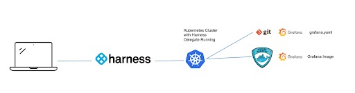

# Harness CD - Quick Start - NG - Kubernetes

Releases that were once done on a quarterly basis seem asinine now, with the advent of Agile Development, getting incremental features out as fast as possible. Infrastructure and practices need to be in place to allow changes to propagate quickly. If we take a look at the definition of Continuous Delivery from Jez Humble’s book, Continuous Delivery:

## Background on Continuous Delivery

“`Continuous Delivery` is the ability to get changes of all types—including
new features, configuration changes, bug fixes and experiments—
into production, or into the hands of users, safely and quickly in a
sustainable way."

```bash
npm run harness docs:version 1.0
```

## Building Blocks to Continuous Delivery

Automating your deployments does require a few pieces. You do need something that can be deployed and infrastructure for your deployment to head to. This can be in the form of a binary distribution e.g an image and a Kubernetes cluster. Typically with modern applications, the deployment manifests will be stored in source control, GitHub being a common SCM **_[source code management]_** solution.

For this example, we will deploy Grafana, an open source analytics tool, to a Kubernetes cluster with Harness CD. The needed Grafana Manifests will be stored on GitHub and you can deploy to a Kubernetes cluster of your choice.



## Getting Started with Harness CD

Getting started with Harness CD is simple, first if you do not have a Harness Account, you can sign up for free for Harness CD.

Once signed up, navigate to the Deployments icon on the left hand navigation and create your start your free forever CD Free Plan.
