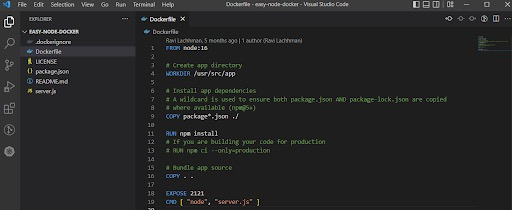

# Continuous Integration - Developer Getting Started Guide - Zero to Pipeline

## Background on Continuous Integration

Continuous Integration is automated builds that can be triggered by some sort of event, such as a code check-in, merge, or on a regular schedule. The end goal of a build is to be deployed somewhere, and the main goal of `Continuous Integration` is to build and publish that deployable unit.

However, more than the compiled source code can go into a build. The end product for Continuous Integration is a release candidate. A release candidate is the final form of an artifact to be deployed. There could be quality steps taken to produce the artifact, such as finding bugs, and identifying their fix. Packaging, distribution, and configuration all go into a release candidate.

<!-- Video:
https://www.youtube.com/watch?v=pcD6cmUuejg -->
<docvideo src="https://www.youtube.com/watch?v=pcD6cmUuejg" />

According to **_Paul Duvall_**, co-author of Continuous Integration, in a nutshell, CI will improve quality and reduce risk. Having a Continuous Integration approach frees teams from the burden of manual builds and also makes builds more repeatable, consistent, and available. If you are unfamiliar with CI, this guide will get you started on your first automated build.

## Your Local Build - Onramp to Continuous Integration

To create a build, you need to have something that can be built, which means source code. The steps you take to build and package your application or service need to be represented in a CI tool or platform for automation. CI platforms will need to connect to source code management e.g SCM to start the build process. This can be as simple as connecting your public GitHub Repository for something that needs to be built.

Create a file at `src/pages/my-react-page.js`:

```jsx title="src/pages/my-react-page.js"
import React from "react";
import Layout from "@theme/Layout";

export default function MyReactPage() {
  return (
    <Layout>
      <h1>My React page</h1>
      <p>This is a React page</p>
    </Layout>
  );
}
```

## How to Build an App Locally?

Languages and package formats have build specific tools. As an example, here is a simplistic NodeJS Application that can be built into a Docker Image; the Dockerfile has specifics on how to build and package the app.



Sample App Repo:
https://github.com/ravilach/easy-node-docker

Building and packaging this sample application locally requires a few pieces, NPM and Docker.
If you don’t have those runtimes, on a Windows Machine, you can use Chocolatey to install, or if using a Mac, Homebrew.

NPM:

```
choco install nodejs
brew install node
```

Docker:

```
choco install docker
brew install docker
```
