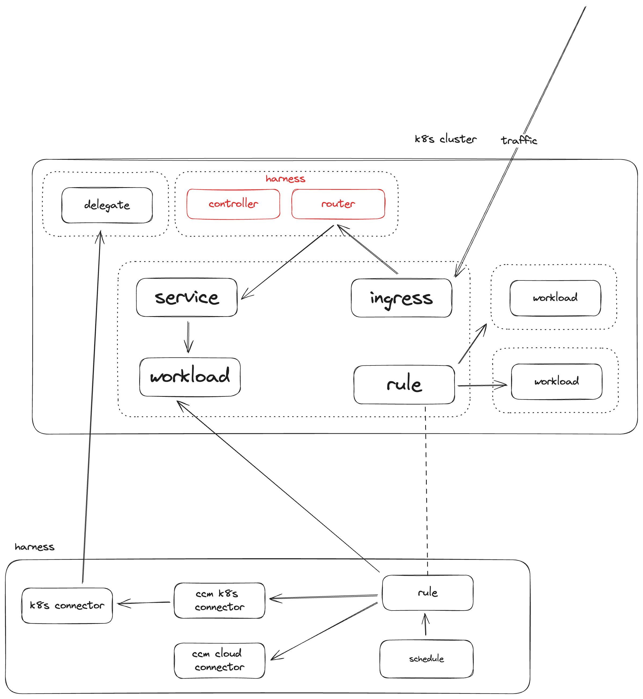
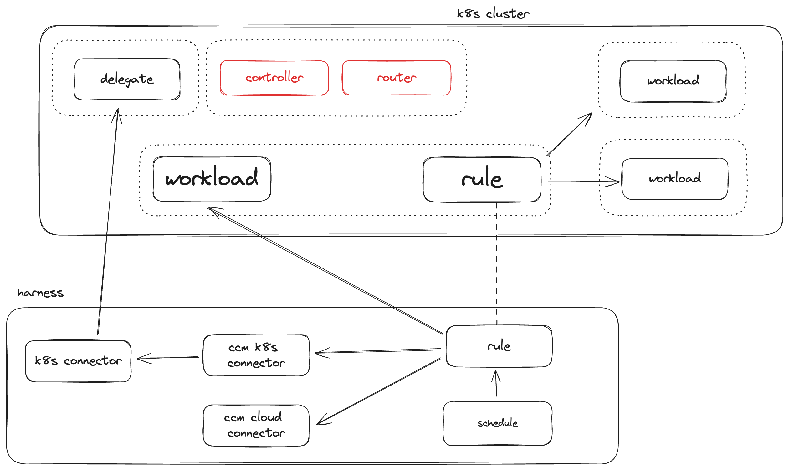
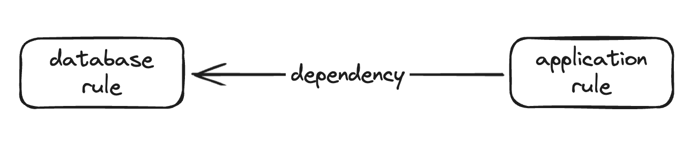

# Kubernetes Auto Stopping

Auto stopping in Kubernetes enables you to spin down the pods of a deployment to zero. You can do this either by monitoring traffic on an ingress resources, or by creating defined schedules of uptime and downtime. 

## Creating Rules

You can create auto stopping rules in the Harness UI or in the cluster itself by deploying a kubernetes `autostoppingrule` resource. When you create rules in the UI, you are actually just sending a message to the auto stopping controller to create the corresponding `autostoppingrule` in the cluster. Any rule created in the cluster will also appear in the UI after creation.

If you wish to modify the settings of a rule (schedule, dry-run, any setting not set in the `autostoppingrule` yaml) you will need to do that from the Harness UI.

## Ingress Based

Harness can monitor the traffic of an ingress rule and bring pods up and down based off the traffic seen. It does this by modifying the ingress rule to send all traffic to the auto stopping router, and then the router sends the traffic to the service that backed the ingress resource.

When the router does not see traffic for a specified amount of idle time, the controller modifies the deployment that backs the service to have zero replicas.

When the router sees traffic again, the controller modifies the the deployment that backs the service to have the amount of replicas that it had whenever it reduced the pods after seeing no traffic.



The YAML for an ingress rule:
```
kind: AutoStoppingRule
apiVersion: ccm.harness.io/v1
metadata:
  name: <name of the rule>
  namespace: <namespace of the target workload>
  annotations:
    harness.io/cloud-connector-id: <some cloud account connector>
spec:
  ingress:
    name: <ingress resource name>
    controllerName: <ingress controller type>
  service:
    name: <backend service resource name>
    port: <backend service port>
  idleTimeMins: <idle time in min>
  dependencies: []
  hideProgressPage: false
  notifications: {}
  enabled: true
```

## Schedule Based

In tandem with traffic based scaling you can define uptime and downtime schedules that will keep the workload up, or down, based on a pre-defined schedule.

Uptime schedules will ensure that pods are not taken offline, no matter the traffic seen by the router.

Downtime schedules will keep the pods offline, no matter the traffic seen by the router.

|          |     idle    |    active  |
|----------|:-----------:|-----------:|
| uptime   |  pods up    |  pods up   |
| downtime |  pods down  |  pods down |

### Schedule-Only Rules

If you do not have an ingress controller, or you only want to stop/start your workloads based on a schedule, you can optionally create a non-ingress rule.

When creating a non-ingress rule, Harness will act as if it was an ingress rule, but never see traffic.

So without any schedule applied, the workload will always be down, and you can apply uptime schedules to force the workload to stay up.

That is to say, you should only apply uptime schedules to non-ingress rules.



The YAML for a schedule only rule:
```
apiVersion: ccm.harness.io/v1
kind: AutoStoppingRule
metadata:
  name: <name of the rule>
  namespace: <namespace of the target workload>
  annotations:
    harness.io/cloud-connector-id: <some cloud account connector>
spec:
  idleTimeMins: <idle time in min>
  workloadName: <name of the target deployment>
  workloadType: Deployment
  hideProgressPage: false
  dependencies: []
```

## Dependencies

You can define a dependency on another auto stopping rule. This will make sure that the dependent rule is online when the rule with the configured dependency is online.

For example, you have a stopping rule for a database configured in Harness. When you create a stopping rule for the application you can specify a dependency on the database rule so that whenever the application is online Harness will ensure that the database is also online.

0. Database and application are offline
1. Application receives some trigger to come online
2. Harness triggers the database to come online, waits the specified amount of time
3. Harness triggers the application to come online.



### In-Line Dependencies

When defining an `autostoppingrule` resource you can also specify other workloads or namespaces in the cluster to auto stop along with the main workload defined in the rule. These workloads can be in other namespaces, and you can stop entire namespaces as well.

Stopping another deployment:
```
kind: AutoStoppingRule
apiVersion: ccm.harness.io/v1
metadata:
  name: <name of the rule>
  namespace: <namespace of the target workload>
  annotations:
    harness.io/cloud-connector-id: <some cloud account connector>
spec:
  ingress:
    name: <ingress resource name>
    controllerName: <ingress controller type>
  service:
    name: <backend service resource name>
    port: <backend service port>
  idleTimeMins: 5
  dependencies:
    - selector:
        workload:
          name: <name of the 2nd target deployment>
          namespace: <namespace of the 2nd target workload>
          type: Deployment
      wait: 5
  hideProgressPage: false
  notifications: {}
  enabled: true
```

Stopping an entire namespace:
```
kind: AutoStoppingRule
apiVersion: ccm.harness.io/v1
metadata:
  name: <name of the rule>
  namespace: <namespace of the target workload>
  annotations:
    harness.io/cloud-connector-id: <some cloud account connector>
spec:
  ingress:
    name: <ingress resource name>
    controllerName: <ingress controller type>
  service:
    name: <backend service resource name>
    port: <backend service port>
  idleTimeMins: 5
  dependencies:
    - selector:
        namespace: <name of the 2nd namespace to stop>
      wait: 5
  hideProgressPage: false
  notifications: {}
  enabled: true
```

## Warming Up Workloads

There is an API available to "warm up" or "cool down" a rule for a specified amount of time. This can be helpful when you have a schedule applied but some developer needs access to a workload, or needs to test bringing the workload down.

To call this API the token used must have auto stopping rule view in the Harness account.

# Troubleshooting

## When opening tickets

Gathering the right information to include when opening support tickets is key. If you are having an issue with traffic based kubernetes stopping, do the following:

- Describe the autostopping rule: `kubectl -n <namespace> describe asr/<rule name>`
- Describe the ingress: `kubectl -n <namespace> describe ingress/<ingress name>`
- Describe the service: `kubectl -n <namespace> describe service/<service name>`
- Get controller logs: `kubectl -n harness-autostopping logs deployment/autostopping-controller`
- Get router logs: `kubectl -n harness-autostopping logs deployment/autostopping-router`

Include all the above with your support ticket.

## Loading page constantly refreshes, or never redirects to my application

If you are unable to get past the autostopping loading page, first check to see if your pods have come up and are healthy.

If the pods do come up and are healthy but the page is not redirecting, or the loading page is reloading constantly but never redirecting you to your application, then we can try resetting the router config.

- Scale controller to zero:  `kubectl -n harness-autostopping scale deploy/autostopping-controller --replicas=0`
- Delete configmap: `k -n harness-autostopping delete cm/harness-autostopping-config`
- Scale controller to one: `k -n harness-autostopping scale deploy/autostopping-controller --replicas=1`

At this point the configmap should be regenerated, and you can try accessing your application again.
