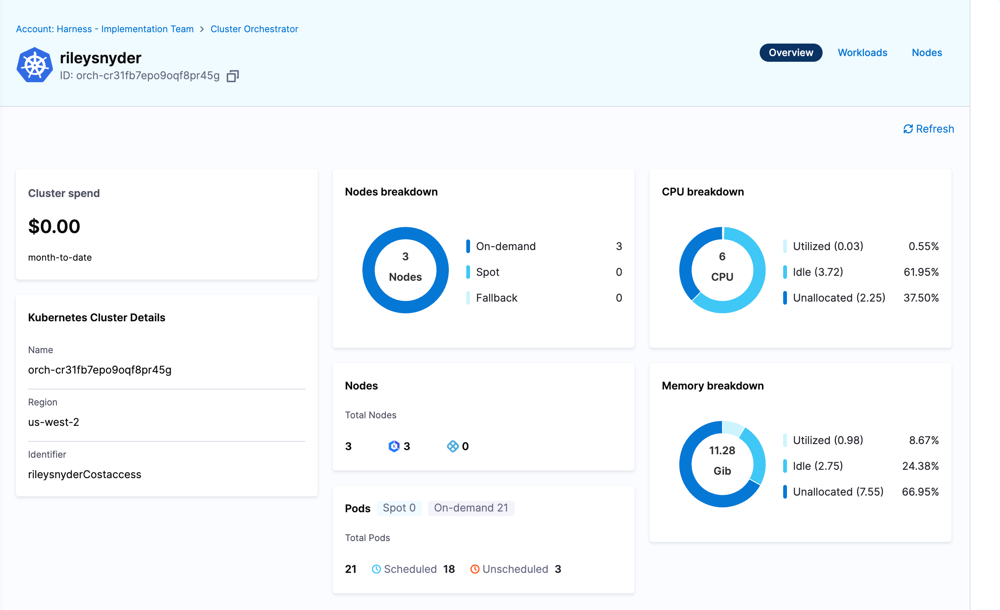

# Prereq

[Follow this guide](https://developer.harness.io/kb/cloud-cost-management/articles/onboarding/k8s#delegate-architecture) to get a delegate installed in your cluster, with a cooresponding k8s and ccm k8s connector in Harness. 

# Preparing your cluster for orchestrator

## Subnets

The subnet(s) your nodegroups are using must be tagged with the following key/value pair:

- key: `harness.io/<cluster name>`
- value: `owned`

If you are using the [aws vpc terraform module](https://registry.terraform.io/modules/terraform-aws-modules/vpc/aws/latest) you can set these via the `private_subnet_tags` input:
```
  private_subnet_tags = {
    "harness.io/ourclustername" = "owned"
  }
```

## Security Groups

The security group(s) your nodegroups are using must be tagged with the following key/value pair:

- key: `harness.io/<cluster name>`
- value: `owned`

If you are using the [aws eks terraform module](https://registry.terraform.io/modules/terraform-aws-modules/eks/aws/latest) you can set these via the `node_security_group_tags` input:
```
  node_security_group_tags = {
    "harness.io/ourclustername" = "owned"
  }
```

## Instance profiles

The following IAM policies must be attached to the IAM role you are using for your node instance profiles:

- AmazonEC2ContainerRegistryReadOnly
- AmazonEKS_CNI_Policy
- AmazonEKSWorkerNodePolicy
- AmazonEKSClusterPolicy
- AmazonSSMManagedInstanceCore

If you are using the [aws eks terraform module](https://registry.terraform.io/modules/terraform-aws-modules/eks/aws/latest) you can set these via the `iam_role_additional_policies` value in your `eks_managed_node_groups`:
```
  eks_managed_node_groups = {
    mynodegroup = {
      # ...other config

      iam_role_additional_policies = {
        CCMClusterOrchClu = "arn:aws:iam::aws:policy/AmazonEKSClusterPolicy"
        CCMClusterOrchSSM = "arn:aws:iam::aws:policy/AmazonSSMManagedInstanceCore"
      }
    }
  }
```
The first three policies mentioend above come default in node groups created via this module, so those are left out.

# Creating an orchestrator for your cluster

Next we need to create an orchestrator in the CCM tool for your cluster. This is done with the following API call:

```
HARNESS_ACCOUNT_ID="<harness account id>"
HARNESS_PLATFORM_API_KEY="<harness api key>"

url="https://app.harness.io/gratis/lw/api/accounts/$HARNESS_ACCOUNT_ID/clusters/orchestrator?accountIdentifier=$HARNESS_ACCOUNT_ID"

json_payload='{
  "name": "<cluster name>",
  "user_config": {
    "cluster_endpoint": "<eks cluster endpoint>"
  },
  "k8s_connector_id": "<harness ccm k8s connector id>"
}'

curl -s -X POST "$url" \
  -H "Content-Type: application/json"  \
  -H "x-api-key: $HARNESS_PLATFORM_API_KEY" \
  -d "$json_payload"
```

The API call will return JSON, in the payload we need to extract the key under `response.id` which should be in the format `orch-xxx`

# Deploy the orchestrator operator


# Configure cluster orchestration

Once your cluster has been set up with all Orchestrator components you can enable orchestration in the UI.

Navigate to the CCM module, and select `Cluster Orchestrator` from the side menu. You should see a list of clusters that have been set up or are pending. Find the cluster you are onboarding and click `Resume Setup`.


On the first page we can set a base on-demand capacity, split of spot vs on-demand compute, and the distribution strategy.


When you have set the configuration according to your needs, select `Complete Enablement`.

Now you can click on your cluster again in the menu and browse the cluster resources and current compute setup.


