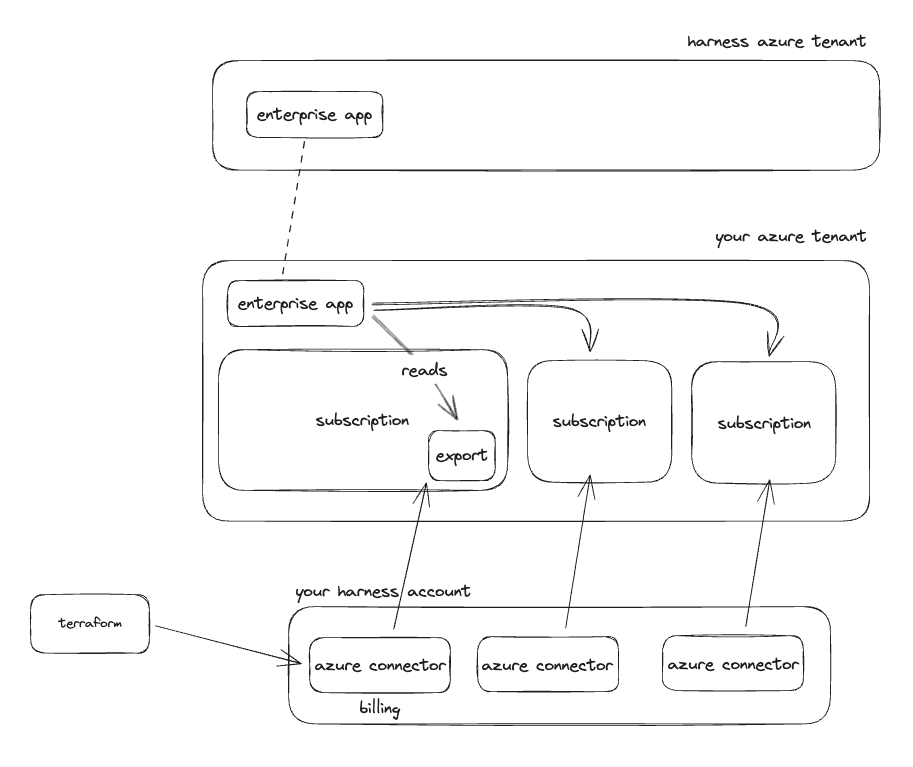

# Azure

In your Azure tenant there should be a billing scope that covers your entire tenant. We will need to create a billing export from this root billing scope, to be placed into a storage account in some subscription in the tenant.

If you do not have a root billing scope, you will need to locate some other location to create the billing export from, either a management group level, or even at the subscription level.

You may end up with one to many billing exports depending on your Azure configuration.

## Add Harness Application to Azure Tenant

To give Harness access to billing information and resources in your Azure tenant you will need to add the Harness Azure Enterprise Application to your Azure tenant.

This can be done in the UI or using the Azure CLI. The CLI command to do so is:

```sh
az ad sp create --id 0211763d-24fb-4d63-865d-92f86f77e908
```

Once added you should have an identity in your tenant named `Harness Continuous Efficiency App`.

## Billing Data

The first step is to [create a billing export](https://developer.harness.io/docs/cloud-cost-management/get-started/onboarding-guide/set-up-cost-visibility-for-azure/#azure-billing-exports) at the billing scope, management group, or subscription level. When you create the billing export, you will need to specify a storage account in some subscription for the export to be placed in. Once the billing export has been created, we will need give Harness access to read the export in the storage account.

To do this, assign `Storage Blob Data Reader` to the `Harness Continuous Efficiency App` identity for the container in the storage account which holds the billing export.


### Harness CCM Azure Connector

Now that the app has been added to your tenant and the export has been created we need to create a corresponding CCM Azure connector in your Harness account to start billing data ingestion.

You can create this connector through the UI or via the API with a tool like Terraform. Using Terraform is the recommended approach and there is a [Harness Terraform provider here](https://registry.terraform.io/providers/harness/harness/latest/docs).

To configure the connector you will need the following information:

- Tenant ID: The ID of your Azure Tenant
- Subscription ID: The ID of the subscription where the storage account is located
- Storage account name: The name of the storage account where the billing export is being delivered to
- Storage account subscription ID: The ID of the subscription where the storage account is located
- Storage container: The container in the storage account where the billing export is being delivered to
- Storage directory: The folder in the container in the storage account where the billing export is being delivered to
- Report name: The name of the billing export
- Features enabled: The CCM features that you want to use in this subscription
  - At minimum this should be `BILLING`
  - You should additionally enable any other features you want to use in this subscription
    - `VISIBILITY`: This enables the inventory management feature
      - This will enable VM recommendations and metadata gathering
    - `OPTIMIZATION`: This enables the optimization feature
      - This will enable you to use the auto stopping feature for VMs


```terraform
resource "harness_platform_connector_azure_cloud_cost" "billing" {
  identifier = "billing"
  name       = "billing"

  features_enabled = ["BILLING", "VISIBILITY", "OPTIMIZATION"]
  tenant_id        = "3e93deba-142a-459a-ab89-eea28bdb589c"
  subscription_id  = "e9ce099c-531b-4f97-b681-e7a02e032e4f"
  billing_export_spec {
    storage_account_name = "harnesscostexportstorage"
    container_name       = "harness"
    directory_name       = "export"
    report_name          = "harnesscostexport"
    subscription_id      = "e9ce099c-531b-4f97-b681-e7a02e032e4f"
  }
}
```

## Other Subscriptions

Enabling CCM for your subscription that holds the billing export gets your cost data into Harness and enables you to start creating perspectives, budgets, alerts, and dashboards. To leverage the other features like auto stopping, and recommendations we need to give access and create connectors for each subscription where you want to use these other features.

For the inventory management feature you need to give the Harness application `Reader` access to the subscription. If you utilized management groups in your tenant it can be easier to assign this access at the management group level so that access cascades down to all the subscriptions in the tenant.

For the optimization feature you need to give the Harness application `Contributor` access to the subscription. If you utilized management groups in your tenant it can be easier to assign this access at the management group level so that access cascades down to all the subscriptions in the tenant.

### Fine-grain Auto Stopping Permissions

If you do not wish to give Contributor access to the Harness application here is the fine grain actions needed for auto stopping. You can create a custom policy with these actions and assign it to the Harness application.

```json
{
    [
        {
            "actions": [
                "Microsoft.Authorization/operations/read",
                "Microsoft.Authorization/permissions/read",
                "Microsoft.Authorization/providerOperations/read",
                "Microsoft.Authorization/roleAssignments/read",
                "Microsoft.Authorization/roleDefinitions/read",
                "Microsoft.Commerce/RateCard/read",
                "Microsoft.Compute/availabilitySets/vmSizes/read",
                "Microsoft.Compute/diskAccesses/read",
                "Microsoft.Compute/disks/delete",
                "Microsoft.Compute/disks/read",
                "Microsoft.Compute/disks/write",
                "Microsoft.Compute/locations/diskOperations/read",
                "Microsoft.Compute/locations/vmSizes/read",
                "Microsoft.Compute/locations/vsmOperations/read",
                "Microsoft.Compute/sshPublicKeys/read",
                "Microsoft.Compute/virtualMachines/capture/action",
                "Microsoft.Compute/virtualMachines/convertToManagedDisks/action",
                "Microsoft.Compute/virtualMachines/deallocate/action",
                "Microsoft.Compute/virtualMachines/delete",
                "Microsoft.Compute/virtualMachines/generalize/action",
                "Microsoft.Compute/virtualMachines/instanceView/read",
                "Microsoft.Compute/virtualMachines/powerOff/action",
                "Microsoft.Compute/virtualMachines/providers/Microsoft.Insights/diagnosticSettings/read",
                "Microsoft.Compute/virtualMachines/providers/Microsoft.Insights/diagnosticSettings/write",
                "Microsoft.Compute/virtualMachines/providers/Microsoft.Insights/logDefinitions/read",
                "Microsoft.Compute/virtualMachines/read",
                "Microsoft.Compute/virtualMachines/reapply/action",
                "Microsoft.Compute/virtualMachines/redeploy/action",
                "Microsoft.Compute/virtualMachines/restart/action",
                "Microsoft.Compute/virtualMachines/retrieveBootDiagnosticsData/action",
                "Microsoft.Compute/virtualMachines/runCommand/action",
                "Microsoft.Compute/virtualMachines/runCommands/read",
                "Microsoft.Compute/virtualMachines/runCommands/write",
                "Microsoft.Compute/virtualMachines/simulateEviction/action",
                "Microsoft.Compute/virtualMachines/start/action",
                "Microsoft.Compute/virtualMachines/vmSizes/read",
                "Microsoft.Compute/virtualMachines/write",
                "microsoft.insights/diagnosticSettings/read",
                "microsoft.insights/diagnosticSettings/write",
                "Microsoft.Network/applicationGatewayAvailableRequestHeaders/read",
                "Microsoft.Network/applicationGatewayAvailableResponseHeaders/read",
                "Microsoft.Network/applicationGatewayAvailableServerVariables/read",
                "Microsoft.Network/applicationGatewayAvailableSslOptions/predefinedPolicies/read",
                "Microsoft.Network/applicationGatewayAvailableSslOptions/read",
                "Microsoft.Network/applicationGateways/backendAddressPools/join/action",
                "Microsoft.Network/applicationGateways/backendhealth/action",
                "Microsoft.Network/applicationGateways/delete",
                "Microsoft.Network/applicationGateways/effectiveRouteTable/action",
                "Microsoft.Network/applicationGateways/getBackendHealthOnDemand/action",
                "Microsoft.Network/applicationGateways/getMigrationStatus/action",
                "Microsoft.Network/applicationGateways/migrateV1ToV2/action",
                "Microsoft.Network/applicationGateways/privateEndpointConnections/read",
                "Microsoft.Network/applicationGateways/privateEndpointConnections/write",
                "Microsoft.Network/applicationGateways/privateLinkConfigurations/read",
                "Microsoft.Network/applicationGateways/privateLinkResources/read",
                "Microsoft.Network/applicationGateways/providers/Microsoft.Insights/logDefinitions/read",
                "Microsoft.Network/applicationGateways/providers/Microsoft.Insights/metricDefinitions/read",
                "Microsoft.Network/applicationGateways/read",
                "Microsoft.Network/applicationGateways/restart/action",
                "Microsoft.Network/applicationGateways/start/action",
                "Microsoft.Network/applicationGateways/stop/action",
                "Microsoft.Network/applicationGateways/write",
                "Microsoft.Network/applicationSecurityGroups/delete",
                "Microsoft.Network/applicationSecurityGroups/joinIpConfiguration/action",
                "Microsoft.Network/applicationSecurityGroups/joinNetworkSecurityRule/action",
                "Microsoft.Network/applicationSecurityGroups/listIpConfigurations/action",
                "Microsoft.Network/applicationSecurityGroups/read",
                "Microsoft.Network/applicationSecurityGroups/write",
                "Microsoft.Network/internalPublicIpAddresses/read",
                "Microsoft.Network/ipAllocations/read",
                "Microsoft.Network/ipAllocations/write",
                "Microsoft.Network/networkInterfaces/delete",
                "Microsoft.Network/networkInterfaces/diagnosticIdentity/read",
                "Microsoft.Network/networkInterfaces/effectiveNetworkSecurityGroups/action",
                "Microsoft.Network/networkInterfaces/effectiveRouteTable/action",
                "Microsoft.Network/networkInterfaces/ipconfigurations/join/action",
                "Microsoft.Network/networkInterfaces/ipconfigurations/read",
                "Microsoft.Network/networkInterfaces/join/action",
                "Microsoft.Network/networkInterfaces/read",
                "Microsoft.Network/networkInterfaces/UpdateParentNicAttachmentOnElasticNic/action",
                "Microsoft.Network/networkInterfaces/write",
                "Microsoft.Network/networkProfiles/read",
                "Microsoft.Network/networkProfiles/write",
                "Microsoft.Network/networkSecurityGroups/defaultSecurityRules/read",
                "Microsoft.Network/networkSecurityGroups/delete",
                "Microsoft.Network/networkSecurityGroups/join/action",
                "Microsoft.Network/networksecuritygroups/providers/Microsoft.Insights/diagnosticSettings/read",
                "Microsoft.Network/networksecuritygroups/providers/Microsoft.Insights/diagnosticSettings/write",
                "Microsoft.Network/networkSecurityGroups/read",
                "Microsoft.Network/networkSecurityGroups/securityRules/delete",
                "Microsoft.Network/networkSecurityGroups/securityRules/read",
                "Microsoft.Network/networkSecurityGroups/securityRules/write",
                "Microsoft.Network/networkSecurityGroups/write",
                "Microsoft.Network/operations/read",
                "Microsoft.Network/publicIPAddresses/ddosProtectionStatus/action",
                "Microsoft.Network/publicIPAddresses/delete",
                "Microsoft.Network/publicIPAddresses/dnsAliases/read",
                "Microsoft.Network/publicIPAddresses/dnsAliases/write",
                "Microsoft.Network/publicIPAddresses/join/action",
                "Microsoft.Network/publicIPAddresses/providers/Microsoft.Insights/diagnosticSettings/read",
                "Microsoft.Network/publicIPAddresses/providers/Microsoft.Insights/diagnosticSettings/write",
                "Microsoft.Network/publicIPAddresses/providers/Microsoft.Insights/logDefinitions/read",
                "Microsoft.Network/publicIPAddresses/providers/Microsoft.Insights/metricDefinitions/read",
                "Microsoft.Network/publicIPAddresses/read",
                "Microsoft.Network/publicIPAddresses/write",
                "Microsoft.Network/publicIPPrefixes/read",
                "Microsoft.Network/virtualNetworks/checkIpAddressAvailability/read",
                "Microsoft.Network/virtualNetworks/customViews/get/action",
                "Microsoft.Network/virtualNetworks/customViews/read",
                "Microsoft.Network/virtualNetworks/join/action",
                "Microsoft.Network/virtualNetworks/joinLoadBalancer/action",
                "Microsoft.Network/virtualNetworks/listDnsForwardingRulesets/action",
                "Microsoft.Network/virtualNetworks/listDnsResolvers/action",
                "Microsoft.Network/virtualNetworks/peer/action",
                "Microsoft.Network/virtualNetworks/privateDnsZoneLinks/read",
                "Microsoft.Network/virtualNetworks/read",
                "Microsoft.Network/virtualNetworks/remoteVirtualNetworkPeeringProxies/read",
                "Microsoft.Network/virtualNetworks/remoteVirtualNetworkPeeringProxies/write",
                "Microsoft.Network/virtualNetworks/subnets/join/action",
                "Microsoft.Network/virtualNetworks/subnets/joinLoadBalancer/action",
                "Microsoft.Network/virtualNetworks/subnets/joinViaServiceEndpoint/action",
                "Microsoft.Network/virtualNetworks/subnets/read",
                "Microsoft.Network/virtualNetworks/subnets/serviceAssociationLinks/details/read",
                "Microsoft.Network/virtualNetworks/subnets/serviceAssociationLinks/read",
                "Microsoft.Network/virtualNetworks/subnets/serviceAssociationLinks/write",
                "Microsoft.Network/virtualNetworks/subnets/virtualMachines/read",
                "Microsoft.Network/virtualNetworks/subnets/write",
                "Microsoft.Network/virtualNetworks/virtualMachines/read",
                "Microsoft.Network/virtualNetworks/virtualNetworkPeerings/read",
                "Microsoft.Network/virtualNetworks/virtualNetworkPeerings/write",
                "Microsoft.Resources/subscriptions/resourceGroups/read",
                "Microsoft.Storage/checknameavailability/read",
                "Microsoft.Storage/locations/checknameavailability/read",
                "Microsoft.Storage/locations/usages/read",
                "Microsoft.Storage/register/action",
                "Microsoft.Storage/skus/read",
                "Microsoft.Storage/storageAccounts/blobServices/containers/delete",
                "Microsoft.Storage/storageAccounts/blobServices/containers/read",
                "Microsoft.Storage/storageAccounts/blobServices/containers/write",
                "Microsoft.Storage/storageAccounts/blobServices/read",
                "Microsoft.Storage/storageAccounts/blobServices/write",
                "Microsoft.Storage/storageAccounts/delete",
                "Microsoft.Storage/storageAccounts/fileServices/providers/Microsoft.Insights/logDefinitions/read",
                "Microsoft.Storage/storageAccounts/fileServices/providers/Microsoft.Insights/metricDefinitions/read",
                "Microsoft.Storage/storageAccounts/fileServices/read",
                "Microsoft.Storage/storageAccounts/fileServices/shares/action",
                "Microsoft.Storage/storageAccounts/fileServices/shares/delete",
                "Microsoft.Storage/storageAccounts/fileServices/shares/read",
                "Microsoft.Storage/storageAccounts/fileServices/shares/write",
                "Microsoft.Storage/storageAccounts/fileServices/write",
                "Microsoft.Storage/storageAccounts/listAccountSas/action",
                "Microsoft.Storage/storageAccounts/listkeys/action",
                "Microsoft.Storage/storageAccounts/listServiceSas/action",
                "Microsoft.Storage/storageAccounts/providers/Microsoft.Insights/diagnosticSettings/read",
                "Microsoft.Storage/storageAccounts/providers/Microsoft.Insights/diagnosticSettings/write",
                "Microsoft.Storage/storageAccounts/read",
                "Microsoft.Storage/storageAccounts/regeneratekey/action",
                "Microsoft.Storage/storageAccounts/rotateKey/action",
                "Microsoft.Storage/storageAccounts/services/diagnosticSettings/write",
                "Microsoft.Storage/storageAccounts/storageTasks/read",
                "Microsoft.Storage/storageAccounts/storageTasks/write",
                "Microsoft.Storage/storageAccounts/tableServices/read",
                "Microsoft.Storage/storageAccounts/tableServices/tables/read",
                "Microsoft.Storage/storageAccounts/tableServices/tables/write",
                "Microsoft.Storage/storageAccounts/tableServices/write",
                "Microsoft.Storage/storageAccounts/updateInternalProperties/action",
                "Microsoft.Storage/storageAccounts/write",
                "Microsoft.Storage/storageTasks/read",
                "Microsoft.Storage/storageTasks/write",
                "Microsoft.Web/certificates/Read",
                "Microsoft.Web/certificates/Write",
                "microsoft.web/sites/functions/action",
                "microsoft.web/sites/functions/delete",
                "microsoft.web/sites/functions/keys/delete",
                "microsoft.web/sites/functions/keys/write",
                "microsoft.web/sites/functions/listkeys/action",
                "microsoft.web/sites/functions/listsecrets/action",
                "microsoft.web/sites/functions/masterkey/read",
                "microsoft.web/sites/functions/read",
                "microsoft.web/sites/functions/token/read",
                "microsoft.web/sites/functions/write",
                "microsoft.web/sites/host/functionkeys/delete",
                "microsoft.web/sites/host/functionkeys/write",
                "microsoft.web/sites/host/listkeys/action",
                "microsoft.web/sites/host/systemkeys/delete",
                "microsoft.web/sites/host/systemkeys/write",
                "microsoft.web/sites/hostruntime/functions/keys/read",
                "Microsoft.Web/sites/hostruntime/host/action",
                "microsoft.web/sites/publiccertificates/read",
                "microsoft.web/sites/publiccertificates/write",
                "Microsoft.Web/sites/read",
                "Microsoft.Web/sites/write",
                "Microsoft.Web/staticSites/builds/functions/Read",
                "Microsoft.Web/staticSites/functions/Read"
            ],
            "notActions": [],
            "dataActions": [
                "Microsoft.KeyVault/vaults/secrets/getSecret/action"
            ],
            "notDataActions": []
        }
    ]
}
```

### Harness CCM Azure Connector

Now that the Harness application has been granted access to your subscriptions we need to create a corresponding CCM Azure connector in your Harness account for each subscription.

You can create these connectors through the UI or via the API with a tool like Terraform. Using Terraform is the recommended approach and there is a [Harness Terraform provider here](https://registry.terraform.io/providers/harness/harness/latest/docs).

To configure the connector you will need the following information:

- Tenant ID: The ID of your Azure Tenant
- Subscription ID: The ID of the subscription where the storage account is located
- Features enabled: The CCM features that you want to use in this subscription
  - You should not set `BILLING` as enabled
  - You should enable the features you want to use in this subscription
    - `VISIBILITY`: This enables the inventory management feature
      - This will enable VM recommendations and metadata gathering
    - `OPTIMIZATION`: This enables the optimization feature
      - This will enable you to use the auto stopping feature for VMs


```terraform
resource "harness_platform_connector_azure_cloud_cost" "subscription" {
  identifier = "subscription"
  name       = "subscription"

  features_enabled = ["VISIBILITY", "OPTIMIZATION"]
  tenant_id        = "3e93deba-142a-459a-ab89-eea28bdb589c"
  subscription_id  = "e9ce099c-531b-4f97-b681-e7a02e032e4f"
}
```

## Overview



## VM Recommendations

To get VM recommendations, you needs to [enable Azure Advisor VM/VMSS recommendations](/docs/cloud-cost-management/get-started/onboarding-guide/set-up-cost-visibility-for-azure#enable-azure-recommendations) for every subscription (that you want recommendations for.

To enable VM recommendations you must have [Azure Advisor](https://developer.harness.io/docs/cloud-cost-management/get-started/onboarding-guide/set-up-cost-visibility-for-azure/#enable-azure-recommendations) turned on in the subscription with VMs that you want recommendations for. Harness does not compute recommendations but pulls them from Azure Advisor across your subscriptions and centralizes them in CCM.
